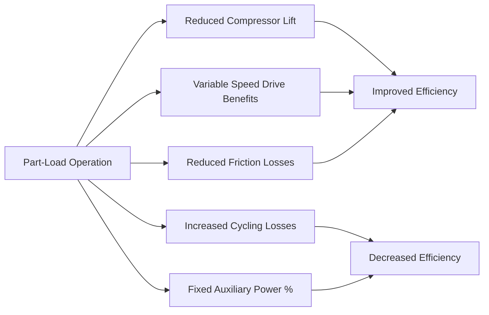
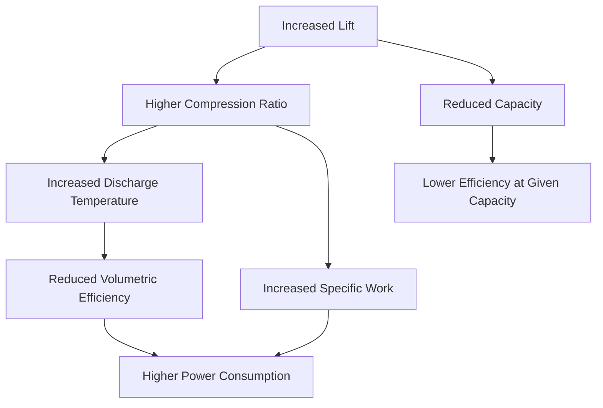

Chiller performance represents the relationship between refrigeration capacity and power consumption across varying operating conditions. Understanding performance characteristics allows engineers to optimize system design, predict energy consumption, and identify operational inefficiencies.

## Efficiency Metrics

### Coefficient of Performance (COP)

The fundamental thermodynamic efficiency metric for chillers:

$$\text{COP} = \frac{Q_{\text{evap}}}{W_{\text{comp}}} = \frac{\text{Cooling Capacity (kW)}}{\text{Compressor Power (kW)}}$$

For a vapor-compression cycle, theoretical maximum COP based on Carnot efficiency:

$$\text{COP}_{\text{Carnot}} = \frac{T_{\text{evap}}}{T_{\text{cond}} - T_{\text{evap}}}$$

where temperatures are in absolute units (Kelvin or Rankine).

### Energy Efficiency Ratio (EER) and kW/ton

North American practice commonly expresses efficiency in kW/ton or EER:

$$\text{kW/ton} = \frac{3.517}{\text{COP}}$$

$$\text{EER (Btu/W·h)} = 3.412 \times \text{COP}$$

Lower kW/ton values indicate higher efficiency. High-efficiency centrifugal chillers achieve 0.45–0.55 kW/ton at AHRI standard conditions, while air-cooled scroll chillers typically operate at 0.9–1.2 kW/ton.

## Full-Load vs Part-Load Performance

### Full-Load Efficiency

AHRI Standard 550/590 defines full-load rating conditions:

| Chiller Type | Leaving Chilled Water | Entering Condenser Water | Ambient (Air-Cooled) |
|--------------|----------------------|--------------------------|---------------------|
| Water-Cooled | 44°F (6.7°C) | 85°F (29.4°C) | — |
| Air-Cooled | 44°F (6.7°C) | — | 95°F (35°C) |

Full-load efficiency serves as a baseline but represents only a small fraction of annual operating hours. Most chillers operate at 20–60% of design capacity for the majority of their runtime.

### Part-Load Performance Characteristics

Chiller efficiency varies nonlinearly with load. Centrifugal and screw chillers typically show improved efficiency at part-load due to reduced motor losses and optimized compression ratios. Scroll and reciprocating chillers may show degraded part-load performance due to cycling losses and fixed auxiliary power.

## Integrated Part-Load Value (IPLV)

AHRI Standard 550/590 defines IPLV as a single-number metric representing weighted average part-load efficiency:

$$\text{IPLV} = 0.01A + 0.42B + 0.45C + 0.12D$$

where:
- **A** = EER at 100% load, 85°F (29.4°C) entering condenser water
- **B** = EER at 75% load, 75°F (23.9°C) entering condenser water
- **C** = EER at 50% load, 65°F (18.3°C) entering condenser water
- **D** = EER at 25% load, 55°F (12.8°C) entering condenser water

The weighting factors reflect typical building load distribution and outdoor temperature profiles for moderate climates. IPLV provides more meaningful annual energy consumption predictions than full-load efficiency alone.

### Non-Standard Part-Load Value (NPLV)

For climates with different temperature distributions, AHRI allows calculation of NPLV using site-specific condenser water temperatures while maintaining load distribution weights.

## Lift Temperature and Performance

### Defining Lift

Lift represents the temperature difference the refrigeration cycle must overcome:

$$\text{Lift} = T_{\text{cond}} - T_{\text{evap}}$$

For practical calculations using fluid temperatures:

$$\text{Lift} = (T_{\text{LCW}} + \text{Approach}_{\text{evap}}) - (T_{\text{ECW}} + \text{Approach}_{\text{cond}})$$

where:
- $T_{\text{LCW}}$ = Leaving chilled water temperature
- $T_{\text{ECW}}$ = Entering condenser water temperature
- Approach = temperature difference between refrigerant saturation and fluid

### Lift Impact on Efficiency

Chiller power consumption increases approximately linearly with lift:

$$\frac{W_2}{W_1} \approx \frac{\text{Lift}_2}{\text{Lift}_1}$$

A 10°F increase in lift typically increases power consumption by 15–25% depending on chiller type and operating conditions.

| Lift Increase | Approximate Power Increase |
|---------------|---------------------------|
| +5°F (+2.8°C) | +8–12% |
| +10°F (+5.6°C) | +15–25% |
| +15°F (+8.3°C) | +25–40% |

## Approach Temperatures

### Evaporator Approach

Evaporator approach represents heat transfer effectiveness:

$$\text{Approach}_{\text{evap}} = T_{\text{evap}} - T_{\text{LCW}}$$

Typical evaporator approach: 2–4°F (1.1–2.2°C)

Factors affecting evaporator approach:
- **Fouling factor**: Scale, biological growth, suspended solids
- **Flow rate**: Lower flow increases approach
- **Heat exchanger area**: Larger area reduces approach
- **Refrigerant charge**: Undercharge reduces wetting, increases approach

### Condenser Approach

Condenser approach similarly indicates heat rejection effectiveness:

$$\text{Approach}_{\text{cond}} = T_{\text{ECW}} - T_{\text{cond}}$$

Typical condenser approach: 1–3°F (0.6–1.7°C)

Elevated approach temperatures indicate fouling, insufficient flow, or inadequate heat transfer surface. Regular tube cleaning and water treatment maintain design approach temperatures.

## Performance Degradation Factors

### Fouling and Scaling

Heat exchanger fouling creates thermal resistance reducing capacity and efficiency. AHRI standards include fouling factors:

| Water Quality | Fouling Factor (ft²·°F·hr/Btu) |
|---------------|-------------------------------|
| Clean cooling tower water | 0.00025 |
| Treated cooling tower water | 0.0005 |
| City water | 0.001 |
| River water | 0.002–0.003 |

Fouling increases approach temperatures and required lift, degrading performance by 5–30% annually without proper maintenance.

### Refrigerant Charge Issues

**Undercharge** reduces evaporator wetting, increasing superheat and decreasing capacity. Power consumption remains relatively constant, degrading efficiency.

**Overcharge** floods the condenser, reducing effective heat transfer area, increasing condensing pressure and power consumption.

### Non-Condensable Gases

Air and other non-condensables accumulate at the condenser top, creating thermal resistance and artificially elevating condensing pressure. A 1% non-condensable concentration increases power consumption by approximately 3–5%.

### Compressor Wear

Mechanical wear in centrifugal impellers, screw rotor clearances, and reciprocating/scroll mechanisms reduces volumetric efficiency. Performance degradation of 1–3% per year indicates normal wear; accelerated degradation requires investigation.

### Oil Contamination

Excessive oil in refrigerant circuits coats heat transfer surfaces, particularly in flooded evaporators. Oil concentrations above 3–5% significantly impair heat transfer, increasing approach temperatures and reducing capacity.

## Performance Monitoring

Continuous monitoring enables early detection of degradation:

$$\text{Efficiency Ratio} = \frac{\text{Current kW/ton}}{\text{Baseline kW/ton at Same Conditions}}$$

Efficiency ratio trending above 1.05–1.10 indicates maintenance requirements. Normalization for lift, load, and ambient conditions isolates performance changes from operational variations.

## ASHRAE 90.1 Performance Requirements

ASHRAE 90.1-2019 establishes minimum efficiency requirements:

| Chiller Type | Size | Path A (kW/ton) | Path B (IPLV, kW/ton) |
|--------------|------|----------------|----------------------|
| Water-Cooled Centrifugal | <150 tons | 0.610 | 0.560 |
| Water-Cooled Centrifugal | ≥150, <300 tons | 0.610 | 0.560 |
| Water-Cooled Centrifugal | ≥300 tons | 0.560 | 0.520 |
| Water-Cooled Screw | All | 0.690 | 0.610 |
| Air-Cooled | All | 1.000 | 0.880 |

Path A emphasizes full-load efficiency; Path B emphasizes part-load performance through IPLV. Most applications benefit from Path B chillers due to predominant part-load operation.

---

**Engineering Insight**: Chiller performance optimization requires understanding the interplay between lift, load, and heat exchanger effectiveness. Part-load operation dominates annual energy consumption, making IPLV more relevant than full-load efficiency for most applications. Regular maintenance preserving approach temperatures and eliminating non-condensables maintains design performance over equipment life.
