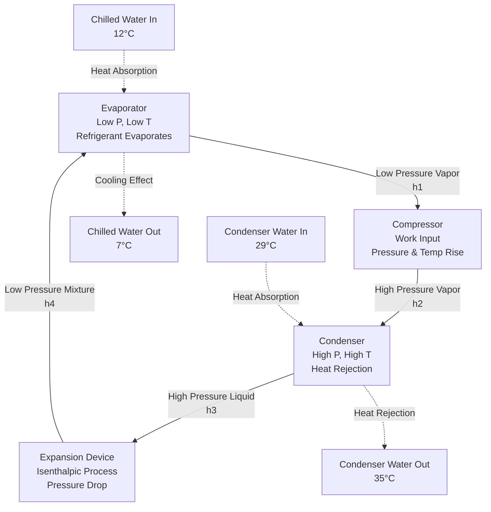

Vapor compression chillers constitute the dominant technology for commercial and industrial cooling applications, leveraging the thermodynamic properties of refrigerants to transfer heat from chilled water to a heat rejection medium. Understanding the underlying physics, component design, and performance metrics enables proper selection, operation, and optimization of these systems.

## Vapor Compression Refrigeration Cycle

The vapor compression cycle operates through four fundamental thermodynamic processes that exploit the phase-change properties of refrigerants to move thermal energy against its natural gradient.

### Thermodynamic Process Analysis

The refrigeration cycle consists of:

1. **Isentropic Compression**: Low-pressure vapor enters the compressor and undergoes compression, increasing both temperature and pressure. The work input is:

$$W_{comp} = \dot{m} (h_2 - h_1)$$

where $\dot{m}$ is refrigerant mass flow rate, $h_2$ is discharge enthalpy, and $h_1$ is suction enthalpy.

2. **Isobaric Condensation**: High-pressure superheated vapor releases heat to the cooling medium (water or air) in the condenser, transitioning through desuperheating, condensation, and subcooling:

$$Q_{cond} = \dot{m} (h_2 - h_3)$$

3. **Isenthalpic Expansion**: Subcooled liquid passes through the expansion device, experiencing a pressure drop with constant enthalpy ($h_3 = h_4$), resulting in a two-phase mixture at evaporator pressure.

4. **Isobaric Evaporation**: The refrigerant absorbs heat from chilled water, evaporating completely and potentially superheating:

$$Q_{evap} = \dot{m} (h_1 - h_4)$$

The coefficient of performance quantifies thermodynamic efficiency:

$$\text{COP}_{ref} = \frac{Q_{evap}}{W_{comp}} = \frac{h_1 - h_4}{h_2 - h_1}$$

### Refrigerant Selection Criteria

Refrigerant selection significantly impacts performance and environmental compliance. Key properties include:

| Property | R-134a | R-513A | R-1234ze(E) | Considerations |
|----------|--------|--------|-------------|----------------|
| **ODP** | 0 | 0 | 0 | Ozone depletion eliminated |
| **GWP (100-yr)** | 1,430 | 631 | 6 | Low-GWP transition mandated |
| **Normal Boiling Point (°C)** | -26.1 | -29.2 | -19.0 | Affects operating pressures |
| **Critical Temperature (°C)** | 101.1 | 96.5 | 109.4 | Limits condensing conditions |
| **Volumetric Capacity (kJ/m³)** | 2,700 | 2,200 | 1,900 | Affects compressor displacement |

ASHRAE Standard 34 classifies refrigerant safety, while ASHRAE Standard 15 governs system design and installation practices.

## Compressor Technologies

The compressor type fundamentally determines chiller capacity range, efficiency characteristics, and maintenance requirements.

### Centrifugal Compressors

Centrifugal compressors dominate large-capacity applications (150-10,000+ tons) through dynamic compression. The impeller imparts kinetic energy to refrigerant vapor, which converts to pressure energy in the diffuser.

**Performance characteristics:**
- Pressure ratio per stage: 2.5-4.0:1
- Isentropic efficiency: 75-85%
- Capacity modulation via inlet guide vanes or variable speed
- Surge limitation at low loads (typically 10-15% minimum)

Pressure ratio relationship:

$$\frac{P_2}{P_1} = \left(1 + \frac{\eta_c}{\eta_{pol}} \left[\left(\frac{U}{\sqrt{C_p T_1}}\right)^2 - 1\right]\right)^{\frac{\gamma}{\gamma-1}}$$

where $U$ is impeller tip speed, $C_p$ is specific heat, and $\eta_{pol}$ is polytropic efficiency.

### Screw Compressors

Twin-screw compressors provide positive displacement compression for medium capacities (50-750 tons) through meshing helical rotors.

**Performance characteristics:**
- Built-in volume ratio determines optimal pressure ratio
- Isentropic efficiency: 65-75%
- Stepless capacity control via slide valve
- Oil injection for sealing, cooling, and lubrication
- Economizer ports enhance efficiency at part-load

### Scroll Compressors

Scroll compressors utilize orbiting and fixed scrolls for small to medium capacities (up to 200 tons, larger in modular configurations).

**Performance characteristics:**
- Inherently high volumetric efficiency (>95%)
- Isentropic efficiency: 60-70%
- Fewer moving parts than reciprocating designs
- Reduced vibration and noise
- Digital or inverter-driven capacity modulation

### Comparison Matrix

| Compressor Type | Capacity Range (Tons) | Part-Load Efficiency | Maintenance | First Cost |
|-----------------|----------------------|---------------------|-------------|------------|
| **Centrifugal** | 150-10,000+ | Excellent with VFD | Low | High |
| **Screw** | 50-750 | Very Good | Moderate | Moderate |
| **Scroll** | 5-200 | Good to Excellent | Very Low | Low to Moderate |
| **Reciprocating** | 5-150 | Fair to Good | High | Low |

## Heat Exchanger Design

Evaporators and condensers constitute the heat transfer interfaces where refrigerant phase change facilitates thermal energy movement.

### Evaporator Configuration

Shell-and-tube evaporators predominate in large chillers, with refrigerant typically on the shell side and chilled water inside tubes.

**Heat transfer governing equation:**

$$Q = UA \cdot \text{LMTD}$$

where $U$ is overall heat transfer coefficient, $A$ is heat transfer area, and LMTD is log mean temperature difference:

$$\text{LMTD} = \frac{\Delta T_1 - \Delta T_2}{\ln(\Delta T_1 / \Delta T_2)}$$

For evaporators with phase change, the evaporating coefficient dominates:

$$\frac{1}{U} = \frac{1}{h_{evap}} + \frac{t_{tube}}{k_{tube}} + \frac{1}{h_{water}} + R_{fouling}$$

Enhanced tube surfaces (rifled, microfin, or turbulated) increase $h_{evap}$ by 200-400% through increased surface area and improved nucleate boiling.

### Condenser Design

Water-cooled condensers similarly employ shell-and-tube construction, with design considerations for:

- Desuperheating zone (typically 10-15% of heat rejection)
- Condensing zone (70-80% of heat rejection)
- Subcooling zone (5-15% of heat rejection)

The condensing coefficient depends on film condensation physics:

$$h_{cond} = 0.725 \left[\frac{g \rho_l (\rho_l - \rho_v) k_l^3 h_{fg}}{\mu_l \Delta T D}\right]^{0.25}$$

where $\rho$ is density, $k$ is thermal conductivity, $h_{fg}$ is latent heat, $\mu$ is viscosity, and $D$ is tube diameter.

## Efficiency Metrics and Ratings

Chiller efficiency quantification employs multiple metrics across various operating conditions.

### Power Consumption: kW/ton

The industry-standard efficiency metric expresses electrical power input per ton of cooling capacity:

$$\text{kW/ton} = \frac{P_{input} \text{ (kW)}}{Q_{cooling} \text{ (tons)}}$$

Lower kW/ton values indicate higher efficiency. The relationship to COP:

$$\text{COP} = \frac{3.517}{\text{kW/ton}}$$

**Typical performance ranges at ARI Standard 550/590 conditions:**

| Chiller Type | Full-Load kW/ton | IPLV.SI (kW/ton) |
|--------------|------------------|------------------|
| Air-Cooled Scroll | 1.00-1.20 | 0.80-1.00 |
| Air-Cooled Screw | 0.95-1.10 | 0.75-0.90 |
| Water-Cooled Centrifugal | 0.50-0.60 | 0.40-0.50 |
| Water-Cooled Screw | 0.60-0.75 | 0.50-0.65 |
| Magnetic Bearing Centrifugal | 0.45-0.55 | 0.35-0.45 |

### AHRI Certification and IPLV

AHRI Standard 550/590 establishes rating conditions and the Integrated Part Load Value (IPLV), which weights performance at multiple load points:

$$\text{IPLV} = 0.01A + 0.42B + 0.45C + 0.12D$$

where A, B, C, D represent efficiency at 100%, 75%, 50%, and 25% load respectively.

This metric better represents annual performance since chillers operate predominantly at part-load conditions. IPLV improvements of 30-40% relative to full-load ratings are common with variable-speed drives and optimized control strategies.

### Thermodynamic Limits

The Carnot COP establishes theoretical maximum efficiency:

$$\text{COP}_{Carnot} = \frac{T_{evap}}{T_{cond} - T_{evap}}$$

For standard conditions (7°C chilled water, 35°C condenser water):

$$\text{COP}_{Carnot} = \frac{280.15}{308.15 - 280.15} = 10.01$$

Actual chillers achieve 40-60% of Carnot efficiency, with losses from:
- Non-isentropic compression (70-85% efficiency)
- Heat exchanger temperature differences (3-8°C approach)
- Pressure drops in piping and heat exchangers
- Motor and transmission losses (90-97% efficiency)

Understanding these fundamentals enables engineers to specify appropriate equipment, optimize operating parameters, and troubleshoot performance issues systematically based on physical principles rather than empirical observation alone.

