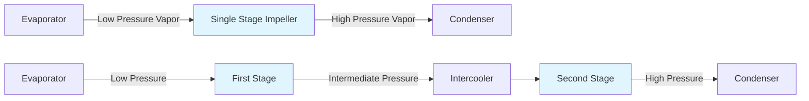
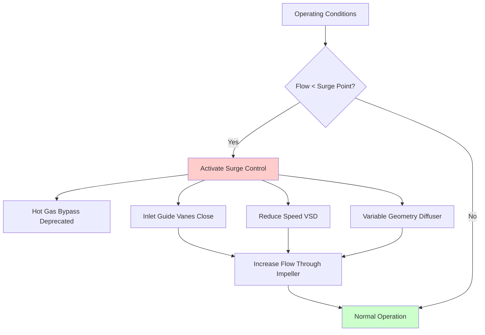

## Centrifugal Chiller Technology

Centrifugal chillers dominate large-capacity cooling applications from 100 to 10,000+ tons, leveraging dynamic compression principles to achieve high efficiency in commercial buildings, district cooling systems, and industrial facilities. Unlike positive displacement compressors, centrifugal machines impart kinetic energy to refrigerant vapor through high-speed impellers, converting velocity to pressure through diffuser passages.

## Impeller Dynamics and Compression Physics

The centrifugal compression process follows fundamental fluid mechanics principles. Refrigerant vapor enters the impeller eye at radius $r_1$ with velocity $V_1$ and exits at tip radius $r_2$ with velocity $V_2$. The Euler turbomachinery equation defines the theoretical head developed:

$$h_{th} = \frac{U_2 V_{t2} - U_1 V_{t1}}{g_c}$$

where $U$ represents blade velocity ($U = \omega r$) and $V_t$ represents tangential velocity component. For radial impellers with zero inlet swirl ($V_{t1} = 0$), this simplifies to:

$$h_{th} = \frac{U_2 V_{t2}}{g_c} = \frac{\omega^2 r_2^2}{g_c}(1 - \frac{c_2}{U_2}\tan\beta_2)$$

The actual pressure rise accounts for losses through isentropic efficiency $\eta_s$. Modern centrifugal chillers achieve compression efficiencies of 75-85% depending on impeller design, surface finish, and operating conditions.

**Velocity triangles** at impeller exit determine the energy transfer effectiveness. The slip factor $\sigma$ accounts for non-ideal flow:

$$\sigma = 1 - \frac{\sqrt{\cos\beta_2}}{Z^{0.7}}$$

where $Z$ represents blade count and $\beta_2$ is the blade exit angle (typically 50-70° for refrigeration applications).

## Single-Stage vs. Two-Stage Configuration

**Comparison of centrifugal compressor configurations:**

| Parameter | Single Stage | Two Stage |
|-----------|--------------|-----------|
| Pressure Ratio | 2.5-4.5:1 | 6-10:1 (combined) |
| Efficiency Range | 0.55-0.65 kW/ton | 0.45-0.55 kW/ton |
| Capacity Range | 100-2,000 tons | 300-10,000 tons |
| Refrigerants | R134a, R513A | R134a, R1233zd(E) |
| Lift Capability | 30-50°F | 60-90°F |
| Surge Margin | Moderate | Improved |
| Cost Premium | Baseline | +25-40% |

Two-stage designs provide superior efficiency for high-lift applications through intercooling between stages, reducing discharge temperature and improving volumetric efficiency. ASHRAE Research Project RP-1738 demonstrates 15-20% energy savings in high-lift conditions compared to single-stage equivalents.

## Magnetic Bearing Technology

Oil-free magnetic bearing systems revolutionized centrifugal chiller design by eliminating mechanical friction and lubrication systems. Active magnetic bearings (AMB) suspend the rotor using controlled electromagnetic fields, providing:

**Operating principle:** Position sensors monitor rotor location with micron-level precision. Control algorithms adjust electromagnet current to maintain centered position:

$$F_{mag} = \frac{B^2 A}{2\mu_0} = K_i i^2$$

where $B$ represents magnetic flux density, $A$ is pole area, and $i$ is coil current. Modern controllers sample at 10-20 kHz, providing dynamic stiffness coefficients of 5-10 million N/m.

**Advantages of magnetic bearing chillers:**

- **Zero oil contamination** in refrigerant circuit (eliminates heat transfer penalties)
- **Variable speed operation** from 10-100% without lubrication concerns
- **Reduced parasitic losses** (1-2% efficiency improvement over oil systems)
- **Predictive maintenance** through continuous vibration monitoring
- **Extended bearing life** (20+ years with no contact wear)

Touchdown bearings provide mechanical backup during power loss or extreme vibration events. AHRI Standard 550/590 includes specific test procedures for magnetic bearing chiller performance verification.

## Surge Control and Performance Mapping

Surge represents a critical operating limit where flow reversal occurs through the compressor, causing violent pressure oscillations. The surge line defines the minimum stable flow at each speed:

**Surge control strategies ranked by efficiency:**

1. **Variable Speed Drive (VSD)** - Primary control, 0% efficiency penalty
2. **Inlet Guide Vanes (IGV)** - Prewhirl control, 5-10% penalty at low load
3. **Variable Geometry Diffuser** - Adjusts pressure recovery, 3-7% penalty
4. **Hot Gas Bypass (Deprecated)** - Energy waste, 25-40% penalty (avoided in modern designs)

The surge prevention algorithm monitors the **surge parameter**:

$$SP = \frac{\dot{m}\sqrt{T_{in}}}{P_{in}} \times \frac{1}{N}$$

When $SP$ approaches surge line (typically 110% of surge point), control systems activate preventive measures. Modern chillers map surge lines across the operating envelope during factory testing.

## Variable Speed Drive Optimization

Variable frequency drives enable precise capacity modulation by adjusting impeller speed. Affinity laws govern performance relationships:

$$\frac{\dot{m}_2}{\dot{m}_1} = \frac{N_2}{N_1} \quad ; \quad \frac{P_2}{P_1} = \left(\frac{N_2}{N_1}\right)^2 \quad ; \quad \frac{\dot{W}_2}{\dot{W}_1} = \left(\frac{N_2}{N_1}\right)^3$$

This cubic relationship between speed and power provides exceptional part-load efficiency. At 50% load, theoretical power reduces to 12.5% of full-load (actual performance: 15-20% due to fixed losses).

**VSD efficiency considerations:**

- Inverter losses: 2-3% at full load, 3-5% at part load
- Motor efficiency improvement with sine-wave drives vs. PWM
- Harmonic mitigation (IEEE 519 compliance requires <5% THD)
- Power factor correction integrated into drive systems

ASHRAE 90.1-2019 requires variable speed drives on centrifugal chillers ≥300 tons for code compliance in most applications.

## Refrigerant Selection for Centrifugal Applications

| Refrigerant | Mol. Weight | Pressure Ratio | Efficiency | Status |
|-------------|-------------|----------------|------------|--------|
| R134a | 102 | 3.2-3.8 | Baseline | Phasing down (HFC) |
| R513A | 108 | 3.0-3.5 | -2 to +1% | Low GWP alternative |
| R1233zd(E) | 131 | 8-12 | +3 to +8% | Low pressure, high efficiency |
| R1234ze(E) | 114 | 3.5-4.2 | -5 to -2% | A2L safety class |

Low-pressure refrigerants (R1233zd(E)) operate below atmospheric pressure in the evaporator, requiring purge systems but enabling two-stage designs with exceptional efficiency. AHRI Guideline N includes system evacuation and leak testing protocols specific to low-pressure centrifugal chillers.

## Performance Maps and Operating Envelope

Centrifugal chiller performance maps plot pressure ratio vs. volumetric flow at constant speeds, bounded by:

- **Surge line** (left boundary) - minimum stable flow
- **Choke line** (right boundary) - sonic velocity limitation
- **Maximum speed line** (top boundary) - mechanical/thermal limits
- **Minimum speed line** (bottom boundary) - typically 30-40% of design speed

Modern chillers provide 10-100% turndown without auxiliary capacity control, operating within the stable region mapped during AHRI 550/590 certification testing.

## Large Tonnage Applications

Centrifugal chillers serve applications requiring:

- **District cooling plants** (5,000-30,000 ton systems)
- **Data centers** (continuous operation, N+1 redundancy)
- **Manufacturing facilities** (process cooling, precise temperature control)
- **Healthcare campuses** (24/7 reliability requirements)
- **Commercial high-rises** (centralized chilled water systems)

Series and parallel chiller configurations optimize staging for varying load profiles. Sequencing algorithms minimize total plant energy through optimal loading across multiple machines based on real-time efficiency curves.

---

**References:**

- ASHRAE Handbook—HVAC Systems and Equipment, Chapter 38: Compressors
- AHRI Standard 550/590: Performance Rating of Water-Chilling and Heat Pump Water-Heating Packages Using the Vapor Compression Cycle
- ASHRAE Standard 90.1-2019: Energy Standard for Buildings Except Low-Rise Residential Buildings
- ASHRAE Research Project RP-1738: Two-Stage Centrifugal Chiller Performance Optimization
