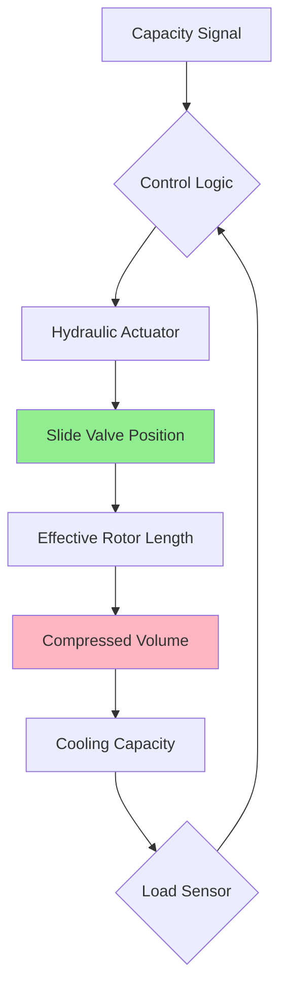
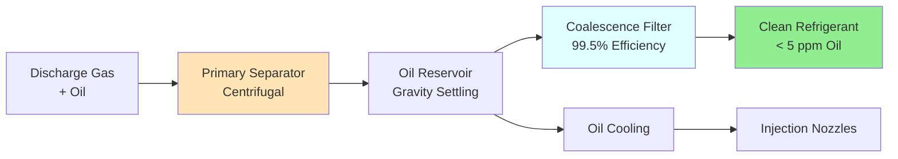

Screw compressor chillers dominate the mid-range capacity segment (10-1000 tons) through positive displacement compression that achieves superior part-load efficiency, continuous capacity modulation, and exceptional reliability. The helical rotor geometry enables oil injection cooling that reduces discharge temperatures below those of reciprocating compressors while maintaining volumetric efficiency across wide operating ranges.

## Twin-Screw Compressor Design

The twin-screw configuration employs a male rotor (typically 4 lobes) and female rotor (typically 6 gates) that mesh without contact, relying on oil film lubrication to maintain minimal clearances. As rotors turn, the volume between lobes progressively decreases, compressing refrigerant from suction to discharge pressure.

### Compression Process Physics

The compression ratio develops along the rotor length according to the built-in volume ratio $V_i$, which represents the geometric compression ratio before discharge port opening:

$$V_i = \frac{V_{suction}}{V_{discharge}} = \frac{P_{discharge}}{P_{suction}}^{1/n}$$

where $n$ is the polytropic exponent (typically 1.05-1.15 for oil-injected compression). Optimal efficiency occurs when $V_i$ matches the operating pressure ratio; mismatches cause over-compression or under-compression losses.

The volumetric efficiency remains high (85-95%) due to positive displacement action and oil sealing:

$$\eta_v = \frac{\dot{m}_{actual}}{\rho_{suction} \cdot V_{swept} \cdot N}$$

where $\dot{m}_{actual}$ is actual mass flow rate, $\rho_{suction}$ is suction density, $V_{swept}$ is swept volume per revolution, and $N$ is rotational speed (rpm).

### Male and Female Rotor Interaction

The male rotor drives the female rotor through oil film contact. Power consumption follows:

$$P_{comp} = \frac{\dot{m} \cdot h_{discharge} - h_{suction}}{\eta_{comp}}$$

where $\eta_{comp}$ ranges from 0.68 to 0.75 for modern designs.

## Single-Screw Compressor Design

Single-screw compressors utilize one cylindrical main rotor with helical grooves and two star-shaped gate rotors positioned 180° apart. This configuration offers inherent radial force balance and reduced bearing loads compared to twin-screw designs.

### Comparative Performance Characteristics

| Parameter | Twin-Screw | Single-Screw |
|-----------|------------|--------------|
| Capacity Range | 10-1000 tons | 20-500 tons |
| Part-Load Efficiency | Excellent (0.50-0.60 kW/ton) | Very Good (0.52-0.62 kW/ton) |
| Vibration Level | Low | Very Low |
| Bearing Life | 60,000-80,000 hrs | 80,000-100,000 hrs |
| Oil Separation Required | Yes (99.5%+ efficiency) | Yes (99.0%+ efficiency) |
| Maintenance Intervals | 8,000-10,000 hrs | 10,000-12,000 hrs |

## Slide Valve Capacity Control

The slide valve mechanism provides stepless capacity modulation from 100% down to 10-25% by axially repositioning a valve that:

1. Delays the start of compression by allowing gas to recirculate to suction
2. Varies the effective working length of the rotors
3. Maintains volumetric efficiency across the capacity range

### Capacity Modulation Mechanism

The relationship between slide valve position and capacity follows:

$$Q_{capacity} = Q_{design} \cdot \left(\frac{L_{effective}}{L_{total}}\right) \cdot \eta_{vol}(x)$$

where $L_{effective}$ is the compression length determined by slide valve position $x$, and $\eta_{vol}(x)$ accounts for recirculation losses.

Power consumption at reduced capacity:

$$P_{partial} = P_{full} \cdot \left[\left(\frac{Q_{partial}}{Q_{full}}\right)^{0.7} + 0.15\right]$$

This favorable part-load characteristic (exponent < 1.0) enables integrated part-load values (IPLV) significantly better than full-load efficiency.

## Oil Injection and Management

Oil serves three critical functions in screw compressors:

1. **Sealing**: Fills clearances between rotors and housing (10-30 μm)
2. **Cooling**: Absorbs compression heat, reducing discharge temperature by 40-60°F
3. **Lubrication**: Protects bearings and rotor surfaces

### Oil Injection Cooling Physics

The polyester or polyolester (POE) oil injected during compression absorbs heat according to:

$$\dot{Q}_{oil} = \dot{m}_{oil} \cdot c_p \cdot \Delta T_{oil}$$

Typical oil circulation rates reach 10-20 times refrigerant mass flow rate. Oil temperature rise ranges from 20-40°F, removing 15-25% of compression heat.

The resulting isothermal compression approximation yields discharge temperatures 80-120°F lower than reciprocating compressors:

$$T_{discharge} \approx T_{suction} \cdot \left(\frac{P_{discharge}}{P_{suction}}\right)^{(n-1)/n}$$

with effective $n = 1.05-1.15$ versus 1.25-1.35 for reciprocating.

### Oil Separation and Coalescence

Multi-stage separation achieves oil carryover below 5 ppm (by mass):

1. **Primary separator**: Centrifugal action removes 95-98% of oil
2. **Coalescence filter**: Captures remaining droplets (0.3-10 μm) through impingement
3. **Oil cooling**: Heat exchanger reduces oil temperature before re-injection

Oil pressure differential across injection nozzles (50-100 psi) atomizes oil for effective distribution:

$$\Delta P_{injection} = P_{oil,pump} - P_{compression,pocket}$$

## Variable Volume Ratio (VVR)

Advanced screw chillers incorporate movable slide stops that adjust the built-in volume ratio to match operating conditions, optimizing efficiency across load and ambient temperature variations.

### Efficiency Optimization

Under-compression losses occur when internal pressure at discharge port opening is below discharge pressure:

$$P_{loss,under} = \int_{V_i}^{V_d} (P_{discharge} - P_{internal}) \, dV$$

Over-compression losses occur when internal pressure exceeds discharge pressure:

$$P_{loss,over} = \int_{V_i}^{V_d} (P_{internal} - P_{discharge}) \, dV$$

VVR systems minimize these losses by adjusting $V_i$ based on lift (discharge pressure / suction pressure).

## Economizer Cycle Operation

Economizers enhance capacity and efficiency by 10-20% through intermediate pressure liquid injection. A flash tank at intermediate pressure (geometric mean of suction and discharge) subcools liquid refrigerant while generating vapor for mid-compression injection.

### Thermodynamic Analysis

The flash tank pressure optimizes at:

$$P_{econ} = \sqrt{P_{suction} \cdot P_{discharge}}$$

Cooling capacity increase:

$$Q_{econ} = \dot{m}_{main} \cdot h_{fg,econ} \cdot x_{flash}$$

where $x_{flash}$ is flash fraction (typically 0.15-0.25) and $h_{fg,econ}$ is enthalpy of vaporization at economizer pressure.

Compressor power increases less than proportionally:

$$\frac{\Delta P}{\Delta Q} < 1.0$$

yielding 8-15% efficiency improvement at design conditions.

## Mid-Range Tonnage Applications

Screw chillers excel in applications requiring:

- **Capacity**: 10-1000 tons (commercial buildings, process cooling)
- **Reliability**: 60,000+ hour bearing life, 40,000+ hour oil change intervals
- **Part-load operation**: Variable occupancy buildings benefit from stepless modulation
- **Low vibration**: Rotary motion versus reciprocating pulsation

### Refrigerant Selection

| Refrigerant | GWP | Applications | Notes |
|-------------|-----|--------------|-------|
| R-134a | 1430 | Water-cooled chillers | Being phased out |
| R-513A | 631 | Retrofit and new | Lower GWP alternative |
| R-1234ze | 6 | Environmental priority | Lower capacity, higher cost |
| R-515B | 299 | Balanced performance | Emerging option |

## Performance Standards

ASHRAE Standard 90.1 and AHRI Standard 550/590 establish minimum efficiency requirements:

**Path A (Full-load efficiency)**:
- Water-cooled: 0.600 kW/ton @ AHRI conditions
- Air-cooled: 1.000 kW/ton @ AHRI conditions

**Path B (IPLV - Integrated Part Load Value)**:
- Water-cooled: 0.540 kW/ton (weighted: 1% @ 100%, 42% @ 75%, 45% @ 50%, 12% @ 25%)
- Air-cooled: 0.920 kW/ton

Modern screw chillers achieve 0.45-0.55 kW/ton full-load and 0.35-0.45 kW/ton IPLV for water-cooled configurations, significantly exceeding minimum requirements.

## Installation and Configuration

**Water-Cooled Systems**:
- Evaporator: Shell-and-tube or brazed plate
- Condenser: Shell-and-tube with enhanced surfaces
- Cooling tower: Open-circuit or closed-circuit
- Water-side economizer integration capability

**Air-Cooled Systems**:
- Microchannel or finned-tube condensers
- Variable-speed condenser fans
- Low ambient controls for operation down to -20°F
- Reduced installation complexity (no cooling tower)

The choice between configurations depends on water availability, energy costs (air-cooled uses 20-30% more energy), and maintenance preferences.

---

*References*: ASHRAE Handbook—HVAC Systems and Equipment, Chapter 38 (Compressors); AHRI Standard 550/590-2023 (Performance Rating of Water-Chilling and Heat Pump Water-Heating Packages Using the Vapor Compression Cycle); ASHRAE Standard 90.1-2022 (Energy Standard for Buildings Except Low-Rise Residential Buildings)