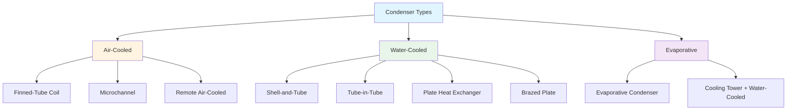

# Condensers in HVAC Systems

Condensers are critical heat rejection devices in vapor-compression refrigeration cycles. They reject heat absorbed in the evaporator plus the energy added by the compressor to a heat sink (air, water, or evaporatively-cooled air). The condenser facilitates the phase change of refrigerant vapor to liquid at elevated pressure and temperature, enabling continuous system operation.

## Fundamental Heat Rejection Principles

The total heat rejection at the condenser exceeds the cooling capacity provided at the evaporator. This relationship is governed by energy conservation:

$$Q_c = Q_e + W_{comp}$$

Where:
- $Q_c$ = condenser heat rejection (Btu/hr or kW)
- $Q_e$ = evaporator cooling capacity (Btu/hr or kW)
- $W_{comp}$ = compressor power input (Btu/hr or kW)

For practical systems, the heat rejection factor (HRF) typically ranges from 1.20 to 1.30 for efficient equipment:

$$HRF = \frac{Q_c}{Q_e}$$

The condenser capacity is also expressed as:

$$Q_c = \dot{m}_r \cdot (h_2 - h_4)$$

Where:
- $\dot{m}_r$ = refrigerant mass flow rate (lb/hr or kg/s)
- $h_2$ = enthalpy at compressor discharge (Btu/lb or kJ/kg)
- $h_4$ = enthalpy at condenser outlet (Btu/lb or kJ/kg)

## Temperature Difference and Approach

Condenser performance depends on the temperature difference between refrigerant and cooling medium:

$$TD = T_{cond} - T_{ambient/entering}$$

Where:
- $TD$ = temperature difference (°F or °C)
- $T_{cond}$ = condensing temperature (°F or °C)
- $T_{ambient/entering}$ = ambient air or entering water temperature (°F or °C)

For water-cooled condensers, the approach temperature quantifies effectiveness:

$$Approach = T_{cond} - T_{leaving\ water}$$

Typical approach temperatures range from 5°F to 10°F (3°C to 6°C) for shell-and-tube designs.

## Condenser Types and Configurations

### Air-Cooled Condensers

Air-cooled condensers use ambient air as the heat sink. They consist of finned-tube coils with copper tubes and aluminum fins, typically arranged in A-frame or horizontal configurations. The heat transfer rate depends on:

$$Q = UA \cdot LMTD$$

Where:
- $U$ = overall heat transfer coefficient (Btu/hr·ft²·°F or W/m²·K)
- $A$ = heat transfer surface area (ft² or m²)
- $LMTD$ = log mean temperature difference (°F or °C)

Air-cooled condensers operate with condensing temperatures 15°F to 30°F (8°C to 17°C) above ambient air temperature. Microchannel condensers offer reduced refrigerant charge (40-60% less) and improved heat transfer but require careful attention to air-side fouling.

### Shell-and-Tube Condensers

Shell-and-tube condensers are the predominant water-cooled design for commercial and industrial applications. Refrigerant condenses on the shell side while cooling water flows through tubes. Key design parameters include:

- Number of tube passes (1, 2, 4, or 6 passes typical)
- Tube diameter (5/8", 3/4", or 1" outer diameter)
- Water velocity (4-12 ft/s recommended to prevent fouling)
- Fouling factors (0.0005-0.001 hr·ft²·°F/Btu for clean water)

Water-side pressure drop follows the Darcy-Weisbach equation:

$$\Delta P = f \cdot \frac{L}{D} \cdot \frac{\rho v^2}{2}$$

Shell-and-tube designs achieve higher efficiency than air-cooled units because water has superior thermal properties (specific heat = 1.0 Btu/lb·°F vs. 0.24 Btu/lb·°F for air).

### Plate Heat Exchangers

Plate heat exchangers use corrugated metal plates with gaskets or brazing to create refrigerant and water flow channels. They offer:

- Compact footprint (1/5 to 1/3 the volume of shell-and-tube)
- High turbulence and heat transfer coefficients
- Easy capacity adjustment (add/remove plates)
- Pressure limitations (typically 300-450 psig)

Brazed plate heat exchangers (BPHE) eliminate gaskets, enabling higher pressure and temperature ratings suitable for refrigerants like R-410A and CO₂.

### Evaporative Condensers

Evaporative condensers combine water evaporation and air cooling to achieve condensing temperatures approaching the ambient wet-bulb temperature. Water sprays over the condenser coil while air flows through, evaporating water and removing heat. The effective temperature difference is:

$$TD_{eff} = T_{cond} - T_{wb}$$

Where $T_{wb}$ = ambient wet-bulb temperature.

Evaporative condensers typically operate with condensing temperatures 10°F to 20°F (6°C to 11°C) above wet-bulb, significantly lower than air-cooled designs, resulting in 20-30% energy savings in compressor power.

## Condenser Performance Comparison

| Type | Condensing Temp Above Heat Sink | Relative First Cost | Operating Cost | Water Usage | Maintenance |
|------|--------------------------------|---------------------|----------------|-------------|-------------|
| Air-Cooled | 15-30°F above ambient | Low | High | None | Low |
| Water-Cooled (shell-and-tube) | 5-10°F above entering water | High | Low | Moderate | Moderate |
| Evaporative | 10-20°F above wet-bulb | Medium | Low | High | High |
| Brazed Plate | 5-10°F above entering water | Medium | Low | Moderate | Low |

## AHRI Standards for Condenser Ratings

The Air-Conditioning, Heating, and Refrigeration Institute (AHRI) establishes standard rating conditions for condensers:

**AHRI Standard 460**: Performance rating of remote mechanical-draft air-cooled refrigerant condensers. Standard conditions:
- Entering air: 95°F dry-bulb
- Refrigerant condensing temperature: varies by refrigerant
- Sea level altitude

**AHRI Standard 450**: Performance rating of water-cooled refrigerant condensers. Standard conditions:
- Entering water temperature: 85°F
- Water flow rate: 3 GPM per ton of refrigeration
- Fouling factor: 0.00025 hr·ft²·°F/Btu

Manufacturers must publish capacity and pressure drop data at these conditions, enabling standardized equipment selection and comparison.

## Design Selection Criteria

Condenser selection depends on multiple factors:

1. **Climate**: Air-cooled suitable for moderate climates; evaporative for hot, dry regions
2. **Water availability**: Water-cooled requires continuous water supply or cooling tower
3. **Space constraints**: Plate exchangers minimize footprint
4. **Energy costs**: Lower condensing temperature reduces compressor power
5. **Maintenance resources**: Evaporative requires water treatment and cleaning
6. **Environmental regulations**: Water discharge temperatures and consumption limits
7. **Noise limitations**: Air-cooled units generate 60-75 dBA at 10 feet

Proper condenser sizing ensures condensing pressure remains within compressor safe operating limits while maximizing system efficiency. Undersized condensers cause elevated head pressure, reduced capacity, increased power consumption, and potential compressor damage from high discharge temperatures.

## Subcooling and Its Importance

Liquid subcooling below the saturation temperature at condenser pressure improves system performance:

$$SC = T_{sat} - T_{liquid}$$

Where:
- $SC$ = subcooling (°F or °C)
- $T_{sat}$ = saturation temperature at condenser pressure (°F or °C)
- $T_{liquid}$ = liquid refrigerant temperature leaving condenser (°F or °C)

Typical subcooling ranges from 8°F to 15°F (4°C to 8°C). Adequate subcooling prevents flash gas formation in the liquid line, ensures proper expansion valve operation, and increases system capacity by 0.5-1.0% per degree F of subcooling.

Condenser performance directly impacts overall system efficiency, making proper selection, sizing, and maintenance critical for reliable HVAC operation.
