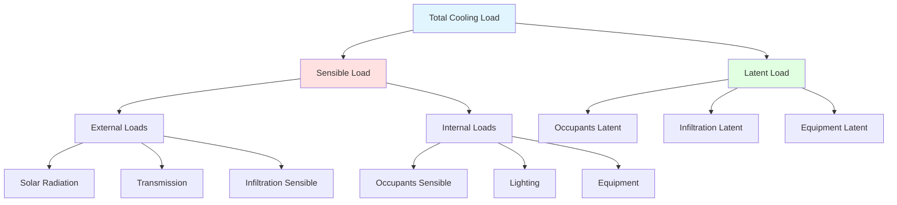

Cooling load calculations quantify the rate of heat removal required to maintain desired indoor conditions. Accurate load calculations are essential for proper HVAC equipment sizing and energy-efficient system design.

## Fundamental Concepts

### Heat Gain vs. Cooling Load

**Heat Gain**: The rate at which heat enters or is generated within a space:

$$q_{gain} = q_{external} + q_{internal}$$

**Cooling Load**: The rate at which heat must be removed from air to maintain setpoint temperature. Due to thermal mass, cooling load lags behind instantaneous heat gain:

$$q_{cooling}(t) \neq q_{gain}(t)$$

**Radiant Time Factor (RTF)**: The fraction of radiant heat gain becoming cooling load immediately. Remainder is delayed by thermal mass absorption and subsequent release.

### Load Components

## Load Calculation Methods

### CLTD/CLF Method (Cooling Load Temperature Difference)

Simplified method using precalculated factors for residential and light commercial:

**Walls and Roofs**:

$$q = U \times A \times CLTD_{corrected}$$

where CLTD is corrected for:
- Indoor temperature deviation from 25°C
- Outdoor temperature deviation from design
- Latitude and month

$$CLTD_{corrected} = CLTD + (25.5 - T_{room}) + (T_{outdoor,avg} - T_{outdoor,design})$$

**Windows (Solar)**:

$$q_{solar} = A \times SHGC \times SC \times CLF$$

- SHGC = Solar Heat Gain Coefficient
- SC = Shading Coefficient
- CLF = Cooling Load Factor (accounts for thermal lag)

**Limitations**:
- Fixed building construction types
- Limited geographical applicability
- Simplified thermal mass treatment
- Less accurate for heavyweight construction

### Radiant Time Series (RTS) Method

Current ASHRAE-recommended method (since 2001) providing improved accuracy through radiant/convective split and time series analysis.

**Process**:
1. Calculate instantaneous heat gains (solar, transmission, internal)
2. Split into radiant and convective components
3. Apply radiant time factors to convert radiant gains to cooling loads
4. Sum convective loads (immediate) and time-delayed radiant loads

**Radiant Time Series**:

$$q_{rad,load}(t) = \sum_{i=0}^{23} q_{rad,gain}(t-i) \times RTF_i$$

where $RTF_i$ are radiant time factors for time delay $i$ hours.

**Advantages**:
- More accurate thermal mass effects
- Valid for all building types
- Consistent with heat balance principles
- Automated in most software

### Heat Balance Method

Most rigorous approach solving energy balances for all surfaces simultaneously:

**Outside Surface**:

$$\alpha I_{solar} + q_{LWR} + q_{conv,out} = q_{cond}$$

- $\alpha I_{solar}$ = absorbed solar radiation
- $q_{LWR}$ = longwave radiation exchange
- $q_{conv,out}$ = outside convection
- $q_{cond}$ = conduction through wall

**Inside Surface**:

$$q_{cond} + q_{LWR,in} + q_{solar,transmitted} = q_{conv,in}$$

**Zone Air**:

$$\sum q_{conv,in} + q_{infiltration} + q_{internal} = q_{cooling}$$

**Solution**: Iterative simultaneous solution of all heat balance equations using computational methods.

**Application**: Research, detailed analysis, hourly energy simulations (EnergyPlus, DOE-2).

## Sensible vs. Latent Loads

### Sensible Cooling Load

Heat affecting air temperature:

$$q_s = \dot{m} c_p (T_{return} - T_{supply})$$

Sources:
- Solar radiation through windows
- Conduction through envelope
- Occupant sensible heat
- Lighting heat
- Equipment sensible heat
- Infiltration and ventilation sensible

### Latent Cooling Load

Moisture addition requiring dehumidification:

$$q_l = \dot{m} h_{fg} (W_{return} - W_{supply})$$

where $h_{fg} = 2501$ kJ/kg at 0°C.

Sources:
- Occupant perspiration and respiration
- Infiltration and ventilation moisture
- Cooking and dishwashing
- Indoor plants
- Equipment moisture generation (some process equipment)

### Grand Total Cooling Load

$$q_{total} = q_s + q_l$$

### Sensible Heat Ratio (SHR)

$$SHR = \frac{q_s}{q_{total}}$$

Typical values:
- Residential: 0.70-0.80
- Office: 0.80-0.90
- Auditorium (high occupancy): 0.60-0.70
- Server room: 0.95-1.00

SHR determines required apparatus dewpoint and dehumidification capacity.

## Peak Load Determination

### Design Day Selection

ASHRAE provides 0.4%, 1.0%, and 2.0% design conditions representing exceedance frequency:

- **0.4% design**: Temperature exceeded 35 hours/year
- **1.0% design**: Temperature exceeded 88 hours/year
- **2.0% design**: Temperature exceeded 175 hours/year

Selection depends on:
- Building type and occupancy criticality
- Economic optimization (capacity vs. comfort)
- Code requirements

### Coincident Wet-Bulb

Use coincident wet-bulb temperature (occurring with design dry-bulb) rather than design wet-bulb for accurate latent load calculation.

### Diversity and Safety Factors

**Diversity**: All loads rarely peak simultaneously:

$$q_{actual,peak} < \sum q_{individual,peaks}$$

Examples:
- East and west solar gains peak at different times
- Office equipment usage varies throughout day
- Lighting in different zones operates at different times

**Safety Factors**: Traditional practice adds 10-20% margin:

$$q_{equipment} = q_{calculated} \times (1 + SF)$$

**Modern Practice**: Avoid excessive safety factors leading to:
- Oversized equipment with poor part-load efficiency
- Short cycling and poor dehumidification
- Higher first cost
- Reduced equipment life

Use realistic loads with minimal (0-10%) safety factors and properly designed controls.

## Load Calculation Workflow

**Step 1: Project Definition**
- Building geometry and orientation
- Construction materials and insulation
- Window types, sizes, and shading
- Occupancy schedules and density
- Equipment and lighting power densities
- Operating hours and setpoints

**Step 2: Design Conditions**
- Outdoor design temperature and humidity (from ASHRAE climate data)
- Indoor temperature and humidity setpoints
- Altitude correction
- Ground temperature

**Step 3: Heat Gain Calculations**
- External loads (solar, transmission, infiltration)
- Internal loads (people, lights, equipment)
- Hourly profile if using RTS or heat balance

**Step 4: Convert to Cooling Loads**
- Apply CLTD/CLF factors, or
- Apply RTS time series, or
- Solve heat balance equations

**Step 5: Peak Load Analysis**
- Identify peak hour for each zone
- Calculate simultaneous system peak
- Separate sensible and latent components
- Calculate SHR

**Step 6: Equipment Selection**
- Size cooling equipment to meet peak loads
- Verify part-load performance
- Ensure adequate dehumidification at SHR

## Common Load Calculation Errors

**Error 1 - Incorrect Orientation**: Using wrong orientation for solar loads causes significant errors, especially for buildings with large glazing areas.

**Error 2 - Neglecting Thermal Mass**: Lightweight construction assumptions for heavyweight buildings overestimate peak loads.

**Error 3 - Unrealistic Internal Loads**: Using peak densities for people, lighting, and equipment that never occur simultaneously.

**Error 4 - Wrong Climate Data**: Using nearby city data instead of site-specific conditions, especially in varied terrain.

**Error 5 - Omitting Ventilation**: Forgetting to include outdoor air ventilation loads (often 20-40% of total).

**Error 6 - Ignoring Altitude**: High-altitude locations have lower air density affecting convection and infiltration loads.

**Error 7 - Excessive Safety Factors**: Stacking multiple safety factors results in severe oversizing.

## Load Calculation Software

### Residential

- **Manual J (ACCA)**: Industry standard for residential loads
- **Wrightsoft Right-J**: Automated Manual J calculations
- **Elite RHVAC**: Residential design and load calculations

### Commercial

- **Carrier HAP (Hourly Analysis Program)**: Comprehensive load and energy analysis
- **Trane TRACE**: Building energy and load analysis
- **IES Virtual Environment**: Detailed building performance simulation
- **DesignBuilder**: EnergyPlus interface for loads and energy

### Hand Calculation Tools

- **ASHRAE Cooling Load Calculation Manual**: Detailed procedures and tables
- **Psychrometric charts and calculators**: Property determination
- **Spreadsheet templates**: Structured calculation organization

## Load Calculation Standards

- **ASHRAE Handbook - Fundamentals**: Comprehensive load calculation methods
- **ASHRAE Standard 183**: Peak Cooling and Heating Load Calculations in Buildings
- **ACCA Manual J**: Residential Load Calculation (8th Edition)
- **ACCA Manual N**: Commercial Load Calculation
- **CIBSE Guide A**: Environmental Design (UK/Europe)

## Example Cooling Load Summary

Typical office building (moderate climate):

| Component | Sensible (kW) | Latent (kW) | Total (kW) |
|-----------|---------------|-------------|------------|
| Solar gain | 45 | 0 | 45 |
| Transmission | 25 | 0 | 25 |
| Infiltration | 5 | 8 | 13 |
| Ventilation | 15 | 22 | 37 |
| Occupants | 12 | 18 | 30 |
| Lighting | 35 | 0 | 35 |
| Equipment | 28 | 2 | 30 |
| **Total** | **165** | **50** | **215** |

$$SHR = \frac{165}{215} = 0.77$$

Required supply airflow at 10°C supply-to-room differential:

$$\dot{m} = \frac{q_s}{c_p \Delta T} = \frac{165}{1.02 \times 10} = 16.2 \text{ kg/s}$$

$$\dot{V} = 16.2 \times 0.82 = 13.3 \text{ m}^3\text{/s} = 47,900 \text{ m}^3\text{/h}$$

Accurate cooling load calculations form the foundation for efficient HVAC system design, ensuring adequate capacity while avoiding the penalties of oversizing. Modern calculation methods account for thermal mass effects and provide hour-by-hour load profiles enabling optimized equipment selection and control strategies.
