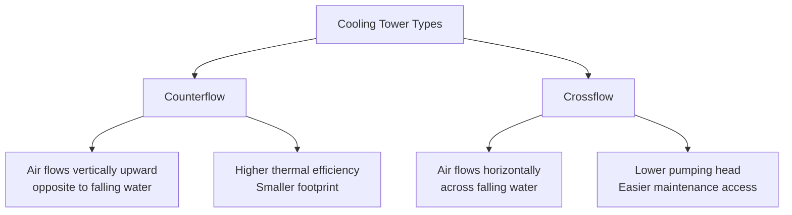

## Overview

Cooling towers are heat rejection devices that transfer waste heat to the atmosphere through evaporative cooling. They serve as critical components in air-conditioning systems, industrial processes, and power generation facilities where large quantities of heat must be dissipated. The fundamental principle involves bringing water and air into direct contact, allowing a small portion of water to evaporate and remove latent heat from the remaining water stream.

## Cooling Tower Classification

### By Air Movement Method

**Mechanical Draft Towers**

Mechanical draft towers use fans to move air through the tower, providing predictable and controllable airflow independent of atmospheric conditions.

*Induced Draft Towers:* Fans are located at the air discharge (top) of the tower, drawing air upward through the fill material. This configuration creates lower entering air velocities and higher exit velocities, reducing the possibility of recirculation. Induced draft towers account for approximately 80% of mechanical draft installations due to superior performance characteristics and reduced visible plume under most conditions.

*Forced Draft Towers:* Fans are positioned at the air inlet (bottom), forcing air upward through the tower. These towers exhibit higher entering air velocities, which can increase the potential for recirculation of warm, humid exhaust air back into the air intake. However, they provide easier fan maintenance access and may be preferred where low-profile installations are required.

**Natural Draft Towers**

Natural draft towers rely on buoyancy forces created by density differences between warm, moist air inside the tower and cooler outside air. These hyperbolic concrete structures can exceed 100 meters in height and are primarily used in large power generation facilities. They require no fan power but are sensitive to atmospheric conditions and require significant capital investment.

### By Water-Air Flow Configuration

## Counterflow vs Crossflow Comparison

| Parameter | Counterflow | Crossflow |
|-----------|-------------|-----------|
| Air-Water Contact | Vertical, opposing directions | Horizontal-vertical, perpendicular |
| Thermal Efficiency | Higher (0.5-1.5°F better approach) | Moderate |
| Pumping Head | Higher (pressurized distribution) | Lower (gravity distribution) |
| Fill Footprint | Smaller for equivalent capacity | Larger by 15-25% |
| Maintenance Access | Limited during operation | Superior - external access to nozzles |
| Freeze Protection | More challenging | Better - can isolate sections |
| Pressure Drop | 6-8 inches WC typical | 4-6 inches WC typical |
| Capital Cost | 5-10% higher for equivalent duty | Lower initial investment |

## Heat Transfer Fundamentals

### Cooling Tower Capacity

The heat rejection capacity of a cooling tower is expressed by:

$$Q = \dot{m}_w c_p (T_{w,in} - T_{w,out})$$

Where:
- $Q$ = heat rejection rate (Btu/hr or kW)
- $\dot{m}_w$ = water mass flow rate (lb/hr or kg/s)
- $c_p$ = specific heat of water (1 Btu/lb·°F or 4.186 kJ/kg·K)
- $T_{w,in}$ = entering water temperature (°F or °C)
- $T_{w,out}$ = leaving water temperature (°F or °C)

### Range and Approach

Two critical performance parameters define cooling tower effectiveness:

**Range** is the temperature difference between entering and leaving water:

$$\text{Range} = T_{w,in} - T_{w,out}$$

Range indicates the thermal load on the tower and is determined by the heat rejection requirements of the system being served.

**Approach** is the difference between leaving water temperature and entering air wet-bulb temperature:

$$\text{Approach} = T_{w,out} - T_{wb,in}$$

Where $T_{wb,in}$ is the entering air wet-bulb temperature.

Approach measures the tower's thermal performance. Smaller approach values indicate better heat transfer effectiveness but require larger, more expensive towers. Typical design approach values:

- Premium efficiency: 5-7°F
- Standard efficiency: 7-10°F
- Economy designs: 10-15°F

### Evaporation Rate

Approximately 1% of the circulating water evaporates for every 10°F of range. The evaporation rate is calculated as:

$$\dot{m}_{evap} = \frac{Q}{\lambda} = \frac{\dot{m}_w c_p \Delta T}{\lambda}$$

Where $\lambda$ is the latent heat of vaporization (approximately 1,050 Btu/lb at typical conditions).

## Design Standards and Selection Criteria

### CTI Standards

The Cooling Technology Institute (CTI) establishes certification standards for cooling tower thermal performance, structural integrity, and testing procedures:

- **CTI STD-201**: Standard for Certification of Water Cooling Tower Thermal Performances
- **CTI ATC-105**: Acceptance Test Code for Water Cooling Towers
- **CTI STD-111**: Nomenclature for Industrial Water Cooling Towers

CTI certification ensures towers meet published performance guarantees under specified conditions of water flow, range, wet-bulb temperature, and approach.

### ASHRAE Guidelines

ASHRAE Standard 90.1 specifies minimum energy efficiency requirements for cooling towers serving comfort cooling applications. Key provisions include:

- Tower efficiency requirements based on open-circuit performance
- Fan power limitations expressed in hp per design gpm
- Minimum turndown capability requirements for variable speed fan control

ASHRAE Handbook - HVAC Systems and Equipment provides comprehensive guidance on cooling tower selection, piping arrangements, water treatment, and winterization strategies.

## Application Considerations

**Tower Sizing:** Selection involves balancing first cost against operating cost. Oversizing the tower (lower approach) reduces required water flow rates and pumping energy but increases capital expenditure. Life-cycle cost analysis determines the economic optimum.

**Water Quality:** Evaporation concentrates dissolved solids in the circulating water, requiring bleed-off and makeup water addition. Cycles of concentration typically range from 3 to 6, with water treatment chemicals controlling scale, corrosion, and biological growth.

**Winterization:** In cold climates, freeze protection measures include basin heaters, two-speed or variable speed fans, modulating dampers, and provisions for reverse water flow during idle periods.

**Plume Abatement:** Visible vapor plumes may be objectionable in certain installations. Plume-abated towers incorporate secondary air paths or heat recovery coils to reduce plume formation, at the expense of efficiency and cost.

## Performance Verification

Field testing per CTI ATC-105 verifies actual cooling tower performance matches design specifications. Testing involves measuring water flow rates, temperatures, air wet-bulb conditions, and fan power draw under stabilized operating conditions. Results are normalized to design conditions using tower characteristic curves to confirm capacity, range, and approach compliance.

