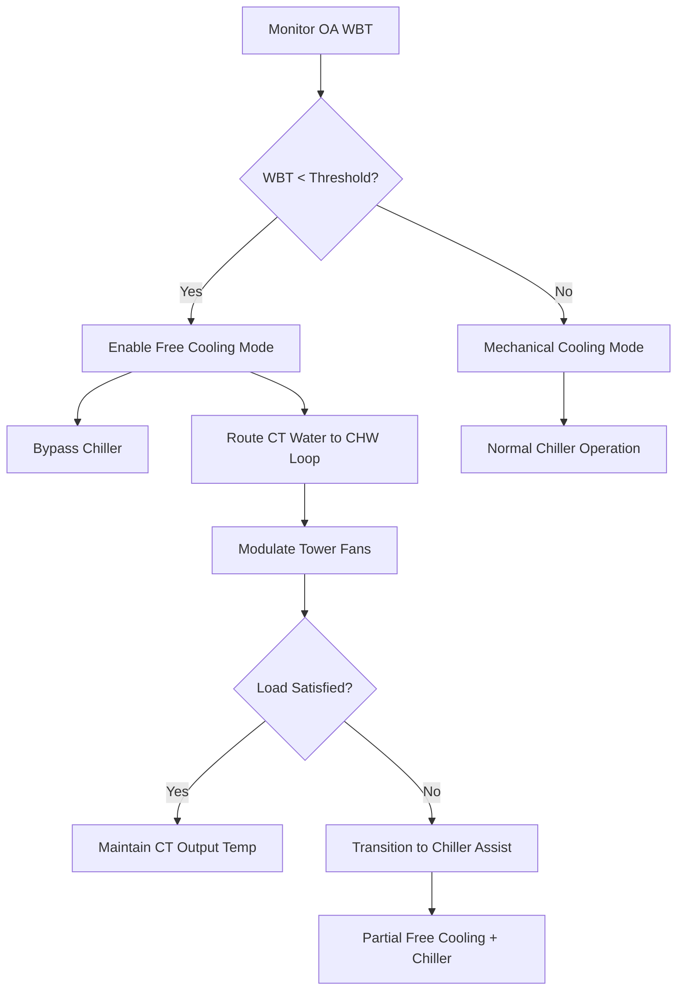
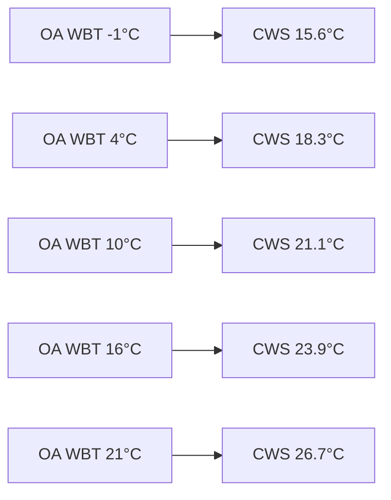

Free cooling with cooling towers exploits favorable ambient conditions to provide building cooling without mechanical refrigeration. This waterside economizer approach leverages the temperature difference between cold outdoor air and the cooling load, delivering substantial energy savings when wet-bulb temperatures permit direct or indirect heat exchange.

## Waterside Economizer Fundamentals

Waterside economizers enable cooling tower water to satisfy building loads when outdoor conditions provide sufficient heat rejection capacity. The fundamental energy balance determines feasibility:

$$Q_{cooling} = \dot{m}_{cw} c_p (T_{cws} - T_{cwr})$$

where $\dot{m}_{cw}$ represents condenser water flow rate, $c_p$ is specific heat (4.186 kJ/kg·K for water), $T_{cws}$ is condenser water supply temperature, and $T_{cwr}$ is return temperature.

**Operating Threshold Criteria:**

For effective free cooling, the cooling tower must produce water temperatures below the chilled water supply setpoint plus approach differential:

$$T_{ct,out} \leq T_{chws} - \Delta T_{approach}$$

Typical approach differentials range from 2.8°C to 5.6°C (5°F to 10°F) depending on heat exchanger effectiveness and system design.

## Direct Waterside Economizer Systems

Direct systems circulate cooling tower water through the building's chilled water loop, eliminating the chiller entirely during economizer mode. This configuration offers maximum efficiency but requires careful water quality management.

**Operating Sequence:**

**Advantages and Limitations:**

| Aspect | Direct System |
|--------|--------------|
| Efficiency | Highest (no intermediate HX) |
| Pump Energy | Lower (single loop) |
| Water Quality | Critical—requires filtration |
| Fouling Risk | High (open loop to coils) |
| Freeze Protection | Essential in cold climates |
| First Cost | Lower equipment cost |

Direct economizers require continuous water treatment and strainer maintenance to prevent fouling of heat transfer surfaces. Minimum filtration is 200 microns; 100 microns is preferred for sensitive equipment.

## Indirect Waterside Economizer Systems

Indirect systems employ a plate-and-frame heat exchanger to separate cooling tower water from the chilled water loop. This configuration provides operational flexibility and protects the closed chilled water system from contamination.

**Heat Exchanger Effectiveness:**

The effectiveness $\epsilon$ of the plate heat exchanger determines the temperature approach:

$$\epsilon = \frac{T_{cwr,in} - T_{cwr,out}}{T_{cwr,in} - T_{ctw,in}}$$

where subscripts denote chilled water return (cwr) and cooling tower water (ctw). High-effectiveness exchangers achieve $\epsilon$ = 0.75 to 0.85, requiring:

$$\Delta T_{approach} = \frac{T_{cwr,in} - T_{ctw,in}}{1/\epsilon - 1}$$

**Plate Heat Exchanger Sizing:**

Heat transfer area requirements follow:

$$A = \frac{Q}{U \cdot LMTD}$$

where $U$ is the overall heat transfer coefficient (typically 3500-5500 W/m²·K for plate exchangers with turbulent flow) and LMTD is the log mean temperature difference:

$$LMTD = \frac{(T_{cwr,in} - T_{ctw,out}) - (T_{cwr,out} - T_{ctw,in})}{\ln\left(\frac{T_{cwr,in} - T_{ctw,out}}{T_{cwr,out} - T_{ctw,in}}\right)}$$

**Indirect System Configuration:**

| Component | Specification | Purpose |
|-----------|---------------|---------|
| Plate HX | 316 SS plates | Corrosion resistance |
| Approach | 2.8-5.6°C (5-10°F) | Temperature differential |
| Pressure Drop | 35-70 kPa (5-10 psi) | Each side maximum |
| Strainer | 100 micron | Tower water protection |
| Isolation Valves | 2-way modulating | Flow control |

## Condenser Water Reset Strategy

Condenser water temperature reset optimizes the balance between chiller efficiency and free cooling capacity. Lower condenser water temperatures improve chiller COP but reduce free cooling hours.

**Reset Schedule Example:**

$$T_{cws} = T_{cws,design} - K \cdot (T_{oa,wb,design} - T_{oa,wb})$$

where $K$ is the reset ratio (typically 0.5-0.8) and temperatures reference wet-bulb conditions.

Lower reset temperatures extend free cooling hours but increase cooling tower fan energy during mechanical cooling mode.

## Operating Modes and Transitions

### Full Free Cooling Mode

Cooling tower capacity fully satisfies the building load. Chillers remain off, and cooling tower fans modulate to maintain chilled water supply temperature:

$$\dot{m}_{ct} \cdot c_p \cdot (T_{cws} - T_{cwr}) \geq Q_{load}$$

### Partial Free Cooling (Chiller Assist)

Ambient conditions provide partial capacity. Cooling tower pre-cools chilled water before entering the chiller, reducing lift and improving efficiency:

$$COP_{partial} = COP_{design} \cdot \left(1 + \frac{\Delta T_{precool}}{\Delta T_{lift,design}}\right)^{1.2}$$

The exponent 1.2 reflects typical centrifugal chiller performance curves per ASHRAE Handbook—HVAC Systems and Equipment.

### Transition Control Logic

Smooth mode transitions prevent temperature excursions:

1. **Entering Free Cooling:** Enable when $T_{ct,out} < T_{chws} - 2.8°C$ for 5 minutes
2. **Exiting Free Cooling:** Disable when $T_{ct,out} > T_{chws} - 1.1°C$ for 3 minutes
3. **Chiller Staging:** Start chiller when economizer capacity falls below 75% of load
4. **Deadband:** Maintain 1.7°C (3°F) between enable/disable thresholds

## Energy Savings Calculations

Annual energy savings depend on climate-specific free cooling hours and system efficiency improvements.

**Cooling Tower Fan Energy:**

$$E_{ct,fan} = \sum_{h=1}^{8760} P_{fan} \cdot PLR_h \cdot \eta_{motor}^{-1}$$

where $PLR_h$ is the hourly part-load ratio and $\eta_{motor}$ is motor efficiency.

**Chiller Energy Avoided:**

$$E_{saved} = \sum_{FC} \frac{Q_h}{COP_{chiller}} - E_{ct,fan,h} - E_{pump,additional}$$

where $\sum_{FC}$ represents summation over free cooling hours.

**Climate-Specific Annual Hours:**

| Climate Zone | ASHRAE 90.1 | Free Cooling Hours | Annual Savings |
|--------------|-------------|-------------------|----------------|
| 1A (Miami) | Hot-Humid | 150-400 hrs | 5-12% |
| 3A (Atlanta) | Warm-Humid | 800-1500 hrs | 15-25% |
| 4A (NYC) | Mixed-Humid | 1500-2500 hrs | 25-35% |
| 5A (Chicago) | Cool-Humid | 2500-3500 hrs | 35-45% |
| 6A (Minneapolis) | Cold-Humid | 3500-4500 hrs | 45-55% |
| 7 (Duluth) | Very Cold | 4500-5500 hrs | 50-60% |

**Simple Payback Calculation:**

$$Payback = \frac{C_{HX} + C_{controls} + C_{installation}}{E_{saved} \cdot C_{energy}}$$

Typical payback periods range from 2-5 years depending on climate, energy costs, and operating hours.

## Design Considerations and Best Practices

**Freeze Protection:**

In climates experiencing freezing conditions, glycol addition or drain-down capabilities prevent coil damage. Glycol reduces heat transfer effectiveness by 5-15% and requires larger heat exchangers.

**Strainer Maintenance:**

Differential pressure switches monitoring strainer pressure drop trigger automated backflushing or maintenance alerts. Replace elements when clean pressure drop exceeds 7 kPa (1 psi).

**Water Quality Management:**

Maintain cooling tower water within these parameters for indirect systems:

- pH: 7.5-9.0
- Conductivity: < 2000 μS/cm
- Suspended solids: < 50 ppm
- Chlorides: < 200 ppm

**Pump Staging:**

Variable speed drives on condenser water and chilled water pumps reduce parasitic losses during partial load operation, maintaining optimal flow rates for heat exchanger performance.

Free cooling operation with cooling towers provides significant energy savings in suitable climates, with indirect systems offering the best balance of efficiency, reliability, and maintenance requirements for most applications.
