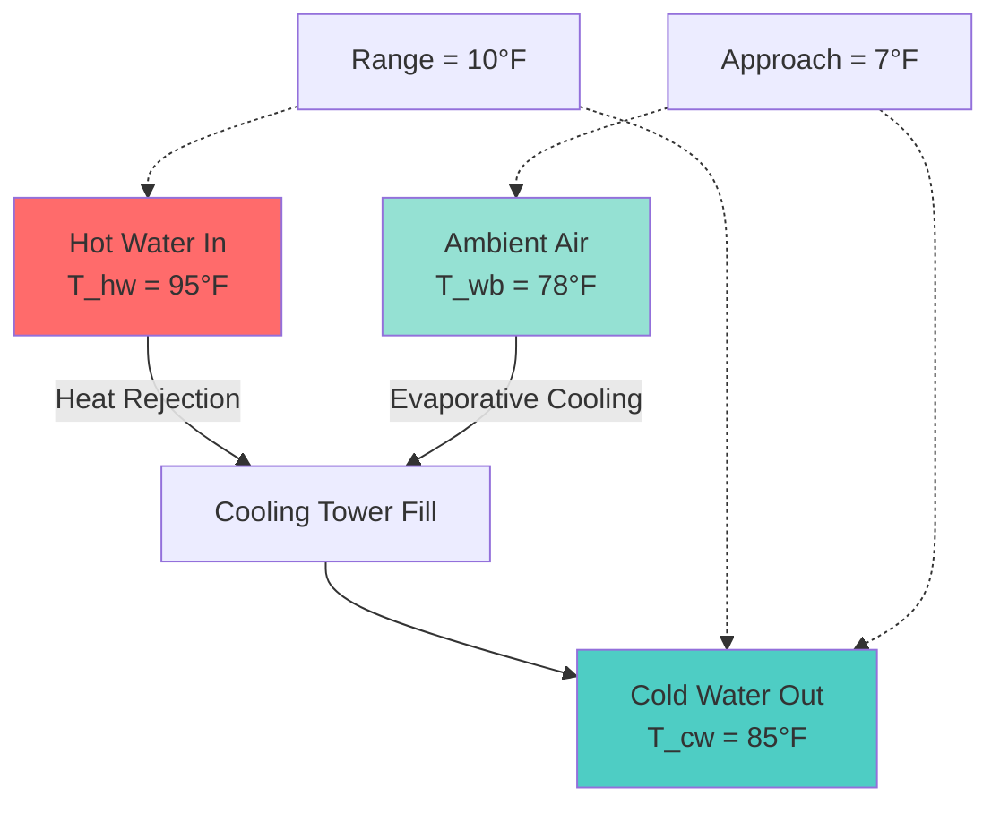
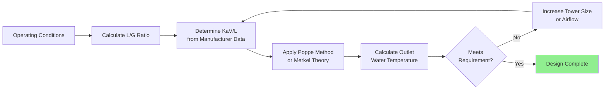

## Fundamental Performance Parameters

Cooling tower performance quantifies the heat rejection capability of evaporative cooling equipment. Performance analysis relies on psychrometric principles governing the mass and energy transfer between water and air streams.

### Range and Approach Definitions

**Range** represents the temperature difference between entering hot water and leaving cold water:

$$\text{Range} = T_{\text{hw}} - T_{\text{cw}}$$

where $T_{\text{hw}}$ is hot water temperature (°F) and $T_{\text{cw}}$ is cold water temperature (°F).

**Approach** measures how closely the cold water temperature approaches the ambient wet-bulb temperature:

$$\text{Approach} = T_{\text{cw}} - T_{\text{wb}}$$

where $T_{\text{wb}}$ is the entering air wet-bulb temperature (°F).

Range indicates the heat load removed from the water, while approach reflects the tower's thermal effectiveness. A smaller approach indicates better performance but requires larger tower surface area and airflow.

## Heat Rejection Capacity

The cooling tower heat rejection rate derives from the sensible and latent heat transfer between water and air:

$$Q = \dot{m}_w c_p \Delta T_w = \dot{m}_w c_p \times \text{Range}$$

where:
- $Q$ = heat rejection rate (Btu/hr)
- $\dot{m}_w$ = water flow rate (lb/hr)
- $c_p$ = specific heat of water (1.0 Btu/lb·°F)
- $\Delta T_w$ = water temperature range (°F)

For practical applications using gpm:

$$Q = 500 \times \text{gpm} \times \text{Range}$$

This relationship shows that doubling either flow rate or range doubles heat rejection capacity, assuming the tower can maintain the same approach temperature.

## Wet-Bulb Temperature Effects

Wet-bulb temperature fundamentally limits cooling tower performance because evaporative cooling cannot reduce water temperature below the air's wet-bulb temperature. The thermodynamic driving force for heat transfer is:

$$\Delta T_{\text{driving}} = T_w - T_{\text{wb,sat}}$$

where $T_{\text{wb,sat}}$ is the saturation wet-bulb temperature at the water-air interface.

| Wet-Bulb Temperature (°F) | Cold Water Achievable (7°F Approach) | Cold Water Achievable (10°F Approach) | Performance Impact |
|---------------------------|--------------------------------------|---------------------------------------|-------------------|
| 72 | 79 | 82 | Excellent capacity |
| 78 | 85 | 88 | Design condition |
| 84 | 91 | 94 | Reduced capacity |
| 90 | 97 | 100 | Significantly limited |

As wet-bulb temperature increases, the vapor pressure driving force decreases, reducing evaporation rates and increasing required tower size for a given approach.

## Fill Media Effectiveness

Fill media provides surface area and contact time for heat and mass transfer. Fill effectiveness $\epsilon$ is defined as:

$$\epsilon = \frac{T_{\text{hw}} - T_{\text{cw}}}{T_{\text{hw}} - T_{\text{wb}}} = \frac{\text{Range}}{\text{Range} + \text{Approach}}$$

This dimensionless parameter ranges from 0 to 1, with higher values indicating more effective heat transfer.

**Fill Types and Performance:**

| Fill Type | Effectiveness Range | L/G Ratio Range | Applications |
|-----------|-------------------|-----------------|--------------|
| Film fill (PVC/PP) | 0.70-0.85 | 0.8-1.5 | Clean water, high efficiency |
| Splash fill | 0.60-0.75 | 1.0-2.0 | Fouling conditions, moderate efficiency |
| Trickle fill | 0.50-0.65 | 1.5-3.0 | Heavy fouling, low efficiency |

Film fill achieves superior performance through thin water films flowing over vertical sheets, maximizing surface area per unit volume. The pressure drop through film fill is:

$$\Delta P_{\text{fill}} = K \times L \times \left(\frac{\dot{m}_w}{A}\right)^n$$

where $K$ is the fill resistance coefficient, $L$ is fill depth, $A$ is plan area, and $n$ ranges from 1.5 to 2.0.

## L/G Ratio and Air-Water Balance

The liquid-to-gas ratio (L/G) fundamentally determines tower performance characteristics:

$$\text{L/G} = \frac{\dot{m}_w}{\dot{m}_a}$$

where $\dot{m}_w$ is water mass flow rate and $\dot{m}_a$ is dry air mass flow rate.

Typical L/G ratios range from 0.75 to 1.50 for counterflow towers. Higher L/G ratios (more water per unit air) require deeper fill or greater airflow velocity to maintain performance.

The relationship between L/G and approach temperature follows:

$$\text{Approach} \propto \left(\text{L/G}\right)^{0.6 \text{ to } 0.8}$$

This power-law relationship demonstrates that doubling L/G ratio increases approach by 50-75%, requiring larger tower volume.

## CTI Rating Conditions

The Cooling Technology Institute (CTI) establishes standardized test conditions for tower performance certification per CTI STD-201:

**Standard Rating Conditions:**
- Hot water temperature: 95°F
- Cold water temperature: 85°F
- Range: 10°F
- Wet-bulb temperature: 78°F
- Approach: 7°F

**Thermal Capability Rating:**

The tower characteristic equation per CTI methodology:

$$\text{KaV}/\text{L} = f(\text{L/G})$$

where $\text{KaV}$ is the tower coefficient (mass transfer coefficient × volume) and represents the tower's inherent thermal capability independent of operating conditions.

## GPM Per Ton Ratio

Condenser water systems typically operate at 2.5-3.5 gpm per refrigeration ton. The standard 3 gpm/ton ratio derives from:

$$\text{gpm/ton} = \frac{12000 \text{ Btu/hr}}{500 \times \text{Range}}$$

For 10°F range: $\text{gpm/ton} = 12000/(500 \times 10) = 2.4$

Including 15-25% safety factor and piping heat gain yields approximately 3 gpm/ton.

**Effect of GPM/Ton on Performance:**

| GPM/Ton | Range (°F) | Approach Impact | Tower Size | Pump Energy |
|---------|------------|----------------|------------|-------------|
| 2.0 | 15 | Smaller approach possible | Smaller | Lower |
| 3.0 | 10 | Standard approach | Standard | Standard |
| 4.0 | 7.5 | Larger approach | Larger | Higher |

Lower gpm/ton increases range, improving chiller efficiency through lower condenser lift, but requires larger tower capacity.

## Characteristic Performance Curves

Tower performance curves plot cold water temperature against L/G ratio for constant wet-bulb conditions. The characteristic curve shape follows from the integrated Merkel equation:

$$\frac{\text{KaV}}{\text{L}} = \int_{T_{\text{cw}}}^{T_{\text{hw}}} \frac{c_p \, dT_w}{h_{\text{sat}}(T_w) - h_a}$$

where $h_{\text{sat}}$ is saturated air enthalpy at water temperature and $h_a$ is entering air enthalpy.

This integral has no closed-form solution but demonstrates that performance degrades non-linearly with increasing L/G ratio.

## Power Consumption

Total tower power includes fan and pump components:

$$P_{\text{total}} = P_{\text{fan}} + P_{\text{pump}}$$

**Fan power:**

$$P_{\text{fan}} = \frac{\text{cfm} \times \Delta P_{\text{static}}}{6356 \times \eta_{\text{fan}}}$$

where static pressure typically ranges from 0.2-0.5 in. w.g. for induced draft towers.

**Pump power:**

$$P_{\text{pump}} = \frac{\text{gpm} \times H_{\text{total}} \times \text{SG}}{3960 \times \eta_{\text{pump}}}$$

Optimizing tower performance requires balancing these competing energy consumers against approach temperature requirements per ASHRAE 90.1 guidelines.

## References

- CTI Code Tower ATC-105: Acceptance Test Code for Water-Cooling Towers
- CTI STD-201: Standard for Certification of Water-Cooling Tower Thermal Performances
- ASHRAE Handbook—HVAC Systems and Equipment, Chapter 40: Cooling Towers
- ASHRAE Standard 90.1: Energy Standard for Buildings Except Low-Rise Residential Buildings
