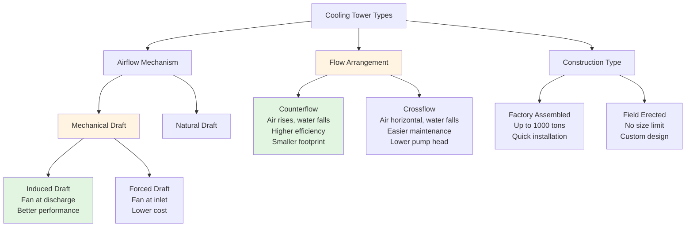

# Cooling Tower Types: Classification and Selection

Cooling towers reject heat from water-cooled HVAC systems and industrial processes to the atmosphere through evaporative cooling. Tower selection depends on heat rejection requirements, available space, energy efficiency targets, and budget constraints. This analysis examines the three primary classification systems: airflow mechanism, air-water flow arrangement, and construction type.

## Airflow Mechanism Classification

Cooling towers are categorized by how air movement is generated through the tower.

### Mechanical Draft Towers

Mechanical draft towers use fans to force or induce airflow through the fill media.

**Induced Draft Towers**

Induced draft towers position fans at the discharge (top) of the tower, pulling air upward through the fill. This configuration provides several advantages:

- Higher entering air velocity (600-800 fpm) reduces recirculation of saturated discharge air
- More uniform air distribution across the fill cross-section
- Fan operates in saturated air stream, requiring moisture-resistant construction
- Better performance stability under varying load conditions

Fan power for induced draft towers is calculated using:

**P = (Q × ΔP) / (6356 × η)**

Where:
- P = fan power (hp)
- Q = airflow rate (cfm)
- ΔP = static pressure drop (in. w.g., typically 0.4-0.6)
- η = fan efficiency (typically 0.75-0.85)

**Forced Draft Towers**

Forced draft towers locate fans at the air inlet (bottom or side), pushing air through the fill. Key characteristics include:

- Lower air velocities (400-600 fpm) at discharge increase susceptibility to recirculation
- Fans operate in ambient air, extending service life
- Lower initial cost due to simpler fan construction
- Higher exit air velocity aids plume dispersion
- More prone to performance degradation from recirculation in confined installations

### Natural Draft Towers

Natural draft towers rely on buoyancy-driven airflow created by air density differences between the warm, moist air inside the tower and cooler ambient air outside.

The draft equation governs natural convection:

**ΔP = H × (ρ_ambient - ρ_tower) × g**

Where:
- ΔP = available draft pressure (Pa)
- H = tower height (m)
- ρ = air density (kg/m³)
- g = gravitational acceleration (9.81 m/s²)

Natural draft towers require:
- Significant height (100-200 m for large power plant applications)
- Large footprint for fill section
- Hyperbolic shell structure for structural efficiency
- No fan power consumption
- Performance highly dependent on ambient conditions

These towers are economically justified only for very large heat rejection loads (>100,000 tons) where fan power savings offset substantial construction costs.

## Air-Water Flow Arrangement

The relative direction of air and water flow through the fill defines two primary configurations.

### Counterflow Towers

In counterflow towers, air travels vertically upward while water cascades downward through the fill. This arrangement provides:

- Maximum thermal driving force (hottest water contacts driest air)
- Highest efficiency per unit of fill volume
- Smaller footprint for equivalent capacity
- Higher pump head requirement (water must be lifted to distribution system above fill)
- More uniform water distribution required

Heat transfer effectiveness:

**ε = (T_wi - T_wo) / (T_wi - T_wb)**

Where:
- ε = effectiveness (typically 0.65-0.75 for counterflow)
- T_wi = inlet water temperature (°F)
- T_wo = outlet water temperature (°F)
- T_wb = ambient wet-bulb temperature (°F)

### Crossflow Towers

Crossflow towers direct air horizontally through the fill while water falls vertically. Characteristics include:

- Gravity water distribution (no pressurized spray system)
- Lower pump head requirements
- Easier maintenance access to internal components
- Larger plan area for equivalent capacity
- Slightly lower thermal efficiency (effectiveness 0.60-0.70)
- Non-uniform air-water contact patterns

## Performance Comparison: Crossflow vs Counterflow

| Parameter | Counterflow | Crossflow | Notes |
|-----------|-------------|-----------|-------|
| Thermal efficiency | 0.65-0.75 | 0.60-0.70 | Counterflow 5-8% better |
| Approach temperature | 5-7°F | 7-10°F | Distance from wet-bulb |
| Footprint (relative) | 1.0 | 1.15-1.25 | Per ton of capacity |
| Fill height | 6-8 ft | 4-6 ft | Typical ranges |
| Water distribution | Pressurized spray | Gravity hot water basin | PSI requirement |
| Pump head | +10-15 ft | Baseline | Static lift difference |
| Air velocity through fill | 400-600 fpm | 300-500 fpm | Face velocity |
| Maintenance access | Restricted | Better | Internal components |
| Freeze protection | More difficult | Easier | Water containment |
| Drift eliminator efficiency | 0.0005-0.001% | 0.001-0.002% | Water loss fraction |

## Heat Rejection Capacity Calculation

Tower capacity is determined by the heat rejection requirement:

**Q = m × c_p × (T_wi - T_wo)**

Where:
- Q = heat rejection rate (Btu/hr)
- m = water flow rate (lb/hr)
- c_p = specific heat of water (1.0 Btu/lb·°F)
- T_wi = inlet water temperature (°F)
- T_wo = outlet water temperature (°F)

For a typical HVAC application with 1000 tons of refrigeration:
- Heat rejection = 1000 tons × 15,000 Btu/hr/ton = 15,000,000 Btu/hr
- Water flow = 3 gpm per ton = 3000 gpm
- Temperature range = 95°F to 85°F (10°F range)

Verification: Q = 3000 gpm × 500 lb/hr per gpm × 1.0 × 10°F = 15,000,000 Btu/hr

## Construction Types

**Factory-Assembled Towers**
- Capacities up to 1000 tons per cell
- Pre-wired and pre-piped
- Rapid installation (1-2 weeks)
- Quality-controlled manufacturing
- Limited customization options

**Field-Erected Towers**
- No practical size limitation
- Custom-designed for specific applications
- Longer installation period (2-4 months)
- Site-specific optimization
- Lower shipping costs for large units

## Standards and Guidelines

**CTI (Cooling Technology Institute) Standards**
- STD-201: Standard for Certification of Water Cooling Tower Thermal Performance
- ATC-105: Acceptance Test Code for Water Cooling Towers
- WMS-2015: Cooling Tower and Evaporative Cooler Water Management and Security

**ASHRAE Standards**
- ASHRAE 90.1: Energy efficiency requirements for mechanical draft towers
- ASHRAE Handbook—HVAC Systems and Equipment: Chapter 40, Cooling Towers

CTI certification ensures tower performance meets specified conditions:
- Wet-bulb temperature: 78°F
- Range: 10°F
- Approach: 7°F
- Water flow rate tolerance: ±5%

## Selection Criteria

Tower type selection depends on multiple factors:

1. **Heat rejection load**: Natural draft economical only above 100,000 tons
2. **Available space**: Counterflow requires less area, natural draft requires significant height
3. **Energy cost**: Induced draft most efficient, natural draft eliminates fan power
4. **Initial budget**: Forced draft lowest cost, natural draft highest
5. **Maintenance philosophy**: Crossflow provides better access
6. **Water quality**: Fill selection impacts all types
7. **Ambient conditions**: Natural draft performance varies significantly with weather
8. **Noise constraints**: Natural draft quietest, forced draft noisiest

The induced draft counterflow configuration represents the optimal balance of efficiency, footprint, and cost for most commercial HVAC applications in the 100-5000 ton range. Crossflow towers suit applications prioritizing maintenance access and lower pump energy. Natural draft towers remain limited to large industrial and power generation facilities where their substantial capital cost is justified by eliminated fan power over decades of operation.

