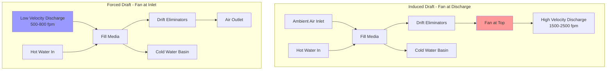

Mechanical draft cooling towers use motor-driven fans to force or draw air through the tower, providing precise control over airflow independent of meteorological conditions. These towers dominate commercial and industrial applications due to their predictable performance and compact footprint compared to natural draft designs.

## Fundamental Configurations

Mechanical draft towers separate into two primary categories based on fan placement relative to the air stream.

**Induced Draft Towers**

The fan mounts at the air discharge (top) of the tower, pulling air upward through the fill media. This configuration creates negative pressure within the tower, drawing air through the fill material and water distribution system. Induced draft designs offer several advantages: the high-velocity discharge (1500-2500 fpm) reduces recirculation potential, hot saturated air contacts fan components (requiring corrosion-resistant construction), and the large-diameter low-speed fans (40-100 hp typical) provide efficient air movement.

The negative pressure distribution prevents fogging at the tower base and contains water within the structure more effectively than forced draft arrangements. However, the fan operates in hot, saturated air, requiring galvanized or fiberglass construction and weatherproof motors.

**Forced Draft Towers**

The fan locates at the air inlet (base or side), pushing air through the tower. This creates positive pressure within the fill section. Forced draft configurations allow the fan to operate in cool, dry ambient air, extending component life and permitting standard motor construction. The low-speed centrifugal fans typically discharge at 500-800 fpm.

The primary disadvantage involves recirculation susceptibility. The low-velocity discharge can entrain in the high-velocity inlet under certain wind conditions. Forced draft towers generally require 20-30% more plan area than equivalent induced draft units to achieve comparable performance.

## Airflow Patterns: Crossflow vs Counterflow

The relationship between air and water flow through the fill determines heat transfer efficiency and physical configuration.

**Crossflow Arrangement**

Air moves horizontally through the fill while water falls vertically. The perpendicular flow paths allow low air-side pressure drop (0.1-0.2 in. w.g.) and simple gravity-fed hot water distribution basins that require no pressurization. Crossflow towers accommodate larger flow variations without performance degradation.

The horizontal air path requires larger plan areas than counterflow designs for equivalent capacity. Fill cleaning proves more difficult due to horizontal passages, and freeze protection demands careful attention in cold climates as the distribution basins expose directly to ambient air.

**Counterflow Arrangement**

Air and water move in opposite vertical directions, with air entering at the bottom and flowing upward while water cascades downward. This arrangement maximizes the thermal driving force as the coldest water contacts the coldest air and hottest water meets the warmest air.

Counterflow towers achieve 10-15% better approach to wet-bulb temperature than equivalent crossflow designs, occupying 30-40% less floor space. However, they require pressurized spray nozzles for water distribution, higher fan horsepower due to increased static pressure (0.3-0.6 in. w.g.), and exhibit greater sensitivity to water flow variations.

## Fan Performance Calculations

The fan must overcome system resistance while delivering the required airflow. Total static pressure includes fill resistance, drift eliminators, and discharge velocity pressure.

**Airflow Requirement**

The air-to-water mass ratio (L/G) typically ranges from 0.75 to 1.5 for mechanical draft towers. For a cooling load:

```
Air flow (cfm) = (Heat rejection, BTU/hr) / (ρ × Cp × ΔT × 60)
```

Where ρ = air density (0.075 lb/ft³), Cp = 0.24 BTU/lb·°F

For practical application using wet-bulb approach:

```
cfm ≈ GPM × (Range) / (Approach × 1.8)
```

**Fan Horsepower**

Brake horsepower accounts for flow, static pressure, and efficiency:

```
BHP = (cfm × Static Pressure, in. w.g.) / (6356 × Fan Efficiency)
```

Typical propeller fan efficiency ranges from 0.70-0.80. Include 15-20% service factor for motor selection.

For a 500-ton tower: 8000 cfm/ton × 500 = 4,000,000 cfm at 0.4 in. w.g. static pressure yields BHP = (4,000,000 × 0.4) / (6356 × 0.75) = 336 hp, requiring 400 hp motor with service factor.



## Selection Criteria

Multiple factors govern mechanical draft tower selection for specific applications.

| Criterion | Induced Draft | Forced Draft | Crossflow | Counterflow |
|-----------|---------------|--------------|-----------|-------------|
| Fan Power Efficiency | High | Moderate | Higher | Lower |
| Plot Space Required | Compact | Larger | Larger | Compact |
| Recirculation Risk | Low | Moderate-High | Low | Moderate |
| Air-Side Pressure Drop | 0.3-0.6 in. w.g. | 0.2-0.4 in. w.g. | 0.1-0.2 in. w.g. | 0.3-0.6 in. w.g. |
| Approach to WBT | 7-10°F | 7-10°F | 8-12°F | 5-8°F |
| Part Load Performance | Good | Good | Excellent | Fair |
| Freeze Resistance | Good | Fair | Fair | Good |
| Maintenance Access | Difficult (top) | Easy (base) | Easy | Moderate |
| First Cost | Moderate-High | Moderate | Moderate | Moderate-High |

## CTI Standards and Performance

The Cooling Technology Institute (CTI) establishes thermal performance standards and certification protocols. CTI Standard 201 defines thermal performance testing procedures, requiring field verification within ±5% of design capacity at rated conditions.

CTI certification ensures towers meet specified performance at:
- Design wet-bulb temperature ± 2°F
- Design range ± 2°F
- Design flow rate ± 5%
- Design approach ± 1°F

Specify CTI-certified towers for critical applications. Performance degradation occurs from fill fouling (15-25% capacity loss), fan blade erosion (5-10% airflow reduction), and water distribution problems (20-30% local capacity loss). Maintain towers per CTI Standard 159 for sustained performance.

Fan cycling and VFD control extend to 50% capacity while maintaining acceptable approach temperatures. Below 50% load, single-cell operation or basin heaters prevent freezing in cold climates.

## Application Guidelines

Select induced draft counterflow for maximum capacity in minimum space where approach to wet-bulb must stay tight (data centers, process cooling). Specify induced draft crossflow for variable load applications with simple maintenance requirements (HVAC comfort cooling). Consider forced draft only where fan maintenance access outweighs recirculation concerns or where low-velocity discharge prevents drift carryover complaints.

All configurations require proper placement with minimum clearances: 1.5× tower height from structures creating wind shadows and minimum 50 feet between adjacent towers to prevent recirculation. Orient induced draft towers with prevailing winds across the short dimension to minimize wind effects on discharge plumes.

