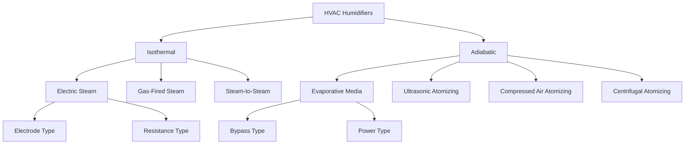

# HVAC Humidifiers

Humidifiers add moisture to air streams to maintain indoor relative humidity within acceptable ranges. Proper humidity control prevents building fabric deterioration, occupant discomfort, static electricity buildup, and respiratory issues. This analysis examines humidifier types, underlying physics, and selection criteria based on ASHRAE standards.

## Humidification Fundamentals

Humidification increases the moisture content of air, quantified as humidity ratio (W) in pounds of water per pound of dry air or grains per pound (7000 grains = 1 lb). The process occurs through two distinct thermodynamic pathways:

**Isothermal Humidification:** Steam injection adds moisture and sensible heat simultaneously. The process increases both humidity ratio and dry-bulb temperature. Steam humidifiers operate isothermally, requiring external energy for water vaporization before injection.

**Adiabatic Humidification:** Liquid water evaporates directly into the air stream, extracting latent heat from the air itself. This process increases humidity ratio while decreasing dry-bulb temperature, following a constant wet-bulb temperature line on the psychrometric chart.

## Humidification Load Calculation

The required humidification capacity depends on ventilation rates, infiltration, and desired humidity levels. The humidification load is calculated as:

$$Q_h = \dot{m}_{air} \times (W_{supply} - W_{return}) \times h_{fg}$$

Where:
- $Q_h$ = humidification load (Btu/hr)
- $\dot{m}_{air}$ = mass flow rate of dry air (lb/hr)
- $W_{supply}$ = supply air humidity ratio (lb/lb)
- $W_{return}$ = return air humidity ratio (lb/lb)
- $h_{fg}$ = latent heat of vaporization ≈ 1060 Btu/lb at atmospheric pressure

For volumetric flow rates, the equation becomes:

$$\dot{m}_{water} = \frac{CFM \times 60 \times \rho_{air} \times (W_{supply} - W_{return})}{7000}$$

Where:
- $\dot{m}_{water}$ = water addition rate (lb/hr)
- $CFM$ = volumetric airflow rate (ft³/min)
- $\rho_{air}$ = air density ≈ 0.075 lb/ft³ at standard conditions
- Division by 7000 converts grains to pounds

## Humidifier Types

### Steam Humidifiers (Isothermal)

Steam humidifiers generate vapor externally and inject it into the air stream. Three configurations exist:

1. **Electric Steam Generators:** Use resistance heating or submerged electrodes to boil water. Electrode types pass current through mineral-laden water, generating heat via resistivity. These units self-clean as mineral concentration increases conductivity until automatic drain cycles flush the canister.

2. **Gas-Fired Steam Generators:** Combust natural gas or propane to generate steam. Higher capacity than electric units with lower operating costs in regions with favorable gas-to-electricity cost ratios.

3. **Steam-to-Steam Converters:** Use facility boiler steam to generate clean steam via heat exchanger. Prevents boiler treatment chemicals from entering occupied spaces.

Steam humidifiers provide rapid response, precise control, and minimal duct space requirements. The steam dispersion manifold must ensure complete absorption before the air stream contacts surfaces to prevent condensation and microbial growth.

### Evaporative Humidifiers (Adiabatic)

Evaporative humidifiers expose water to the air stream using wetted media. Water trickles over porous pads while air passes through, enabling evaporation. Two categories exist:

**Bypass Humidifiers:** Divert a portion of heated air through the media pad before returning it to the main duct. Lower capacity, suitable for residential applications.

**Power Humidifiers:** Install directly in the supply duct with fan-forced airflow through the media. Higher evaporation rates than bypass types.

Evaporative systems consume no direct energy for vaporization but reduce air temperature by 5-15°F depending on entering conditions and pad efficiency. This requires downstream reheating in applications demanding specific supply temperatures.

### Atomizing Humidifiers (Adiabatic)

Atomizing humidifiers create fine water droplets that evaporate in the air stream. Droplet size determines evaporation distance and risk of downstream wetting:

**Ultrasonic Atomizers:** Vibrate a piezoelectric transducer at ultrasonic frequencies (1-3 MHz) to produce 1-5 micron droplets. Require demineralized water to prevent white dust from mineral residue.

**Compressed Air Atomizers:** Use compressed air (80-100 psi) to shear water into droplets. Produce 10-20 micron droplets requiring longer evaporation distances.

**Centrifugal Atomizers:** Spin water at high velocity to create droplets. Suitable for large commercial applications with adequate duct length for complete evaporation.

## Performance Comparison

| Parameter | Steam | Evaporative | Atomizing |
|-----------|-------|-------------|-----------|
| Process Type | Isothermal | Adiabatic | Adiabatic |
| Energy Input | High (540-1060 Btu/lb) | Low (fan only) | Medium (compressed air/motor) |
| Response Time | Fast (< 5 min) | Slow (15-30 min) | Medium (5-15 min) |
| Control Precision | Excellent (±2% RH) | Fair (±5-10% RH) | Good (±3-5% RH) |
| Air Temperature Effect | +5 to +15°F | -5 to -15°F | -3 to -10°F |
| Water Quality | Moderate | Low | High (DI/RO required) |
| Maintenance | Low | High (media replacement) | Medium (nozzle cleaning) |
| First Cost | High | Low | Medium |
| Operating Cost | High | Low | Medium |
| Absorption Distance | 3-5 ft | N/A | 10-30 ft |

## ASHRAE Humidity Standards

ASHRAE Standard 55 (Thermal Environmental Conditions for Human Occupancy) recommends 30-60% relative humidity for occupied spaces. Lower humidity causes dry mucous membranes and increased static electricity; higher humidity promotes mold growth and dust mite proliferation.

ASHRAE Standard 62.1 (Ventilation for Acceptable Indoor Air Quality) does not mandate specific humidity levels but recognizes humidity control as essential for IAQ. Applications with hygroscopic materials, electronics, or healthcare requirements may demand tighter control bands.

Humidifier selection criteria per ASHRAE Handbook - HVAC Systems and Equipment:
- Space dew point requirements
- Ventilation and infiltration rates
- Allowable supply air temperature depression
- Water quality and treatment costs
- Energy costs and sustainability goals
- Maintenance capabilities

## Selection Methodology

1. Calculate humidification load using psychrometric analysis of supply and return conditions
2. Determine if isothermal or adiabatic humidification is compatible with supply temperature requirements
3. Evaluate water quality and treatment infrastructure
4. Assess available utilities (electricity, gas, compressed air, steam)
5. Calculate life cycle costs including energy, water, and maintenance
6. Verify adequate duct length for complete moisture absorption
7. Confirm control system compatibility for modulation and safety interlocks

Proper humidifier selection balances first cost, operating efficiency, control precision, and maintenance requirements to achieve ASHRAE compliance while minimizing total cost of ownership.

