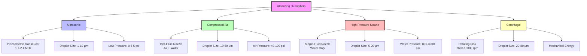

# Atomizing Humidifiers

Atomizing humidifiers introduce moisture into air streams by mechanically breaking water into fine droplets that evaporate within the airstream or conditioned space. Unlike steam systems that require phase change energy input, atomizing systems rely on mechanical energy to create aerosols with droplet diameters typically ranging from 1-50 μm. The evaporation process provides adiabatic cooling, reducing sensible heat while adding latent load.

## Physical Principles of Atomization

The fundamental process involves overcoming water's surface tension (approximately 0.072 N/m at 20°C) to create new surface area. Energy requirements scale with the total surface area generated:

**Energy per unit mass** = (Surface tension × Total surface area) / Mass of water

For a given water volume V broken into spherical droplets of diameter d:
- Number of droplets N = 6V/(πd³)
- Total surface area A = N × πd² = 6V/d
- Surface area increases inversely with droplet diameter

Smaller droplets provide faster evaporation rates due to higher surface-to-volume ratios but require greater atomization energy. Evaporation rate follows:

**dm/dt** = hm × A × (ρsat - ρair)

where hm is the mass transfer coefficient, A is droplet surface area, and ρ represents water vapor densities at the droplet surface (saturated) and in the surrounding air.

## Atomization Technologies

## Technology Comparison

| Parameter | Ultrasonic | Compressed Air | High Pressure Nozzle |
|-----------|------------|----------------|----------------------|
| Droplet Size (μm) | 1-10 | 10-50 | 5-20 |
| Water Pressure | 0.5-5 psi | 5-20 psi | 800-3000 psi |
| Air/Power Input | 50-100 W/lb/hr | 40-100 psi compressed air | Pump motor 1-5 hp |
| Evaporation Distance | 2-4 ft | 6-12 ft | 4-8 ft |
| Water Quality | Demineralized required | Filtered acceptable | RO/DI recommended |
| Capacity Range | 10-200 lb/hr | 50-500 lb/hr | 100-2000 lb/hr |
| Energy Efficiency | High (electrical) | Low (compressed air losses) | Medium (pump energy) |
| Maintenance Frequency | Monthly (transducer cleaning) | Quarterly (nozzle replacement) | Semi-annual (pump service) |
| Initial Cost | $$ | $ | $$$ |
| White Dust Risk | High if untreated water | Medium | Low with proper filtration |

## Ultrasonic Humidification

Ultrasonic systems employ piezoelectric transducers vibrating at 1.7-2.4 MHz to create capillary waves on the water surface. When wave amplitude exceeds a critical threshold (Rayleigh criterion), the surface becomes unstable and ejects droplets.

**Droplet diameter** (Lang equation): d ≈ 0.34 × (8πγ/ρf²)^(1/3)

where γ is surface tension, ρ is water density, and f is frequency.

For f = 2 MHz, typical droplet size ≈ 3-5 μm. These fine droplets provide:
- Rapid evaporation (typically complete within 2-4 feet of discharge)
- Minimal wetting of surfaces
- Requirement for demineralized water to prevent white dust (mineral precipitate)

**Absorption distance calculation:**

For droplets of initial diameter d₀ = 5 μm in air at 70°F, 30% RH, moving at 500 fpm:
- Evaporation time t ≈ d₀²/(8 × Dv × Sh × ln[(1-X∞)/(1-Xs)])
- With Dv = 2.6×10⁻⁵ m²/s, Sherwood number Sh ≈ 2, X values from psychrometrics
- t ≈ 0.8-1.2 seconds
- Absorption distance ≈ 500 fpm × 1 second ≈ 8 feet (allowing for turbulent mixing)

## Compressed Air Atomization

Two-fluid nozzles use compressed air (typically 40-100 psi) to shear water streams into droplets. The Weber number characterizes atomization:

**We** = ρair × vrel² × d / γ

Atomization occurs when We > 12 (critical Weber number). Higher air velocities and pressures produce finer droplets but consume more energy.

**Compressed air energy cost:** For 100 psi air at 10 scfm per lb/hr of water:
- Compressor power ≈ 0.2 hp per scfm
- Energy input ≈ 2 hp per lb/hr of humidification
- Significantly higher than evaporative or steam systems

This technology suits applications where compressed air is readily available or where moderate droplet sizes (10-50 μm) provide adequate evaporation distances.

## High-Pressure Nozzle Systems

Single-fluid nozzles operating at 800-3000 psi force water through precision orifices (0.005-0.020 inch diameter). The pressure drop accelerates water to 100-200 fps, creating turbulent breakup into 5-20 μm droplets.

**Flow rate per nozzle:** Q = Cd × A × √(2ΔP/ρ)

where Cd ≈ 0.6-0.7 for turbulent orifice flow, A is orifice area, ΔP is pressure drop, and ρ is water density.

For 1500 psi (10.3 MPa) through 0.010 inch orifice:
- Q ≈ 0.6 × π(0.127 mm)²/4 × √(2 × 10.3×10⁶ Pa / 1000 kg/m³)
- Q ≈ 0.09 L/min ≈ 1.3 lb/hr per nozzle

Systems use multiple nozzles manifolded together. Pump energy consumption approximately 0.15-0.25 hp per lb/hr at 1500 psi, more efficient than compressed air but requiring regular maintenance of high-pressure components.

## Centrifugal Atomization

Rotating disks or cups (3600-10,000 rpm) fling water radially outward. Centrifugal force overcomes surface tension at the disk edge, forming ligaments that break into droplets.

**Droplet size** (Nukiyama-Tanasawa): d ≈ C × (γ/(ρω²r²))^0.5

where ω is angular velocity and r is disk radius. Higher rotational speeds produce finer droplets but with broader size distribution (20-80 μm typical) compared to nozzle-based systems.

This technology is less common in HVAC applications due to mechanical complexity and larger droplet sizes but finds use in specialized industrial humidification.

## Design Considerations per ASHRAE

ASHRAE fundamentals (Chapter 22, Sorbents and Desiccants; Chapter 21, Air-Cleaning and Humidification) emphasizes:

**Water quality requirements:**
- Total dissolved solids (TDS) < 50 ppm for ultrasonic systems
- TDS < 200 ppm for high-pressure nozzles
- Reverse osmosis or deionization typically required

**Evaporation distance:**
Ensure adequate duct length downstream of atomizer injection:
- Lmin = 1.5 × √(Q/V) for complete evaporation
- Q = airflow (cfm), V = air velocity (fpm)
- Add 20-30% safety factor

**Control strategy:**
Modulate capacity via:
- Number of active nozzles (staged control)
- Pump pressure variation (high-pressure systems)
- Air pressure modulation (compressed air systems)
- Transducer power (ultrasonic systems)

Integrate with dew point or RH sensing, maintaining discharge air below saturation to prevent condensation on ductwork.

## Application Selection

**Ultrasonic systems:** Clean rooms, museums, data centers requiring precise control and minimal droplet size (1-10 μm). High water quality costs offset by low energy consumption.

**Compressed air systems:** Facilities with existing compressed air infrastructure, moderate capacity requirements (50-500 lb/hr), and tolerance for larger droplets.

**High-pressure nozzles:** Large commercial and industrial applications (100-2000 lb/hr), longest throw distances, best energy efficiency among atomizing technologies when compressed air costs are factored.

**Centrifugal systems:** Specialized industrial processes accepting broader droplet distribution and mechanical complexity.

All atomizing systems provide adiabatic cooling (approximately 1000 BTU per lb of water evaporated), reducing cooling loads during humidification. Calculate total sensible cooling effect and adjust HVAC system capacity accordingly.

