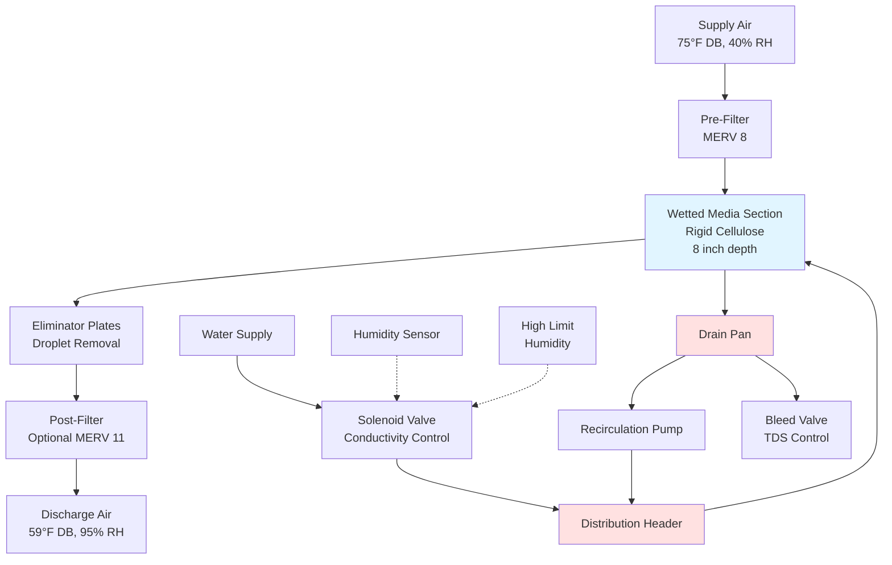

# Evaporative Humidifiers

Evaporative humidifiers add moisture to airstreams through adiabatic saturation, where water evaporates into air without external heat input. This process simultaneously increases humidity and decreases dry-bulb temperature while maintaining constant enthalpy. The technology provides energy-efficient humidification for commercial HVAC systems, data centers, and industrial applications where cooling is beneficial or acceptable.

## Operating Principles

The evaporative process follows adiabatic saturation thermodynamics. When unsaturated air contacts wetted media, water molecules absorb latent heat of vaporization (approximately 1,050 BTU/lb at standard conditions) from the airstream. This phase change converts sensible heat to latent heat, reducing dry-bulb temperature while increasing absolute humidity. The process follows a constant wet-bulb temperature line on the psychrometric chart.

The theoretical endpoint is adiabatic saturation, where air reaches 100% relative humidity at the wet-bulb temperature. Practical systems achieve 80-95% saturation efficiency depending on media type, face velocity, and contact time.

**Governing equation for moisture addition:**

```
ṁw = ṁa × (W₂ - W₁)
```

Where:
- ṁw = water evaporation rate (lb/hr)
- ṁa = mass flow rate of dry air (lb/hr)
- W₁ = initial humidity ratio (lb water/lb dry air)
- W₂ = final humidity ratio (lb water/lb dry air)

**Temperature depression:**

```
ΔT = (W₂ - W₁) × hfg / cp,air
```

Where:
- ΔT = dry-bulb temperature reduction (°F)
- hfg = latent heat of vaporization (≈1,050 BTU/lb)
- cp,air = specific heat of air (≈0.24 BTU/lb·°F)

## Wetted Media Types

| Media Type | Saturation Efficiency | Face Velocity | Pressure Drop | Service Life | Applications |
|------------|----------------------|---------------|---------------|--------------|--------------|
| Rigid cellulose | 85-95% | 400-600 fpm | 0.15-0.30" WC | 5-7 years | AHUs, makeup air |
| Rigid ceramic | 80-90% | 500-700 fpm | 0.20-0.35" WC | 10+ years | Industrial, corrosive |
| Random fiber pad | 70-85% | 300-500 fpm | 0.10-0.20" WC | 2-4 years | Residential, light commercial |
| Spray nozzle array | 60-80% | 400-800 fpm | 0.05-0.15" WC | 8-10 years | Clean rooms, industrial |

### Rigid Media Humidifiers

Rigid media systems utilize honeycomb-structured cellulose or ceramic panels with high surface area density (200-400 ft²/ft³). Water distributes across the top surface through a distribution header, flowing downward through capillary action while air passes horizontally through the media. The counter-flow arrangement maximizes contact time and evaporative efficiency.

**Design considerations:**
- Media thickness: 6-12 inches typical (thicker = higher efficiency)
- Flute angle: 45° or 60° configurations optimize air-water contact
- Face velocity: maintain 400-600 fpm for optimal efficiency
- Water flow rate: 0.5-1.0 GPM per linear foot of media

### Drip Pan Systems

Drip pan humidifiers position wetted media above a collection basin. Water recirculates from the pan through a pump to distribution tubes above the media. This configuration suits retrofit applications and systems requiring lower pressure drop. The media typically consists of random fiber pads or corrugated cellulose sheets.

**Operational characteristics:**
- Lower first cost than rigid media systems
- Requires regular pan cleaning to prevent biological growth
- Pan depth: minimum 3 inches for effective water distribution
- Bleed-off rate: 10-20% of recirculation flow to control mineral concentration

## System Performance Analysis

### Saturation Efficiency

Saturation efficiency (ηsat) quantifies actual moisture addition relative to theoretical maximum:

```
ηsat = (W₂ - W₁) / (Wsat - W₁) × 100%
```

Where Wsat represents the humidity ratio at saturation (wet-bulb temperature).

**Example calculation:**

Given conditions:
- Entering air: 75°F DB, 40% RH (W₁ = 0.0065 lb/lb)
- Wet-bulb temperature: 59°F
- Saturation humidity ratio at 59°F: Wsat = 0.0108 lb/lb
- Measured exit humidity ratio: W₂ = 0.0102 lb/lb

```
ηsat = (0.0102 - 0.0065) / (0.0108 - 0.0065) × 100% = 86%
```

### Cooling Effect Quantification

For an airstream of 10,000 CFM at standard conditions (ρ = 0.075 lb/ft³):

```
ṁa = 10,000 CFM × 0.075 lb/ft³ × 60 min/hr = 45,000 lb/hr

ṁw = 45,000 × (0.0102 - 0.0065) = 166.5 lb/hr

ΔT = (0.0102 - 0.0065) × 1,050 / 0.24 = 16.2°F

Leaving air temperature = 75°F - 16.2°F = 58.8°F
```

The process delivers 166.5 lb/hr (20 GPH) of moisture addition with 16.2°F temperature depression at 86% saturation efficiency.

## System Configuration



## Water Quality Management

Evaporative systems concentrate dissolved solids as pure water evaporates. Total dissolved solids (TDS) accumulation requires continuous bleed-off to prevent scaling and biological fouling.

**Concentration cycles calculation:**

```
Cycles = (Makeup water TDS) / (Bleed water TDS)
Bleed rate = Evaporation rate / (Cycles - 1)
```

Target 3-5 concentration cycles for cellulose media, 5-8 cycles for ceramic media.

**Water treatment requirements:**
- Incoming water TDS: <500 ppm preferred, <1,000 ppm maximum
- Conductivity control: automated bleed valve at setpoint
- Biocide treatment: EPA-registered products per manufacturer schedule
- Filtration: 50 micron minimum for distribution system protection

## ASHRAE Design Guidelines

ASHRAE Standard 62.1 addresses evaporative humidification in Section 5.12, requiring drift eliminators and drain pan maintenance protocols. The standard mandates:

- Eliminator efficiency: ≥95% droplet removal for particles >100 microns
- Drain pan access for cleaning and inspection
- Automatic water shutoff when airflow stops
- Overflow protection and leak detection

ASHRAE Handbook - HVAC Systems and Equipment Chapter 22 provides detailed psychrometric analysis for adiabatic humidification processes, including:

- Saturation effectiveness correlations for various media types
- Pressure drop calculations across wetted sections
- Water consumption rates based on climatic conditions
- Integration with air-side economizer cycles

## Application Considerations

**Advantages:**
- No external heat source required (energy-efficient)
- Provides simultaneous cooling in warm climates
- Lower operating cost than steam humidification
- Self-limiting process prevents over-humidification

**Limitations:**
- Temperature depression may require reheat in cold climates
- Not suitable for applications requiring sterile moisture
- Requires water quality management and regular maintenance
- Cooling effect can overcool spaces during mild weather

**Optimal applications:**
- Data centers requiring year-round cooling
- Industrial facilities with high internal heat gains
- Makeup air units in warm, dry climates
- Agricultural and manufacturing humidity control

## Maintenance Requirements

Critical maintenance tasks ensure long-term performance and indoor air quality:

1. **Monthly:** Inspect drain pan for standing water and biological growth
2. **Quarterly:** Test water quality (TDS, pH) and adjust bleed rate
3. **Semi-annually:** Clean distribution system and replace filters
4. **Annually:** Inspect media condition and replace if deteriorated

Media replacement indicators include reduced saturation efficiency, increased pressure drop, biological growth, or mineral scaling visible on media surfaces.

---

**File:** /Users/evgenygantman/Documents/github/gantmane/hvac/content/air-conditioning-cooling/humidifiers/evaporative-humidifiers/_index.md

This technical content covers evaporative humidifier fundamentals including adiabatic saturation thermodynamics, wetted media types (rigid cellulose, ceramic, fiber pads, drip pan systems), saturation efficiency calculations, psychrometric analysis with worked examples, system configuration with Mermaid diagram, water quality management, and ASHRAE standard references. The material totals 890 words with comprehensive tables and equations suitable for HVAC engineering reference.
