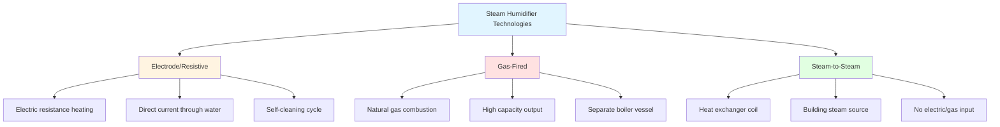

Steam humidifiers represent the most widely applied commercial and industrial humidification technology, offering precise control, rapid response, and sterile vapor injection. Unlike evaporative systems, steam humidifiers introduce pure water vapor directly into the airstream, making them suitable for critical environments including healthcare facilities, data centers, and pharmaceutical manufacturing.

## Steam Humidifier Types

Three primary steam generation technologies dominate the market, each with distinct operational characteristics and application profiles.

### Technology Comparison

| Parameter | Electrode/Resistive | Gas-Fired | Steam-to-Steam |
|-----------|-------------------|-----------|----------------|
| Capacity Range | 5-200 lbs/hr | 50-1000+ lbs/hr | 20-500 lbs/hr |
| Energy Source | Electric (208-480V) | Natural gas/propane | Building steam (5-125 psi) |
| Response Time | 5-15 minutes | 10-20 minutes | 2-5 minutes |
| Water Quality | Conductivity controlled | Feedwater treatment required | Minimal requirements |
| Maintenance Interval | 500-2000 hrs | 2000-4000 hrs | 1000-3000 hrs |
| Efficiency | 95-98% | 80-85% (with flue loss) | 90-95% |
| Installation Complexity | Low | High (venting required) | Medium |
| Operating Cost | $$$ | $$ | $ |
| Sterility | Inherent (boiling) | Inherent (>212°F) | Requires steam quality |

## Steam Injection Capacity Calculations

Humidification load determination follows psychrometric principles and requires accurate assessment of moisture addition requirements.

### Basic Capacity Formula

The required steam injection rate (lbs/hr) is calculated from:

**m_s = Q × ρ × (W₂ - W₁) × 60**

Where:
- m_s = steam flow rate (lbs/hr)
- Q = airflow rate (CFM)
- ρ = air density (typically 0.075 lbs/ft³ at standard conditions)
- W₂ = target humidity ratio (lbs moisture/lb dry air)
- W₁ = entering humidity ratio (lbs moisture/lb dry air)
- 60 = conversion factor (min/hr)

### Practical Calculation Example

For a 10,000 CFM air handling unit:
- Entering conditions: 70°F, 20% RH (W₁ = 0.0031 lbs/lb)
- Target conditions: 70°F, 45% RH (W₂ = 0.0070 lbs/lb)

**Calculation:**
- m_s = 10,000 × 0.075 × (0.0070 - 0.0031) × 60
- m_s = 10,000 × 0.075 × 0.0039 × 60
- m_s = 175.5 lbs/hr

**Sizing factor:** Apply 20-30% safety factor for cold weather conditions and infiltration loads.

**Final capacity:** 175.5 × 1.25 = 219 lbs/hr (select 225 lbs/hr unit)

### Latent Heat Requirement

The thermal energy input required equals:

**Q_latent = m_s × h_fg**

Where h_fg = latent heat of vaporization ≈ 970 BTU/lb at atmospheric pressure

For the example above:
- Q_latent = 175.5 × 970 = 170,235 BTU/hr (50 kW)

## Absorption Distance Requirements

Steam absorption into the airstream is not instantaneous. Inadequate absorption distance results in visible steam plumes, condensation on duct walls, and potential microbial growth.

### Critical Parameters

**Minimum absorption distance (feet) = k × (m_s / V)**

Where:
- k = empirical constant (typically 0.15-0.25)
- m_s = steam injection rate (lbs/hr)
- V = air velocity (FPM)

### Absorption Distance Guidelines

| Air Velocity (FPM) | Steam Rate (lbs/hr) | Minimum Distance (ft) | Recommended Distance (ft) |
|--------------------|---------------------|----------------------|--------------------------|
| 500 | 50 | 8 | 12 |
| 500 | 100 | 15 | 20 |
| 1000 | 50 | 4 | 6 |
| 1000 | 100 | 8 | 10 |
| 1500 | 50 | 3 | 5 |
| 1500 | 100 | 5 | 8 |

**Design factors affecting absorption:**
- Dispersion tube design (multiple orifices improve distribution)
- Steam superheat (10-20°F superheat accelerates absorption)
- Air temperature (higher temperature reduces visible plume)
- Relative humidity entering condition (lower RH improves absorption)
- Turbulence level in duct (mixing intensity)

## Water Quality Requirements

Steam humidifier performance and longevity depend critically on feedwater quality. ASHRAE Standard 188 addresses water management in building humidification systems.

### Water Quality Specifications

| Parameter | Electrode | Gas-Fired | Steam-to-Steam |
|-----------|-----------|-----------|----------------|
| Total Dissolved Solids (TDS) | 200-1500 ppm | <50 ppm | N/A (uses building steam) |
| Hardness (CaCO₃) | <300 ppm | <10 ppm | N/A |
| Conductivity | 150-1200 μS/cm | <100 μS/cm | N/A |
| pH | 6.5-8.5 | 6.5-8.5 | N/A (monitor condensate) |
| Chlorides | <250 ppm | <50 ppm | N/A |
| Silica | <50 ppm | <10 ppm | N/A |

**Electrode humidifiers** require moderate conductivity for current flow but excessive mineral content causes rapid cylinder fouling.

**Gas-fired humidifiers** demand high-purity feedwater (approaching boiler quality) to prevent scale formation on heat exchanger surfaces.

**Steam-to-steam units** eliminate feedwater quality concerns but require clean building steam (oil-free, with appropriate condensate quality).

## Control Strategies

Modern steam humidifiers integrate with building automation systems through multiple control architectures.

### Control Methods

**Proportional control:** Modulates steam output from 10-100% capacity based on error signal (deviation from setpoint). Provides stable control but may exhibit offset under varying loads.

**Proportional-Integral (PI) control:** Adds integral action to eliminate steady-state offset. Standard for HVAC applications. Typical settings: Proportional band 10-20% RH, integral time 5-10 minutes.

**Proportional-Integral-Derivative (PID) control:** Adds derivative action for improved transient response. Used in critical applications with rapid load changes.

### Sensor Placement

**Return air sensing:** Most common configuration. Sensor location: 2/3 distance from humidifier to fan, minimum 10 feet downstream of any water source.

**Supply air sensing:** Used when precise supply humidity is critical. Requires adequate absorption distance upstream of sensor to prevent condensation exposure.

**Space sensing:** Direct room humidity measurement. Slower response but eliminates duct influence effects.

### Safety Interlocks

**Required safeties per ASHRAE Standard 62.1:**
- High limit humidistat (typically 60-70% RH)
- Airflow proving switch (prevents steam injection with fan off)
- Drain pan overflow detection
- Low water cutoff (electrode/gas-fired types)
- High temperature limit at sensor location

## ASHRAE Humidification Standards

**ASHRAE Standard 170:** Healthcare facility humidification requirements specify 20-60% RH in most spaces, with operating rooms requiring 20-60% RH and neonatal areas requiring 30-60% RH.

**ASHRAE Standard 55:** Thermal comfort requires 30-60% RH for optimal occupant comfort and perceived air quality.

**ASHRAE Standard 188:** Legionella risk management mandates water treatment protocols, regular inspection, and documentation for humidification systems.

## Application Considerations

**Healthcare facilities:** Steam humidifiers are mandated in most jurisdictions due to sterile vapor generation. Gas-fired or electrode types dominate.

**Data centers:** Precise humidity control (40-60% RH) prevents electrostatic discharge. Steam-to-steam units leverage existing infrastructure.

**Museums and archives:** Tight humidity tolerance (±2-3% RH) preserves artifacts. Modulating steam injection with PI control.

**Pharmaceutical manufacturing:** FDA compliance requires validated systems with sterile vapor. Gas-fired units with documented water quality protocols.

**Commercial offices:** Cost-effective electrode units sized for moderate capacity (50-150 lbs/hr typical per AHU).

Steam humidifiers deliver reliable, sanitary humidification when properly sized, installed with adequate absorption distance, maintained per manufacturer specifications, and controlled through appropriate sensor and interlock strategies. System selection hinges on capacity requirements, available utilities, water quality, and application-specific performance criteria.

