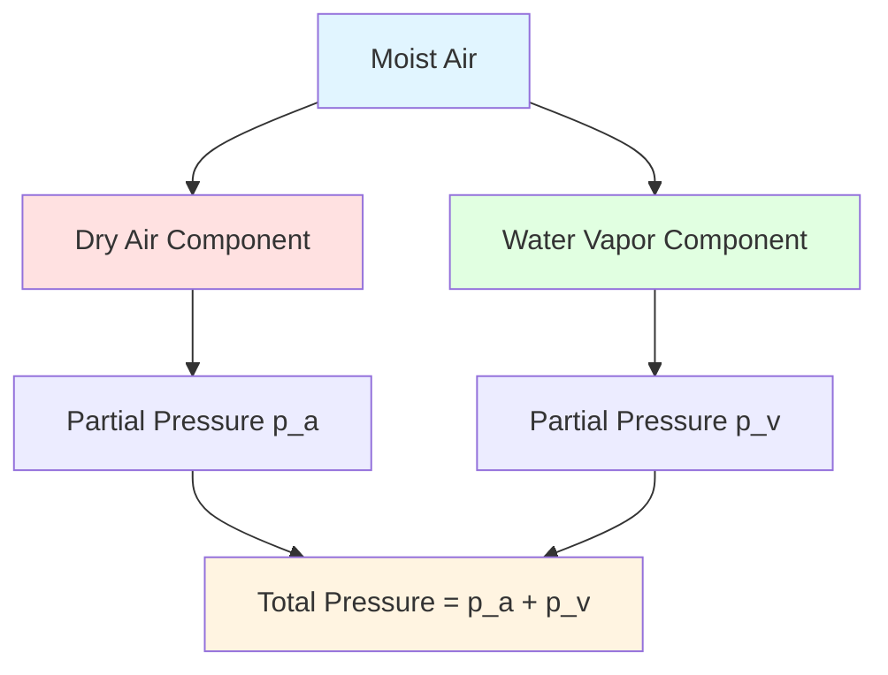

Psychrometrics is the science studying the thermodynamic properties of moist air and the processes affecting these properties. Understanding psychrometrics is fundamental to HVAC system design, enabling engineers to analyze and predict air-water vapor mixture behavior under various conditions.

## Fundamentals of Psychrometric Analysis

Psychrometrics treats atmospheric air as a binary mixture: dry air and water vapor. This mixture behaves according to ideal gas laws when operating at typical atmospheric pressures and temperatures encountered in HVAC applications. The fundamental pressure relationship states:

$$p_{total} = p_a + p_v$$

where $p_{total}$ represents total atmospheric pressure, $p_a$ is the partial pressure of dry air, and $p_v$ is the partial pressure of water vapor. At sea level under standard conditions, total pressure equals 101.325 kPa (14.696 psia).

## Dry Air Composition and Properties

Dry air consists of nitrogen (78.08% by volume), oxygen (20.95%), argon (0.93%), and trace amounts of carbon dioxide and other gases. For psychrometric calculations, dry air is treated as a single pseudo-component with consistent thermodynamic properties:

- Molecular mass: 28.965 kg/kmol (28.965 lb/lb-mol)
- Gas constant: $R_a = 287.055$ J/(kg·K) or 53.352 ft·lbf/(lbm·°R)
- Specific heat at constant pressure: $c_p = 1.006$ kJ/(kg·K) at 20°C

The ideal gas equation for dry air becomes:

$$p_a V = n_a R_a T$$

where $V$ is volume, $n_a$ is the number of moles of dry air, and $T$ is absolute temperature in Kelvin or Rankine.

## Water Vapor and Saturation Phenomena

Water vapor exists in air as a gas at temperatures below the boiling point. The maximum water vapor that air can hold at given temperature and pressure is determined by the saturation pressure, which increases exponentially with temperature following the Clausius-Clapeyron relationship:

$$\frac{dp_{ws}}{dT} = \frac{h_{fg}}{T v_{fg}}$$

where $h_{fg}$ is the latent heat of vaporization and $v_{fg}$ is the specific volume change during vaporization.

For practical calculations over the temperature range -100°C to 0°C (-148°F to 32°F), saturation pressure over ice is calculated using:

$$\ln(p_{ws}) = \frac{C_1}{T} + C_2 + C_3 T + C_4 T^2 + C_5 T^3 + C_6 T^4 + C_7 \ln(T)$$

where the coefficients $C_1$ through $C_7$ are empirically determined constants. Above 0°C (32°F), different coefficients apply for saturation over liquid water.

## Applications in HVAC Engineering

Psychrometric analysis enables critical HVAC design tasks:

**Cooling Load Calculations**: Determining sensible and latent cooling loads requires understanding how air properties change during cooling and dehumidification. Engineers calculate required cooling capacity by analyzing state point changes on the psychrometric chart.

**Air Mixing Analysis**: When outdoor air mixes with return air in air handling units, the resulting mixture properties follow the lever rule. The mixture condition lies on a straight line connecting the two air stream states, with exact position determined by mass flow ratio:

$$W_{mix} = \frac{\dot{m}_1 W_1 + \dot{m}_2 W_2}{\dot{m}_1 + \dot{m}_2}$$

**Humidification and Dehumidification Design**: Maintaining proper indoor humidity levels (typically 30-60% RH) requires careful analysis. Winter humidification adds moisture without significant temperature change, moving vertically upward on the psychrometric chart. Summer dehumidification removes moisture through cooling below the dewpoint temperature, following the saturation curve.

**Energy Recovery Systems**: Heat and energy recovery equipment transfers sensible and latent energy between air streams. Psychrometric analysis quantifies energy transfer efficiency and predicts resulting air conditions, enabling proper equipment selection and system sizing.

## Standard Atmospheric Conditions

ASHRAE Standard 62.1 establishes standard conditions for psychrometric calculations:
- Standard atmospheric pressure: 101.325 kPa (14.696 psia) at sea level
- Standard temperature: 20°C (68°F)
- Standard barometric pressure reference: 101.325 kPa (29.921 in. Hg)

Atmospheric pressure decreases with altitude according to the barometric equation:

$$p_z = p_0 \left(1 - \frac{gz}{R T_0}\right)^{5.2559}$$

where $p_z$ is pressure at altitude $z$, $p_0$ is sea level pressure, $g$ is gravitational acceleration, and $T_0$ is standard temperature. At 1500 m (5000 ft) elevation, atmospheric pressure reduces to approximately 84.5 kPa, significantly affecting psychrometric properties and equipment performance.

## Psychrometric Property Definitions

Seven fundamental properties define the state of moist air:

**Dry-Bulb Temperature (DBT)**: Temperature measured by standard thermometer, representing sensible heat content. This is the most commonly measured property.

**Wet-Bulb Temperature (WBT)**: Temperature indicated by thermometer with wetted wick in moving airstream, representing adiabatic saturation temperature. The difference between dry-bulb and wet-bulb temperatures indicates moisture content.

**Dewpoint Temperature ($T_d$)**: Temperature at which air becomes saturated when cooled at constant pressure and humidity ratio. Condensation begins when surfaces fall below dewpoint temperature.

**Relative Humidity ($\phi$)**: Ratio of actual water vapor pressure to saturation pressure at the same temperature:

$$\phi = \frac{p_v}{p_{ws}} \times 100\%$$

**Humidity Ratio (W)**: Mass of water vapor per unit mass of dry air:

$$W = 0.622 \frac{p_v}{p - p_v}$$

Typical values range from 0.002 kg/kg in cold, dry climates to 0.020 kg/kg in hot, humid conditions.

**Specific Enthalpy (h)**: Total heat content per unit mass of dry air, combining sensible and latent components:

$$h = c_p t + W(h_{fg} + c_{pw} t)$$

where $c_p$ is specific heat of dry air, $t$ is dry-bulb temperature, $h_{fg}$ is latent heat of vaporization at 0°C, and $c_{pw}$ is specific heat of water vapor.

**Specific Volume (v)**: Volume occupied by one kilogram of dry air plus its associated water vapor:

$$v = \frac{R_a T}{p_a} = \frac{R_a T}{p - p_v}$$

## Common HVAC Psychrometric Processes

Understanding process paths on the psychrometric chart enables system analysis and design:

**Sensible Heating**: Adding heat without moisture change moves horizontally right on the chart. Electric resistance heaters, hot water coils, and gas furnaces create this process. Enthalpy increases while humidity ratio remains constant.

**Sensible Cooling**: Removing heat without condensation moves horizontally left. This occurs when cooling coil surface temperature exceeds air dewpoint temperature.

**Cooling and Dehumidifying**: Cooling below dewpoint temperature removes both sensible and latent heat, following a path toward the saturation curve. Air contacts coil surface at the apparatus dewpoint temperature, then mixes with bypass air.

**Heating and Humidifying**: Simultaneous heat and moisture addition, common in winter air conditioning, moves diagonally upward and right on the chart.

**Evaporative Cooling**: Direct evaporative cooling adds moisture while removing sensible heat, following constant wet-bulb temperature lines. This process approaches saturation along a line of constant enthalpy (adiabatic process).

**Adiabatic Mixing**: Combining two air streams without external heat transfer creates a mixture state on a straight line between initial conditions. This fundamental process occurs in air handling units and mixing boxes.

## Engineering Calculation Methodology

Modern HVAC design uses computer programs incorporating psychrometric routines, but engineers must understand underlying principles for result interpretation and verification. Manual calculations using psychrometric charts provide intuitive understanding of process behavior.

Typical calculation steps include:
1. Establish initial air state from known properties (typically DBT and RH or WBT)
2. Determine required final state based on space conditions and loads
3. Identify processes needed to achieve transformation
4. Calculate energy requirements for each process
5. Size equipment to provide required capacity with appropriate safety factors

## Extended Applications

Psychrometric principles extend beyond basic comfort conditioning:

**Industrial Process Air Conditioning**: Manufacturing processes requiring precise humidity control (textiles, printing, electronics) demand detailed psychrometric analysis for quality control.

**Drying Systems**: Agricultural product drying, lumber kilns, and industrial dryers rely on psychrometric relationships between temperature, humidity, and moisture removal rates.

**Clean Room Design**: Pharmaceutical and semiconductor manufacturing requires strict environmental control, with psychrometric analysis ensuring proper conditions while minimizing energy consumption.

**Agricultural Facilities**: Livestock housing, greenhouses, and food storage facilities use psychrometric principles to optimize growing conditions and prevent moisture damage.

**Museum and Archive Preservation**: Artifact preservation requires stable temperature and humidity conditions, with psychrometric analysis preventing condensation and material degradation.

**Data Center Cooling**: High-density computing equipment creates concentrated cooling loads, with psychrometric optimization enabling economizer operation and reducing mechanical cooling energy.

Mastering psychrometric principles enables HVAC engineers to design efficient systems maintaining desired environmental conditions while minimizing energy consumption, operating costs, and environmental impact. The psychrometric chart serves as the fundamental tool translating theoretical understanding into practical design solutions.
