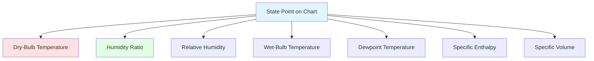

The psychrometric chart is the fundamental graphical tool for HVAC engineers, displaying all thermodynamic properties of moist air in a single diagram. Mastering chart usage enables rapid analysis of air conditioning processes without complex calculations.

## Chart Construction and Coordinate Systems

The psychrometric chart plots moist air properties using dry-bulb temperature as the horizontal axis and humidity ratio as the vertical axis. This orthogonal coordinate system forms the foundation for all other property lines.

**Horizontal Axis (X-axis)**: Dry-bulb temperature in °C or °F, typically ranging from -10°C to 50°C (14°F to 122°F) for comfort applications. Industrial charts may extend this range for specialized processes.

**Vertical Axis (Y-axis)**: Humidity ratio (W) in kg water/kg dry air or lb water/lb dry air, ranging from 0 to approximately 0.030 kg/kg (grains per pound in imperial units).

The chart boundary is defined by:

$$W_{max}(T) = 0.622 \frac{p_{ws}(T)}{p_{atm} - p_{ws}(T)}$$

where $p_{ws}(T)$ is saturation pressure at temperature $T$ and $p_{atm}$ is atmospheric pressure.

## Saturation Curve

The saturation curve forms the left boundary of the psychrometric chart, representing 100% relative humidity conditions. At any point on this curve:

$$p_v = p_{ws}(T_{db})$$

The saturation curve is critical for analyzing cooling and dehumidification processes, as air cannot exist to the left of this boundary under equilibrium conditions. Attempting to cool saturated air results in condensation.

The curve's exponential shape reflects the Clausius-Clapeyron relationship, with saturation humidity ratio increasing rapidly at higher temperatures:

$$\frac{dW_{sat}}{dT} = 0.622 \frac{1}{p_{atm}} \frac{dp_{ws}}{dT}$$

## Relative Humidity Lines

Constant relative humidity lines curve upward from left to right, with the saturation curve representing 100% RH. Typical charts show RH lines at 10% increments.

For any state point not on the saturation curve:

$$\phi = \frac{p_v}{p_{ws}(T_{db})} = \frac{W}{W_{sat}(T_{db})} \times \frac{p_{atm} - p_{ws}}{p_{atm} - p_v}$$

The simplified approximation works well for typical HVAC conditions:

$$\phi \approx \frac{W}{W_{sat}(T_{db})}$$

Moving horizontally right (heating) at constant humidity ratio decreases relative humidity. Moving vertically up (humidification) at constant temperature increases relative humidity.

## Wet-Bulb Temperature Lines

Wet-bulb temperature lines slope downward from upper left to lower right at approximately 30° from horizontal. These lines represent constant wet-bulb temperature.

Wet-bulb temperature indicates the lowest temperature achievable through evaporative cooling at constant pressure:

$$T_{wb} < T_{db} \text{ (for unsaturated air)}$$

$$T_{wb} = T_{db} \text{ (at saturation)}$$

The wet-bulb depression $(T_{db} - T_{wb})$ indicates the potential for evaporative cooling and correlates with relative humidity.

## Enthalpy Lines

Specific enthalpy lines run nearly parallel to wet-bulb temperature lines, sloping downward from upper left to lower right. On ASHRAE charts, enthalpy is typically read from a scale on the left edge of the saturation curve.

Total enthalpy combines sensible and latent heat:

$$h = c_p T_{db} + W(h_{fg} + c_{pw} T_{db})$$

At standard conditions:

$$h \approx 1.006 \times T_{db} + W(2501 + 1.86 \times T_{db}) \text{ kJ/kg (SI)}$$

$$h \approx 0.24 \times T_{db} + W(1061 + 0.444 \times T_{db}) \text{ Btu/lb (IP)}$$

Enthalpy lines enable energy calculations for heating, cooling, and humidification processes.

## Specific Volume Lines

Specific volume lines slope downward from upper left to lower right, steeper than wet-bulb or enthalpy lines. Specific volume represents the volume occupied by one kilogram (or pound) of dry air plus its associated water vapor:

$$v = \frac{R_a T}{p_a} = \frac{287.055 \times T}{(p_{atm} - p_v) \times 1000}$$

For standard atmospheric pressure:

$$v \approx 0.287 \times \frac{T}{101.325 - p_v}$$

Specific volume is essential for calculating volumetric flow rates from mass flow rates:

$$\dot{V} = \dot{m} \times v$$

## Dewpoint Temperature Lines

Dewpoint temperature is found by moving horizontally left from any state point to the saturation curve. The temperature at this intersection is the dewpoint:

$$T_d = T_{sat}(p_v)$$

Dewpoint indicates the temperature at which condensation begins on surfaces. Maintaining surface temperatures above dewpoint prevents condensation, critical for preventing mold growth and material damage.

The spread between dry-bulb and dewpoint temperatures indicates air dryness:

- $(T_{db} - T_d)$ small: High relative humidity
- $(T_{db} - T_d)$ large: Low relative humidity

## Reading the Chart: Locating State Points

Any two independent properties define a unique state point on the psychrometric chart. Common combinations include:

**Dry-bulb + Relative Humidity**:
1. Locate dry-bulb temperature on horizontal axis
2. Follow vertical line upward
3. Intersection with appropriate RH curve defines state point

**Dry-bulb + Wet-bulb**:
1. Locate dry-bulb temperature on horizontal axis
2. Locate wet-bulb temperature on wet-bulb scale
3. Intersection of vertical dry-bulb line with wet-bulb line defines state point

**Dry-bulb + Humidity Ratio**:
1. Locate dry-bulb on horizontal axis
2. Locate humidity ratio on vertical axis
3. Intersection defines state point directly

**Dry-bulb + Dewpoint**:
1. Locate dewpoint on saturation curve
2. Follow horizontal line (constant W) to dry-bulb temperature

## Plotting Common HVAC Processes

### Sensible Heating

Horizontal line moving right on the chart. Humidity ratio remains constant while temperature increases:

- Start: State point 1 at $(T_1, W_1)$
- End: State point 2 at $(T_2, W_1)$
- Process: $\rightarrow$ (horizontal right)

Heat added per unit mass:

$$q_s = c_p(T_2 - T_1) + W_1 \times c_{pw}(T_2 - T_1)$$

Simplified: $q_s \approx 1.006(T_2 - T_1)$ kJ/kg

### Sensible Cooling

Horizontal line moving left. Temperature decreases while humidity ratio remains constant until dewpoint is reached:

- Start: $(T_1, W_1)$
- End: $(T_2, W_1)$ where $T_2 \geq T_d$
- Process: $\leftarrow$ (horizontal left)

### Cooling and Dehumidifying

Process follows a path toward the apparatus dewpoint (ADP) on the saturation curve, then rises slightly due to bypass factor:

1. Air approaches cooling coil at state 1
2. Portion of air cools to ADP on saturation curve
3. Bypass air at state 1 mixes with cooled air
4. Resulting mixture at state 2 lies on straight line between state 1 and ADP

Bypass factor:

$$BF = \frac{T_2 - T_{ADP}}{T_1 - T_{ADP}}$$

### Humidification

Vertical line upward when adding steam or dry steam:

- Start: $(T_1, W_1)$
- End: $(T_1, W_2)$
- Process: $\uparrow$ (vertical up)

Adiabatic humidification (evaporative cooling) follows wet-bulb line:

- Start: $(T_1, W_1)$
- End: $(T_2, W_2)$ on same wet-bulb line
- Process: $\swarrow$ (down and left along wet-bulb)

### Air Mixing

Two air streams mixing create a state point on a straight line connecting the initial states. The location follows the mass ratio:

$$\frac{m_1}{m_2} = \frac{L_2}{L_1}$$

where $L_1$ is the distance from mixture point to state 1, and $L_2$ is distance to state 2.

For equal mass flows, mixture point lies at midpoint. For volumetric flows, convert using specific volumes.

## Practical Chart Usage Examples

### Example 1: Winter Heating and Humidification

**Given**: Outdoor air at 0°C, 80% RH. Desired indoor: 22°C, 40% RH.

**Process**:
1. Plot outdoor air state point (0°C, 80% RH)
2. Preheat to 22°C (horizontal line right) to prevent condensation
3. Humidify with steam (vertical line up) to 40% RH
4. Read humidity addition: $\Delta W = W_2 - W_1$

### Example 2: Summer Cooling

**Given**: Outdoor air at 35°C, 50% RH. Desired: 24°C, 50% RH. Cooling coil ADP: 10°C.

**Process**:
1. Plot outdoor air (35°C, 50% RH)
2. Draw line to ADP (10°C, 100% RH)
3. Plot desired condition (24°C, 50% RH)
4. Calculate cooling load: $q = h_1 - h_2$

### Example 3: Mixed Air Calculation

**Given**:
- Return air: 24°C, 50% RH, 3000 m³/h
- Outdoor air: 35°C, 60% RH, 1000 m³/h

**Process**:
1. Plot both state points
2. Calculate mass flows using specific volumes
3. Use lever rule to find mixture state
4. Determine mixed air temperature and humidity

## Chart Variations for Different Conditions

### High Altitude Charts

Atmospheric pressure decreases with elevation, affecting all psychrometric properties:

$$p_{alt} = p_0 e^{-gz/RT}$$

Charts for elevations above 500 m require altitude-specific versions. At 1500 m (5000 ft), atmospheric pressure is approximately 84.5 kPa, requiring a separate chart.

### Low Temperature Charts

Extended charts for refrigeration applications range from -40°C to +10°C (-40°F to +50°F), essential for:

- Cold storage design
- Refrigeration systems
- Ice rink dehumidification
- Winter outdoor air analysis

### High Temperature Charts

Industrial process applications may require charts extending to 100°C (212°F) or higher for:

- Drying processes
- High-temperature ventilation
- Industrial ovens
- Combustion air analysis

## Digital Psychrometric Tools

Modern HVAC practice increasingly uses software-based psychrometric analysis:

**Advantages**:
- Precise numerical results vs. chart reading limitations
- Automatic unit conversions
- Altitude adjustments
- Process overlay and comparison
- Integration with load calculation programs

**Popular Tools**:
- ASHRAE Psychrometric Chart Software
- Carrier Psychrometric Analyzer
- CYTSoft Psychrometric Chart
- Online calculators and mobile apps

## Common Errors in Chart Usage

**Error 1 - Incorrect Altitude**: Using sea-level chart for high-elevation projects introduces significant errors in humidity ratio and enthalpy.

**Error 2 - Extrapolation**: Attempting to plot conditions beyond chart boundaries produces unreliable results. Use appropriate charts or calculation methods.

**Error 3 - Units Confusion**: Mixing metric and imperial units or misreading scales leads to order-of-magnitude errors.

**Error 4 - Assuming Constant Enthalpy**: Steam humidification is NOT constant enthalpy—it follows a vertical line with increasing enthalpy.

**Error 5 - Neglecting Altitude**: Forgetting to account for elevation effects when calculating from charts.

## Summary of Chart Properties

The psychrometric chart transforms complex thermodynamic calculations into intuitive graphical analysis, enabling rapid evaluation of air conditioning processes and equipment sizing. Proficiency in chart usage remains essential for HVAC professionals despite the availability of digital tools.
