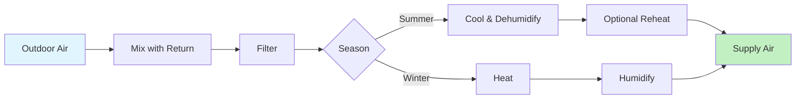

Psychrometric processes transform air from one state to another through energy and mass transfer. Understanding these processes enables proper HVAC system design and troubleshooting.

## Sensible Heating

Sensible heating adds thermal energy without changing moisture content. The process moves horizontally right on the psychrometric chart with constant humidity ratio.

**Process Characteristics**:
- Humidity ratio: Constant ($W_2 = W_1$)
- Dry-bulb temperature: Increases
- Relative humidity: Decreases
- Enthalpy: Increases

**Energy Equation**:

$$q_s = \dot{m}(h_2 - h_1) = \dot{m} c_p (T_2 - T_1)$$

For practical calculations with moisture:

$$q_s = \dot{m}[c_p + W c_{pw}](T_2 - T_1)$$

where $c_p = 1.006$ kJ/(kg·K) and $c_{pw} = 1.86$ kJ/(kg·K).

**Approximation**: For typical HVAC conditions:

$$q_s \approx 1.02 \dot{m} (T_2 - T_1) \text{ kW}$$

**Equipment**: Electric resistance heaters, hot water coils, steam coils, gas furnaces, heat pumps in heating mode.

**Example**: Heat 1000 m³/h of air from 10°C to 25°C at standard density (1.2 kg/m³):

$$\dot{m} = 1000 \times 1.2 = 1200 \text{ kg/h} = 0.333 \text{ kg/s}$$

$$q_s = 1.02 \times 0.333 \times (25-10) = 5.1 \text{ kW}$$

## Sensible Cooling

Sensible cooling removes thermal energy without condensation. Process moves horizontally left on the chart, stopping when coil surface temperature equals dewpoint.

**Process Limits**: Sensible cooling continues until:

$$T_2 = T_d$$

Further cooling causes dehumidification.

**Coil Surface Temperature Requirement**:

$$T_{coil} > T_d$$

**Energy Equation**: Same form as sensible heating with negative value:

$$q_s = \dot{m} c_p (T_1 - T_2)$$

**Equipment**: Chilled water coils (surface temperature > dewpoint), air-to-air heat exchangers, evaporative coolers (dry surfaces).

**Application**: Rare in practice as most cooling coils operate below dewpoint. Used in sensible-only heat recovery and some industrial processes.

## Cooling and Dehumidifying

Most common summer air conditioning process. Air cools below dewpoint, causing water vapor condensation. Process follows a path toward the apparatus dewpoint (ADP) on saturation curve.

**Apparatus Dewpoint**: The effective surface temperature of the cooling coil where air would reach saturation:

$$T_{ADP} < T_d$$

**Bypass Factor**: Not all air contacts coil surface. Bypass factor (BF) represents the fraction passing through unchanged:

$$BF = \frac{T_2 - T_{ADP}}{T_1 - T_{ADP}}$$

Typical bypass factors:
- 4-row coil: BF = 0.10-0.15
- 6-row coil: BF = 0.05-0.10
- 8-row coil: BF = 0.02-0.05

**Contact Factor**:

$$CF = 1 - BF$$

**Sensible Heat Ratio**: Ratio of sensible to total cooling:

$$SHR = \frac{q_s}{q_t} = \frac{T_1 - T_2}{(T_1 - T_2) + \frac{h_{fg}}{ c_p}(W_1 - W_2)}$$

**Total Cooling**:

$$q_t = \dot{m}(h_1 - h_2)$$

**Sensible Cooling**:

$$q_s = \dot{m} c_p (T_1 - T_2)$$

**Latent Cooling**:

$$q_l = \dot{m} h_{fg} (W_1 - W_2)$$

where $h_{fg} \approx 2501$ kJ/kg.

**Condensate Removal**:

$$\dot{m}_{condensate} = \dot{m}_{air}(W_1 - W_2)$$

**Example**: Cool 2000 m³/h from 30°C, 60% RH to 15°C, 90% RH:
- $W_1 = 0.0160$ kg/kg, $h_1 = 70.7$ kJ/kg
- $W_2 = 0.0095$ kg/kg, $h_2 = 39.3$ kJ/kg
- $\dot{m} = 2000 \times 1.15 / 3600 = 0.639$ kg/s
- $q_t = 0.639 \times (70.7 - 39.3) = 20.1$ kW
- $q_l = 0.639 \times 2501 \times (0.0160 - 0.0095) = 10.4$ kW
- $SHR = (20.1 - 10.4)/20.1 = 0.48$

## Heating and Humidifying

Winter air conditioning process combining sensible heating and moisture addition. Two approaches exist: sequential or simultaneous.

**Sequential Process**:
1. Preheat air (horizontal right)
2. Add steam humidification (vertical up)

**Advantages**: Simple control, independent temperature and humidity regulation.

**Energy for Preheating**:

$$q_1 = \dot{m} c_p (T_{intermediate} - T_1)$$

**Steam Required**:

$$\dot{m}_{steam} = \dot{m}_{air}(W_2 - W_1)$$

**Energy for Steam**:

$$q_2 = \dot{m}_{steam} h_{steam}$$

**Simultaneous Process**: Air washer with heated water provides heating and humidification along a diagonal path.

**Example**: Condition 1500 m³/h from 0°C, 50% RH to 22°C, 40% RH:
- $W_1 = 0.0019$ kg/kg, $W_2 = 0.0067$ kg/kg
- Preheat to 22°C: $q_1 = 1.5 \times 1.02 \times 22 = 33.7$ kW
- Steam addition: $\Delta W = 0.0048$ kg/kg
- $\dot{m}_{steam} = 0.5 \times 0.0048 = 0.0024$ kg/s = 8.6$ kg/h

## Adiabatic Humidification (Evaporative Cooling)

Water evaporates into air stream, adding moisture while removing sensible heat. Process follows constant wet-bulb temperature line (nearly constant enthalpy).

**Process Characteristics**:
- Wet-bulb temperature: Approximately constant
- Dry-bulb temperature: Decreases
- Humidity ratio: Increases
- Enthalpy: Nearly constant (slight increase due to pump energy)

**Effectiveness**:

$$\varepsilon = \frac{T_1 - T_2}{T_1 - T_{wb,1}}$$

Direct evaporative coolers achieve $\varepsilon = 0.70-0.90$.

**Cooling Effect**:

$$q_{cooling} = \dot{m} c_p (T_1 - T_2) = \dot{m}(W_2 - W_1) h_{fg}$$

**Example**: Evaporatively cool 3000 m³/h from 35°C, 20% RH (WBT = 18°C) with 80% effectiveness:

$$T_2 = 35 - 0.80(35-18) = 21.4°C$$

Cooling effect ≈ $\dot{m} \times 1.02 \times (35-21.4) = 14$ kW

**Limitations**:
- Effective only in dry climates (RH < 40%)
- Cannot cool below wet-bulb temperature
- Adds moisture (increases latent load)

## Adiabatic Mixing of Air Streams

Two air streams mixing without external energy creates a state on the straight line connecting initial conditions.

**Mass Balance**:

$$\dot{m}_1 + \dot{m}_2 = \dot{m}_3$$

**Humidity Ratio**:

$$W_3 = \frac{\dot{m}_1 W_1 + \dot{m}_2 W_2}{\dot{m}_1 + \dot{m}_2}$$

**Dry-Bulb Temperature**:

$$T_3 = \frac{\dot{m}_1 c_p T_1 + \dot{m}_2 c_p T_2}{\dot{m}_1 c_p + \dot{m}_2 c_p} = \frac{\dot{m}_1 T_1 + \dot{m}_2 T_2}{\dot{m}_1 + \dot{m}_2}$$

**Lever Rule**: Graphical solution on psychrometric chart:

$$\frac{\dot{m}_1}{\dot{m}_2} = \frac{L_2}{L_1}$$

where $L_1$ and $L_2$ are line segment distances.

**Volumetric Flow Mixing**: Convert to mass flows first:

$$\dot{m} = \frac{\dot{V}}{v}$$

**Example**: Mix return air (2000 m³/h, 24°C, 50% RH) with outdoor air (500 m³/h, 35°C, 60% RH):

1. Calculate mass flows using specific volumes
2. $\dot{m}_1 = 2000/0.855 = 2340$ kg/h
3. $\dot{m}_2 = 500/0.895 = 559$ kg/h
4. $T_3 = (2340 \times 24 + 559 \times 35)/(2340+559) = 26.1°C$
5. $W_3 = (2340 \times 0.0093 + 559 \times 0.0210)/(2340+559) = 0.0115$ kg/kg

## Chemical Dehumidification

Desiccant materials absorb moisture without cooling. Process moves downward and right (in heating mode) or downward and left (in cooling mode).

**Solid Desiccants**: Silica gel, molecular sieves, activated alumina

**Liquid Desiccants**: Lithium chloride, triethylene glycol solutions

**Process**: Air passes through desiccant material:
- Moisture removal: W decreases
- Sensible heat addition: T increases (heat of adsorption released)

**Regeneration**: Heated air (80-150°C) drives moisture from desiccant.

**Effectiveness**: Depends on inlet conditions and desiccant capacity:

$$\Delta W = W_1 - W_2 = f(W_1, T_1, desiccant)$$

Typical moisture removal: 30-70% of inlet humidity ratio.

## Steam Humidification

Direct injection of steam adds both moisture and sensible heat. Process moves vertically upward and slightly right.

**Moisture Addition**:

$$W_2 = W_1 + \frac{\dot{m}_{steam}}{\dot{m}_{air}}$$

**Temperature Change**: Steam condenses, releasing latent heat:

$$T_2 = T_1 + \frac{\dot{m}_{steam} h_{fg}}{\dot{m}_{air} c_p}$$

For dry saturated steam at atmospheric pressure:

$$T_2 \approx T_1 + 2.4(W_2 - W_1)°C$$

**Example**: Add 10 g/s steam to 1 kg/s air at 20°C:

$$\Delta W = 10/1000 = 0.010 \text{ kg/kg}$$

$$\Delta T = 2.4 \times 0.010 = 0.024°C$$ (negligible)

## Process Combination Strategies

Real HVAC systems combine multiple processes:

**Summer Operation**:
1. Mix return and outdoor air
2. Cool and dehumidify to supply condition
3. Optional reheat for humidity control

**Winter Operation**:
1. Mix return and outdoor air
2. Preheat to prevent freezing
3. Main heating to supply temperature
4. Humidify to desired RH

**Process Sequence Optimization**:
- Preheat before humidification prevents condensation in ducting
- Economizer mixing reduces mechanical cooling
- Energy recovery between exhaust and supply reduces conditioning load

Understanding psychrometric processes enables engineers to design efficient HVAC systems that maintain desired indoor conditions while minimizing energy consumption and operating costs.
