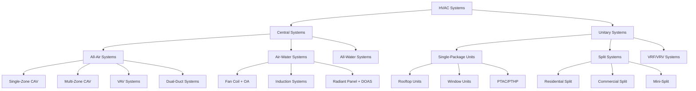

# HVAC System Classification and Selection

HVAC systems are classified by their configuration, energy transport medium, and distribution architecture. Understanding these classifications is fundamental to proper system selection, design, and application. This guide follows ASHRAE Handbook - HVAC Systems and Equipment classification standards.

## Primary System Classifications

HVAC systems are categorized along three primary dimensions: the location of primary equipment (central vs unitary), the medium used for thermal energy distribution (all-air, air-water, all-water, or refrigerant-based), and the configuration of equipment serving the conditioned space.

## Central vs Unitary Systems

The fundamental distinction between central and unitary systems lies in equipment location, maintenance accessibility, and system complexity.

**Central Systems** house major components (chillers, boilers, air handlers) in dedicated mechanical rooms. Thermal energy is distributed via air ducts, chilled/hot water piping, or both. These systems serve multiple zones from centralized equipment, offering superior control, efficiency at scale, and maintenance accessibility. Central systems dominate applications exceeding 20,000 CFM or buildings requiring precise environmental control.

**Unitary Systems** integrate all refrigeration components into factory-assembled packages located at or near the conditioned space. Each unit serves a single zone or small area independently. Unitary systems provide simplicity, lower first cost for small applications, and decentralized failure modes. They are optimal for applications under 10 tons per zone or buildings requiring tenant-level metering.

| Characteristic | Central Systems | Unitary Systems |
|----------------|-----------------|-----------------|
| **Capacity Range** | 50-10,000+ tons total | 1.5-150 tons per unit |
| **First Cost** | High (economies at >100 tons) | Low to moderate |
| **Operating Efficiency** | 0.45-0.65 kW/ton (chillers) | 0.70-1.10 kW/ton |
| **Maintenance Location** | Centralized mechanical room | Distributed (roofs, grade) |
| **Redundancy** | Requires multiple chillers | Inherent (multiple units) |
| **Space Requirements** | Large central plant | Minimal (scattered) |
| **Control Complexity** | High (BAS integration) | Low to moderate |
| **Typical Applications** | Hospitals, labs, high-rises | Retail, small offices, schools |

## All-Air vs Air-Water Systems

The choice between all-air and air-water systems fundamentally impacts distribution infrastructure, zone control capability, and space utilization.

**All-Air Systems** distribute both sensible and latent cooling capacity via conditioned air. Air handlers supply cooled, dehumidified air through ductwork to terminal devices (diffusers, VAV boxes). These systems provide superior humidity control, air filtration, and ventilation management. However, they require substantial duct space (typically 2-4% of floor area), face velocity and noise constraints, and consume significant fan energy.

**Air-Water Systems** separate ventilation (via air) from thermal delivery (via water). A dedicated outdoor air system (DOAS) provides 100% outside air for ventilation, while hydronic distribution to terminal units (fan coils, chilled beams, radiant panels) handles sensible loads. Water's thermal capacity (4.18 kJ/kg·K vs 1.0 for air) enables dramatically smaller distribution infrastructure—6-inch pipes replace 48-inch ducts for equivalent capacity.

| Parameter | All-Air Systems | Air-Water Systems |
|-----------|-----------------|-------------------|
| **Distribution Efficiency** | ~1.0 W/CFM (fan energy) | ~0.02 W/CFM equivalent (pumping) |
| **Duct/Pipe Space** | 3-5% floor area | 0.5-1% floor area |
| **Zone Control** | ±2°F with VAV | ±0.5°F with local control |
| **Humidity Control** | Excellent (central dehumidification) | Limited (no latent at terminal) |
| **Air Quality** | Superior (central filtration) | Moderate (DOAS only) |
| **Acoustics** | Higher NC (duct velocities) | Lower NC (water is silent) |
| **Condensation Risk** | None | Moderate (dew point control critical) |
| **First Cost** | Baseline | 10-20% higher |
| **Best Applications** | Hospitals, labs, high-ventilation | Offices, hotels, high-rises |

## System Selection Criteria

Selecting the appropriate HVAC system type requires analyzing multiple factors simultaneously. No single system excels across all criteria.

**Load Characteristics**: Peak cooling loads exceeding 300 tons favor central chilled water systems with multiple chillers for staging and redundancy. Variable loads with significant part-load hours benefit from VAV all-air systems or VRF. High ventilation requirements (>1.5 CFM/sf) necessitate all-air or DOAS-based air-water systems.

**Building Geometry**: High-rise construction (>10 floors) favors air-water systems to minimize vertical shaft space. Horizontal campuses benefit from distributed unitary equipment to avoid extensive distribution. Tight ceiling plenums (<18 inches) may preclude all-air systems due to duct space constraints.

**Operational Priorities**: Mission-critical facilities requiring N+1 redundancy typically employ central plants with multiple chillers. Buildings prioritizing individual tenant control favor unitary equipment or four-pipe fan coil systems. Laboratory and healthcare applications demanding precise humidity control require all-air systems with reheat capability.

**Economic Factors**: First cost minimization favors unitary equipment for projects under 50,000 sf. Life-cycle cost optimization typically favors central systems above 100,000 sf due to superior part-load efficiency and maintenance economies. Energy cost structures with high demand charges favor thermal storage with central plants.

**Maintenance Infrastructure**: Buildings with dedicated facility staff benefit from central system maintainability and monitoring. Properties without on-site staff favor unitary equipment with distributed service contracts.

## Integration with Building Systems

Modern HVAC system selection cannot ignore integration requirements. Building automation systems (BAS) enable central system optimization through load forecasting, optimal start/stop, and demand-based ventilation. However, this requires substantial front-end programming and ongoing commissioning.

Unitary equipment with communicating controls now achieves 80-90% of central system control capability at lower implementation cost. VRF systems bridge the gap, offering unitary equipment simplicity with heat recovery and zone-level control approaching central system performance.

The trend toward electrification and decarbonization increasingly favors high-efficiency heat pumps—whether central (water-source heat pump systems) or distributed (VRF, packaged rooftop heat pumps)—over fossil fuel-based heating.

---

**Reference**: ASHRAE Handbook - HVAC Systems and Equipment, Chapters 1-4 (System Classification and Selection)
