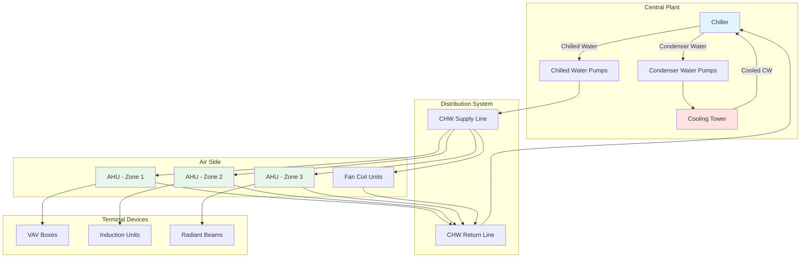

# Central Air Conditioning Systems

Central air conditioning systems condition air or water at a central location and distribute the cooling effect throughout a building. This approach offers superior control, efficiency, and maintenance accessibility compared to distributed systems, making it the preferred solution for commercial buildings, large residential complexes, and institutional facilities.

## System Architecture

Central systems separate the generation of cooling from its distribution and delivery. The refrigeration equipment (chillers, cooling towers, boilers) resides in a mechanical room or on the roof, while air handling units (AHUs) or terminal devices serve individual zones.

## System Types

### All-Air Systems

All-air systems supply 100% of the sensible and latent cooling capacity through conditioned air. Central AHUs cool, dehumidify, filter, and distribute air through ductwork to occupied spaces.

**Characteristics:**
- Single-duct constant volume (CV)
- Single-duct variable air volume (VAV)
- Dual-duct systems (hot and cold decks)
- Multizone units

**Advantages:**
- Precise humidity control through central dehumidification
- Superior air filtration and ventilation control
- No water distribution to occupied spaces (leak risk elimination)
- Flexible zone control with VAV terminals

**Design Considerations (ASHRAE 90.1):**
- Supply air temperature: 52-58°F for cooling
- Duct velocity: 1,500-2,500 fpm in main ducts
- Maximum static pressure: 3-6 in. w.g. depending on system size
- Outside air economizer required for systems >54,000 Btu/h in most climate zones

### Air-Water Systems

Air-water systems use a primary air system to handle ventilation and latent loads, while water-based terminal units (fan coils, induction units, radiant panels) manage sensible cooling.

**Characteristics:**
- Fan coil units with dedicated outside air system (DOAS)
- Induction units (high-velocity primary air induces room air through coil)
- Radiant cooling panels with ventilation air

**Advantages:**
- Reduced duct sizes (lower airflow requirements)
- Individual zone control at terminal devices
- Lower fan energy compared to all-air systems
- Quieter operation with properly selected equipment

**Design Parameters:**
- Primary air quantity: 0.3-0.5 CFM/ft² (ventilation only)
- Chilled water supply: 42-48°F
- Water flow rate: 2-3 GPM per ton of cooling
- Condensate management required at fan coils in humid climates

### All-Water Systems

All-water systems eliminate air distribution entirely, using only water to transport cooling capacity. Fan coil units or radiant systems provide space conditioning, with ventilation handled separately or through operable windows (in mild climates).

**Characteristics:**
- Two-pipe or four-pipe fan coil systems
- Chilled beams (passive or active)
- Radiant ceiling or floor panels

**Advantages:**
- Minimal space requirements (no ductwork)
- Low energy transport costs (water vs. air: 1 GPM = 500 CFM thermally)
- Easy retrofitting in existing buildings
- Reduced floor-to-floor height requirements

**Limitations:**
- Limited dehumidification capability
- Potential condensation issues if dew point not controlled
- Separate ventilation system required for IAQ compliance

### Water-Source Heat Pumps (WSHP)

Water-source heat pump systems use a common water loop (60-90°F) as a heat source and sink. Individual heat pumps serve zones, rejecting or absorbing heat from the loop.

**System Components:**
- Distributed heat pumps (0.5-5 tons each)
- Closed-loop water circulation (typically 2-3 GPM per ton)
- Boiler for loop heating (winter)
- Cooling tower or fluid cooler for heat rejection (summer)

**Advantages:**
- Simultaneous heating and cooling capability
- Heat recovery between zones (perimeter heating uses core cooling)
- No refrigerant piping throughout building
- Individual zone control and metering

**Design Guidelines (ASHRAE Handbook - HVAC Systems and Equipment):**
- Loop temperature range: 60-90°F (optimal: 70-80°F)
- Pipe sizing: 2-4 fps water velocity
- Buffer tank: 1.5-3 gallons per ton of connected load
- Tower capacity: 60-80% of total heat pump capacity

## Central Plant Design Considerations

### Chiller Selection

| Parameter | Water-Cooled | Air-Cooled | Evaporative-Cooled |
|-----------|--------------|------------|-------------------|
| Efficiency (kW/ton) | 0.45-0.65 | 0.85-1.20 | 0.55-0.75 |
| Footprint | Smaller | Larger | Medium |
| Water Consumption | High | None | Medium |
| Maintenance | Moderate | Low | Moderate |
| First Cost | Higher | Lower | Medium |
| Noise Level | Low | High | Medium |

### Chilled Water System Design

**Temperature Differential:**
- Standard: 44°F supply / 54°F return (10°F ΔT)
- High ΔT: 40°F supply / 56°F return (16°F ΔT)
- Low-temperature: 38°F supply for high sensible load applications

**Pumping Strategies:**
- Primary-only: Single pump loop, constant or variable flow
- Primary-secondary: Decoupled production and distribution
- Variable primary flow: Eliminates secondary pumps, requires careful control

**Pipe Sizing:**
- Velocity: 4-8 fps in mains, 2-4 fps in branches
- Pressure drop: 2-4 ft per 100 ft of pipe
- Flow rate: Q (GPM) = Cooling Load (Btu/h) / (500 × ΔT°F)

### Load Diversity and Sizing

Central systems benefit from load diversity. Peak loads do not occur simultaneously across all zones.

**Diversity Factors (ASHRAE Fundamentals):**
- Office buildings: 0.75-0.85
- Hotels: 0.70-0.80
- Hospitals: 0.85-0.95
- Retail: 0.90-1.00

Total system capacity = Sum of zone loads × Diversity factor

### Energy Efficiency Strategies

**Variable Flow Systems:**
- Two-way control valves at coils enable variable primary flow
- VFD-controlled pumps reduce energy at part load
- Minimum flow bypass maintains chiller evaporator flow

**Free Cooling:**
- Waterside economizer using cooling tower when outdoor wet-bulb permits
- Airside economizer for all-air systems in appropriate climates
- ASHRAE 90.1 requires economizers for systems >54,000 Btu/h

**Chiller Sequencing:**
- Stage multiple chillers based on load
- Operate chillers at optimal efficiency points
- Consider thermal storage for demand management

## Comparison of Central System Approaches

| System Type | Distribution | Terminal Device | Humidity Control | Space Requirements | Typical Application |
|-------------|--------------|-----------------|------------------|--------------------|--------------------|
| All-Air VAV | Ductwork | VAV boxes | Excellent | High (ducts) | Office buildings, laboratories |
| Air-Water | Ducts + Pipes | Fan coils | Good | Moderate | Hotels, apartments, offices |
| All-Water | Pipes only | Fan coils, beams | Limited | Low | Retrofits, high-rise residential |
| WSHP | Water loop | Heat pumps | Moderate | Low-Moderate | Schools, offices, mixed-use |

## Design Process and Guidelines

**ASHRAE Standard 62.1 Compliance:**
- Minimum ventilation rates based on occupancy and space type
- Ventilation effectiveness factors for air distribution
- Demand-controlled ventilation for variable occupancy spaces

**Load Calculation (ASHRAE Fundamentals):**
1. Calculate block loads for central equipment sizing
2. Calculate zone loads for distribution system and terminal device sizing
3. Apply diversity factors appropriate to building type
4. Include safety factors judiciously (10-15% maximum)

**Sequence of Design:**
1. Establish space conditions and loads
2. Select system type based on building requirements
3. Size central plant equipment with diversity
4. Design distribution system (ductwork or piping)
5. Select and locate terminal devices
6. Develop control sequences
7. Verify energy code compliance

Central air conditioning systems represent the most flexible and scalable approach to building climate control. Proper design requires understanding the physical principles of heat transfer, fluid mechanics, and psychrometrics, combined with application of ASHRAE standards and manufacturer data. The selection between all-air, air-water, all-water, or water-source approaches depends on building type, climate, spatial constraints, and operational requirements.
