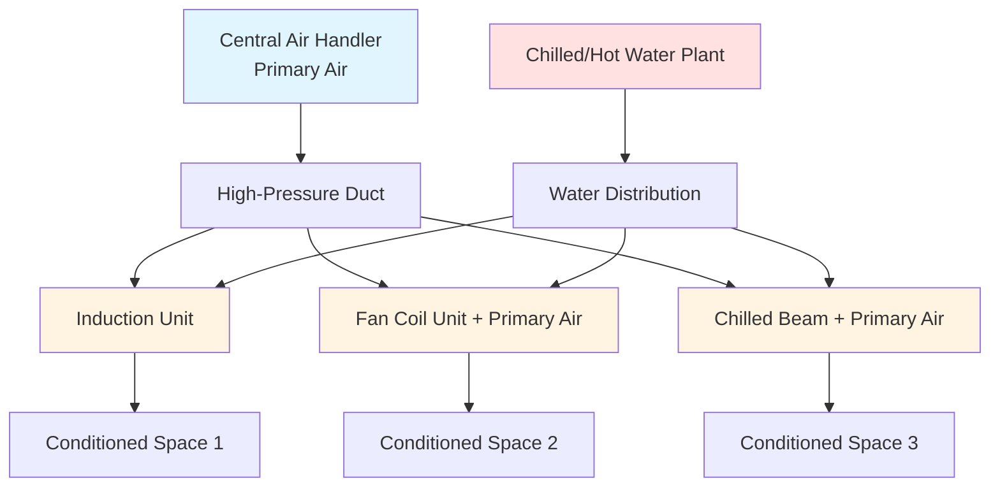

Air-water systems combine centralized primary air handling with localized water-based terminal units to provide efficient, zoned climate control. These hybrid systems leverage the superior heat transport capacity of water (approximately 3,500 times that of air by volume) while maintaining adequate ventilation through dedicated outdoor air.

## System Architecture

Air-water systems consist of two distinct subsystems operating in coordination:

**Primary Air System:** A central air handling unit conditions and distributes outdoor air to meet ventilation requirements. This air is typically cooled, dehumidified, and filtered before distribution at relatively high pressure (2-6 in. wg) and low volume (10-30% of total system airflow).

**Secondary Water System:** Chilled and/or hot water circulates to terminal units located within conditioned spaces. These units provide the majority of sensible cooling and heating capacity through water-to-air heat exchange, supplementing the primary air supply.

This division of labor allows the primary air system to focus on latent load removal and ventilation, while the water distribution handles sensible loads with significantly reduced fan energy compared to all-air systems.

## Terminal Unit Types

### Induction Units

Induction units utilize the momentum of high-velocity primary air to induce room air circulation through a water coil without mechanical fans. Primary air is discharged through nozzles, creating a low-pressure zone that draws room air across the secondary water coil at a ratio of 3:1 to 5:1 (induced air to primary air).

**Operating Principles:**
- Primary air velocity: 2,000-4,000 fpm at nozzles
- Induction ratio: 3:1 to 5:1 typical
- Water temperature: 42-48°F cooling, 120-140°F heating
- No moving parts in terminal unit
- Continuous air circulation during occupied periods

**Applications:** Perimeter zones in office buildings, hotels, hospitals where individual zone control is required. Most effective in buildings with 8-12 ft floor-to-ceiling heights.

### Fan Coil Units with Primary Air

Fan coil units provide mechanical air circulation over water coils, with separate ducted primary air supplied for ventilation. This configuration offers greater flexibility than induction systems and operates effectively at lower static pressures.

**Operating Principles:**
- Local fan speeds: typically 3-4 speed settings
- Primary air: 10-25% of total unit airflow
- Water flow: modulated via control valve
- Primary air pressure: 0.5-2.0 in. wg
- Fan motor: 50-200 watts depending on capacity

**Applications:** High-rise residential, hotels, hospitals, renovation projects. Suitable for variable occupancy spaces requiring individual control.

## System Comparison

| Parameter | Induction Units | Fan Coil + Primary Air | All-Air Systems |
|-----------|----------------|----------------------|-----------------|
| Fan Energy | Very Low (central only) | Low (small terminal fans) | High (large central fans) |
| Zone Control | Excellent | Excellent | Good to Fair |
| First Cost | High | Moderate | Moderate |
| Maintenance | Low (no moving parts) | Moderate (fan motors) | Low (central only) |
| Noise Level | Very Quiet | Quiet (low-speed fans) | Variable |
| Humidity Control | Limited (central only) | Limited (central only) | Excellent |
| Space Requirements | Compact terminals | Compact terminals | Large duct shafts |
| Primary Air Pressure | High (2-6 in. wg) | Low (0.5-2 in. wg) | Moderate (1-4 in. wg) |

## Design Considerations

### Primary Air Requirements

ASHRAE Standard 62.1 mandates minimum outdoor air ventilation rates based on occupancy and space type. For air-water systems, the primary air system must deliver:

- Office spaces: 5-10 cfm per person minimum
- Conference rooms: 5-10 cfm per person minimum
- Residential spaces: 0.06-0.12 cfm per square foot

Primary air typically provides 15-30% of total space cooling load and 100% of ventilation and dehumidification requirements.

### Water System Design

**Cooling Water Parameters:**
- Supply temperature: 42-48°F
- Return temperature: 54-60°F
- Temperature rise: 10-14°F typical
- Flow rate: 2.0-3.0 gpm per ton

**Heating Water Parameters:**
- Supply temperature: 120-140°F (medium temp) or 160-180°F (high temp)
- Return temperature: 100-120°F
- Temperature drop: 20-40°F typical

Two-pipe systems switch seasonally between cooling and heating. Four-pipe systems provide simultaneous heating and cooling capability, essential for buildings with diverse simultaneous loads.

## ASHRAE Selection Guidelines

According to ASHRAE Handbook—HVAC Systems and Equipment, air-water systems are optimal when:

1. **Building characteristics:** Medium to high-rise construction (4+ floors) with significant perimeter zones requiring individual control
2. **Load profile:** High sensible heat ratios (SHR > 0.75) with moderate latent loads
3. **Occupancy patterns:** Spaces requiring diverse simultaneous heating and cooling
4. **Energy considerations:** Situations where reduced fan energy justifies higher first cost
5. **Ceiling height:** Adequate space for terminal unit installation (typically 8-12 ft minimum)
6. **Maintenance access:** Distributed terminal units accessible for filter changes and coil cleaning

Air-water systems typically achieve 20-40% reduction in fan energy compared to equivalent all-air systems while providing superior zone control. The primary air system operates continuously during occupied hours, while terminal units modulate water flow to match space loads.

**Limitations:** Air-water systems provide limited dehumidification beyond what the primary air system delivers. Spaces with high latent loads (natatoriums, kitchens, humid climates) may require supplemental dehumidification or alternative system types. The distributed nature of terminal units increases maintenance touchpoints compared to centralized all-air systems.
