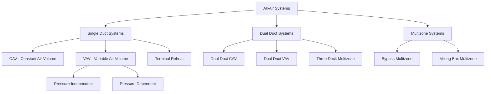

All-air systems condition spaces exclusively through the supply and distribution of air at various temperatures and flow rates. These systems transport all heating and cooling capacity via air rather than using water or refrigerant in terminal units, making them fundamentally different from air-water or all-water systems.

## Operating Principles

All-air systems operate on the principle that conditioned air provides both the sensible and latent cooling (or heating) required to maintain space conditions. The air is conditioned at a central air handling unit (AHU) and distributed through ductwork to occupied spaces. Heat transfer occurs by convection as supply air mixes with room air, absorbing thermal loads.

The cooling capacity delivered is:

Q = 1.08 × CFM × ΔT (sensible) + 0.68 × CFM × Δω (latent)

Where CFM is airflow rate, ΔT is temperature difference, and Δω is humidity ratio difference. For typical applications, sensible heat ratio (SHR) ranges from 0.70 to 0.95.

## System Configurations

## System Type Comparison

| System Type | Airflow Control | Energy Efficiency | Application | Complexity |
|-------------|----------------|-------------------|-------------|------------|
| **CAV Single Duct** | Constant volume | Moderate | Simple loads, small buildings | Low |
| **VAV Single Duct** | Variable volume | High | Variable loads, large buildings | Moderate |
| **Terminal Reheat** | Constant volume | Low | Critical humidity control | Moderate |
| **Dual Duct CAV** | Constant, mixed | Low | Perimeter zones | High |
| **Dual Duct VAV** | Variable, mixed | Moderate | Simultaneous heating/cooling | High |
| **Multizone** | Constant, dampered | Low to Moderate | Multiple zones, retrofit | Moderate |

## Airflow Fundamentals

### Design Air Quantities

Supply airflow is determined by the dominant load condition:

**Sensible Load Dominated:**
CFM = Q_sensible / (1.08 × ΔT)

**Latent Load Dominated:**
CFM = Q_latent / (0.68 × Δω)

Typical supply air temperature differentials range from 15°F to 25°F for cooling applications. Larger ΔT values reduce airflow requirements but may create comfort issues due to high discharge velocities.

### Ventilation Requirements

ASHRAE Standard 62.1 mandates minimum outdoor air based on occupancy and floor area:

V_oz = R_p × P_z + R_a × A_z

Where R_p is outdoor air per person, P_z is zone population, R_a is outdoor air per unit area, and A_z is zone floor area.

## Duct Sizing Standards

ASHRAE duct design follows two primary methods per ASHRAE Fundamentals Handbook Chapter 21:

### Equal Friction Method

Maintains constant pressure drop per unit length throughout the duct system. Typical friction rates:

| Application | Friction Rate (in. w.g./100 ft) |
|-------------|--------------------------------|
| Low velocity residential | 0.06 - 0.10 |
| Commercial systems | 0.08 - 0.15 |
| High velocity systems | 0.30 - 0.60 |

Duct diameter is calculated using the friction chart or Darcy-Weisbach equation:

ΔP/L = f × (ρV²/2D)

Where f is friction factor, ρ is air density, V is velocity, and D is duct diameter.

### Static Regain Method

Used for VAV systems, this method sizes ducts to maintain constant static pressure at each branch takeoff. Velocity reduces at each junction, converting velocity pressure to static pressure, which offsets friction losses.

## Constant Air Volume (CAV) Systems

CAV systems deliver fixed airflow regardless of load variations. Temperature control occurs by modulating supply air temperature via heating/cooling coils. Supply fans operate at constant speed, and zone control uses dampers or terminal reheat coils.

**Advantages:**
- Simple control logic
- Lower first cost
- Reliable operation
- Consistent ventilation rates

**Disadvantages:**
- High energy consumption at part load
- Poor humidity control at reduced loads
- Simultaneous heating and cooling in reheat systems

## Variable Air Volume (VAV) Systems

VAV systems modulate airflow to match thermal loads while maintaining constant supply air temperature. Terminal units throttle airflow using dampers controlled by zone thermostats. Supply fan speed varies via VFD to maintain duct static pressure.

**Fan Power Relationship:**
BHP ∝ CFM³ (affinity laws)

This cubic relationship makes VAV highly efficient at part-load conditions, where most commercial buildings operate 80-90% of operating hours.

**Design Considerations:**
- Minimum airflow settings (typically 30-50% of peak) for ventilation
- Static pressure reset strategies to reduce fan energy
- Diversity factors (0.70-0.85) applied to peak zone loads
- Air distribution effectiveness at reduced flows

## Dual Duct Systems

Dual duct systems maintain separate hot and cold air ducts throughout the building. Terminal mixing boxes blend the two airstreams to achieve desired zone temperatures. This configuration provides excellent zone control but at significant energy penalty.

**Energy Recovery Strategies:**
- Heat recovery between hot and cold decks
- Cold deck temperature reset based on zone demands
- Hot deck lockout during cooling-only periods

## Multizone Systems

Multizone units condition multiple zones from a single AHU with zone dampers located at the unit. Hot and cold deck sections condition air, and zone dampers mix airstreams for each zone's duct. Limited to smaller buildings due to long duct runs and energy inefficiency.

**Application Limits:**
Per ASHRAE 90.1, multizone systems are restricted due to energy concerns. Maximum 5,000 CFM capacity for new construction in most climate zones.

## Practical Design Guidelines

**Duct Velocity Limits (to minimize noise):**

| Duct Type | Maximum Velocity (fpm) |
|-----------|----------------------|
| Main ducts (commercial) | 1500 - 2000 |
| Branch ducts | 1000 - 1300 |
| Final runouts | 600 - 900 |
| Residential supply | 600 - 900 |

**Aspect Ratio:** Rectangular ducts should maintain aspect ratios below 4:1 to minimize pressure drop and material costs.

**Leakage Class:** Specify duct sealing per SMACNA standards. Sealed Class 6 or 12 ductwork reduces energy waste by 10-20% compared to unsealed construction.

All-air systems remain the dominant choice for commercial buildings due to their simplicity, ability to provide complete environmental control, and compatibility with economizer cycles for free cooling.

