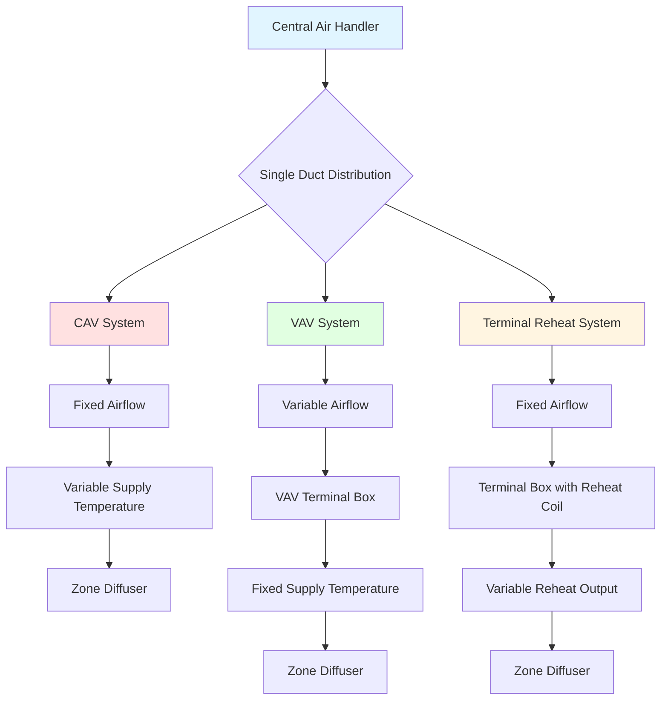

Single duct all-air systems represent the most widely implemented HVAC architecture in commercial buildings. These systems deliver conditioned air through a single duct network from central air handling units to terminal devices or directly to conditioned spaces. The fundamental characteristic distinguishing single duct systems is that all air distribution occurs through one duct path per zone, with temperature control achieved through airflow modulation, supply air temperature adjustment, or terminal reheat.

## System Classification

Single duct systems fall into three primary categories based on airflow control methodology:

### Constant Air Volume (CAV) Systems

CAV systems maintain fixed airflow rates to each zone regardless of thermal load variations. Temperature control is achieved by modulating the supply air temperature at the central air handler. When one zone reaches setpoint, the entire system reduces cooling output, making CAV systems suitable only for spaces with uniform load profiles and simultaneous heating or cooling requirements.

**Operating characteristics:**
- Fixed fan speed and airflow delivery
- Supply air temperature varies between 55-65°F based on zone demand
- Economizer operation adjusts outdoor air intake
- Minimal part-load energy efficiency

### Variable Air Volume (VAV) Systems

VAV systems modulate airflow delivery to match zone thermal loads while maintaining constant supply air temperature. Terminal boxes at each zone contain dampers that throttle airflow based on zone thermostat signals. As dampers close across the system, static pressure increases in the ductwork, triggering the central fan to reduce speed via variable frequency drive control.

**Operating characteristics:**
- Supply air temperature typically fixed at 55°F
- Airflow varies from 30% minimum to 100% of design
- Fan energy reduces proportionally to the cube of flow reduction
- Superior part-load efficiency compared to CAV
- Requires minimum airflow for ventilation and mixing

### Terminal Reheat Systems

Terminal reheat configurations combine constant volume airflow delivery with zone-level heating coils located in terminal boxes. The central system supplies air at temperatures cold enough to satisfy the highest cooling load zone (typically 52-55°F), while zones requiring less cooling or heating receive electric or hot water reheat at the terminal device.

**Operating characteristics:**
- Constant airflow ensures adequate ventilation and mixing
- Individual zone temperature control via reheat coils
- High energy consumption due to simultaneous cooling and heating
- Excellent humidity control in critical applications
- Simple zone-level temperature control

## System Architecture Comparison

## Performance Characteristics

| Parameter | CAV | VAV | Terminal Reheat |
|-----------|-----|-----|-----------------|
| **Part-Load Efficiency** | Poor | Excellent | Poor |
| **Zone Control** | Single zone only | Excellent multi-zone | Excellent multi-zone |
| **First Cost** | Low | Medium | Medium-High |
| **Operating Cost** | Medium | Low | High |
| **Humidity Control** | Poor | Fair | Excellent |
| **Ventilation Certainty** | Good | Requires monitoring | Excellent |
| **Applicable Building Types** | Small uniform spaces | Most commercial | Laboratories, hospitals |
| **Fan Energy at 50% Load** | 100% | 25% | 100% |

## ASHRAE System Selection Guidelines

According to ASHRAE Handbook—HVAC Systems and Equipment, single duct system selection depends on several building parameters:

**VAV systems are preferred when:**
- Multiple zones exist with diverse load profiles
- Building occupancy varies throughout the day
- Energy efficiency is a priority
- Floor-to-ceiling heights exceed 9 feet
- Renovation allows for duct pressure sensors

**CAV systems remain viable for:**
- Single-zone applications under 10,000 ft²
- Spaces requiring constant ventilation rates
- Buildings with highly uniform loads
- Budget-constrained projects
- Retrofit applications with ductwork constraints

**Terminal reheat is justified for:**
- Laboratories requiring minimum airflow for safety
- Healthcare facilities needing precise temperature control
- Spaces with critical humidity requirements
- High-sensible-heat-ratio applications
- Buildings with available low-grade heat sources

## Design Considerations

**Ductwork sizing:** Single duct systems require larger duct cross-sections than dual duct systems since all airflow travels through one path. Friction losses must remain below 0.1 in. w.g. per 100 feet to maintain acceptable fan energy consumption.

**Minimum airflow:** VAV systems require minimum airflow settings, typically 30% of design, to ensure adequate ventilation and prevent stratification. ASHRAE Standard 62.1 mandates ventilation tracking for VAV systems to verify outdoor air delivery at all operating conditions.

**Supply air temperature:** Lower supply temperatures (52-55°F) increase sensible cooling capacity and reduce airflow requirements but require additional dehumidification and risk condensation on ductwork exterior surfaces. Insulation R-values must meet or exceed local energy code requirements.

**Fan control:** VAV systems achieve energy savings only with proper fan control. Static pressure sensors located two-thirds of the distance along the longest duct run provide optimal control signals. The fan maintains sufficient pressure to keep the most-open VAV box damper at 90-95% open position.

## Operational Advantages and Limitations

Single duct systems offer simplicity in design, installation, and maintenance compared to dual duct or multizone alternatives. The single air path minimizes ductwork space requirements and reduces first costs. However, these systems cannot simultaneously heat some zones while cooling others without terminal reheat equipment, limiting application in buildings with high facade loads or mixed-use spaces.

VAV technology has become the dominant choice for commercial HVAC applications due to substantial energy savings potential. Fan laws dictate that reducing fan speed to 50% of design reduces power consumption to approximately 12.5% of full-load power, making VAV systems dramatically more efficient than constant volume alternatives at part-load conditions.

