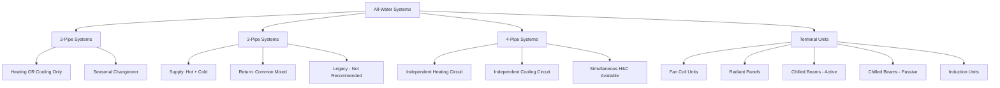

## Overview

All-water HVAC systems distribute conditioned water to terminal units located throughout a building, where the water exchanges heat with the space air or surfaces. Unlike all-air systems that transport conditioned air through ductwork, all-water systems rely on smaller-diameter piping to transport thermal energy. This fundamental difference provides significant advantages in building applications where space constraints, zoning requirements, or energy efficiency drive system selection.

The physics governing these systems centers on convective and radiant heat transfer. Water's specific heat capacity (4.186 kJ/kg·K) far exceeds that of air (1.005 kJ/kg·K), enabling water to transport approximately 3,500 times more thermal energy per unit volume than air. This thermodynamic advantage translates to reduced distribution system size, lower pumping energy compared to fan energy, and quieter operation.

## System Architecture Types

## Piping Configuration Comparison

| Parameter | 2-Pipe System | 4-Pipe System |
|-----------|---------------|---------------|
| Piping Cost | Lower initial investment | Higher initial investment |
| Operating Flexibility | Heating OR cooling per season | Simultaneous heating and cooling |
| Changeover Period | 2-4 weeks transition downtime | No transition period required |
| Zone Control | Limited - same mode building-wide | Excellent - independent zone control |
| Energy Efficiency | Moderate - cannot optimize by zone | Higher - serves actual zone loads |
| Application Suitability | Uniform load buildings, single climate zones | Variable loads, perimeter/core zones |
| Maintenance Complexity | Lower - fewer valves and controls | Higher - more components to maintain |
| Design Water Temperature | 44-48°F cooling / 120-180°F heating | Separate optimization for each circuit |

## Terminal Unit Configurations

### Fan Coil Units (FCUs)

Fan coil units consist of a finned-tube heat exchanger coil, centrifugal or axial fan, filter, and drain pan enclosed in a cabinet. The fan forces air across the coil where sensible and latent heat transfer occurs according to:

**Sensible Cooling:** Q_s = m_air × c_p × (T_entering - T_leaving)

**Latent Cooling:** Q_l = m_air × h_fg × (ω_entering - ω_leaving)

FCUs provide local control, allowing individual zone temperature adjustment. Typical applications include hotels, apartments, and perimeter offices where zoning flexibility outweighs the maintenance requirements of distributed equipment.

**Performance Characteristics:**

| FCU Specification | Typical Range | Design Considerations |
|-------------------|---------------|----------------------|
| Cooling Capacity | 200-2,000 CFM | Size based on peak zone load |
| Water Flow Rate | 1-10 GPM | Maintain 5-15°F ΔT across coil |
| Supply Water Temp | 44-48°F (cooling) | Dewpoint control prevents condensation |
| Sound Level | 25-45 NC | Critical for occupied spaces |
| Fan Power | 0.2-0.8 W/CFM | Select for efficiency, not just first cost |

### Radiant Cooling Panels

Radiant panels exchange heat primarily through thermal radiation rather than convection. Surface temperature differences drive radiant heat transfer according to the Stefan-Boltzmann relationship. Ceiling-mounted panels cool by absorbing longwave infrared radiation emitted by warmer surfaces and occupants.

The heat transfer rate follows:

**q = ε × σ × A × (T_surface⁴ - T_panel⁴)**

Where ε represents surface emissivity and σ is the Stefan-Boltzmann constant (5.67×10⁻⁸ W/m²·K⁴).

Practical radiant panel systems achieve cooling capacities of 30-50 BTU/hr·ft² with panel surface temperatures maintained 2-4°F above the space dewpoint to prevent condensation. Dewpoint control represents the critical design constraint - sophisticated humidity monitoring and panel temperature modulation prevents moisture accumulation.

### Chilled Beams

Chilled beams leverage natural convection (passive) or induced airflow (active) to transfer heat from the space to chilled water circulating through the beam.

**Passive Chilled Beams** rely entirely on buoyancy-driven convection. Warm room air rises to contact the cooled beam surface, transfers heat, becomes denser, and descends. Typical capacities range from 20-40 BTU/hr·ft² of floor area served.

**Active Chilled Beams** incorporate primary air supplied at high velocity through nozzles, inducing room air across the cooling coil via the Venturi effect. The induced air ratio typically ranges from 2:1 to 6:1 (room air to primary air). Capacities reach 60-100 BTU/hr·ft² with proper design.

Both types require strict dewpoint control and excel in applications with well-controlled humidity, such as offices, laboratories, and educational facilities.

## ASHRAE System Selection Guidelines

ASHRAE Handbook - HVAC Systems and Equipment provides selection criteria based on building characteristics:

**All-water systems suit applications where:**
- Individual zone control justifies terminal unit maintenance
- Vertical space for ductwork is limited
- Sensible cooling dominates (latent loads addressed separately)
- Quiet operation is required
- Energy transport efficiency is prioritized over air distribution

**Avoid all-water systems where:**
- High ventilation rates are required (cannot meet without dedicated outdoor air)
- Humidity control is critical and difficult to manage centrally
- Occupants lack technical sophistication for local controls
- Maintenance access to terminal units is severely restricted

## System Design Considerations

### Water Temperature Control

Maintain supply water temperature above the space dewpoint temperature with adequate safety margin (typically 2-4°F). Monitor dewpoint continuously and implement reset strategies that raise supply water temperature as humidity increases.

### Ventilation Air Requirements

All-water systems provide no ventilation air directly. Compliance with ASHRAE Standard 62.1 requires a separate dedicated outdoor air system (DOAS). The DOAS conditions ventilation air, controls space humidity, and often maintains slight pressurization.

### Zoning Strategy

Design zones based on load characteristics, exposure, and occupancy patterns. Perimeter zones with high solar and conductive loads separate from interior zones with primarily equipment and occupant loads. A 4-pipe system enables optimal response to simultaneous heating and cooling demands in different zones.

### Energy Efficiency

Pumping energy for water distribution typically consumes 1-2% of thermal energy transported, compared to 8-15% for air distribution systems. Variable speed pumping, optimized ΔT control, and demand-based flow reduction maximize efficiency gains. Waterside economizer operation extends free cooling hours when outdoor conditions permit.
