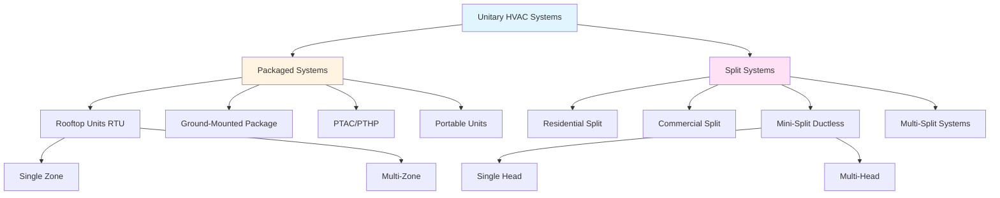

# Unitary HVAC Systems

Unitary systems are factory-assembled air conditioning units designed to serve a single zone or space. These self-contained systems integrate all refrigeration components—compressor, condenser, evaporator, expansion device, and controls—into one or two factory-matched assemblies. The term "unitary" distinguishes these products from field-assembled central systems where components are selected and matched on-site.

## Classification of Unitary Equipment

Unitary systems divide into two primary categories based on physical configuration:

**Packaged Systems:** All components housed in a single cabinet installed outdoors or in mechanical spaces.

**Split Systems:** Refrigeration circuit divided between an outdoor condensing unit and an indoor air handler connected by refrigerant lines.

## Efficiency Metrics for Unitary Systems

Three primary metrics quantify unitary system efficiency, each addressing different operating conditions:

**SEER (Seasonal Energy Efficiency Ratio):** Measures cooling efficiency over an entire cooling season, accounting for varying outdoor temperatures from 65°F to 104°F. Calculated as total heat removed (BTU) divided by total electrical energy input (Wh) during the cooling season.

- Current federal minimum: 14 SEER (split systems), 13.4 SEER (packaged units) in northern states
- Energy Star threshold: ≥15 SEER (split), ≥14 SEER (packaged)
- High-efficiency units: 20-28 SEER achievable with inverter-driven compressors

**EER (Energy Efficiency Ratio):** Steady-state cooling efficiency at design conditions (95°F outdoor, 80°F/67°F indoor dry bulb/wet bulb, 50% relative humidity). Calculated as cooling capacity (BTU/hr) divided by power input (W).

- Federal minimum: 12.2 EER for split systems ≥45,000 BTU/hr
- Critical for peak demand analysis and electrical service sizing
- Commercial rooftop units: typically 10-14 EER

**HSPF (Heating Seasonal Performance Factor):** Heat pump heating efficiency over an entire heating season. Total heat output (BTU) divided by total electrical energy input (Wh) including supplemental resistance heat.

- Federal minimum: 8.8 HSPF (split heat pumps), 8.0 HSPF (packaged)
- Energy Star threshold: ≥9.0 HSPF
- Cold-climate heat pumps: maintain capacity to -15°F with HSPF 10-13

## Packaged vs Split System Comparison

| Parameter | Packaged Systems | Split Systems |
|-----------|-----------------|---------------|
| **Installation Footprint** | No indoor equipment space required | Requires 3-6 ft² indoor mechanical space |
| **Refrigerant Lines** | Factory-sealed, no field piping | Field-installed lines, 15-150 ft typical |
| **Ductwork Connection** | Single penetration at roof/wall | Indoor unit requires supply/return plenum |
| **Service Access** | All components accessible outdoors | Outdoor and indoor service required |
| **Efficiency (SEER)** | 13-18 SEER typical | 14-28 SEER typical |
| **Noise (Indoor)** | 45-55 dB transmitted through duct | 35-50 dB at air handler location |
| **First Cost** | Lower equipment + installation cost | Higher due to line set and labor |
| **Refrigerant Charge** | 5-15 lbs factory-sealed | 8-25 lbs with field adjustments |
| **Aesthetic Impact** | Visible rooftop/ground equipment | Concealed indoor unit, small outdoor unit |
| **Replacement Flexibility** | Must match existing roof curb/pad | Components replaceable independently |

## Rooftop Units (RTUs)

Commercial packaged units designed for roof mounting serve 3-25 tons capacity per unit. RTUs integrate cooling, heating (gas furnace, electric heat, or heat pump), filtration, and economizer controls. These units mount on structural roof curbs that accommodate duct connections and provide weather-tight installation.

**Key Design Considerations:**

- Structural load: 15-20 lbs/ft² roof loading for unit + curb + duct transitions
- Curb flashing integration with roofing membrane critical for waterproofing
- Supply air discharge: horizontal or vertical configurations available
- Economizer operation: up to 100% outdoor air for free cooling when To < 55-65°F
- Gas heating: 80% thermal efficiency furnace sections up to 400 MBH input
- AHRI certification mandatory for performance verification

## Packaged Terminal Units (PTACs)

Self-contained units installed through exterior walls serve individual rooms. Standard 42" width fits wall sleeves in hotels, apartments, and senior living facilities. Cooling capacity ranges from 7,000-15,000 BTU/hr with optional resistance or heat pump heating.

**Performance Characteristics:**

- EER: 9.4-12.5 at standard rating conditions
- Air-cooled condenser discharges directly to outdoors (no ducting required)
- Outdoor air ventilation integrated (10-25 CFM typical)
- Standard 208/230V single-phase electrical
- Operating sound: 45-55 dBA at 3 feet
- Service life: 10-15 years with annual maintenance

## Mini-Split Ductless Systems

Variable-capacity mini-splits deliver 9,000-36,000 BTU/hr per indoor head with SEER ratings exceeding 25. Inverter-driven compressors modulate from 20-130% of nominal capacity, matching load precisely while minimizing cycling losses.

**Advantages:**

- Zone-level temperature control with individual head thermostats
- No ductwork eliminates 25-40% distribution losses
- Refrigerant line sets up to 200 ft horizontal, 50 ft vertical separation
- Heating capacity maintained to outdoor temperatures as low as -13°F
- Installation in 4-8 hours for single-zone applications

**Multi-head configurations** connect 2-8 indoor units to a single outdoor unit with independent operation. Total connected capacity should not exceed 100-130% of outdoor unit nominal capacity to prevent simultaneous full-load operation issues.

## AHRI Certification and Rating Standards

Air-Conditioning, Heating, and Refrigeration Institute (AHRI) maintains independent certification programs verifying manufacturer performance claims. AHRI-certified equipment displays a reference number searchable in the online directory containing:

- Certified cooling/heating capacities at standard conditions
- SEER, EER, HSPF efficiency ratings
- Electrical characteristics (voltage, phase, full-load amps)
- Refrigerant type and charge quantity
- Sound power levels (indoor and outdoor)

AHRI 210/240 standard governs residential unitary equipment testing while AHRI 340/360 covers commercial units above 5 tons. Specifying AHRI-certified equipment ensures third-party verification of performance data used in load calculations and energy modeling.

Energy Star certification requires efficiency levels 15-20% above federal minimums, verified through AHRI testing. Utility rebate programs typically mandate Energy Star qualification as a minimum eligibility threshold.

## System Selection Methodology

1. **Calculate design loads** per ACCA Manual J (residential) or ASHRAE fundamentals (commercial)
2. **Determine configuration** based on available mechanical space and distribution approach
3. **Size equipment** to 100-115% of design cooling load (avoid oversizing)
4. **Select efficiency level** through life-cycle cost analysis including utility rates and operating hours
5. **Verify AHRI certification** for selected model and match outdoor/indoor components
6. **Confirm voltage compatibility** with available electrical service
7. **Review sound levels** against project requirements
8. **Check clearances** for code-compliant installation and service access

Proper refrigerant line sizing, evacuation to 500 microns, and nitrogen pressure testing remain critical for split system longevity regardless of equipment quality.

