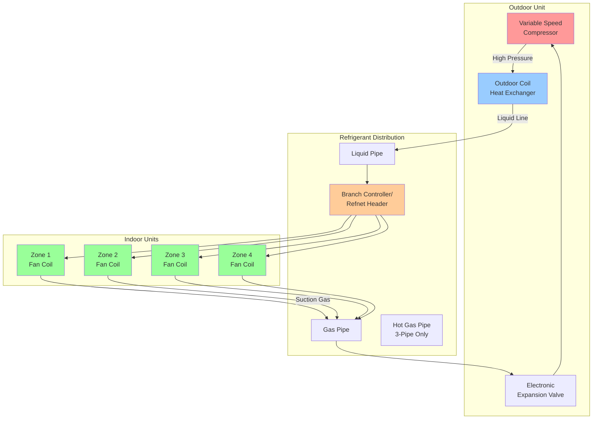

# Variable Refrigerant Flow Systems

Variable Refrigerant Flow (VRF) systems represent advanced ductless HVAC technology utilizing refrigerant as the primary heat transfer medium. These systems employ variable-speed compressors and electronic expansion valves to modulate refrigerant flow, matching precise thermal loads across multiple indoor units connected to a single outdoor unit.

## System Architecture and Configuration

VRF systems consist of three primary components:

- **Outdoor Unit**: Contains variable-speed inverter-driven compressor(s), heat exchanger, and control electronics
- **Indoor Units**: Multiple fan coil units (1 to 64+ per system) with individual zone control
- **Refrigerant Piping Network**: Copper tubing distributing refrigerant between outdoor and indoor units

### System Configuration Diagram

## VRF System Types

### Heat Pump VRF (2-Pipe)

Heat pump systems operate in either cooling or heating mode across all zones simultaneously. Two refrigerant pipes (liquid and gas) connect outdoor and indoor units.

**Applications**: Buildings with uniform thermal loads, residential complexes, hotels

### Heat Recovery VRF (3-Pipe)

Heat recovery systems enable simultaneous heating and cooling in different zones. A third pipe (hot gas line) allows refrigerant energy redistribution between zones requiring heating and cooling.

**Applications**: Office buildings, healthcare facilities, mixed-use developments

## 2-Pipe vs 3-Pipe System Comparison

| Parameter | 2-Pipe Heat Pump | 3-Pipe Heat Recovery |
|-----------|------------------|----------------------|
| Simultaneous Heating/Cooling | No | Yes |
| Refrigerant Pipes | 2 (liquid + gas) | 3 (liquid + gas + hot gas) |
| Energy Recovery | None | High (30-40% savings) |
| Installation Cost | Lower | 15-25% higher |
| Operating Efficiency | High | Very High |
| Mode Switching | Required | Not required |
| Branch Controller | Refnet joints | BS/BC boxes |
| Ideal Application | Uniform loads | Mixed loads |
| Control Complexity | Moderate | Advanced |

## Capacity Calculations

### Total System Capacity

Per ASHRAE Guideline 37-2022, VRF system capacity is calculated using the combination ratio (CR):

**Combination Ratio (CR)** = Σ(Indoor Unit Capacities) / Outdoor Unit Capacity

Maximum CR varies by manufacturer (typically 100-150%):

**Example Calculation**:
- Outdoor unit capacity: 48,000 BTU/hr
- Indoor units: 8 units × 9,000 BTU/hr = 72,000 BTU/hr
- CR = 72,000 / 48,000 = 1.50 or 150%

### Diversity Factor Application

Actual simultaneous load is less than total connected capacity:

**Effective Capacity** = Outdoor Unit Capacity × Operating Efficiency Factor

For office applications, apply 70-80% diversity factor when CR exceeds 100%.

## Refrigerant Piping Design

### Piping Length Limitations

ASHRAE Guideline 37 establishes piping constraints:

- **Maximum equivalent piping length**: 650-1,000 ft (varies by manufacturer)
- **Maximum vertical height difference**: 160-330 ft
- **Longest single run**: 500-600 ft from outdoor unit to farthest indoor unit

### Pipe Sizing Methodology

Refrigerant pipe sizing depends on capacity and equivalent length:

| Indoor Unit Capacity | Liquid Line OD | Gas Line OD |
|----------------------|----------------|-------------|
| 7,000-9,000 BTU/hr | 1/4 in | 3/8 in |
| 9,000-15,000 BTU/hr | 3/8 in | 1/2 in |
| 15,000-24,000 BTU/hr | 3/8 in | 5/8 in |
| 24,000-36,000 BTU/hr | 1/2 in | 3/4 in |
| 36,000-48,000 BTU/hr | 5/8 in | 7/8 in |

### Pressure Drop Calculation

Refrigerant pressure drop in piping:

**ΔP** = f × (L/D) × (ρv²/2)

Where:
- f = friction factor (0.015-0.025 for refrigerant)
- L = equivalent pipe length (ft)
- D = inside diameter (ft)
- ρ = refrigerant density (lb/ft³)
- v = refrigerant velocity (ft/s)

Maximum allowable pressure drop: 3-5 psi equivalent per 100 ft for proper oil return.

### Oil Return Considerations

Minimum refrigerant velocity for oil entrainment:

- **Horizontal runs**: 1,000-1,500 fpm
- **Vertical risers**: 1,500-2,000 fpm

Install oil traps every 30-40 ft on vertical risers exceeding 40 ft.

## Heat Recovery Operation

Heat recovery VRF systems redistribute thermal energy using branch selector (BS) boxes:

**Energy Balance**: Q_cooling + Q_heating = Q_outdoor + Q_recovered

In simultaneous mode, cooling zones reject heat through the outdoor unit while heating zones receive recovered energy, reducing outdoor unit load.

**Heat Recovery Efficiency** = (Recovered Energy) / (Total Energy Input) × 100%

Typical recovery efficiency: 30-40% under mixed load conditions.

## Design Guidelines per ASHRAE

### Load Calculation (ASHRAE Guideline 37-2022)

1. Calculate zone-by-zone heating and cooling loads per Manual J or ASHRAE Fundamentals
2. Determine coincident peak loads for outdoor unit sizing
3. Apply diversity factors based on building type and occupancy patterns
4. Size outdoor unit at 70-80% of total connected indoor capacity for high CR systems

### Refrigerant Charge Calculation

Total refrigerant charge:

**M_total** = M_outdoor + (M_liquid × L_liquid) + (M_gas × L_gas) + Σ(M_indoor)

Where:
- M_outdoor = factory charge in outdoor unit (lb)
- M_liquid = liquid line charge per ft (lb/ft)
- M_gas = gas line charge per ft (lb/ft)
- L = piping length (ft)
- M_indoor = charge per indoor unit (lb)

Typical charge: 0.5-1.5 lb per 1,000 BTU/hr system capacity

## Performance Optimization

### Part-Load Efficiency

VRF systems excel at part-load conditions through inverter technology:

- **100% load**: EER 11-13
- **50% load**: EER 15-18
- **25% load**: EER 18-22

Integrated Part Load Value (IPLV) per AHRI 1230: 18-24 EER typical for high-efficiency models.

### Zoning Strategy

Optimal zoning maximizes efficiency:

- Group zones with similar thermal characteristics
- Separate perimeter and interior zones
- Isolate high-load areas (conference rooms, server rooms)
- Limit 8-12 indoor units per outdoor unit for responsive control

## Installation Requirements

**Critical installation considerations**:

- Refrigerant piping must be brazed with nitrogen purge (prevent oxidation)
- Evacuate system to 500 microns minimum before charging
- Use polyol ester (POE) oil compatible with R-410A refrigerant
- Install liquid line filter-dryers to protect expansion valves
- Pitch horizontal piping 0.5% toward outdoor unit for oil return
- Support piping every 4-6 ft; avoid vibration transmission
- Insulate both liquid and gas lines (minimum 1/2 in wall thickness)

## Conclusion

VRF systems provide exceptional energy efficiency, precise zone control, and flexible installation in applications ranging from small commercial buildings to large multi-story complexes. Heat recovery configurations enable simultaneous heating and cooling, recovering 30-40% of energy that would otherwise be wasted. Proper system design requires careful attention to piping layout, capacity calculations, and adherence to ASHRAE Guideline 37 recommendations to ensure optimal performance and reliability.

