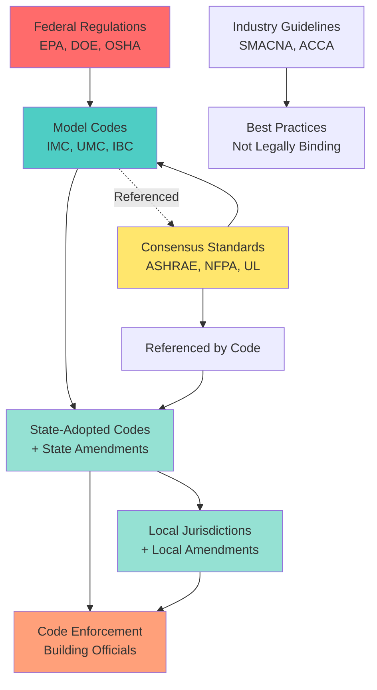

The HVAC industry operates within a comprehensive regulatory framework established by model codes, consensus standards, and federal regulations. Understanding the hierarchy, adoption process, and enforcement mechanisms is essential for compliant system design, installation, and operation.

## Codes vs Standards vs Regulations

These three categories serve distinct but complementary functions in the built environment:

**Building Codes** are legally enforceable documents adopted by governmental jurisdictions. They establish minimum requirements for safety, health, and structural integrity. Codes are enacted through legislation and carry the force of law. The International Mechanical Code (IMC) and Uniform Mechanical Code (UMC) exemplify model mechanical codes.

**Consensus Standards** are technical specifications developed through industry collaboration. Organizations like ASHRAE, NFPA, and SMACNA produce standards through consensus processes involving manufacturers, engineers, contractors, and code officials. Standards become enforceable only when referenced by adopted codes or when specified in contracts.

**Regulations** are government-mandated rules with direct legal authority. Federal regulations from EPA (refrigerant management), DOE (equipment efficiency), and OSHA (worker safety) apply nationwide regardless of local code adoption.

## Major Code and Standards Organizations

The HVAC regulatory landscape is shaped by several key organizations:

| Organization | Full Name | Primary Focus | Document Types |
|--------------|-----------|---------------|----------------|
| **ICC** | International Code Council | Model building codes | IMC, IBC, IECC, IFC, IRC |
| **ASHRAE** | American Society of Heating, Refrigerating and Air-Conditioning Engineers | HVAC design standards | 15, 55, 62.1, 62.2, 90.1, 189.1 |
| **NFPA** | National Fire Protection Association | Fire and life safety | 70 (NEC), 90, 92, 96, 105 |
| **UL** | Underwriters Laboratories | Product safety testing | 1995, 1741, 60335-2-40 |
| **SMACNA** | Sheet Metal and Air Conditioning Contractors' National Association | Installation standards | Duct construction, sealing, HVAC systems |
| **IAPMO** | International Association of Plumbing and Mechanical Officials | Model codes (western US) | UMC, UPC |

## Code Hierarchy and Relationships

## Code Adoption Process

The path from model code publication to local enforcement follows a multi-stage process:

**Model Code Development** occurs on a three-year cycle. ICC and IAPMO convene committees of technical experts to review proposed changes. Public comment periods allow industry participation. Code development hearings enable voting by governmental members to accept, modify, or reject proposals.

**State Adoption** varies by jurisdiction. Some states mandate statewide codes with centralized enforcement. Others permit local adoption with state oversight. Adoption typically lags model code publication by 1-3 years. States frequently introduce amendments addressing regional climate, construction practices, or political considerations.

**Local Adoption** occurs through municipal ordinances or county resolutions. Jurisdictions may adopt model codes verbatim, with state amendments, or with additional local modifications. Local amendments commonly address high-wind regions, seismic zones, wildfire interfaces, or flood hazards.

**Amendment Cycles** mean practitioners must track multiple code editions simultaneously. New construction follows newly adopted codes. Existing buildings often remain under original construction codes unless substantial alterations trigger upgrades. The ICC publishes new editions every three years (2021, 2024, 2027).

## Standards Incorporation by Reference

Model codes incorporate standards through reference rather than reproducing full text. When the IMC references ASHRAE 62.1, that standard becomes enforceable as if written into the code itself. This mechanism enables:

- Specialization: Standards organizations develop deep technical expertise
- Currency: Standards update independently of code cycles
- Harmonization: Multiple codes reference identical standards
- Flexibility: Jurisdictions can amend code references to specify standard editions

Common referenced standards include ASHRAE 90.1 (energy efficiency), ASHRAE 62.1 (ventilation), NFPA 70 (electrical), and hundreds of ASTM, ANSI, and UL product standards.

## Code Enforcement and Compliance

**Plan Review** precedes construction. Designers submit mechanical plans and specifications to building departments. Code officials verify compliance with applicable codes and standards. Incomplete or non-compliant plans receive correction notices requiring resubmission.

**Permit Issuance** authorizes construction. Mechanical permits require plans, calculations, and fees. Some jurisdictions offer expedited review for standard installations.

**Inspections** occur at prescribed construction stages: rough-in (before concealment), final (system operational), and special inspections (seismic bracing, smoke control). Inspectors verify installation matches approved plans and meets code requirements.

**Certificate of Occupancy** authorizes building occupation after successful final inspections across all trades. HVAC deficiencies can prevent CO issuance.

**Variance Procedures** exist for situations where literal code compliance creates practical difficulties. Applicants demonstrate equivalent safety through alternative methods or materials. Building officials or appeals boards grant variances case-by-case.

## Key Code References

Critical mechanical code provisions address:

- Equipment sizing methodology and load calculations
- Combustion air requirements for fuel-burning appliances
- Duct construction, materials, and sealing requirements
- Ventilation rates for occupied spaces
- Refrigerant classification and system limitations
- Energy conservation measures and equipment efficiency
- Seismic and wind restraint for equipment and distribution systems
- Access and clearances for maintenance

Understanding the distinction between codes, standards, and regulations enables HVAC professionals to navigate compliance requirements effectively. Codes establish enforceable minimums. Standards provide technical specifications. Regulations impose direct federal requirements. Together, these frameworks ensure safe, efficient, and reliable HVAC systems.
