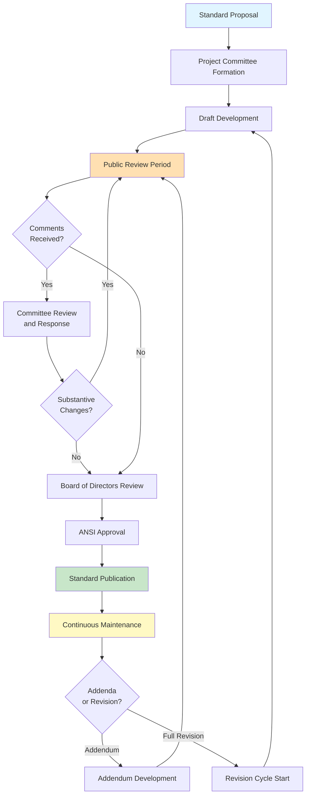
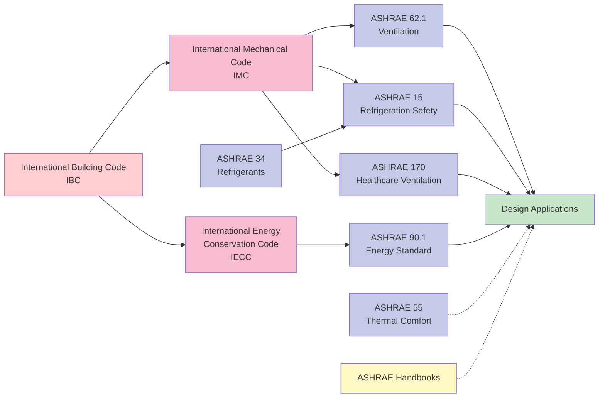

The American Society of Heating, Refrigerating and Air-Conditioning Engineers (ASHRAE) develops and maintains the most widely adopted HVAC standards in the United States and internationally. These consensus standards form the technical backbone of building codes, energy regulations, and design practice across the industry.

## Core ASHRAE Standards

### ASHRAE Standard 62.1: Ventilation for Acceptable Indoor Air Quality

Standard 62.1 establishes minimum ventilation rates and indoor air quality requirements for commercial and institutional buildings. The standard defines outdoor air requirements based on occupancy density, floor area, and contaminant sources.

**Key Requirements:**
- Minimum outdoor air ventilation rates specified in cfm per person plus cfm per square foot
- Ventilation rate procedure and indoor air quality procedure as alternative compliance paths
- Air filtration requirements based on outdoor air quality
- Design documentation and system commissioning mandates

The breathing zone outdoor airflow is calculated as:

Vbz = Rp × Pz + Ra × Az

Where Rp is people outdoor air rate, Pz is zone population, Ra is area outdoor air rate, and Az is zone floor area.

### ASHRAE Standard 90.1: Energy Standard for Buildings

Standard 90.1 sets minimum energy efficiency requirements for building systems including HVAC, lighting, and building envelope. This standard is referenced by IECC and adopted as law in most US jurisdictions.

**Key Components:**
- Prescriptive requirements for equipment efficiency
- Mandatory provisions including economizers, energy recovery, and demand control ventilation
- Building envelope insulation and fenestration requirements
- Energy cost budget method as performance-based alternative
- Climate zone-specific requirements (zones 0-8)

Equipment efficiency requirements use metrics including EER, SEER, COP, IPLV, and combustion efficiency depending on equipment type and capacity.

### ASHRAE Standard 55: Thermal Environmental Conditions for Human Occupancy

Standard 55 specifies thermal environment conditions for acceptable human comfort. The standard addresses temperature, humidity, air movement, and radiant effects.

**Comfort Models:**
- Predicted Mean Vote (PMV) and Predicted Percentage of Dissatisfied (PPD) for mechanically conditioned spaces
- Adaptive comfort model for naturally ventilated buildings
- Elevated air speed method for increased air movement
- Temperature and humidity operating ranges for typical office environments

Acceptable operative temperature ranges vary from 68-79°F in winter to 73-80°F in summer depending on clothing insulation and metabolic rate.

### ASHRAE Standard 15: Safety Standard for Refrigeration Systems

Standard 15 establishes safety requirements for refrigeration system design, construction, installation, and operation. The standard addresses refrigerant classification, system location, ventilation, and leak detection.

**Critical Requirements:**
- Refrigerant quantity limits based on toxicity (A/B) and flammability (1/2L/2/3) classifications
- Machinery room ventilation requirements
- Refrigerant detection and alarm systems
- Pressure relief and containment provisions
- Testing and purging procedures

### ASHRAE Standard 34: Designation and Safety Classification of Refrigerants

Standard 34 assigns refrigerant numbers and establishes safety classifications based on toxicity and flammability. The classification system uses a letter for toxicity (A = lower, B = higher) and number for flammability (1 = no flame propagation, 2L = lower flammability, 2 = flammable, 3 = higher flammability).

**Common Refrigerant Classifications:**

| Refrigerant | Number | Classification | Application |
|-------------|--------|----------------|-------------|
| R-410A | - | A1 | Residential/commercial AC |
| R-32 | - | A2L | Low-GWP alternative |
| R-134a | - | A1 | Chillers, automotive |
| R-1234yf | - | A2L | Automotive, low-GWP |
| R-717 (ammonia) | - | B2L | Industrial refrigeration |
| R-744 (CO2) | - | A1 | Transcritical systems |

### ASHRAE Standard 170: Ventilation of Health Care Facilities

Standard 170 specifies ventilation requirements for health care facilities including hospitals, outpatient facilities, and nursing homes. The standard defines strict requirements for air change rates, pressure relationships, filtration, and humidity control.

**Key Requirements:**
- Minimum air changes per hour for specific room types
- Positive or negative pressure relationships relative to adjacent spaces
- Minimum outdoor air percentages
- Filtration efficiency requirements (MERV ratings)
- Temperature and humidity ranges for patient comfort and infection control

Operating rooms require minimum 20 air changes per hour with positive pressure, while airborne infection isolation rooms require minimum 12 air changes per hour with negative pressure.

## ASHRAE Handbooks

ASHRAE publishes four comprehensive handbooks on a rotating four-year cycle, each updated and revised completely every cycle:

| Handbook | Publication Year | Content Focus |
|----------|------------------|---------------|
| HVAC Systems and Equipment | 2024, 2028 | System types, equipment selection, design |
| Refrigeration | 2026, 2030 | Refrigeration systems, food storage, transport |
| HVAC Applications | 2027, 2031 | Building types, specialized applications |
| Fundamentals | 2025, 2029 | Psychrometrics, heat transfer, load calculation |

## Standard Development Process

ASHRAE standards follow a rigorous consensus development process accredited by the American National Standards Institute (ANSI). The process ensures balanced representation from producers, users, and general interest categories.

## Standard Relationships and Hierarchy

Core ASHRAE standards interact with building codes and other standards to form the regulatory framework:

The diagram illustrates how model building codes reference ASHRAE standards, which then guide design applications. ASHRAE 34 feeds into 15 for refrigerant safety, while Standard 55 and the Handbooks provide supplementary design guidance.

## Addenda and Revision Cycles

Standards undergo continuous maintenance through addenda published between full revisions. Major standards like 62.1, 90.1, and 55 publish on three-year revision cycles. Addenda are incorporated into the next published edition and available separately for immediate adoption.

The typical standard lifecycle:
- **Year 0**: Standard published
- **Years 1-2**: Addenda developed and published
- **Year 3**: Revision process begins, new edition published
- Continuous maintenance committee meets 2-3 times annually

## Compliance and Adoption

ASHRAE standards become legally enforceable when adopted by jurisdictions or referenced in building codes. Most states adopt model codes (IBC, IMC, IECC) that reference specific editions of ASHRAE standards. Design professionals must verify which edition applies to their project based on jurisdiction and permit date.

Standard 90.1 sees particularly widespread adoption as the basis for federal building requirements, utility incentive programs, and green building certifications including LEED. Standard 62.1 forms the minimum ventilation requirement in IMC and most state mechanical codes.

Understanding ASHRAE standards is essential for HVAC design, specification, installation, and operation. These standards represent the collective knowledge of the industry and provide the technical basis for safe, efficient, and comfortable building environments.
