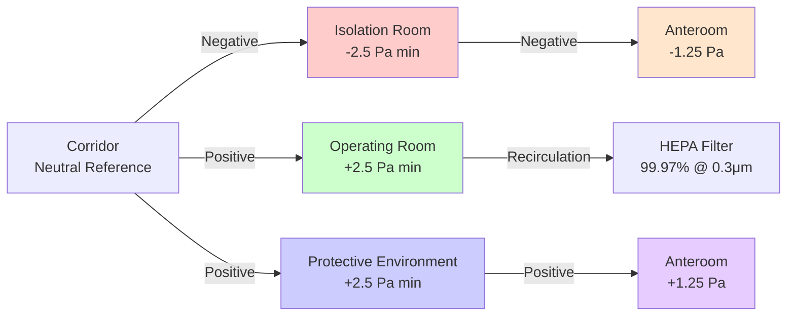

ASHRAE Standard 170, *Ventilation of Health Care Facilities*, establishes minimum ventilation requirements for healthcare spaces to minimize infection transmission, control odors, and maintain appropriate environmental conditions. This standard works in conjunction with the Facility Guidelines Institute (FGI) Guidelines for Design and Construction of Hospitals and Outpatient Facilities.

## Fundamental Design Principles

Healthcare facility HVAC systems differ fundamentally from commercial buildings due to critical requirements for infection control, patient safety, and regulatory compliance. The standard addresses three primary infection control strategies:

**Dilution Ventilation** reduces airborne contaminant concentrations through continuous air change. The total air changes per hour (ACH) required depends on space function, with critical areas demanding higher rates.

**Directional Airflow** controls contaminant migration through pressure relationships. Positive pressure protects immunocompromised patients by preventing infiltration of corridor air, while negative pressure contains infectious aerosols in isolation rooms.

**Filtration** removes particulates and microorganisms. The standard specifies minimum efficiency reporting value (MERV) ratings and, for critical spaces, high-efficiency particulate air (HEPA) filtration.

## Pressure Relationship Requirements

Pressure differentials prevent cross-contamination between spaces. The standard requires minimum pressure differences of **2.5 Pa (0.01 in. w.g.)** between adjacent spaces, though design values of 5-10 Pa provide operational margin.

## Room-by-Room Design Parameters

### Critical Care and Surgical Spaces

| Space Type | Pressure | ACH Total | ACH Outside Air | Recirculation | Air Filtration | Temperature (°F) | RH (%) |
|------------|----------|-----------|-----------------|---------------|----------------|------------------|--------|
| Operating Room (Class B/C) | Positive | 20 min | 4 min | Permitted | MERV 14 + HEPA | 68-73 | 20-60 |
| Protective Environment (PE) | Positive | 12 min | 2 min | Not permitted | MERV 14 + HEPA | 68-75 | 40 max |
| Airborne Infection Isolation (AII) | Negative | 12 min | 2 min | Not permitted | MERV 14 | 68-75 | 30-60 |
| Intensive Care Unit (ICU) | Positive/Equal | 6 min | 2 min | Permitted | MERV 14 | 70-75 | 30-60 |
| Cardiac Catheterization | Positive | 15 min | 3 min | Permitted | MERV 14 + HEPA | 68-73 | 20-60 |

### Diagnostic and Treatment Areas

| Space Type | Pressure | ACH Total | ACH Outside Air | Air Filtration | Temperature (°F) | RH (%) |
|------------|----------|-----------|-----------------|----------------|------------------|--------|
| Emergency Department | Equal/Negative | 12 min | 2 min | MERV 14 | 70-75 | 30-60 |
| Bronchoscopy Room | Negative | 12 min | 2 min | MERV 14 | 68-75 | 30-60 |
| Autopsy Room | Negative | 12 min | 2 min | MERV 8 | 68-75 | 30-60 |
| Radiology (X-ray) | Equal | 6 min | 2 min | MERV 8 | 72-78 | 30-60 |
| MRI Suite | Equal | 6 min | 2 min | MERV 8 | 70-75 | 30-60 |
| Pharmacy (Sterile Compounding) | Positive | 30 min | 4 min | MERV 14 + HEPA | 68-73 | 30-60 |

### Support and Ancillary Spaces

| Space Type | Pressure | ACH Total | ACH Outside Air | Air Filtration |
|------------|----------|-----------|-----------------|----------------|
| Soiled Workroom | Negative | 10 min | 2 min | MERV 8 |
| Sterilizer Equipment Room | Negative | 10 min | 2 min | MERV 8 |
| Housekeeping Room | Negative | 10 min | 2 min | MERV 8 |
| Food Preparation | Negative | 10 min | 2 min | MERV 8 |
| Patient Toilet Room | Negative | 10 min | 1 min | MERV 8 |

## Air Change Calculations

The total air changes per hour is calculated from the required airflow rate and room volume:

$$\text{ACH} = \frac{Q \times 60}{V}$$

Where:
- $\text{ACH}$ = Air changes per hour
- $Q$ = Airflow rate (CFM)
- $V$ = Room volume (ft³)

For rooms with minimum ACH requirements, the required airflow becomes:

$$Q = \frac{\text{ACH} \times V}{60}$$

Outside air ventilation must meet the greater of the ACH requirement or the ventilation needed for thermal load control:

$$Q_{oa} = \max\left(\frac{\text{ACH}_{oa} \times V}{60}, \frac{Q_{sensible}}{1.08 \times \Delta T}\right)$$

Where:
- $Q_{oa}$ = Outside air flow rate (CFM)
- $Q_{sensible}$ = Sensible cooling load (BTU/hr)
- $\Delta T$ = Supply-to-room temperature difference (°F)

## Filtration Requirements

Healthcare facilities require progressive filtration to protect both patients and HVAC equipment:

**MERV 8 Prefilter**: Protects downstream equipment and maintains system cleanliness. Minimum for all healthcare supply systems.

**MERV 14 Secondary Filter**: Required for patient care areas. Captures 75-85% of 0.3-1.0 μm particles, including most bacterial carriers and large viral aerosols.

**HEPA Final Filter**: Required for protective environments, operating rooms, and pharmaceutical compounding. Removes ≥99.97% of 0.3 μm particles. Filter efficiency testing:

$$E = \left(1 - \frac{C_{downstream}}{C_{upstream}}\right) \times 100\%$$

Where efficiency $E$ must be ≥99.97% at the most penetrating particle size (MPPS) of 0.3 μm.

## Special Ventilation Considerations

**Anteroom Design**: Anterooms buffer pressure transitions between isolation rooms and corridors. They may operate in positive, negative, or neutral mode depending on whether they serve protective environments or airborne infection isolation rooms.

**Demand-Based Control**: Some non-critical spaces permit airflow reduction during unoccupied periods, but critical areas require continuous operation at full ACH rates regardless of occupancy.

**Redundancy Requirements**: Life safety systems serving operating rooms and critical care areas should incorporate redundant equipment, emergency power connections, and fail-safe controls to maintain pressure relationships during equipment failure.

**Humidity Control**: Relative humidity control prevents bacterial growth (>60% RH) and static electricity issues (<30% RH). Operating rooms and protective environments have the tightest tolerances.

## Integration with FGI Guidelines

The FGI Guidelines reference ASHRAE 170 as the authoritative ventilation standard but add space types and requirements not covered in ASHRAE 170. Designers must comply with both documents, applying the more stringent requirement when conflicts arise. Recent editions have improved alignment between the two standards, particularly regarding anteroom configurations and Class B versus Class C operating rooms.

## Components

- Ventilation Healthcare Ashrae 170
- Pressure Relationships Healthcare
- Air Change Rates Healthcare
- Filtration Healthcare
- Temperature Humidity Healthcare
- Design Parameters Space Type
