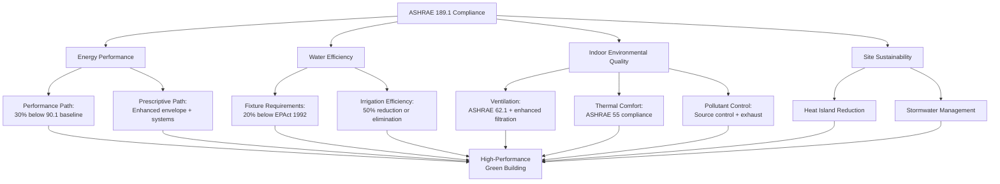

## Overview

ASHRAE Standard 189.1, Standard for the Design of High-Performance Green Buildings, establishes minimum requirements for sustainable building design, construction, and operation. This comprehensive standard integrates site sustainability, water use efficiency, energy performance, indoor environmental quality, and materials selection into a single prescriptive code.

ASHRAE 189.1 serves as both a standalone standard and the technical basis for the International Green Construction Code (IgCC). It provides enforceable requirements that jurisdictions can adopt as mandatory code, distinguishing it from voluntary rating systems like LEED.

## Standard Structure

The standard addresses six core performance areas:

**Site Sustainability**: Limits development on sensitive sites, promotes stormwater management, reduces heat island effect, and protects habitat.

**Water Use Efficiency**: Establishes maximum flow rates and flush volumes for fixtures and irrigation systems, reducing potable water consumption by 30-40% compared to baseline.

**Energy Efficiency**: Requires performance 30% better than ASHRAE 90.1 Appendix G baseline for most building types, with prescriptive pathways for smaller projects.

**Indoor Environmental Quality (IEQ)**: Mandates minimum ventilation rates per ASHRAE 62.1, source control of pollutants, thermal comfort compliance, and acoustic performance criteria.

**Materials and Resources**: Requires environmentally preferable materials, construction waste management, and refrigerant impact limitations.

**Construction and Plans for Operation**: Establishes commissioning requirements, documentation standards, and provisions for ongoing performance.

## Energy Efficiency Requirements

ASHRAE 189.1 energy provisions exceed Standard 90.1 through multiple pathways:

**Performance Path**: Whole-building energy cost 30% below ASHRAE 90.1-2010 Appendix G baseline (varies by building type and climate zone). This approach provides design flexibility while ensuring significant energy savings.

**Prescriptive Path**: Enhanced envelope insulation, lighting power density reductions, HVAC efficiency minimums, and mandatory economizers where applicable. Prescriptive requirements typically result in 20-25% energy savings.

**HVAC-Specific Requirements**:
- Economizer requirements in climate zones 3B-8
- Demand-controlled ventilation for spaces >500 ft² with density >40 people/1000 ft²
- Energy recovery where outdoor air exceeds 70% of supply air
- Fan power limitations 30% below ASHRAE 90.1
- Duct and pipe insulation R-values increased 20-30%
- Hydronic system balancing and control optimization

## Water Use Efficiency

Water conservation requirements address indoor fixtures, outdoor irrigation, and process water:

**Indoor Water Use**: Maximum flow rates 20% below Energy Policy Act 1992 baseline:
- Lavatory faucets: 1.5 gpm (vs. 2.2 gpm baseline)
- Showerheads: 2.0 gpm (vs. 2.5 gpm baseline)
- Water closets: 1.28 gpf (vs. 1.6 gpf baseline)
- Urinals: 0.5 gpf (vs. 1.0 gpf baseline)

**Irrigation Efficiency**: Landscape water use reduced by 50% through efficient irrigation technology, climate-appropriate plant selection, and soil amendments. High-efficiency systems include drip irrigation, soil moisture sensors, and weather-based controllers.

**HVAC Water Systems**: Cooling towers must achieve minimum cycles of concentration, limiting blowdown water waste. Evaporative coolers require water management systems preventing continuous bleed.

## Indoor Environmental Quality (IEQ)

IEQ provisions ensure occupant health, comfort, and productivity:

**Ventilation Requirements**: Minimum outdoor air rates per ASHRAE 62.1, with enhanced filtration (MERV 13 minimum vs. MERV 8 baseline). Demand-controlled ventilation required for high-density spaces, optimizing air quality while reducing energy consumption.

**Thermal Comfort**: Design must comply with ASHRAE 55, providing thermal comfort for 80% of occupants. Systems must maintain temperature and humidity within prescribed ranges.

**Pollutant Source Control**:
- Low-emitting materials specifications
- Exhaust directly adjacent to source (printers, kitchens, restrooms)
- Isolation of high-pollutant areas with negative pressurization
- CO monitoring in parking areas with automatic ventilation control

**Acoustic Performance**: Maximum background noise levels specified by space type (NC 35 for classrooms, NC 40 for open offices). HVAC systems must incorporate silencers, acoustic duct lining, or other attenuation methods.

**Daylighting and Lighting Control**: Automatic lighting controls required, reducing HVAC cooling loads from lighting heat gain.

## Comparison with Other Green Standards

| Criterion | ASHRAE 189.1 | LEED v4 BD+C | IgCC 2018 | CALGreen Tier 2 |
|-----------|--------------|--------------|-----------|------------------|
| **Standard Type** | Prescriptive code | Rating system | Prescriptive code | Prescriptive code |
| **Energy Performance** | 30% below 90.1 | Credits 5-18 pts | 189.1 or prescriptive | 15% below Title 24 |
| **Water Reduction** | 30-40% indoor 50% outdoor | 30% indoor 50% outdoor | 189.1 requirements | 20% indoor reduction |
| **Ventilation** | ASHRAE 62.1 + MERV 13 | 62.1 + enhanced monitoring | 189.1 requirements | 62.1 baseline |
| **Commissioning** | Enhanced Cx required | Fundamental + Enhanced Cx | Enhanced Cx | Functional testing |
| **Enforcement** | Code-enforceable | Voluntary certification | Code-enforceable | Code-enforceable (CA) |
| **Flexibility** | Limited | High (points menu) | Moderate | Limited |

## Integration with LEED

ASHRAE 189.1 compliance provides substantial progress toward LEED certification:

**Direct LEED Prerequisites Met**:
- Energy & Atmosphere prerequisite (minimum energy performance)
- Water Efficiency prerequisite (indoor water use reduction)
- Indoor Environmental Quality prerequisites (minimum IAQ, environmental tobacco smoke control)

**LEED Credits Earned**: Projects meeting 189.1 typically achieve 35-45 LEED points across multiple categories, approaching LEED Gold level. Additional optimization beyond 189.1 minimums yields further credits.

**Complementary Use**: Many jurisdictions adopt 189.1 as baseline code while projects pursue LEED certification for market differentiation, demonstrating performance beyond minimum requirements.

## Materials and Resources Impact

The standard addresses environmental impacts of materials selection and construction practices:

**Refrigerant Management**: Total building GWP and ODP limits based on refrigerant charge and equipment life. Systems must use lower-impact refrigerants (R-410A, R-134a preferred over R-22).

**Construction Waste Management**: Minimum 50% diversion of construction and demolition waste from landfills through recycling and salvage.

**Materials Selection**: Preference for recycled content, regional materials, and certified wood products, reducing embodied carbon and transportation impacts.

## Compliance Pathways

Projects can demonstrate compliance through three primary methods:

**Prescriptive Compliance**: Follow all mandatory provisions plus prescriptive requirements in each section. Suitable for straightforward projects with standard occupancy patterns.

**Performance Compliance**: Demonstrate equivalent or superior performance through energy modeling, water use calculations, and IAQ analysis. Provides flexibility for innovative designs.

**Outcome-Based Compliance**: Demonstrate actual measured performance for one year post-occupancy. Requires robust monitoring systems but validates real-world achievement.

## Implementation Considerations

Successful ASHRAE 189.1 compliance requires integrated design:

**Early-Stage Planning**: Involve HVAC engineers during conceptual design to optimize system selection, sizing, and integration with envelope and lighting systems.

**Energy Modeling**: Performance path requires detailed modeling per Appendix G protocols, establishing baseline and proposed building energy consumption.

**Commissioning**: Enhanced commissioning verifies all systems perform as designed. Begin commissioning during design phase, continuing through construction and into occupancy.

**Documentation**: Maintain comprehensive records demonstrating compliance with each section. Documentation supports code approval and future operation.

**Cost Implications**: Incremental costs typically 2-4% for new construction, offset by 25-40% operational cost savings from reduced energy and water consumption.

## Future Development

ASHRAE 189.1 undergoes continuous improvement on a 3-year revision cycle:

**Zero Energy Alignment**: Future versions will progress toward net-zero energy performance, aligning with Architecture 2030 targets and state zero-energy mandates.

**Climate Adaptation**: Enhanced resilience provisions addressing extreme weather, grid interruption, and climate change impacts on building systems.

**Health-Focused IEQ**: Expanded requirements for air quality monitoring, pathogen control, and wellness-oriented environmental conditions, reflecting post-pandemic priorities.

**Refrigerant Phase-Down**: Accelerated transition to ultra-low GWP refrigerants, supporting international climate commitments under the Kigali Amendment.

## Components

- Site Sustainability
- Water Use Efficiency
- Energy Efficiency Enhanced
- Indoor Environmental Quality
- Materials Resources Impacts
- Construction Plans Specifications
