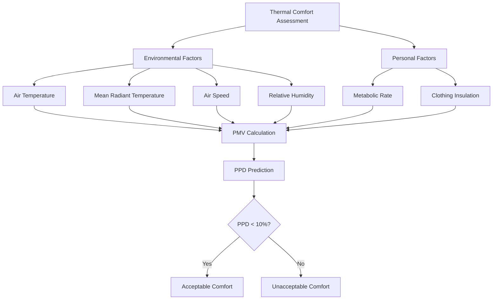

ASHRAE Standard 55, "Thermal Environmental Conditions for Human Occupancy," establishes the combinations of indoor thermal environmental and personal factors that produce acceptable thermal environmental conditions for a majority of occupants. This standard applies to healthy adults engaged in sedentary to moderate physical activity and applies to indoor spaces designed for human occupancy for periods exceeding 15 minutes.

## Thermal Comfort Parameters

Thermal comfort assessment requires six primary parameters divided into environmental and personal factors.

**Environmental Parameters:**
- Air temperature (dry-bulb)
- Mean radiant temperature
- Air speed
- Relative humidity

**Personal Parameters:**
- Metabolic rate (met)
- Clothing insulation (clo)

## Metabolic Rate

Metabolic rate represents the body's energy production from cellular metabolism, expressed in met units where 1 met = 58.2 W/m². This corresponds to the metabolic rate of a sedentary person at rest.

| Activity | Metabolic Rate (met) | Metabolic Rate (W/m²) |
|----------|---------------------|----------------------|
| Reclining | 0.8 | 47 |
| Seated, quiet | 1.0 | 58 |
| Seated, light work (office) | 1.2 | 70 |
| Standing, relaxed | 1.2 | 70 |
| Light activity (walking slowly) | 1.6 | 93 |
| Medium activity (walking 3 mph) | 2.0 | 116 |
| High activity (exercise) | 3.0-4.0 | 175-232 |

The metabolic rate directly influences thermal sensation. Higher metabolic rates increase heat generation, requiring lower ambient temperatures to maintain thermal neutrality.

## Clothing Insulation

Clothing insulation is measured in clo units, where 1 clo = 0.155 m²·K/W. This represents the insulation provided by typical business attire.

| Clothing Ensemble | Insulation (clo) | Insulation (m²·K/W) |
|-------------------|------------------|---------------------|
| Nude | 0 | 0 |
| Shorts | 0.3 | 0.047 |
| Light summer clothing | 0.5 | 0.078 |
| Typical business suit | 1.0 | 0.155 |
| Heavy winter indoor clothing | 1.5 | 0.233 |

Clothing insulation values are additive. Each garment contributes to total insulation:

$$I_{cl,total} = \sum_{i=1}^{n} I_{cl,i}$$

Where $I_{cl,i}$ represents the insulation of each individual garment.

## Operative Temperature

Operative temperature ($t_o$) combines air temperature and mean radiant temperature into a single value, representing the uniform temperature of an imaginary enclosure with which an occupant exchanges the same heat by radiation and convection as in the actual environment.

For air speeds less than 0.2 m/s (40 fpm):

$$t_o = \frac{t_a + t_r}{2}$$

For air speeds between 0.2 and 0.6 m/s:

$$t_o = A \cdot t_a + (1-A) \cdot t_r$$

Where:
- $t_o$ = operative temperature (°C)
- $t_a$ = air temperature (°C)
- $t_r$ = mean radiant temperature (°C)
- $A$ = coefficient dependent on air speed

For most HVAC design applications with low air movement, the simple average suffices. Operative temperature provides a more meaningful metric for thermal comfort than air temperature alone, particularly in spaces with significant radiant heat sources or cold surfaces.

## PMV and PPD Models

The Predicted Mean Vote (PMV) and Predicted Percentage Dissatisfied (PPD) models, developed by P.O. Fanger and standardized in both ASHRAE 55 and ISO 7730, predict thermal sensation based on steady-state heat balance.

### PMV Calculation

The PMV equation predicts the mean thermal sensation vote on the ASHRAE thermal sensation scale:

$$PMV = [0.303 \cdot e^{-0.036M} + 0.028] \cdot L$$

Where $L$ represents the thermal load on the body:

$$L = (M - W) - 3.05 \times 10^{-3}[5733 - 6.99(M-W) - p_a]$$
$$- 0.42[(M-W) - 58.15] - 1.7 \times 10^{-5}M(5867 - p_a)$$
$$- 0.0014M(34 - t_a) - 3.96 \times 10^{-8}f_{cl}[(t_{cl} + 273)^4 - (t_r + 273)^4]$$
$$- f_{cl}h_c(t_{cl} - t_a)$$

Where:
- $M$ = metabolic rate (W/m²)
- $W$ = external work (W/m²), typically zero for most activities
- $p_a$ = water vapor partial pressure (Pa)
- $t_a$ = air temperature (°C)
- $t_r$ = mean radiant temperature (°C)
- $t_{cl}$ = clothing surface temperature (°C)
- $f_{cl}$ = clothing area factor
- $h_c$ = convective heat transfer coefficient (W/m²·K)

### PPD Calculation

The PPD predicts the percentage of thermally dissatisfied occupants:

$$PPD = 100 - 95 \cdot e^{-(0.03353 \cdot PMV^4 + 0.2179 \cdot PMV^2)}$$

ASHRAE 55 requires PPD ≤ 10%, corresponding to -0.5 ≤ PMV ≤ +0.5 for acceptable thermal environments.

## Comfort Zone Boundaries

ASHRAE 55 defines acceptable ranges for operative temperature based on metabolic rate, clothing insulation, and humidity.

### Summer Conditions (0.5 clo)

| Activity Level | Operative Temperature Range (°C) | Operative Temperature Range (°F) |
|----------------|----------------------------------|----------------------------------|
| 1.0 met (sedentary) | 24.5 - 28.0 | 76 - 82 |
| 1.2 met (light activity) | 23.5 - 27.0 | 74 - 80 |

### Winter Conditions (1.0 clo)

| Activity Level | Operative Temperature Range (°C) | Operative Temperature Range (°F) |
|----------------|----------------------------------|----------------------------------|
| 1.0 met (sedentary) | 20.0 - 23.5 | 68 - 74 |
| 1.2 met (light activity) | 19.0 - 22.5 | 66 - 72 |

**Humidity Constraints:**
- Dew point temperature: 0°C to 18°C (32°F to 64°F)
- Relative humidity: No upper limit for comfort (condensation and microbial growth limit at ~70%)

**Air Speed:**
- Still air condition: ≤ 0.15 m/s (30 fpm)
- Elevated air speeds allowed at higher temperatures for increased cooling effect

## Adaptive Comfort Model

For naturally conditioned spaces, ASHRAE 55 provides an adaptive comfort model recognizing that occupants adapt to outdoor climate variations. The acceptable operative temperature depends on the prevailing mean outdoor temperature:

$$t_{comf} = 0.31 \cdot t_{pma(out)} + 17.8$$

Where:
- $t_{comf}$ = comfort temperature (°C)
- $t_{pma(out)}$ = prevailing mean outdoor air temperature (°C)

Acceptable ranges extend ±3.5°C (±6.3°F) from the comfort temperature for 80% acceptability and ±2.5°C (±4.5°F) for 90% acceptability. This model applies only to naturally conditioned spaces where occupants have control over operable windows and clothing adjustments.

## Local Thermal Discomfort

Beyond whole-body thermal comfort, ASHRAE 55 addresses local discomfort factors:

**Vertical Air Temperature Difference:** Maximum 3°C (5.4°F) between ankle (0.1 m) and head (1.1 m) levels for seated occupants.

**Radiant Temperature Asymmetry:**
- Warm ceiling: < 5°C (9°F)
- Cool wall: < 10°C (18°F)
- Cool ceiling: < 14°C (25°F)
- Warm wall: < 23°C (41°F)

**Floor Surface Temperature:** 19-29°C (66-84°F) for occupied spaces with appropriate footwear.

**Draft Risk:** Air speed variations should not exceed specified limits based on local turbulence intensity and mean air speed to prevent draft sensation.

## Application in HVAC Design

ASHRAE 55 compliance requires design consideration of all six thermal comfort parameters. HVAC systems must maintain operative temperatures within acceptable ranges while controlling humidity, minimizing drafts, and limiting radiant asymmetry. The standard permits trade-offs between parameters—elevated air speed can compensate for higher temperatures, and lower humidity extends acceptable temperature ranges.

For mechanically conditioned buildings, designers typically target PMV = 0 (thermal neutrality) with PPD ≤ 10%, ensuring 90% occupant satisfaction. Critical applications may target stricter criteria with PPD ≤ 6% (PMV within ±0.35).
