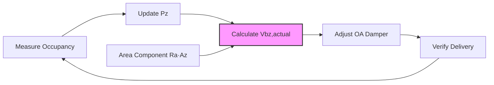

## Breathing Zone Definition

The breathing zone constitutes the occupied region of a conditioned space where ventilation effectiveness is evaluated. ASHRAE 62.1 defines this zone as the volume between 3 and 72 inches above the floor and more than 2 feet from walls or fixed air-conditioning equipment. This spatial definition focuses ventilation analysis on the region where occupants actually breathe, excluding floor-level and ceiling-level volumes where air quality has minimal impact on human exposure.

The breathing zone concept recognizes that air distribution systems do not produce uniform contaminant concentrations throughout a space. Temperature stratification, supply air jet characteristics, and return air placement create concentration gradients that vary significantly from floor to ceiling. The breathing zone definition establishes a consistent reference plane for evaluating outdoor air delivery effectiveness.

## Fundamental Equation

The breathing zone outdoor airflow (Vbz) combines two independent ventilation components addressing distinct contaminant sources:

$$V_{bz} = R_p \cdot P_z + R_a \cdot A_z$$

The people component (Rp · Pz) addresses bioeffluents, metabolic CO₂, and occupant-related odors. The area component (Ra · Az) addresses building-related emissions from materials, furnishings, cleaning products, and processes. This dual-component approach acknowledges that indoor air quality depends on both occupancy density and building characteristics.

The equation produces deterministic results requiring four input parameters:
- Rp: outdoor air rate per person (cfm/person)
- Pz: zone population (people)
- Ra: outdoor air rate per unit area (cfm/ft²)
- Az: zone floor area (ft²)

## Ventilation Rate Tables

ASHRAE Standard 62.1 Table 6-1 specifies minimum Rp and Ra values for 63 occupancy categories spanning commercial, institutional, residential, and industrial building types. The table organizes categories by primary function, recognizing that different activities generate different contaminant profiles.

### Selected Ventilation Rates

| Occupancy Category | Rp (cfm/person) | Ra (cfm/ft²) | Default Occupant Density (people/1000 ft²) |
|-------------------|-----------------|--------------|-------------------------------------------|
| Office - Break Room | 5 | 0.12 | 25 |
| Office - Conference/Meeting | 5 | 0.06 | 50 |
| Office - Main Entry Lobby | 5 | 0.06 | 10 |
| Office - Open Office | 5 | 0.06 | 5 |
| Classroom - Age 5-8 | 10 | 0.12 | 25 |
| Classroom - Age 9+ | 10 | 0.12 | 35 |
| Retail - Sales | 7.5 | 0.12 | 15 |
| Retail - Mall Common Area | 7.5 | 0.06 | 40 |
| Restaurant - Dining | 7.5 | 0.18 | 70 |
| Restaurant - Cafeteria/Fast Food | 7.5 | 0.18 | 100 |
| Gymnasium - Playing Floor | 20 | 0.06 | 30 |
| Gymnasium - Spectator Area | 7.5 | 0.06 | 150 |
| Hotel - Bedroom/Suite | 5 | 0.06 | 10 |
| Hotel - Lobby/Pre-function | 7.5 | 0.06 | 30 |
| Theater - Auditorium | 5 | 0.06 | 150 |
| Library - Reading Room | 5 | 0.12 | 10 |

The table reveals systematic patterns in rate assignment. Spaces with intense metabolic activity (gymnasiums, exercise rooms) receive elevated Rp values reflecting higher bioeffluent generation. Spaces with significant material emissions (retail sales, dining) receive elevated Ra values accounting for product off-gassing and process contaminants.

## People Component Analysis

The people component addresses contaminants generated by human metabolism and activity. Adult humans at rest produce approximately 0.3 L/min of CO₂, increasing to 2-3 L/min during vigorous exercise. Metabolic activity also generates heat, moisture, and bioeffluents including volatile organic compounds from respiration and skin emanations.

The Rp · Pz term calculates outdoor airflow required to dilute people-related contaminants to acceptable concentrations. The calculation assumes steady-state conditions where contaminant generation equals removal through outdoor air ventilation plus any air cleaning. The Rp values in Table 6-1 derive from studies correlating occupant dissatisfaction with ventilation rates, establishing empirical relationships between airflow and perceived air quality.

**Example - Conference Room:**

A 600 ft² conference room accommodates 30 occupants (50 people/1000 ft²):
- Rp = 5 cfm/person
- Pz = 30 people

People component:
$$R_p \cdot P_z = 5 \times 30 = 150\ \text{cfm}$$

This flow rate maintains CO₂ concentrations below 700 ppm above outdoor levels (approximately 1100 ppm total with 400 ppm outdoor baseline).

## Area Component Analysis

The area component addresses emissions from building materials, furnishings, equipment, and cleaning products. New buildings off-gas significantly higher contaminant loads than older buildings, though material selection and ventilation during construction can reduce initial concentrations. Carpet, paint, adhesives, and composite wood products represent primary emission sources.

The Ra · Az term provides baseline ventilation independent of occupancy, ensuring adequate dilution of building-related sources. The Ra values reflect typical emission rates for different space categories, with higher values assigned to spaces with intensive material usage or process emissions.

**Example - Conference Room Continued:**

For the same 600 ft² conference room:
- Ra = 0.06 cfm/ft²
- Az = 600 ft²

Area component:
$$R_a \cdot A_z = 0.06 \times 600 = 36\ \text{cfm}$$

Total breathing zone outdoor airflow:
$$V_{bz} = 150 + 36 = 186\ \text{cfm}$$

The people component dominates (81% of total) due to high occupant density, typical for conference spaces.

## Occupancy Density Considerations

The default occupant density values in Table 6-1 provide typical design guidance when specific occupancy data is unavailable. Designers may use actual anticipated densities when documented by building programs or code requirements. Higher densities increase the people component proportionally while leaving the area component unchanged.

The relationship between occupancy density and total Vbz follows:

$$V_{bz} = R_p \cdot \left(\frac{\rho \cdot A_z}{1000}\right) + R_a \cdot A_z = \left(\frac{R_p \cdot \rho}{1000} + R_a\right) \cdot A_z$$

Where ρ represents occupant density in people/1000 ft². This formulation reveals that total ventilation rate per unit area increases linearly with occupancy density.

**Density Impact Example:**

For a 1,000 ft² open office with varying densities:

| Scenario | Density (people/1000 ft²) | Pz | People Component (cfm) | Area Component (cfm) | Total Vbz (cfm) | Unit Rate (cfm/ft²) |
|----------|---------------------------|----|-----------------------|---------------------|-----------------|-------------------|
| Low Density | 5 | 5 | 25 | 60 | 85 | 0.085 |
| Default | 10 | 10 | 50 | 60 | 110 | 0.110 |
| High Density | 15 | 15 | 75 | 60 | 135 | 0.135 |
| Very High | 20 | 20 | 100 | 60 | 160 | 0.160 |

Doubling occupancy from 5 to 10 people/1000 ft² increases total ventilation by 29%, while quadrupling density increases requirements by 88%.

## Variable Occupancy Applications

Spaces with highly variable occupancy benefit from demand-controlled ventilation (DCV) strategies that adjust Vbz calculations based on actual measured occupancy. CO₂ sensors or occupancy counters provide real-time data enabling dynamic Pz adjustment:

$$V_{bz,actual} = R_p \cdot P_{z,measured} + R_a \cdot A_z$$

The area component remains constant while the people component varies with occupancy. This approach maintains code-minimum ventilation during low occupancy periods while providing adequate outdoor air when occupancy increases.

The control loop continuously adjusts outdoor air delivery matching actual ventilation needs, reducing energy consumption while maintaining IAQ.

## Atypical Occupancy Categories

Certain space types deviate from standard Rp and Ra patterns. Correctional facility cells receive minimum 5 cfm/person despite continuous occupancy, reflecting enhanced security constraints on outdoor air systems. Smoking lounges, though increasingly rare, receive elevated 60 cfm/person rates addressing tobacco combustion products. Spaces housing animals use specialized rates based on animal type and density.

High-occupancy transient spaces including auditoriums, theaters, and transportation terminals use elevated default densities (100-150 people/1000 ft²) while maintaining moderate Rp values (5-7.5 cfm/person). This combination recognizes intense short-duration occupancy without proportional material emission increases.

## Calculation Procedure

The systematic calculation process follows:

1. Identify occupancy category from Table 6-1
2. Extract Rp and Ra values for the category
3. Determine zone floor area Az from architectural drawings
4. Establish zone population Pz from default density or documented occupancy
5. Calculate people component: Rp · Pz
6. Calculate area component: Ra · Az
7. Sum components to obtain Vbz

This deterministic procedure produces consistent results across different designers and projects, supporting code enforcement and peer review.

## Related Topics

- [Ventilation Rate Procedure](../ventilation-rate-procedure/)
- [Zone Air Distribution Effectiveness](../zone-air-distribution-effectiveness/)
- [Multiple Zone Ventilation Efficiency](../multiple-zone-ventilation-efficiency/)
- Demand Controlled Ventilation Systems
- CO₂ Monitoring and Control
- Occupancy Sensing Technologies
