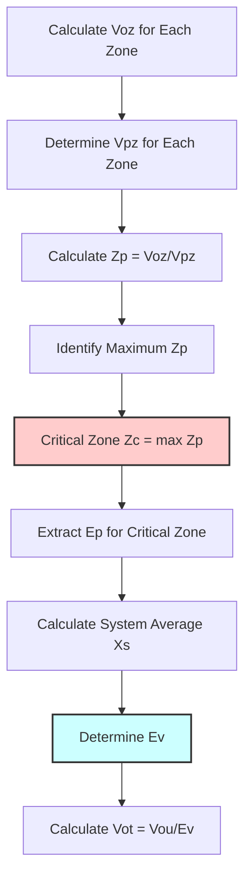

## System Efficiency Concept

System ventilation efficiency (Ev) quantifies the effectiveness with which a multiple zone system distributes outdoor air to individual zones relative to their requirements. The dimensionless factor accounts for the physical reality that systems serving zones with different outdoor air fractions cannot achieve perfect distribution—the zone requiring the highest outdoor air fraction (critical zone) dictates system outdoor air intake, resulting in over-ventilation of zones with lower requirements.

The Ev value represents the ratio of minimum zone primary outdoor air fraction to system outdoor air fraction at the critical zone. Values less than 1.0 indicate distribution inefficiency requiring additional system outdoor air intake beyond the simple sum of zone requirements. Single zone systems and multiple zone systems where all zones have identical outdoor air fractions achieve Ev = 1.0, requiring no additional outdoor air.

## Fundamental Equations

The uncorrected outdoor air intake sums individual zone requirements:

$$V_{ou} = D \cdot \sum_{all\ zones} V_{oz}$$

Where D represents the diversity factor (typically 1.0 unless documented occupancy variations permit reduction). This summation assumes perfect distribution where each zone receives exactly its required outdoor airflow.

The system ventilation efficiency follows:

$$E_v = \frac{1 + X_s - Z_c}{1 + X_s - Z_c \cdot E_p}$$

Where:
- Xs = system average outdoor air fraction = Vou / Vps
- Zc = critical zone outdoor air fraction = max(Zp) for all zones
- Ep = zone primary air fraction at critical zone
- Vps = total system primary airflow (sum of all zone primary airflows)

The corrected system outdoor air intake accounts for distribution inefficiency:

$$V_{ot} = \frac{V_{ou}}{E_v}$$

This value represents the actual outdoor air required at the system intake to satisfy all zone requirements when distribution is imperfect.

## Critical Zone Determination

The critical zone exhibits the highest zone primary outdoor air fraction (Zp), calculated for each zone as:

$$Z_p = \frac{V_{oz}}{V_{pz}}$$

Where Vpz represents zone primary airflow—the outdoor air and recirculated air delivered from the air handling unit, excluding any transfer air from adjacent zones or recirculated air from the same zone. For VAV systems, Vpz varies from minimum to design flow based on thermal loads.

The critical condition typically occurs at minimum airflow when outdoor air fractions reach maximum values. The standard requires evaluating Zp at the condition producing the highest ratio—usually minimum flow for VAV systems, design flow for constant volume systems.

The flowchart illustrates the systematic procedure for identifying the critical zone and calculating system efficiency.

## Zone Primary Air Fraction (Ep)

The zone primary air fraction (Ep) at the critical zone represents the ratio of minimum to design primary airflow for VAV systems:

$$E_p = \frac{V_{pz,min}}{V_{pz,design}}$$

For constant volume systems, Ep = 1.0 since primary airflow remains constant. For VAV systems, Ep typically ranges from 0.3 to 0.5 based on minimum airflow setpoints. Lower Ep values indicate wider turndown ratios, generally reducing Ev and requiring higher system outdoor air intake.

The relationship between Ep and Ev follows inverse patterns. Lower Ep values (greater turndown) reduce Ev because the high outdoor air fraction at minimum flow drives larger discrepancies between critical zone requirements and other zones. Higher Ep values (limited turndown) improve Ev by reducing the spread in outdoor air fractions across operating conditions.

## System Average Outdoor Air Fraction

The system average outdoor air fraction (Xs) represents the ratio of uncorrected outdoor air intake to total system primary airflow:

$$X_s = \frac{V_{ou}}{V_{ps}}$$

Where Vps sums all zone primary airflows:

$$V_{ps} = \sum_{all\ zones} V_{pz}$$

For VAV systems, the calculation uses minimum primary airflows since critical conditions occur at minimum flow. The Xs calculation establishes the baseline outdoor air fraction before correcting for distribution inefficiency.

## Efficiency Calculation Examples

**Example 1 - Three Zone VAV System:**

Consider a VAV system serving three office zones with identical ventilation rates but different sizes:

| Zone | Az (ft²) | Pz | Vbz (cfm) | Ez | Voz (cfm) | Vpz,min (cfm) | Vpz,design (cfm) | Ep |
|------|----------|----|-----------|----|-----------|---------------|------------------|-----|
| 1 | 1,500 | 15 | 165 | 1.0 | 165 | 300 | 750 | 0.40 |
| 2 | 2,000 | 20 | 220 | 1.0 | 220 | 400 | 1,000 | 0.40 |
| 3 | 1,000 | 10 | 110 | 1.0 | 110 | 200 | 500 | 0.40 |

Step 1 - Calculate zone primary outdoor air fractions:
- Z1 = 165/300 = 0.550
- Z2 = 220/400 = 0.550
- Z3 = 110/200 = 0.550

Step 2 - Identify critical zone (all zones equal):
$$Z_c = 0.550$$

Step 3 - Calculate uncorrected outdoor air intake:
$$V_{ou} = 165 + 220 + 110 = 495\ \text{cfm}$$

Step 4 - Calculate total primary airflow:
$$V_{ps} = 300 + 400 + 200 = 900\ \text{cfm}$$

Step 5 - Calculate system average outdoor air fraction:
$$X_s = \frac{495}{900} = 0.550$$

Step 6 - Calculate system ventilation efficiency:
$$E_v = \frac{1 + 0.550 - 0.550}{1 + 0.550 - 0.550 \times 0.40} = \frac{1.0}{1.33} = 0.752$$

Step 7 - Calculate system outdoor air intake:
$$V_{ot} = \frac{495}{0.752} = 658\ \text{cfm}$$

The system requires 658 cfm outdoor air intake, 33% more than the sum of zone requirements due to distribution inefficiency.

**Example 2 - Mixed Occupancy VAV System:**

Consider a system serving different occupancy types with varying outdoor air requirements:

| Zone | Type | Az (ft²) | Pz | Vbz (cfm) | Ez | Voz (cfm) | Vpz,min (cfm) | Vpz,design (cfm) | Zp | Ep |
|------|------|----------|----|-----------|----|-----------|---------------|------------------|----|-----|
| 1 | Office | 2,000 | 20 | 220 | 1.0 | 220 | 500 | 1,200 | 0.440 | 0.417 |
| 2 | Conference | 600 | 30 | 186 | 1.0 | 186 | 400 | 800 | 0.465 | 0.500 |
| 3 | Break Room | 400 | 10 | 98 | 1.0 | 98 | 250 | 500 | 0.392 | 0.500 |

Step 1 - Identify critical zone:
$$Z_c = \max(0.440, 0.465, 0.392) = 0.465\ \text{(Zone 2)}$$

Critical zone Ep = 0.500

Step 2 - Calculate totals:
$$V_{ou} = 220 + 186 + 98 = 504\ \text{cfm}$$
$$V_{ps} = 500 + 400 + 250 = 1,150\ \text{cfm}$$
$$X_s = \frac{504}{1,150} = 0.438$$

Step 3 - Calculate efficiency:
$$E_v = \frac{1 + 0.438 - 0.465}{1 + 0.438 - 0.465 \times 0.500} = \frac{0.973}{1.206} = 0.807$$

Step 4 - Calculate system outdoor air intake:
$$V_{ot} = \frac{504}{0.807} = 624\ \text{cfm}$$

The system requires 624 cfm intake, 24% above summed zone requirements. The higher efficiency (0.807 vs 0.752 in Example 1) results from the smaller spread in Zp values across zones.

## Impact of Design Parameters

Several design parameters significantly influence Ev and resulting system outdoor air requirements:

### Minimum Airflow Ratios

Lower minimum airflow ratios (lower Ep) reduce Ev:

| Ep Value | Ev (for Zc=0.55, Xs=0.55) | Vot/Vou Ratio |
|----------|---------------------------|---------------|
| 0.30 | 0.690 | 1.45 |
| 0.40 | 0.752 | 1.33 |
| 0.50 | 0.810 | 1.23 |
| 0.60 | 0.864 | 1.16 |
| 1.00 (CV) | 1.000 | 1.00 |

Lower turndown ratios require 16-45% additional outdoor air compared to constant volume systems.

### Zone Outdoor Air Fraction Spread

Systems with similar Zp values across zones achieve higher Ev:

| Zp Range | Critical Zc | Xs | Ep | Ev |
|----------|-------------|----|----|-----|
| 0.50-0.52 | 0.52 | 0.51 | 0.40 | 0.961 |
| 0.40-0.60 | 0.60 | 0.50 | 0.40 | 0.833 |
| 0.30-0.70 | 0.70 | 0.50 | 0.40 | 0.750 |

Uniform outdoor air requirements minimize distribution inefficiency.

## Design Strategies for Improved Efficiency

Designers can employ several strategies to improve Ev and reduce system outdoor air intake:

### 1. Zone Grouping

Group zones with similar outdoor air fractions on common systems. Separate high-requirement zones (conference rooms, gymnasiums) from low-requirement zones (storage, mechanical) to reduce Zp spread within each system.

### 2. Dedicated Outdoor Air Systems

Decouple ventilation from thermal loads using dedicated outdoor air systems (DOAS). These systems deliver 100% outdoor air to all zones in proportion to requirements, eliminating distribution inefficiency (Ev = 1.0).

### 3. Increased Minimum Airflows

Raise minimum airflow setpoints (increase Ep) to reduce outdoor air fraction variation. This approach trades fan energy for reduced outdoor air heating/cooling loads.

### 4. Transfer Air

Use transfer air from zones with excess outdoor air to supply adjacent zones, reducing their direct outdoor air requirements and improving system Ev.

## Constant Volume Systems

Constant volume systems achieve Ev = 1.0 when all zones operate continuously. The unchanging airflow ratios eliminate the distribution inefficiency that plagues VAV systems. However, CV systems consume more fan energy and may over-ventilate spaces during partial occupancy.

The simplified calculation for CV systems:

$$V_{ot} = V_{ou} = \sum_{all\ zones} V_{oz}$$

No efficiency correction is required, simplifying outdoor air control and reducing system outdoor air intake compared to equivalent VAV systems.

## Dynamic System Efficiency

VAV systems experience varying Ev as zone airflows modulate with thermal loads. The critical zone may shift between spaces as loads change, complicating outdoor air control. Advanced control systems calculate Ev continuously based on measured airflows and outdoor air fractions, adjusting system intake to maintain minimum ventilation under all conditions.

The dynamic calculation requires:
1. Measure Vpz for each zone
2. Calculate current Zp for each zone
3. Identify current critical zone
4. Calculate current Ev
5. Adjust system outdoor air intake to maintain Vot

This real-time approach optimizes outdoor air delivery, reducing energy consumption while ensuring code compliance.

## Implications for Energy Consumption

Low Ev values substantially increase outdoor air heating and cooling loads. For a system with Ev = 0.75 compared to Ev = 1.0:

Additional outdoor air = 33%
Additional outdoor air load = 33%

In a 100,000 cfm system with 20,000 cfm base requirement:
- Ev = 1.0: Vot = 20,000 cfm
- Ev = 0.75: Vot = 26,667 cfm
- Additional load: 6,667 cfm requiring heating/cooling

This additional airflow increases annual energy consumption proportionally, emphasizing the importance of efficient system design.

## Related Topics

- [Ventilation Rate Procedure](../ventilation-rate-procedure/)
- [Breathing Zone Outdoor Airflow](../breathing-zone-outdoor-airflow/)
- [Zone Air Distribution Effectiveness](../zone-air-distribution-effectiveness/)
- VAV System Design and Control
- Dedicated Outdoor Air Systems
- Critical Zone Analysis Methods
