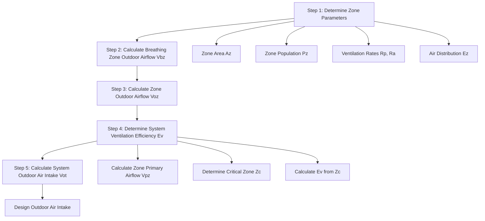

## Procedure Overview

The Ventilation Rate Procedure (VRP) provides the prescriptive methodology for calculating minimum outdoor air requirements in mechanically ventilated commercial buildings. The procedure determines outdoor airflow at three distinct levels: breathing zone, zone supply, and system outdoor air intake. Each calculation stage incorporates factors accounting for air distribution characteristics, system configuration, and operational diversity.

The VRP applies to constant and variable volume systems, single and multiple zone configurations, and systems with or without air recirculation. The procedure accommodates transfer air, demand-controlled ventilation, and energy recovery systems through specific calculation modifications. The methodology produces deterministic results based on occupancy density, floor area, space function, and system architecture.

## Calculation Sequence

The VRP follows a systematic five-step sequence progressing from individual zone requirements to total system outdoor air intake:

Each step builds upon previous calculations, establishing a deterministic pathway from space characteristics to system design requirements. The sequence ensures systematic consideration of all factors affecting outdoor air delivery.

## Step 1: Zone Parameters

The initial step assembles fundamental zone characteristics from architectural and occupancy data. Zone floor area (Az) derives from building plans, excluding unoccupied spaces such as mechanical rooms and storage areas. Zone population (Pz) represents design occupancy, typically obtained from building codes or owner's program requirements.

Ventilation rates per person (Rp) and per unit area (Ra) come from ASHRAE 62.1 Table 6-1 based on occupancy category. Common values include:

| Occupancy Category | Rp (cfm/person) | Ra (cfm/ft²) |
|-------------------|-----------------|--------------|
| Office Space | 5 | 0.06 |
| Conference Room | 5 | 0.06 |
| Classroom | 10 | 0.12 |
| Retail Sales | 7.5 | 0.12 |
| Restaurant Dining | 7.5 | 0.18 |
| Gymnasium | 20 | 0.06 |

The air distribution effectiveness (Ez) derives from Table 6-2 based on system type and operating mode. Typical values range from 0.8 for overhead mixing systems in cooling to 1.2 for floor-based displacement ventilation with thermal plumes.

## Step 2: Breathing Zone Outdoor Airflow

The breathing zone outdoor airflow (Vbz) calculation combines people and area components using the fundamental equation:

$$V_{bz} = R_p \cdot P_z + R_a \cdot A_z$$

This equation establishes the minimum outdoor air requirement at the breathing zone—the region within an occupied space between 3 and 72 inches above the floor and more than 2 feet from walls or fixed air-conditioning equipment.

**Example Calculation:**

For a 2,000 ft² office space with 20 occupants:
- Rp = 5 cfm/person
- Ra = 0.06 cfm/ft²
- Az = 2,000 ft²
- Pz = 20 people

$$V_{bz} = 5 \times 20 + 0.06 \times 2000 = 100 + 120 = 220\ \text{cfm}$$

The breathing zone requires 220 cfm of outdoor air to maintain acceptable indoor air quality.

## Step 3: Zone Outdoor Airflow

The zone outdoor airflow (Voz) accounts for air distribution effectiveness, recognizing that not all supplied outdoor air reaches the breathing zone:

$$V_{oz} = \frac{V_{bz}}{E_z}$$

For the office example with overhead mixing supply (Ez = 1.0 in heating/cooling):

$$V_{oz} = \frac{220}{1.0} = 220\ \text{cfm}$$

If the space used ceiling supply with floor return in cooling (Ez = 0.8):

$$V_{oz} = \frac{220}{0.8} = 275\ \text{cfm}$$

The poor mixing characteristics require 25% additional outdoor air at the zone supply to achieve the same breathing zone concentration.

## Step 4: System Ventilation Efficiency

For multiple zone systems, the system ventilation efficiency (Ev) calculation requires determining zone primary outdoor air fraction for each zone:

$$Z_p = \frac{V_{oz}}{V_{pz}}$$

Where Vpz represents zone primary airflow—the outdoor air and recirculated air from the air handling unit, excluding transfer or recirculated air from the same zone. The critical zone exhibits the highest Zp value:

$$Z_c = \max(Z_{p,all\ zones})$$

The uncorrected outdoor air intake sums all zone requirements:

$$V_{ou} = D \cdot \sum_{all\ zones} V_{oz}$$

The diversity factor D typically equals 1.0 unless occupancy variations are documented. The system ventilation efficiency follows:

$$E_v = \frac{1 + X_s - Z_c}{1 + X_s - Z_c \cdot E_p}$$

Where Xs represents system average outdoor air fraction and Ep denotes zone primary air fraction at the critical zone (typically 1.0 for constant volume systems or the ratio of minimum to design primary airflow for VAV systems).

## Step 5: System Outdoor Air Intake

The final calculation determines system outdoor air intake:

$$V_{ot} = \frac{V_{ou}}{E_v}$$

This value represents the minimum outdoor air required at the system intake to satisfy all zone requirements considering unequal distribution throughout the system.

**Multiple Zone Example:**

Consider a VAV system serving three zones:

| Zone | Az (ft²) | Pz | Vbz (cfm) | Ez | Voz (cfm) | Vpz,min (cfm) | Vpz,design (cfm) |
|------|----------|----|-----------|----|-----------|---------------|------------------|
| 1 | 1,500 | 15 | 165 | 1.0 | 165 | 300 | 600 |
| 2 | 2,000 | 20 | 220 | 1.0 | 220 | 400 | 800 |
| 3 | 1,000 | 10 | 110 | 1.0 | 110 | 200 | 400 |

$$V_{ou} = 165 + 220 + 110 = 495\ \text{cfm}$$

Zone primary outdoor air fractions at minimum flow:
- Z1 = 165/300 = 0.55
- Z2 = 220/400 = 0.55
- Z3 = 110/200 = 0.55

Critical zone: All zones equal (Zc = 0.55)

Assuming Xs = 0.25 and Ep = 300/600 = 0.5 for all zones:

$$E_v = \frac{1 + 0.25 - 0.55}{1 + 0.25 - 0.55 \times 0.5} = \frac{0.70}{0.975} = 0.718$$

$$V_{ot} = \frac{495}{0.718} = 689\ \text{cfm}$$

The system requires 689 cfm outdoor air intake, 39% more than the sum of zone requirements due to distribution inefficiency.

## Special Applications

Single zone systems or multiple zone systems with identical Zp values in all zones achieve Ev = 1.0, requiring outdoor air intake equal to zone requirements. Systems with 100% outdoor air operation (no recirculation) automatically satisfy VRP requirements if total supply airflow meets or exceeds Vou.

Demand-controlled ventilation systems use occupancy sensors or CO₂ monitoring to adjust Vot based on actual occupancy. The standard permits reducing Pz in the Vbz calculation to measured values, decreasing outdoor air intake proportionally. This approach yields significant energy savings in spaces with highly variable occupancy.

Transfer air from adjacent zones with Class 2 air classification may substitute for outdoor air in receiving zones, reducing Vot. The calculation subtracts transfer airflow from Voz in receiving zones, subject to the limitation that transfer air cannot exceed zone outdoor air requirement.

## Design Implementation

Designers specify outdoor air damper minimum positions to deliver Vot under all operating conditions. Variable volume systems require outdoor air flow measurement and control to maintain minimum Vot as supply airflow varies. Economizer controls integrate with minimum ventilation requirements, ensuring Vot delivery during economizer operation.

Proper VRP implementation requires air balancing verification that design outdoor airflow reaches each zone. Testing and balancing procedures measure outdoor air intake, verify damper control sequences, and confirm zone ventilation rates under minimum and design flow conditions.

## Related Topics

- [Breathing Zone Outdoor Airflow](../breathing-zone-outdoor-airflow/)
- [Zone Air Distribution Effectiveness](../zone-air-distribution-effectiveness/)
- [Multiple Zone Ventilation Efficiency](../multiple-zone-ventilation-efficiency/)
- Demand Controlled Ventilation
- Critical Zone Analysis
- VAV System Outdoor Air Control
