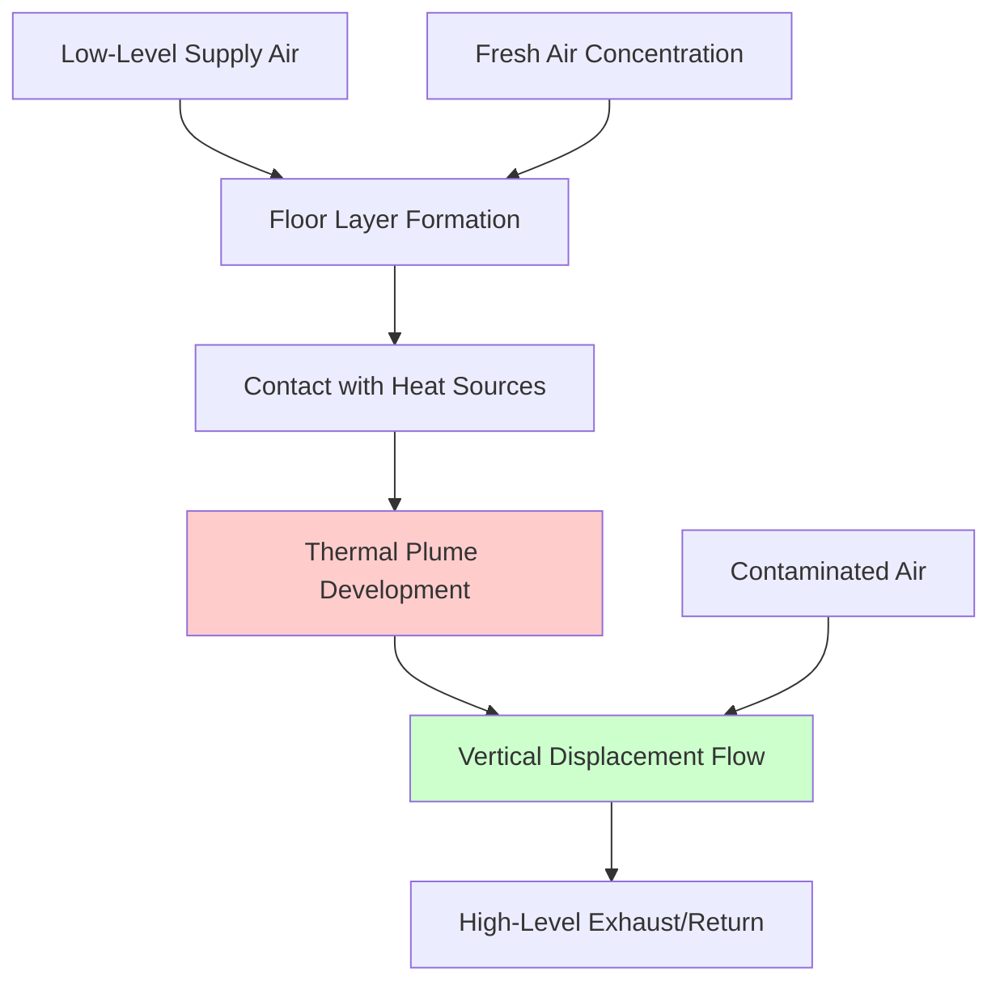

## Effectiveness Definition

Zone air distribution effectiveness (Ez) quantifies how efficiently supplied outdoor air reaches the breathing zone relative to perfect mixing conditions. The dimensionless factor represents the ratio of breathing zone outdoor air concentration to supply air outdoor air concentration. Values less than 1.0 indicate incomplete mixing where breathing zone concentrations fall below supply concentrations. Values greater than 1.0 indicate enhanced delivery where stratification or air distribution patterns concentrate outdoor air in the breathing zone.

The Ez factor addresses the physical reality that air distribution systems create non-uniform concentration fields within conditioned spaces. Temperature differences, supply air momentum, return air location, and heat source distribution all influence mixing effectiveness. The standard assigns Ez values based on system configuration and operating mode, recognizing predictable patterns in air distribution performance.

## Mathematical Framework

The zone outdoor airflow calculation incorporates Ez to adjust breathing zone requirements:

$$V_{oz} = \frac{V_{bz}}{E_z}$$

Where:
- Voz = zone outdoor airflow at the supply air device (cfm)
- Vbz = breathing zone outdoor airflow requirement (cfm)
- Ez = zone air distribution effectiveness (dimensionless)

This relationship establishes that poor air distribution (Ez < 1.0) requires proportionally higher outdoor air supply to achieve target breathing zone concentrations. Conversely, enhanced distribution (Ez > 1.0) permits reduced supply outdoor air fractions while maintaining breathing zone quality.

The outdoor air fraction at the zone supply follows:

$$Z_{oz} = \frac{V_{oz}}{V_z} = \frac{V_{bz}}{E_z \cdot V_z}$$

Where Vz represents total zone supply airflow. Lower Ez values require higher zone outdoor air fractions, increasing system outdoor air requirements and energy consumption.

## Standard Ez Values

ASHRAE 62.1 Table 6-2 specifies Ez values for common system configurations:

| System Configuration | Air Distribution | Ez Value |
|---------------------|------------------|----------|
| Ceiling supply, ceiling return | Mixing | 1.0 |
| Ceiling supply, floor/low return | Cooling mode | 0.8 |
| Ceiling supply, floor/low return | Heating mode | 1.0 |
| Floor supply, ceiling return | Cooling mode | 1.0 |
| Floor supply, ceiling return | Heating mode | 0.7 |
| Underfloor air distribution (UFAD) | Stratified cooling | 1.2 |
| Displacement ventilation | Heat sources present | 1.2 |
| Displacement ventilation | No heat sources | 0.8 |

The values reflect fundamental heat transfer and fluid mechanics principles governing airflow patterns in conditioned spaces.

## Overhead Mixing Systems

Overhead supply with ceiling return represents the most common commercial configuration. Supply air jets entrain room air, creating turbulent mixing that produces relatively uniform temperature and concentration fields. This configuration achieves Ez = 1.0 in both heating and cooling modes when supply and return locate in the ceiling plane.

Overhead supply with floor or low return creates different patterns in heating and cooling. During cooling, cold supply air descends due to negative buoyancy, establishing a strong vertical flow pattern that sweeps through the breathing zone. This configuration achieves Ez = 1.0. However, low returns in cooling with ceiling supply create short-circuit patterns where supply air bypasses portions of the occupied zone, reducing Ez to 0.8.

In heating mode, warm supply air rises due to positive buoyancy, potentially bypassing the breathing zone and flowing directly to ceiling returns. This stratification reduces breathing zone concentrations, lowering Ez to 0.8 for floor returns. Ceiling returns in heating achieve Ez = 1.0 by capturing stratified air after it circulates through occupied zones.

**Example - Office with Floor Returns:**

A 2,000 ft² office requires Vbz = 220 cfm with ceiling supply and floor returns:

Cooling mode (Ez = 0.8):
$$V_{oz} = \frac{220}{0.8} = 275\ \text{cfm}$$

Heating mode (Ez = 1.0):
$$V_{oz} = \frac{220}{1.0} = 220\ \text{cfm}$$

The design must accommodate the higher cooling mode requirement, increasing outdoor air supply by 25% compared to perfect mixing.

## Underfloor Air Distribution

Underfloor air distribution (UFAD) systems deliver conditioned air through floor-mounted diffusers, creating stratified temperature profiles with cool air at floor level and warmer air near the ceiling. This configuration leverages thermal buoyancy to establish predictable airflow patterns. Cool supply air spreads across the floor, warms through contact with heat sources (occupants, equipment, solar gains), and rises into the upper zone.

UFAD systems concentrate outdoor air in the lower occupied zone, enhancing breathing zone delivery. The standard assigns Ez = 1.2, permitting 17% reduction in zone outdoor airflow compared to perfect mixing. The stratification creates a displacement-like effect where fresh air preferentially ventilates the breathing zone before migrating to ceiling exhaust or return locations.

The enhanced effectiveness depends on maintaining appropriate stratification. Supply air temperatures typically range from 63-65°F, approximately 5-7°F below mixed-air systems. Floor-ceiling temperature differentials of 5-9°F are common, with stratification height varying by cooling load intensity and ceiling height.

**UFAD Example:**

Same office space (Vbz = 220 cfm) with UFAD:
$$V_{oz} = \frac{220}{1.2} = 183\ \text{cfm}$$

UFAD reduces zone outdoor airflow by 37 cfm (17%) compared to ceiling supply with floor returns in cooling, decreasing outdoor air heating and cooling loads.

## Displacement Ventilation

Displacement ventilation delivers low-velocity air at or near floor level with temperatures slightly below room temperature (typically 1-4°F below setpoint). The supply air spreads across the floor as a thin layer, warms through contact with heat sources, and rises in localized thermal plumes. These plumes carry contaminants upward in a piston-like displacement flow, exhausting at high level.

The system achieves Ez = 1.2 when heat sources create adequate thermal plumes to establish displacement flow. Occupants, equipment, and solar gains provide necessary buoyancy. The enhanced effectiveness results from fresh air preferentially supplying the lower breathing zone while contaminated air rises and exhausts without mixing back into occupied regions.

Displacement ventilation effectiveness degrades without sufficient heat sources to drive vertical airflows. Spaces with minimal internal gains or dominant cooling loads from envelope conduction may not establish stable displacement patterns. The standard assigns Ez = 0.8 for displacement systems without adequate heat sources, recognizing that the configuration then operates as an inefficient mixing system.

## System Selection Impact

The choice of air distribution system significantly affects outdoor air requirements and associated energy consumption:

| System Type | Ez | Voz for Vbz=220 cfm | % Change from Baseline |
|-------------|----|--------------------|------------------------|
| Ceiling/Ceiling - Baseline | 1.0 | 220 cfm | 0% |
| Ceiling/Floor Cooling | 0.8 | 275 cfm | +25% |
| Floor/Ceiling Heating | 0.7 | 314 cfm | +43% |
| UFAD Cooling | 1.2 | 183 cfm | -17% |
| Displacement with Heat | 1.2 | 183 cfm | -17% |

Poor distribution patterns (Ez = 0.7-0.8) increase outdoor air requirements by 25-43%, substantially increasing heating and cooling energy. Enhanced distribution (Ez = 1.2) reduces requirements by 17%, offering energy savings particularly valuable in extreme climates.

## Design Considerations

Designers must verify that assumed Ez values align with actual system configurations and operating modes. Mixed systems using both heating and cooling require evaluation at both conditions, selecting the lower Ez value (higher Voz) for design calculations. Year-round analysis determines the controlling condition.

Spaces with varying load conditions throughout the year may experience different effective Ez values seasonally. Predominately cooling climates with occasional heating emphasize cooling mode Ez values. Cold climates with significant heating seasons must consider heating mode performance. Designers in mixed climates evaluate both conditions, potentially designing for different outdoor air fractions in heating and cooling modes.

## Variable Air Volume Implications

VAV systems modulate zone supply airflow (Vz) based on thermal loads while maintaining minimum outdoor airflow (Voz). The zone outdoor air fraction varies inversely with supply airflow:

$$Z_{oz} = \frac{V_{oz}}{V_z}$$

At minimum airflow conditions, Zoz reaches maximum values, potentially approaching 100% outdoor air. At design airflow, Zoz reaches minimum values. The Ez factor remains constant across the flow range for a given operating mode, though the outdoor air fraction varies continuously.

**VAV Example:**

Office zone with Vbz = 220 cfm, Ez = 0.8 (cooling), Voz = 275 cfm:

| Condition | Vz (cfm) | Zoz (%) |
|-----------|----------|---------|
| Minimum Flow | 300 | 91.7% |
| Part Load | 600 | 45.8% |
| Design Load | 1200 | 22.9% |

The high outdoor air fraction at minimum flow drives ventilation efficiency calculations for multiple zone systems.

## Temperature Stratification Effects

Vertical temperature gradients influence Ez through their impact on buoyancy-driven flows. Stable stratification (warm air over cool air) suppresses vertical mixing, potentially reducing breathing zone ventilation effectiveness. Unstable stratification (cool air over warm air) enhances mixing through convective overturning.

UFAD and displacement systems intentionally create stable stratification, using the thermal structure to preferentially deliver fresh air to occupied zones. The stratification must maintain stability to achieve Ez = 1.2. Excessive cooling loads or poor diffuser design can break down stratification, reverting to mixing patterns with reduced effectiveness.

Overhead mixing systems generally avoid strong stratification, maintaining Ez = 1.0 through turbulent mixing that overcomes buoyancy effects. Very high ceilings (>15 feet) may develop stratification even with overhead mixing, potentially requiring modified Ez values based on detailed analysis.

## Verification and Measurement

Commissioning activities verify that installed systems achieve assumed Ez values through tracer gas testing or CO₂ concentration measurements. These tests compare breathing zone concentrations to supply air concentrations under controlled conditions, calculating actual effectiveness:

$$E_{z,measured} = \frac{C_{supply} - C_{breathing\ zone}}{C_{supply} - C_{outdoor}}$$

Where C represents contaminant concentrations. Measured values within ±10% of assumed values indicate acceptable agreement. Significant deviations require system modifications or outdoor air adjustments to compensate for distribution deficiencies.

## Related Topics

- [Ventilation Rate Procedure](../ventilation-rate-procedure/)
- [Breathing Zone Outdoor Airflow](../breathing-zone-outdoor-airflow/)
- [Multiple Zone Ventilation Efficiency](../multiple-zone-ventilation-efficiency/)
- Underfloor Air Distribution Design
- Displacement Ventilation Systems
- Indoor Air Quality Measurement
