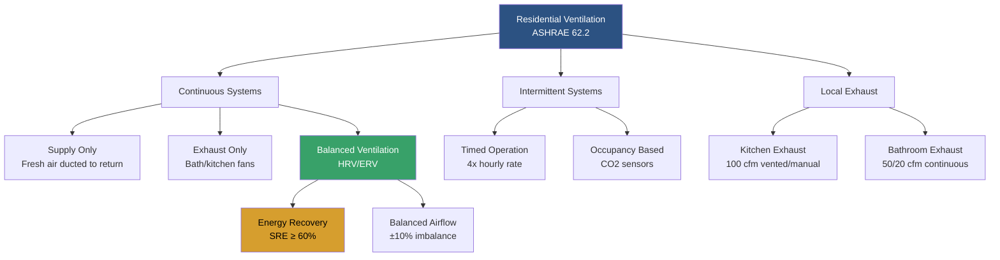

## Overview

ASHRAE Standard 62.2, "Ventilation and Acceptable Indoor Air Quality in Residential Buildings," establishes minimum ventilation rates and other measures for new and existing low-rise residential buildings. The standard addresses whole-building ventilation, local exhaust, source control, and performance verification to maintain acceptable indoor air quality.

The standard applies to single-family homes, multifamily structures of three stories or fewer, manufactured homes, and additions to existing dwellings. It provides a prescriptive path based on floor area and occupancy, ensuring continuous or intermittent ventilation to dilute contaminants from building materials, furnishings, and occupant activities.

## Whole-Building Ventilation Requirements

### Ventilation Rate Calculation

ASHRAE 62.2 specifies the total required ventilation rate using the following formula:

$$Q_{total} = 0.03 \times A_{floor} + 7.5 \times (N_{br} + 1)$$

Where:
- $Q_{total}$ = total required ventilation rate (cfm)
- $A_{floor}$ = conditioned floor area (ft²)
- $N_{br}$ = number of bedrooms (minimum of 1)

For dwelling units with occupant density greater than assumed, an alternative formula applies:

$$Q_{fan} = Q_{total} \times \frac{\phi}{\phi + \eta \times I}$$

Where:
- $Q_{fan}$ = fan flow rate required (cfm)
- $\phi$ = fractional on-time for ventilation system (dimensionless)
- $\eta$ = system efficiency accounting for distribution effectiveness
- $I$ = infiltration credit (cfm)

### Infiltration Credit

The standard allows credit for natural infiltration based on envelope tightness:

$$Q_{inf} = \frac{NL \times A_{floor}}{2.7}$$

Where:
- $Q_{inf}$ = infiltration airflow (cfm)
- $NL$ = normalized leakage (dimensionless)
- $A_{floor}$ = conditioned floor area (ft²)

The infiltration credit reduces the mechanical ventilation requirement but cannot exceed two-thirds of $Q_{total}$.

## Ventilation System Strategies

### Supply Ventilation Systems

Supply-only systems introduce filtered outdoor air directly into the conditioned space or through the central air handler. The outdoor air intake must be located to avoid contamination sources and protected with a rain hood and insect screen. Supply air should be distributed to habitable spaces, not just utility areas.

**Advantages:**
- Pressurizes the building, reducing infiltration of unconditioned air
- Filters incoming air before distribution
- Integrates easily with central forced-air systems

**Disadvantages:**
- May not effectively remove moisture in humid climates
- Higher energy consumption in extreme climates without recovery
- Can pressurize building envelope, potentially driving moisture into wall cavities

### Exhaust Ventilation Systems

Exhaust-only systems depressurize the dwelling by removing air, typically using bathroom or utility room exhaust fans. Makeup air enters through leakage points in the building envelope or dedicated passive inlets.

**Advantages:**
- Lower installed cost
- Simple operation and maintenance
- Effective in cold climates where depressurization minimizes moisture concerns

**Disadvantages:**
- No filtration of incoming air
- May draw air from undesirable locations (crawlspaces, garages)
- Can create backdrafting concerns with combustion appliances
- Uncontrolled air pathways

### Balanced Ventilation Systems

Balanced systems provide equal supply and exhaust airflow, maintaining neutral building pressure. Heat recovery ventilators (HRVs) and energy recovery ventilators (ERVs) transfer sensible heat (HRV) or both sensible and latent energy (ERV) between airstreams.

**Performance Requirements:**
- Airflow balance within ±10% between supply and exhaust
- Sensible recovery effectiveness (SRE) ≥ 60% at 0°F for HRVs in cold climates
- Total recovery effectiveness ≥ 50% for ERVs in humid climates
- Fan efficacy ≥ 1.0 cfm/watt

## Local Exhaust Requirements

### Kitchen Ventilation

ASHRAE 62.2 requires kitchen exhaust with one of the following:

| Configuration | Minimum Requirement |
|--------------|-------------------|
| Vented range hood | 100 cfm intermittent OR 5 air changes per hour (ACH) continuous |
| Downdraft exhaust | 100 cfm intermittent OR 5 ACH continuous |
| Over-the-range microwave | 100 cfm vented to outdoors |
| Remote in-line exhaust | 100 cfm with capture hood |

All kitchen exhaust must terminate outdoors and operate on demand. Recirculating hoods do not satisfy the requirement.

### Bathroom Ventilation

Bathrooms require ventilation per the following table:

| Bathroom Configuration | Continuous (cfm) | Intermittent (cfm) |
|----------------------|-----------------|-------------------|
| Full bathroom (toilet, sink, shower/tub) | 20 | 50 |
| Half bathroom (toilet and sink) | 20 | 50 |
| Powder room (toilet only) | 20 | 50 |

Bathrooms with operable windows of at least 0.5 ft² are exempt from mechanical exhaust requirements in some jurisdictions, though ASHRAE 62.2 still recommends mechanical ventilation for consistent operation.

### Fan Performance

Bathroom and kitchen exhaust fans must be rated and tested per HVI (Home Ventilating Institute) procedures. Installed airflow should be verified at 0.25 inches w.c. static pressure. Fan efficacy requirements ensure energy efficiency:

$$E_{fan} = \frac{Q}{P} \geq 2.8 \text{ cfm/watt}$$

Where:
- $E_{fan}$ = fan efficacy (cfm/watt)
- $Q$ = airflow (cfm)
- $P$ = power consumption (watts)

## Ventilation System Sizing Examples

### Example 1: Single-Family Home

**Given:**
- Floor area: 2,400 ft²
- Bedrooms: 3
- Envelope: Moderate tightness (ACH50 = 5.0)

**Calculate total ventilation rate:**

$$Q_{total} = 0.03 \times 2400 + 7.5 \times (3 + 1) = 72 + 30 = 102 \text{ cfm}$$

**Infiltration credit calculation:**

Normalized leakage from blower door test:
$$NL = \frac{ACH50}{100} = \frac{5.0}{100} = 0.05$$

$$Q_{inf} = \frac{0.05 \times 2400}{2.7} = 44.4 \text{ cfm}$$

Maximum allowable credit = $\frac{2}{3} \times 102 = 68$ cfm

Actual credit = 44.4 cfm (less than maximum, acceptable)

**Required mechanical ventilation:**
$$Q_{mech} = 102 - 44.4 = 57.6 \text{ cfm} \approx 60 \text{ cfm continuous}$$

### Example 2: Tight Construction with HRV

**Given:**
- Floor area: 1,800 ft²
- Bedrooms: 2
- Envelope: Very tight (ACH50 = 1.5)

**Calculate total ventilation rate:**

$$Q_{total} = 0.03 \times 1800 + 7.5 \times (2 + 1) = 54 + 22.5 = 76.5 \text{ cfm}$$

**Infiltration credit:**

$$NL = \frac{1.5}{100} = 0.015$$

$$Q_{inf} = \frac{0.015 \times 1800}{2.7} = 10 \text{ cfm}$$

**Required mechanical ventilation:**
$$Q_{mech} = 76.5 - 10 = 66.5 \text{ cfm} \approx 70 \text{ cfm continuous}$$

For tight construction, a balanced HRV system is recommended to control air pathways and recover energy.

## System Integration and Controls

### Central System Integration

When integrating ventilation with central forced-air systems, the outdoor air intake must meet minimum flow requirements regardless of heating or cooling operation. A motorized damper or fan interlock ensures ventilation air is delivered even when the air handler is not running for thermal conditioning.

### Control Strategies

**Time-Based Controls:**
- Continuous operation at calculated rate
- Intermittent operation at higher rates (typically 4× hourly requirement)
- Scheduled operation during occupied hours

**Demand-Based Controls:**
- CO₂ sensors in bedrooms and living areas
- Humidity sensors for moisture-producing areas
- Occupancy detection for intermittent boost

## Commissioning and Verification

ASHRAE 62.2 requires verification of installed system performance:

1. **Airflow measurement** of whole-building ventilation system
2. **Local exhaust testing** at 0.25 in. w.c. static pressure
3. **Pressure balancing** for balanced systems (±10%)
4. **Sound level verification** (≤1.0 sone for continuous operation)
5. **Control sequence verification** for intermittent systems

Flow measurement methods include flow hoods, powered flow hoods, and manometer-based calculations using duct velocity measurements.

## Components

- Whole House Ventilation Rates
- Local Exhaust Requirements
- Kitchen Exhaust Residential
- Bathroom Exhaust Residential
- Mechanical Ventilation Residential
- Natural Ventilation Residential
