The International Code Council (ICC) publishes the International Codes (I-Codes), a coordinated family of model building codes adopted by most U.S. jurisdictions and numerous international locations. These codes establish minimum requirements for HVAC system design, installation, inspection, and maintenance to protect public health, safety, and welfare.

## I-Code Family Structure

The I-Codes function as an integrated system where provisions from multiple codes apply to a single HVAC installation. Understanding code coordination is essential for compliance.

```mermaid
graph TD
    A[International Building Code IBC] --> B[Administrative Provisions]
    A --> C[Structural Requirements]
    A --> D[Fire Safety]

    E[International Mechanical Code IMC] --> F[HVAC Design]
    E --> G[Duct Systems]
    E --> H[Ventilation]
    E --> I[Equipment Installation]

    J[International Fuel Gas Code IFGC] --> K[Gas Piping]
    J --> L[Gas Appliances]

    M[International Energy Conservation Code IECC] --> N[Equipment Efficiency]
    M --> O[System Controls]
    M --> P[Duct Insulation]

    Q[International Fire Code IFC] --> R[Fire Dampers]
    Q --> S[Equipment Access]
    Q --> T[Smoke Control]

    U[International Plumbing Code IPC] --> V[Condensate Drainage]
    U --> W[Hydronic Piping]

    B --> X[HVAC Project]
    C --> X
    D --> X
    F --> X
    G --> X
    H --> X
    I --> X
    K --> X
    L --> X
    N --> X
    O --> X
    P --> X
    R --> X
    S --> X
    T --> X
    V --> X
    W --> X

    style A fill:#e1f5ff
    style E fill:#ffe1e1
    style M fill:#e1ffe1
    style X fill:#fff4e1
```

## Primary I-Codes for HVAC Systems

| Code | Abbreviation | Primary HVAC Scope | Update Cycle |
|------|--------------|-------------------|--------------|
| International Mechanical Code | IMC | Complete mechanical system design, installation, equipment requirements, ventilation rates, duct systems | 3 years |
| International Building Code | IBC | Structural support, fire-resistance ratings, building occupancy classifications, smoke control | 3 years |
| International Fire Code | IFC | Fire damper maintenance, equipment room access, flame spread ratings, combustible materials | 3 years |
| International Energy Conservation Code | IECC | Equipment efficiency minimums, economizers, duct sealing, controls, insulation requirements | 3 years |
| International Fuel Gas Code | IFGC | Gas furnaces, boilers, unit heaters, gas piping sizing, venting requirements | 3 years |
| International Plumbing Code | IPC | Condensate disposal, hydronic piping, water-source heat pumps, cooling towers | 3 years |
| International Residential Code | IRC | One- and two-family dwelling mechanical systems (alternative to IMC for residential) | 3 years |

## International Mechanical Code (IMC)

The IMC serves as the primary code document for HVAC systems in commercial buildings. It contains comprehensive requirements for:

**Equipment Standards:**
- Furnaces, boilers, air conditioners, heat pumps, refrigeration equipment
- Manufacturer certification to recognized standards (AHRI, UL, CSA)
- Nameplate data and identification requirements

**Ventilation Requirements:**
- Minimum outdoor air rates by occupancy type (references ASHRAE 62.1)
- Natural ventilation provisions
- Mechanical ventilation system design

**Duct System Construction:**
- Material standards by pressure classification
- Sheet metal thickness requirements
- Duct support and seismic bracing
- Fire damper and smoke damper installation locations

**Combustion Air:**
- Indoor combustion air requirements (50 ft³ per 1,000 Btu/hr input)
- Outdoor combustion air openings sizing
- Mechanical combustion air supply provisions

## Code Coordination Requirements

HVAC designers and installers must navigate overlapping provisions from multiple I-Codes:

| System Component | Primary Code | Secondary Codes | Coordination Requirement |
|------------------|--------------|-----------------|--------------------------|
| Rooftop unit structural support | IBC (Chapter 16) | IMC (Section 304) | Structural engineer calculates dead/live loads; IMC requires adequate support |
| Fire damper installation | IMC (Section 607) | IBC (Section 717), IFC | IMC references IBC fire-resistance rating assemblies; IFC governs access and testing |
| Duct insulation | IECC (Section C403.2.7) | IMC (Section 604) | IECC mandates R-values; IMC addresses flame spread and smoke development |
| Gas furnace venting | IFGC (Chapter 5) | IMC (Section 801) | IFGC provides detailed venting tables; IMC establishes general venting principles |
| Economizer requirements | IECC (Section C403.5) | IMC | IECC mandates economizers by climate zone and capacity; IMC addresses damper installation |
| Condensate drainage | IPC (Section 314) | IMC (Section 307) | IPC sizes drainage piping; IMC requires auxiliary drain pans and safety switches |

## ICC Code Development Process

The I-Codes undergo a transparent, consensus-based development process:

**Three-Year Update Cycle:**
1. **Proposal Stage** - Anyone may submit code change proposals (18 months before publication)
2. **Committee Action Hearings** - Technical committees evaluate proposals and make recommendations
3. **Public Comment Period** - Stakeholders comment on committee actions
4. **Government Member Vote** - ICC governmental members cast final votes on contested items
5. **Publication** - New edition published on 3-year cycle (2024, 2027, 2030)

**Code Development Committees:**
- International Mechanical Code Development Committee (IMC-DC)
- International Energy Conservation Code Development Committee (IECC-DC)
- Code correlation activities ensure consistency across I-Codes

**Adoption Process:**
States and local jurisdictions adopt I-Codes through legislative or regulatory action. Jurisdictions may:
- Adopt codes with or without amendments
- Reference specific edition years (often 3-6 years behind current edition)
- Maintain jurisdiction-specific amendments addressing local conditions

## International Energy Conservation Code (IECC)

The IECC establishes minimum energy efficiency requirements for HVAC systems:

**Equipment Efficiency:**
- Minimum efficiency values reference federal standards and ASHRAE 90.1
- Split systems, package units, chillers, boilers must meet or exceed minimums
- Equipment performance certification through AHRI or equivalent

**Mandatory System Provisions:**
- Thermostatic controls with setback capability
- Duct and pipe insulation R-values by location
- Duct air leakage testing (≤4.0 cfm/100 ft² at 0.1 in. w.g.)
- Economizers required for cooling systems ≥54,000 Btu/hr (climate dependent)

**Prescriptive vs. Performance Paths:**
- Prescriptive path follows specific requirements for each component
- Performance path (energy cost budget method) allows tradeoffs between building systems

## IBC and Fire Safety Integration

The International Building Code governs structural and fire safety aspects of HVAC installations:

**Fire-Resistance-Rated Assemblies:**
- Penetrations through fire-resistance-rated assemblies require listed through-penetration firestop systems
- Fire dampers required where ducts penetrate fire walls, fire barriers, fire partitions (IMC references IBC Section 717)

**Smoke Control Systems:**
- IBC Section 909 mandates smoke control for atriums, underground buildings, covered mall buildings
- IMC coordinates with IBC requirements for smoke control system design and acceptance testing

**Combustible Materials:**
- IBC Chapter 8 (Interior Finishes) limits duct material flame spread and smoke development indices
- Class 0 or Class 1 duct materials required in most applications

## Compliance Documentation

Demonstrating I-Code compliance requires comprehensive documentation:

- **Design drawings** showing equipment locations, duct/pipe routing, control sequences
- **Load calculations** (Manual J for residential, block load or HVAC software for commercial)
- **Ventilation calculations** demonstrating compliance with IMC outdoor air requirements
- **Equipment submittals** with manufacturer certification to applicable standards
- **Energy compliance forms** (IECC certificate, COMcheck reports)
- **Special inspection reports** for duct leakage testing, fire damper installation verification

## International Residential Code (IRC)

For one- and two-family dwellings and townhouses up to three stories, the IRC provides an alternative to the IMC:

- **Simplified provisions** appropriate for residential construction
- **Prescriptive requirements** for equipment installation, combustion air, venting
- **Fewer special inspections** compared to commercial IMC applications
- Jurisdictions may require IMC for all buildings or allow IRC for qualifying residential structures

## Relationship to ASHRAE Standards

The I-Codes extensively reference ASHRAE standards:

- **IMC Section 401** - Ventilation rates reference ASHRAE 62.1 (commercial) and 62.2 (residential)
- **IECC** - Equipment efficiency tables mirror ASHRAE 90.1 requirements
- **IMC Section 312** - Refrigeration systems reference ASHRAE 15 safety standard

Understanding both I-Codes and referenced ASHRAE standards is necessary for complete compliance.

---

*The I-Codes represent a coordinated regulatory framework ensuring HVAC systems meet minimum safety, health, and efficiency requirements. Designers and installers must understand code coordination across the I-Code family and stay current with jurisdiction-specific adoption and amendment status.*
