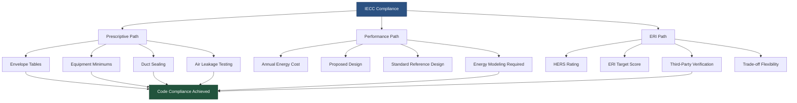

## Overview

The International Energy Conservation Code (IECC) establishes minimum energy efficiency requirements for new residential and commercial buildings. Updated on a three-year cycle, the IECC provides three distinct compliance paths for HVAC systems: prescriptive, performance-based, and Energy Rating Index (ERI). The code divides the United States into eight climate zones (1-8) with sub-designations for moisture regimes, directly impacting HVAC design requirements.

The IECC works in parallel with ASHRAE Standard 90.1 for commercial buildings, often serving as the foundation for state and local energy codes. Understanding IECC compliance is fundamental for HVAC engineers, contractors, and building officials ensuring code-compliant installations.

## Climate Zone Classification

Climate zones determine envelope insulation levels, equipment efficiency minimums, and system design requirements. The IECC defines zones based on heating degree days (HDD) and cooling degree days (CDD):

| Climate Zone | Description | Representative Cities | HDD Base 65°F | CDD Base 50°F |
|--------------|-------------|----------------------|---------------|---------------|
| 1A | Very Hot-Humid | Miami, FL | <900 | >9000 |
| 2A | Hot-Humid | Houston, TX | 900-1800 | 6300-9000 |
| 2B | Hot-Dry | Phoenix, AZ | 900-1800 | 6300-9000 |
| 3A | Warm-Humid | Atlanta, GA | 1800-3600 | 4500-6300 |
| 3B | Warm-Dry | Las Vegas, NV | 1800-3600 | 4500-6300 |
| 3C | Warm-Marine | San Francisco, CA | 1800-3600 | <4500 |
| 4A | Mixed-Humid | New York, NY | 3600-5400 | 2700-4500 |
| 4B | Mixed-Dry | Albuquerque, NM | 3600-5400 | 2700-4500 |
| 4C | Mixed-Marine | Seattle, WA | 3600-5400 | <2700 |
| 5A | Cool-Humid | Chicago, IL | 5400-7200 | 1800-2700 |
| 5B | Cool-Dry | Denver, CO | 5400-7200 | 1800-2700 |
| 6A | Cold-Humid | Minneapolis, MN | 7200-9000 | 900-1800 |
| 6B | Cold-Dry | Helena, MT | 7200-9000 | 900-1800 |
| 7 | Very Cold | Duluth, MN | 9000-12600 | <900 |
| 8 | Subarctic | Fairbanks, AK | >12600 | <900 |

## Compliance Paths

### Prescriptive Path

The prescriptive approach requires strict adherence to minimum efficiency values for each building component without trade-offs. HVAC equipment must meet or exceed minimum AFUE, SEER, HSPF, and EER ratings specified in IECC tables based on equipment type and capacity.

**Residential HVAC Minimum Efficiencies (IECC 2021):**

| Equipment Type | Capacity | Minimum Efficiency | Climate Zone Application |
|----------------|----------|-------------------|--------------------------|
| Central AC | <65,000 Btu/h | 14 SEER2 | All zones |
| Air-Source Heat Pump (Cooling) | <65,000 Btu/h | 14 SEER2 | All zones |
| Air-Source Heat Pump (Heating) | <65,000 Btu/h | 7.5 HSPF2 | All zones |
| Gas Furnace | <225,000 Btu/h | 80% AFUE (90% AFUE in Zones 4C, 5-8) | Zone dependent |
| Boiler (Gas) | <300,000 Btu/h | 90% AFUE | All zones |
| Ductless Mini-Split AC | <36,000 Btu/h | 15 SEER2 | All zones |

### Performance Path

The performance path allows design flexibility through whole-building energy modeling. The proposed design must demonstrate equal or lower annual energy cost compared to a standard reference design using identical geometry but code-minimum components.

The compliance equation:

$$
\text{Energy Cost}_{\text{proposed}} \leq \text{Energy Cost}_{\text{standard}}
$$

For HVAC systems, the performance calculation considers:

$$
Q_{\text{annual}} = \sum_{i=1}^{8760} \left( \frac{Q_{\text{heating},i}}{\text{AFUE}} + \frac{Q_{\text{cooling},i}}{\text{SEER} \times 3.413} + Q_{\text{fan},i} \right)
$$

Where hourly loads account for envelope heat transfer, infiltration, ventilation, internal gains, and solar radiation.

### Energy Rating Index (ERI) Path

The ERI path requires HERS (Home Energy Rating System) certification demonstrating performance relative to a reference home. The target ERI varies by climate zone:

| Climate Zone | Target ERI (2021 IECC) | Maximum ERI Allowed |
|--------------|------------------------|---------------------|
| 1-2 | 54 | 54 |
| 3 | 53 | 53 |
| 4 | 52 | 52 |
| 5 | 51 | 51 |
| 6 | 50 | 50 |
| 7-8 | 49 | 49 |

Lower ERI values indicate better energy performance, with an ERI of 100 representing the reference home and 0 representing net-zero energy.

## Envelope U-Factor Requirements

The building envelope's thermal performance directly impacts HVAC load calculations. The overall heat transfer coefficient through assemblies must not exceed maximum U-factors:

$$
U_{\text{effective}} = \frac{1}{R_{\text{total}}} = \frac{1}{R_{\text{insulation}} + R_{\text{air film}} + R_{\text{materials}}}
$$

For thermal bridging through framing:

$$
U_{\text{assembly}} = \frac{A_{\text{cavity}}}{R_{\text{cavity}}} + \frac{A_{\text{framing}}}{R_{\text{framing}}}
$$

**Maximum Envelope U-Factors (Residential):**

| Component | Zone 1-2 | Zone 3 | Zone 4 | Zone 5 | Zone 6 | Zone 7-8 |
|-----------|----------|--------|--------|--------|--------|----------|
| Roof/Ceiling | U-0.026 | U-0.026 | U-0.026 | U-0.026 | U-0.026 | U-0.026 |
| Above-Grade Wall | U-0.084 | U-0.084 | U-0.060 | U-0.060 | U-0.045 | U-0.045 |
| Basement Wall | U-0.360 | U-0.360 | U-0.059 | U-0.050 | U-0.050 | U-0.050 |
| Slab-on-Grade | F-0.730 | F-0.730 | F-0.540 | F-0.520 | F-0.510 | F-0.434 |
| Fenestration | U-0.50 | U-0.50 | U-0.40 | U-0.32 | U-0.30 | U-0.27 |

## Mechanical System Requirements

Beyond equipment efficiency, the IECC mandates proper installation practices:

- **Duct Sealing**: Total leakage ≤4 cfm per 100 ft² of conditioned floor area at 25 Pa (rough-in test) or ≤8 cfm per 100 ft² (post-construction test)
- **Air Leakage**: Building envelope ≤3 ACH50 (Zones 1-2) or ≤5 ACH50 (Zones 3-8) verified by blower door testing
- **Thermostat**: Programmable or automatic setback capability required
- **Ventilation**: Mechanical ventilation meeting ASHRAE 62.2 with heat/energy recovery in Zones 6-8
- **Economizers**: Required for commercial cooling systems ≥54,000 Btu/h in appropriate climate zones

## Commissioning and Verification

IECC Section R403.3 requires functional testing of HVAC systems:

1. Airflow measurement across heating/cooling coils (±10% of design)
2. Outdoor air ventilation rate verification
3. Thermostat calibration and programming
4. Refrigerant charge verification (±5% of manufacturer specification)

Documentation must demonstrate proper installation per manufacturer specifications and code requirements.

## Relationship to ASHRAE 90.1

For commercial buildings, jurisdictions typically adopt either IECC Commercial Provisions or ASHRAE 90.1. Both codes share similar climate zone definitions and energy modeling methodologies, though ASHRAE 90.1 generally provides more detailed technical requirements for complex mechanical systems. Many jurisdictions reference ASHRAE 90.1 for commercial projects while applying IECC to residential construction.

## Components

- Building Envelope Requirements
- Mechanical Systems Efficiency
- Service Water Heating
- Electrical Power Lighting
- Commissioning Verification Iecc
