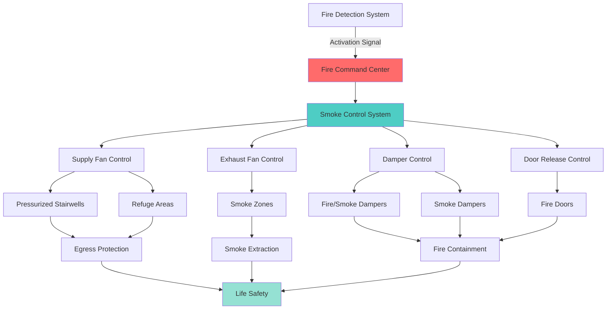

The International Fire Code (IFC) establishes minimum fire safety requirements for existing and new buildings, including critical HVAC system provisions. Published by the International Code Council, the IFC coordinates with the International Mechanical Code to ensure comprehensive fire protection through proper HVAC design, installation, and maintenance.

## Fire Damper Requirements

Fire dampers prevent fire and smoke spread through ductwork penetrating fire-rated assemblies. The IFC mandates specific installations based on assembly ratings and duct characteristics.

### Fire Damper Installation Requirements

| Location | Fire Rating | Damper Type | Actuation Temperature |
|----------|-------------|-------------|----------------------|
| Fire walls | 3-hour | Fire damper | 165°F or 212°F |
| Fire barriers | 1-2 hour | Fire damper | 165°F |
| Horizontal assemblies | 1-2 hour | Fire damper | 165°F |
| Smoke barriers | Varies | Smoke damper | HVAC shutdown |
| Combination barriers | 1-3 hour | Combination damper | 165°F + smoke |
| Shaft enclosures | 2-hour | Fire/smoke damper | 165°F |

### Damper Exemptions

The IFC provides specific exemptions where fire dampers are not required:

- Steel ducts without openings penetrating concrete or masonry with 6-inch minimum embedment
- Ducts within individual residential dwelling units
- Exhaust ducts serving clothes dryers in residential occupancies
- HVAC ducts in detached one- and two-family dwellings
- Ducts serving makeup air systems where redundant protection exists

## Smoke Control Systems

Smoke control systems maintain tenable conditions during fire events by managing smoke movement through mechanical or passive means.

### IFC Smoke Control Requirements

**Atriums and Large Spaces:**
- Natural ventilation: minimum 2.5% of atrium floor area
- Mechanical systems: exhaust capacity based on plume calculations
- Makeup air provisions to maintain pressure differentials
- Separate smoke control zones for areas exceeding 20,000 square feet

**High-Rise Buildings:**
- Stairwell pressurization: 0.10 inch w.c. minimum, 0.35 inch w.c. maximum
- Elevator shaft pressurization for firefighter access
- Automatic activation upon fire alarm system initiation
- Manual override capability at fire command center

**Underground Buildings:**
- Exhaust rate minimum 6 air changes per hour
- Smoke exhaust directly to exterior
- Independent emergency power supply
- Smoke barrier coordination with ventilation zones

## Emergency Ventilation Systems

Emergency ventilation maintains safe conditions during hazardous material releases and fire events.

### Emergency Power Requirements

| System Type | Backup Power | Transfer Time | Runtime |
|-------------|--------------|---------------|---------|
| Smoke control | Required | 10 seconds | 2 hours minimum |
| Fire pump room ventilation | Required | 60 seconds | 2 hours |
| Hazardous material exhaust | Required | 10 seconds | Per hazard analysis |
| Exit stair pressurization | Required | 10 seconds | 2 hours minimum |
| Battery rooms | Required | 60 seconds | Until ventilated |
| Refrigeration machinery | Required | 10 seconds | Until evacuated |

## Hazardous Materials Storage

The IFC establishes ventilation requirements for hazardous materials storage to prevent dangerous accumulations and ensure safe dispersion.

**General Requirements:**
- Mechanical exhaust for all indoor storage areas
- Exhaust rate: 1 CFM per square foot of floor area
- Discharge point: minimum 10 feet from property lines, openings
- Negative pressure relative to surrounding areas
- Corrosion-resistant construction for duct systems

**Special Hazards:**

**Flammable Liquids:**
- Exhaust inlets within 12 inches of floor
- Explosion-proof electrical equipment
- Continuous ventilation or interlocked with occupancy
- Minimum 6 air changes per hour

**Oxidizers and Corrosives:**
- Dedicated exhaust systems (no recirculation)
- Chemical-resistant ductwork and fans
- Separate systems for incompatible materials
- Emergency shutoff accessible from exterior

**Cryogenic Fluids:**
- Oxygen deficiency monitoring
- Mechanical ventilation during dispensing operations
- Emergency exhaust activation upon alarm
- Minimum rate: 1 CFM per 2 square feet

## IFC and NFPA Coordination

The IFC references and coordinates with multiple NFPA standards for comprehensive fire protection:

| IFC Chapter | NFPA Standard | HVAC Application |
|-------------|---------------|------------------|
| Chapter 6 | NFPA 90A | Air conditioning and ventilation systems |
| Chapter 9 | NFPA 13 | Sprinkler system coordination with HVAC |
| Chapter 9 | NFPA 92 | Smoke control systems |
| Chapter 23 | NFPA 96 | Commercial kitchen exhaust systems |
| Chapter 50 | NFPA 318 | Semiconductor fabrication facilities |
| Chapter 60 | NFPA 45 | Laboratory fire protection |

**Key Coordination Points:**

1. **Duct Smoke Detectors:** NFPA 90A placement requirements enforced through IFC
2. **Kitchen Suppression:** NFPA 96 exhaust interlock mandates referenced in IFC Chapter 23
3. **Smoke Management:** NFPA 92 calculation methods adopted for IFC smoke control systems
4. **Clean Agent Systems:** NFPA 2001 requirements for HVAC shutdown during discharge

## Inspection and Maintenance

The IFC mandates periodic inspection and maintenance of fire protection components within HVAC systems:

**Fire Dampers:**
- Initial inspection after installation
- Periodic inspection every 4 years (hospitals: 6 years)
- Inspection after any building modifications affecting fire-rated assemblies
- Documentation maintained for building life

**Smoke Control Systems:**
- Semiannual testing of all components
- Annual testing under simulated fire conditions
- Five-year comprehensive system test
- Immediate testing after modifications or repairs

**Emergency Ventilation:**
- Quarterly operational testing
- Annual capacity verification
- Emergency power transfer testing semiannually
- Alarm and interlock verification quarterly

## Compliance Strategy

Effective IFC compliance for HVAC systems requires:

1. **Early coordination** between mechanical, fire protection, and architectural disciplines
2. **Commissioning** of all fire protection components with documented performance
3. **Training** for building operators on emergency system operation
4. **Documentation** including damper locations, smoke control sequences, and system capacities
5. **Maintenance contracts** ensuring periodic testing and inspection requirements are met

The IFC's comprehensive approach to HVAC fire safety protects life and property through proven engineering principles, mandatory inspection programs, and coordination with established fire protection standards.
