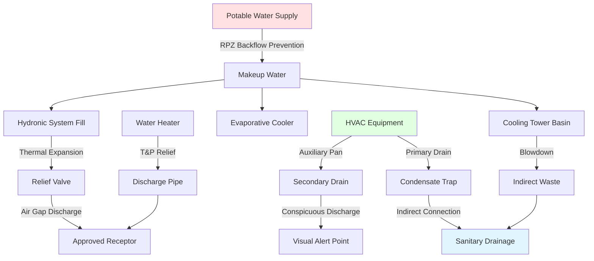

## Overview

The International Plumbing Code (IPC) establishes minimum requirements for plumbing systems that directly interface with HVAC installations. Published by the International Code Council (ICC), the IPC governs water supply, drainage, venting, and fuel gas systems that support heating, cooling, and ventilation equipment. HVAC professionals must understand IPC provisions affecting condensate removal, hydronic distribution, equipment drainage, and water-side components.

## Condensate Drainage Requirements

### Air Conditioning and Refrigeration Equipment

IPC Section 314 addresses condensate disposal from cooling equipment. All condensate must discharge to an approved plumbing fixture, floor drain, or disposal area. Direct connection to the sanitary drainage system requires an indirect waste connection with an air gap or air break to prevent backflow contamination.

**Primary Drain Requirements:**
- Minimum 3/4-inch internal diameter pipe
- Minimum 1/8-inch per foot slope toward discharge
- Trap required with minimum 1-inch seal depth
- Accessible cleanouts at changes in direction exceeding 45 degrees
- Materials: PVC Schedule 40, CPVC, copper, or approved plastic

**Auxiliary Drain Pans:**
For equipment installed above occupied spaces or in concealed locations, IPC mandates secondary protection. Auxiliary drain pans must have minimum 1-1/2-inch depth with 3/4-inch drain connection. The auxiliary drain must discharge to a conspicuous location to alert occupants of primary drain failure.

### Condensate Pump Systems

When gravity drainage proves impractical, condensate pumps provide lift capability. IPC requires:
- Reservoir sized for equipment condensate production rate
- High-water safety switch to shut down equipment before overflow
- Check valve on discharge to prevent backflow
- Discharge to approved indirect waste receptor

## Hydronic Piping Systems

The IPC governs potable water connections to hydronic HVAC systems while mechanical codes typically regulate closed-loop distribution.

### Makeup Water Connections

IPC Section 608.16.3 requires backflow prevention for all connections between potable water supply and non-potable systems:

| System Type | Required Backflow Prevention |
|-------------|------------------------------|
| Closed-loop heating/cooling | Reduced pressure backflow assembly (RPZ) |
| Open cooling towers | Air gap or RPZ assembly |
| Evaporative coolers | Vacuum breaker or RPZ assembly |
| Hydronic snow melting | RPZ assembly |
| Chemical treatment systems | Air gap separation |

### Expansion Tank Relief

Hydronic systems require pressure relief protection per IPC Section 504.6. Relief valves must discharge to an approved indirect waste receptor through an air gap. The discharge pipe shall be:
- Minimum size of relief valve outlet
- Materials rated for 210°F minimum temperature
- Full-size to termination point without reducers
- Visible discharge to alert of relief valve operation

## Water Heater Provisions

IPC Chapter 5 establishes requirements for water heaters serving HVAC applications including domestic hot water coils, radiant heating, and process loads.

### Installation Requirements

| Parameter | IPC Requirement |
|-----------|-----------------|
| Relief valve capacity | Minimum BTU/hr rating equal to water heater input |
| Relief valve setting | Maximum 150 psi and 210°F |
| Temperature/pressure relief | Required on all storage tank heaters |
| Discharge pipe material | Copper, CPVC, approved plastic rated 210°F |
| Discharge termination | 6-24 inches above floor, approved receptor |
| Pan requirement | Required when installed above occupied space |
| Seismic restraint | Strapping per IPC Section 308 in seismic zones |

### Combustion Air and Venting

Water heaters using combustion processes require adequate air supply per IPC Section 701. Standard installations need 50 cubic feet per 1,000 BTU/hr input for combustion and ventilation air combined. Confined spaces require engineered air supply from outdoor sources.

Venting must comply with IPC Chapter 8 requirements for gas appliances and Chapter 9 for oil-fired equipment. Category I appliances require Type B vent with minimum clearances. Condensing appliances use PVC or CPVC vent systems with proper condensate drainage.

## Cooling Tower and Evaporative Equipment

### Blowdown and Overflow Drainage

IPC Section 802.2 requires cooling towers to drain blowdown water through an indirect waste connection. Overflow drains must discharge to an approved location where water discharge creates no hazard or damage.

**Drainage System Sizing:**

| Tower Capacity | Minimum Drain Size |
|----------------|-------------------|
| Up to 10 tons | 1-1/2 inches |
| 10-30 tons | 2 inches |
| 30-60 tons | 3 inches |
| Over 60 tons | 4 inches minimum |

### Water Treatment Chemical Handling

Systems using chemical water treatment require special provisions:
- Chemical feeders connected through air gap or RPZ assembly
- Blowdown discharge pH testing to verify acceptable limits
- Neutralization tanks where required by authority having jurisdiction
- Spill containment for chemical storage areas

## Plumbing-HVAC Interface Points

## Equipment Drainage and Receptor Requirements

### Indirect Waste Connections

IPC Section 802 requires indirect waste connections for equipment that discharge potentially contaminated drainage:
- Air conditioning condensate
- Cooling tower blowdown and overflow
- Relief valve discharge
- Equipment drain pans
- Sterilizers and commercial dishwashers

The indirect connection creates an air gap between equipment discharge and sanitary drainage system, preventing cross-contamination during backflow conditions.

### Floor Drain Sizing

Equipment rooms housing HVAC components require floor drainage sized for potential discharge volumes:
- Minimum 2-inch floor drains in mechanical rooms
- Catch basins for cooling tower overflow
- Trench drains for water heater banks
- Sloped floors toward drainage points (minimum 1/4-inch per foot)

## Fuel Gas Piping (IPC Chapter 12)

The IPC contains comprehensive fuel gas piping requirements as an alternative to the International Fuel Gas Code. Key provisions include:
- Pipe sizing based on longest run and total BTU demand
- Proper support spacing (horizontal runs every 6 feet for steel pipe)
- Sediment traps (drip legs) at each appliance connection
- Gas pressure testing at 1.5 times operating pressure minimum
- Shutoff valves within 6 feet of each appliance

## Code Compliance Inspection Points

### Rough-In Inspection

Inspectors verify before concealment:
- Condensate drain pipe sizing and slope
- Trap installation and seal depth
- Backflow preventer installation orientation
- Piping materials and joint methods
- Support and hanger spacing
- Fuel gas pressure testing results

### Final Inspection

Completed system verification includes:
- Relief valve discharge termination
- Condensate flow testing
- Backflow preventer certification
- Equipment access clearances
- Labeling of shut-off valves
- Operational testing of condensate pumps

## Material Standards Referenced by IPC

The IPC references numerous material standards for components interfacing with HVAC systems:
- ASTM B88: Copper water tube
- ASTM D1785: PVC plastic pipe Schedule 40
- ASTM D2846: CPVC plastic pipe and fittings
- ASTM A53: Steel pipe, black and hot-dipped zinc-coated
- ASSE 1012: Backflow prevention assemblies
- CSA LC-1: Fuel gas piping systems

## Coordination with Mechanical Codes

While the IPC governs water supply and drainage, the International Mechanical Code (IMC) regulates equipment installation, ductwork, and refrigeration systems. Successful HVAC installations require coordination between both codes. The IPC specifically exempts certain closed-loop hydronic systems from plumbing code coverage, deferring to mechanical code authority for distribution piping, expansion tanks, and air elimination devices.

Jurisdictions adopting the I-Codes must clarify which code takes precedence for hybrid systems incorporating both plumbing and mechanical elements. Building departments typically require both plumbing and mechanical permits for comprehensive HVAC projects involving water-side and air-side components.

## Components

- Water Supply Distribution
- Sanitary Drainage Systems
- Venting Systems
- Fixtures Faucets Fixtures
- Water Heaters Ipc
- Fuel Gas Piping Ipc
