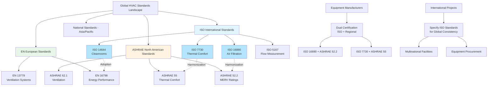

# ISO Standards for HVAC Systems and Applications

The International Organization for Standardization (ISO) develops globally recognized technical standards that establish unified performance criteria, testing methodologies, and classification systems for HVAC equipment and applications. ISO standards provide international harmonization for air filtration efficiency (ISO 16890), cleanroom design and operation (ISO 14644 series), thermal comfort assessment (ISO 7730), flow measurement (ISO 5167), and management systems (ISO 9001, 14001, 50001). These standards enable consistent equipment specifications, facilitate international trade, support regulatory compliance, and establish common technical language across different national frameworks including ASHRAE, EN (European Norms), JIS (Japanese Industrial Standards), and GB (Chinese National Standards).

## Core HVAC Technical Standards

### ISO 16890: Air Filters for General Ventilation

**Standard scope and application:**
ISO 16890 (published 2016) establishes a global testing and classification system for air filters used in general ventilation applications, replacing the previous EN 779 European standard. The standard introduces particulate matter efficiency classifications (ePM) based on filter performance against PM₁, PM₂.₅, and PM₁₀ particles, aligning filtration specifications with outdoor air quality metrics and health-based particle size ranges.

**Filter classification structure:**

| Filter Group | Particle Size Range | Minimum Efficiency | Typical Applications |
|--------------|---------------------|-------------------|---------------------|
| ISO Coarse | > 10 μm | ≥ 50% coarse dust arrestance | Pre-filtration, industrial facilities |
| ISO ePM₁₀ | ≤ 10 μm (PM₁₀) | ≥ 50% at PM₁₀ | General ventilation, commercial buildings |
| ISO ePM₂.₅ | ≤ 2.5 μm (PM₂.₅) | ≥ 50% at PM₂.₅ | Enhanced indoor air quality applications |
| ISO ePM₁ | ≤ 1 μm (PM₁) | ≥ 50% at PM₁ | High-efficiency filtration, hospitals, laboratories |

**Efficiency reporting structure:**
Filters receive numerical efficiency ratings in 5% increments from 50% to 95% for the relevant particle size range. Example designations:

- **ISO ePM₁₀ 50%:** Minimum 50% efficiency for PM₁₀ particles
- **ISO ePM₂.₅ 65%:** Minimum 65% efficiency for PM₂.₅ particles
- **ISO ePM₁ 80%:** Minimum 80% efficiency for PM₁ particles (ultrafine particles)

**Testing protocol requirements:**
- Conditioned filters tested at 0.944 m³/s (3,400 m³/h) airflow
- DEHS (Di-Ethyl-Hexyl-Sebacat) aerosol challenge
- Particle counting in 0.3-10 μm range using optical particle counters
- Initial efficiency and loaded efficiency measurements
- Minimum efficiency rating based on most penetrating particle size

**Global adoption status:**
ISO 16890 has been adopted or recognized in European Union (replacing EN 779), China (GB/T 14295-2019 based on ISO 16890), Australia, and increasingly in North America as supplement to ASHRAE 52.2 MERV ratings. Major filter manufacturers now provide dual ISO 16890/ASHRAE 52.2 performance data.

### ISO 7730: Ergonomics of the Thermal Environment

**Standard purpose:**
ISO 7730 provides analytical methods for determining and interpreting thermal comfort in indoor environments using Predicted Mean Vote (PMV) and Predicted Percentage of Dissatisfied (PPD) indices developed by P.O. Fanger. The standard establishes comfort criteria for moderate thermal environments and supports HVAC system design, setpoint determination, and indoor environmental quality assessment.

**PMV-PPD model parameters:**

The PMV index integrates six fundamental parameters:

**Personal factors:**
- Metabolic rate (met): 0.8 (sleeping) to 4.0+ (heavy exercise)
- Clothing insulation (clo): 0.0 (nude) to 2.0+ (heavy winter clothing)

**Environmental factors:**
- Air temperature: 10-30°C typical comfort range
- Mean radiant temperature: Wall, floor, ceiling surface temperatures
- Air velocity: 0-1.0 m/s typical occupied zone
- Relative humidity: 30-70% recommended range

**Comfort criteria for design:**

| PMV Scale | Thermal Sensation | PPD (% Dissatisfied) | HVAC Design Category |
|-----------|------------------|----------------------|---------------------|
| +3 | Hot | > 95% | Outside comfort zone |
| +2 | Warm | 75% | Outside comfort zone |
| +1 | Slightly warm | 26% | Category C (acceptable) |
| +0.5 | Neutral-warm | 10% | Category B (normal) |
| 0 | Neutral | 5% | Category A (high expectation) |
| -0.5 | Neutral-cool | 10% | Category B (normal) |
| -1 | Slightly cool | 26% | Category C (acceptable) |
| -2 | Cool | 75% | Outside comfort zone |
| -3 | Cold | > 95% | Outside comfort zone |

**Design comfort categories:**

**Category A (PMV: -0.2 to +0.2, PPD < 6%):**
- High level of expectation
- Spaces for sensitive occupants (hospitals, nursing homes)
- Precision control requirements

**Category B (PMV: -0.5 to +0.5, PPD < 10%):**
- Normal level of expectation
- Typical office buildings, schools, residences
- Standard HVAC design target

**Category C (PMV: -0.7 to +0.7, PPD < 15%):**
- Moderate level of expectation
- Warehouses, temporary structures, unconditioned spaces

**Local thermal discomfort factors:**
- Draft rating (DR): Air velocity, temperature, turbulence intensity
- Vertical air temperature difference: < 3°C between head and ankle level
- Floor surface temperature: 19-29°C depending on flooring material
- Radiant temperature asymmetry: < 10°C vertical, < 5°C horizontal

### ISO 14644: Cleanrooms and Controlled Environments

**Standard series structure:**
ISO 14644 comprises 17 parts covering cleanroom classification, testing, monitoring, design, construction, and operation. The standard provides the global framework for contamination control in pharmaceutical manufacturing, semiconductor fabrication, biotechnology, aerospace, and medical device production.

**Airborne particulate cleanliness classes:**

| ISO Class | Maximum Particles/m³ by Size |||||
|-----------|------------|-----------|-----------|-----------|-----------|
| | ≥ 0.1 μm | ≥ 0.2 μm | ≥ 0.3 μm | ≥ 0.5 μm | ≥ 1 μm |
| **ISO 1** | 10 | 2 | — | — | — |
| **ISO 2** | 100 | 24 | 10 | 4 | — |
| **ISO 3** | 1,000 | 237 | 102 | 35 | 8 |
| **ISO 4** | 10,000 | 2,370 | 1,020 | 352 | 83 |
| **ISO 5** | 100,000 | 23,700 | 10,200 | 3,520 | 832 |
| **ISO 6** | 1,000,000 | 237,000 | 102,000 | 35,200 | 8,320 |
| **ISO 7** | — | — | — | 352,000 | 83,200 |
| **ISO 8** | — | — | — | 3,520,000 | 832,000 |
| **ISO 9** | — | — | — | 35,200,000 | 8,320,000 |

**HVAC design requirements by ISO class:**

**ISO 5 (Class 100) example requirements:**
- Air change rate: 240-480 ACH (unidirectional flow preferred)
- Filtration: HEPA H14 (99.995% @ 0.3 μm) terminal filters
- Pressurization: +15 Pa minimum relative to lower class areas
- Temperature control: ±1°C typical
- Humidity control: ±5% RH typical

**ISO 7 (Class 10,000) example requirements:**
- Air change rate: 60-90 ACH (mixed flow acceptable)
- Filtration: HEPA H13 (99.95% @ 0.3 μm) or H14 terminal filters
- Pressurization: +10 Pa minimum relative to lower class areas
- Temperature control: ±2°C acceptable
- Humidity control: ±10% RH acceptable

**ISO 8 (Class 100,000) example requirements:**
- Air change rate: 20-30 ACH
- Filtration: ISO ePM₁ 95% pre-filters + HEPA H13 terminal filters
- Pressurization: +5 Pa minimum relative to uncontrolled areas
- Temperature control: ±2-3°C acceptable
- Humidity control: ±15% RH acceptable

**Monitoring and testing requirements (ISO 14644-2):**
- Particle count testing frequency: Every 6-12 months depending on criticality
- Airflow velocity/volume testing: Annually
- Pressure differential monitoring: Continuous
- HEPA filter integrity testing: Installation and annually
- Recovery time testing: After construction/modification

### ISO 5167: Measurement of Fluid Flow

**Application to HVAC systems:**
ISO 5167 specifies geometry and calculation methods for differential pressure flowmeters including orifice plates, nozzles, and venturi tubes used for airflow and water flow measurement in HVAC distribution systems, chilled water plants, and hydronic heating systems.

**Orifice plate specifications:**
- Beta ratio (β = d/D): 0.10 to 0.75 typical
- Reynolds number requirements: Re > 5,000 for accuracy
- Straight pipe requirements: 10-44D upstream, 4-8D downstream
- Pressure tap configurations: Corner, flange, D and D/2 taps

**Flow calculation:**
Q = C × A × √(2ΔP/ρ)

Where:
- Q = Volumetric flow rate (m³/s)
- C = Discharge coefficient (function of β, Re, tap configuration)
- A = Orifice throat area (m²)
- ΔP = Differential pressure (Pa)
- ρ = Fluid density (kg/m³)

## Management System Standards

### ISO 9001: Quality Management Systems

**Relevance to HVAC industry:**
ISO 9001:2015 establishes requirements for quality management systems applicable to HVAC design firms, equipment manufacturers, contractors, and service providers. Certification demonstrates commitment to consistent quality, customer satisfaction, and continual improvement.

**Key requirements affecting HVAC operations:**
- Document control for design calculations, submittals, O&M manuals
- Competence requirements for technicians and engineers
- Equipment calibration and testing protocols
- Nonconformance and corrective action procedures
- Internal audit programs

### ISO 14001: Environmental Management Systems

**Application to HVAC:**
ISO 14001:2015 provides framework for environmental management applicable to refrigerant handling, energy consumption reduction, waste management, and environmental impact assessment for HVAC projects.

**HVAC-specific environmental aspects:**
- Refrigerant leak prevention and recovery (GWP reduction)
- Energy efficiency optimization (reduced emissions)
- Equipment disposal and recycling
- Construction waste management
- Noise pollution control

### ISO 50001: Energy Management Systems

**HVAC energy management framework:**
ISO 50001:2018 establishes systematic approach to energy performance improvement through measurement, documentation, reporting, and optimization of energy use in HVAC systems.

**Implementation requirements:**
- Energy baseline establishment (building energy use intensity)
- Energy performance indicators (kWh/ton for chillers, W/CFM for fans)
- Operational controls (setpoint management, scheduling)
- Energy procurement strategies
- Performance verification and measurement

**Typical HVAC energy performance indicators:**

| System Type | Energy Performance Indicator | Industry Benchmark |
|------------|----------------------------|-------------------|
| Chilled water plant | kW/ton at design conditions | 0.45-0.65 kW/ton |
| Boiler plant | Annual combustion efficiency | 80-95% |
| Air handling units | Fan system W/CFM | 0.4-0.8 W/CFM |
| Pumping systems | Wire-to-water efficiency | 45-65% |

## International Harmonization and Regional Adoption

### ISO and ASHRAE Standards Relationship

### Harmonization Status by Application Area

**Air filtration standards:**
- **ISO 16890** increasingly adopted globally, replacing regional standards
- **ASHRAE 52.2** remains dominant in North America with MERV ratings
- **EN 779** withdrawn in favor of ISO 16890 (European transition complete)
- Manufacturers provide cross-reference tables: MERV ≈ ePM equivalents

**Thermal comfort assessment:**
- **ISO 7730** PMV-PPD model basis for **ASHRAE 55** adaptive comfort model
- Both standards recognize limitations in naturally ventilated buildings
- **EN 16798-1** adopts ISO 7730 methodology with adaptations
- Regional clothing and metabolic rate assumptions vary

**Cleanroom classification:**
- **ISO 14644** universally adopted for pharmaceutical, semiconductor industries
- **US Federal Standard 209E** officially withdrawn, replaced by ISO 14644
- **EU GMP Annex 1** references ISO 14644 classifications
- **China GB 50073** aligns with ISO 14644 classes

### Regional Standard Equivalencies

**Filter efficiency cross-reference:**

| ISO 16890 | ASHRAE 52.2 | EN 779 (withdrawn) | Application |
|-----------|-------------|-------------------|-------------|
| ISO Coarse | MERV 5-7 | G3-G4 | Pre-filtration |
| ISO ePM₁₀ 50% | MERV 9-10 | M5 | General ventilation |
| ISO ePM₂.₅ 50-70% | MERV 11-13 | M6-F7 | Commercial buildings |
| ISO ePM₁ 50-80% | MERV 14-15 | F8-F9 | Healthcare, laboratories |

**Cleanroom class equivalencies:**

| ISO 14644 | US Fed Std 209E | EU GMP | Typical Application |
|-----------|-----------------|---------|-------------------|
| ISO 5 | Class 100 | Grade A/B | Aseptic processing |
| ISO 7 | Class 10,000 | Grade C | Clean manufacturing |
| ISO 8 | Class 100,000 | Grade D | Packaging areas |

## Compliance and Specification Strategies

**International project specifications:**
When specifying HVAC equipment for multinational facilities, reference both ISO standards and regional requirements:

- Primary reference: ISO standard (ISO 16890, ISO 14644)
- Secondary reference: Local code compliance (ASHRAE, EN, national codes)
- Testing verification: Accredited laboratories following ISO 17025

**Equipment procurement language:**
"Air filters shall meet ISO ePM₁ 70% classification per ISO 16890 testing protocol. Provide documentation showing equivalency to ASHRAE 52.2 MERV rating for North American facilities."

**Design documentation requirements:**
- Thermal comfort calculations per ISO 7730 showing PMV/PPD for design conditions
- Cleanroom classification verification per ISO 14644-3 testing protocols
- Flow measurement device selection per ISO 5167 sizing calculations
- Quality management procedures per ISO 9001 for commissioning activities

**Certification and third-party verification:**
- Filter manufacturers: Eurovent, AHRI, or independent laboratory ISO 16890 test reports
- Cleanroom certification: ISO 14644-2 classification testing by accredited agencies
- Management systems: ISO 9001, 14001, 50001 certification by accredited registrars

## Future Developments and Emerging Standards

**ISO standards under development:**
- ISO 16890 revision addressing ultrafine particles < 0.3 μm
- ISO 14644 parts expansion for biocontamination control
- ISO 52000 series (EPBD energy performance calculation methods)
- Integration of ISO standards with building information modeling (BIM) workflows

**Global convergence trends:**
The HVAC industry continues moving toward unified international standards, reducing regional variation and enabling global supply chains, consistent performance specifications, and simplified compliance verification across markets.

---

**Related sections:**
- ASHRAE Standards and Guidelines
- European EN Standards
- Codes and Regulations Overview
- International Perspectives on HVAC Design
