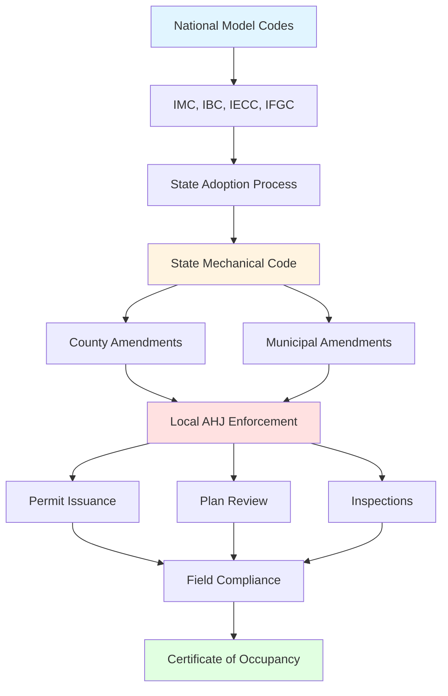

## Overview

Local HVAC regulations represent the most immediate layer of code enforcement, building upon national model codes through state adoption and local amendments. Understanding jurisdictional requirements is essential for legal compliance, as violations can result in failed inspections, project delays, permit revocations, and liability issues. Local authorities having jurisdiction (AHJ) retain the power to modify adopted codes to address climate-specific needs, building density concerns, and regional safety priorities.

## Regulatory Hierarchy

The typical regulatory structure flows from national model codes through state adoption to local amendments:

## State Code Adoption Processes

States employ different mechanisms for adopting and modifying model codes. The three primary approaches are:

**Direct Adoption**: States adopt the most recent edition of model codes (IMC, IBC, IECC) with minimal or no amendments. This approach simplifies multi-jurisdictional projects but may not address state-specific conditions.

**Adoption with Amendments**: States adopt model codes but incorporate amendments addressing climate zones, seismic requirements, energy efficiency mandates, or licensing structures. Amendments typically appear in state administrative codes.

**Custom State Codes**: Some states develop entirely separate mechanical codes, incorporating model code principles while restructuring organization and requirements. California's Title 24 exemplifies this approach, integrating mechanical, energy, and accessibility requirements into a unified framework.

States update codes on varying cycles. Most follow 3-year update intervals aligned with model code publication, but adoption lags range from immediate to 6+ years behind current editions.

## Local Amendments and Variations

Municipalities and counties frequently amend state codes to address local conditions:

- **Climate-specific requirements**: Enhanced insulation minimums, modified equipment sizing factors, or mandatory humidity control in coastal regions
- **Seismic provisions**: Strengthened bracing and anchorage requirements in high-seismic zones beyond state minimums
- **Energy efficiency**: Local stretch codes requiring performance exceeding state energy codes
- **Air quality mandates**: Enhanced ventilation rates, filtration minimums (MERV 13+), or mandatory outdoor air monitoring
- **Equipment restrictions**: Prohibitions on specific refrigerants, fuel types, or combustion appliances
- **Sound ordinances**: Noise level limits (dBA) for outdoor equipment stricter than model codes

Jurisdictions publish amendments in municipal codes, typically organized by chapter corresponding to model code structure (IMC Chapter 3 amendments affect Chapters 3 provisions).

## Permit Requirements

HVAC work requires permits in virtually all jurisdictions, with scope thresholds varying by location.

### Permit Triggers by Jurisdiction Type

| Jurisdiction Type | New Installation | Replacement | Repair | Ductwork Modification | Refrigerant System |
|------------------|------------------|-------------|--------|----------------------|-------------------|
| Major Metropolitan | Always required | ≥5 tons or furnace | If altering capacity | >10% system modification | >50 lbs charge |
| Mid-size City | Always required | ≥3 tons | Code-related repairs | New duct runs | >25 lbs charge |
| Small Municipality | Always required | Fuel-burning equipment | Fuel system repairs | Supply/return additions | Variable |
| County (unincorporated) | Always required | Like-for-like varies | Typically exempt | May be exempt | State minimum |

**Common Exemptions** (verify with local AHJ):
- Portable equipment not requiring utilities
- Like-for-like refrigerant line replacements
- Filter replacements and routine maintenance
- Thermostat replacements (non-zoning systems)
- Duct cleaning without modification

### Application Requirements

Permit applications typically require:

1. **Drawings**: Equipment schedules, floor plans showing equipment/duct locations, riser diagrams, seismic bracing details
2. **Load calculations**: ACCA Manual J (residential) or ASHRAE methodology (commercial)
3. **Equipment specifications**: Cut sheets showing efficiency ratings, capacity, electrical characteristics
4. **Licensing documentation**: Contractor license verification, trade certifications (EPA 608)
5. **Energy compliance**: Code compliance certificates (ResCheck, COMcheck) or performance modeling
6. **Special system documentation**: Commissioning plans for complex systems, fire/smoke damper schedules, controls sequences

## Inspection Processes

HVAC installations undergo phased inspections ensuring code compliance before concealment and final approval.

### Typical Inspection Sequence

**Rough-In Inspection** (before concealment):
- Gas piping pressure testing (typically 3-10 psi for 15+ minutes)
- Refrigerant line routing and sizing verification
- Ductwork installation, sealing (Duct Blaster testing in some jurisdictions)
- Combustion air openings
- Equipment support and seismic bracing
- Clearances to combustibles

**Final Inspection**:
- Equipment installation per manufacturer specifications
- Electrical connections and disconnects
- Condensate drainage and traps
- Venting and termination compliance
- Airflow measurements (residential: ≥350 CFM/ton cooling)
- Combustion safety testing (CO levels, draft)
- Thermostat operation and programming
- Energy code compliance verification
- Labeling (refrigerant type, electrical ratings, filter sizes)

**Special Inspections** (jurisdiction-dependent):
- Duct leakage testing (≤4-6 CFM25/100 sq ft duct surface)
- Building envelope leakage (≤3-5 ACH50)
- Airflow measurement at registers
- Refrigerant charge verification (superheat/subcooling)
- Economizer functional testing
- Building automation system (BAS) commissioning

Failed inspections require correction and re-inspection, with fees assessed per additional visit in most jurisdictions.

## Contractor Licensing Requirements

State and local governments regulate HVAC contractor licensing to ensure competency and consumer protection.

### Licensing Structures by State

| Licensing Model | Description | Examples | Requirements |
|----------------|-------------|----------|--------------|
| State-Only License | Single license valid statewide | FL, TX, CA | State exam, experience (2-5 years), bonding |
| Dual Licensing | State + local licenses required | NY, NJ (some cities) | State qualification + municipal registration |
| County/Municipal | No state license; local only | VA, CO (some areas) | Varies widely by jurisdiction |
| Unrestricted | No specialized HVAC license | WY (electrician license may apply) | General contractor or trade license |

**Common License Classifications**:
- **Residential HVAC**: Systems ≤5 tons, single-family/duplex applications
- **Commercial HVAC**: No tonnage limit, all building types
- **Limited/Journeyman**: Work under master licensee supervision
- **Specialty**: Gas piping, refrigeration-only, sheet metal, duct cleaning

### Typical Licensing Requirements

1. **Experience**: 2-5 years verifiable field experience under licensed supervision
2. **Examination**: Trade knowledge (psychrometrics, load calculation, codes), business/law
3. **Insurance**: General liability ($300,000-$1,000,000), workers compensation
4. **Bonding**: Surety bonds ($5,000-$25,000) protecting consumers
5. **Continuing Education**: 4-16 hours annually on code updates, safety, efficiency

## Regional Variation Examples

**California**: Title 24 requires HERS verification for residential systems, refrigerant charge certification, duct testing, and airflow measurement. Local air quality districts impose additional requirements (South Coast AQMD Rule 1111 for equipment NOx emissions).

**New York City**: Requires NYC Department of Buildings permits distinct from state licensing, special inspections for systems >15,000 CFM, and boiler/pressure vessel inspections by authorized agencies.

**Florida**: State preemption limits local amendments; building departments enforce Florida Building Code-Mechanical with minimal local variation. Product approval requires statewide validation.

**Chicago**: Extensive local amendments to IMC including enhanced seismic bracing, specific venting requirements, and mandatory backflow prevention on hydronic systems.

## Compliance Best Practices

- **Pre-design research**: Contact local building department to obtain amendment lists and permit requirements before design
- **Early permit submittal**: Allow 2-6 weeks for plan review in most jurisdictions
- **Inspection scheduling**: Provide 24-48 hour notice; coordinate with other trades to avoid delays
- **Documentation retention**: Maintain permits, approved drawings, inspection records, and warranty documentation
- **Code official relationships**: Establish professional rapport; seek clarification on unclear requirements before proceeding

Understanding local regulatory requirements prevents costly redesigns, ensures legal compliance, and protects building occupants through verified system safety and performance.
