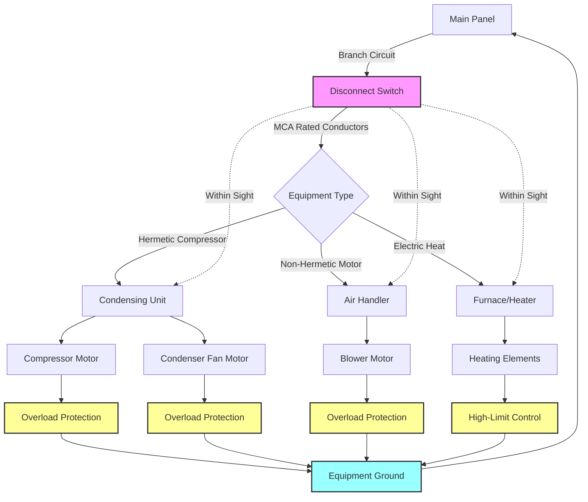

## Overview

NFPA 70, the National Electrical Code (NEC), establishes minimum safety standards for electrical installations in buildings. For HVAC systems, specific articles address motor-driven equipment, appliances, fixed electric heating, and air-conditioning/refrigeration equipment. Compliance ensures electrical safety, proper equipment operation, and protection against electrical hazards.

## Critical NEC Articles for HVAC

**Article 422 - Appliances:** Covers permanently connected HVAC appliances including furnaces, boilers, and duct heaters. Requires disconnecting means within sight or with lockable service equipment.

**Article 424 - Fixed Electric Space-Heating Equipment:** Addresses electric baseboard heaters, radiant heating panels, heating cables, and duct heaters. Mandates branch-circuit sizing, overcurrent protection, and spacing from combustible materials.

**Article 430 - Motors, Motor Circuits, and Controllers:** Establishes general requirements for motor installations. Used for pumps, fans, and non-hermetic compressors. Covers conductor sizing, overload protection, and controller specifications.

**Article 440 - Air-Conditioning and Refrigeration Equipment:** Specifically addresses hermetic refrigerant motor-compressors. Supersedes Article 430 for sealed compressor systems. Includes provisions for room air conditioners, split systems, and package units.

## Motor Circuit Sizing Requirements

### Conductor Ampacity

Branch-circuit conductors supplying a single motor must have ampacity not less than 125% of the motor full-load current (FLC) rating. For hermetic compressors, use the rated-load current (RLC) or branch-circuit selection current (BCSC), whichever is greater.

| Equipment Type | Minimum Conductor Ampacity | NEC Reference |
|----------------|---------------------------|---------------|
| Single motor (non-hermetic) | 125% of FLC | 430.22(A) |
| Hermetic compressor | 125% of RLC or BCSC | 440.32 |
| Multiple motors (largest + others) | 125% of largest + sum of others | 430.24 |
| Air handler with heating | 125% of total load | 424.3(B) |

### Overcurrent Protection Sizing

| Equipment | Maximum Breaker/Fuse Size | Requirement |
|-----------|---------------------------|-------------|
| Non-hermetic motor | 250% FLC (inverse time breaker) | 430.52(C)(1) |
| Non-hermetic motor | 175% FLC (time-delay fuse) | 430.52(C)(1) |
| Hermetic compressor | Per manufacturer nameplate MCA/MOP | 440.22(A) |
| Electric resistance heat | 125% of total heater load | 424.3(B) |
| Combination equipment | Largest motor at 125% + others at 100% | 440.33 |

**MCA (Minimum Circuit Ampacity):** Minimum wire size requirement.
**MOP (Maximum Overcurrent Protection):** Maximum breaker or fuse size permitted.

Always use nameplate MCA and MOP values for hermetic equipment. These values account for locked-rotor current, service factor, and other manufacturer-specific parameters.

## Disconnecting Means Requirements

### Location and Visibility

Every HVAC unit requires a disconnecting means. For equipment located outdoors or in mechanical rooms, the disconnect must be within sight and readily accessible from the equipment. "Within sight" means visible and not more than 50 feet away.

**Acceptable disconnect types:**
- Lockable circuit breaker in panel (if within sight)
- Fused or non-fused disconnect switch
- Attachment plug and receptacle (for cord-connected equipment under 1/3 HP)

### Disconnect Sizing

The disconnect ampere rating must be at least 115% of the nameplate rated-load current or branch-circuit selection current for hermetic compressors (Article 440.12). For combination equipment with motors and heaters, size for the sum of all loads.

| Equipment Rating | Minimum Disconnect Rating |
|-----------------|---------------------------|
| Single hermetic compressor | 115% of RLC or BCSC |
| Motor + resistance heater | Sum of motor (115%) + heater (100%) |
| Multiple motors | Sum with largest at 115% |
| Horsepower rating | Must equal or exceed motor HP |

## GFCI and AFCI Protection

### Ground-Fault Circuit Interrupter Requirements

**210.8(B)(2)** - Rooftop HVAC equipment: As of 2023 NEC, rooftop equipment requires GFCI protection for 120-volt, single-phase, 15- and 20-ampere receptacles located on rooftops.

**210.8(B)(10)** - Indoor equipment: Mechanical rooms and equipment areas require GFCI protection for 125-volt, single-phase receptacles.

**Exception:** GFCI not required for receptacles not readily accessible or serving dedicated space-conditioning equipment.

### Arc-Fault Circuit Interrupter Requirements

AFCI protection required for 120-volt, single-phase branch circuits supplying outlets in dwelling unit areas specified in 210.12. HVAC equipment in attics, crawl spaces, and mechanical rooms generally exempt from AFCI requirements when serving dedicated equipment.

## Grounding and Bonding

All non-current-carrying metal parts of HVAC equipment must be grounded per Article 250. Equipment grounding conductor (EGC) sizing based on overcurrent device rating:

| Overcurrent Device Rating | Minimum Copper EGC Size |
|---------------------------|------------------------|
| 15A | 14 AWG |
| 20A | 12 AWG |
| 30A | 10 AWG |
| 40A | 10 AWG |
| 60A | 10 AWG |
| 100A | 8 AWG |

For outdoor condensing units, ensure bonding between unit and disconnect. Use listed grounding bushings or bonding jumpers when connecting to metallic conduit.

## HVAC Electrical Connection Diagram

## Special Considerations

### Cord-and-Plug Connected Equipment

Room air conditioners and portable equipment may use cord-and-attachment-plug connections. The attachment plug serves as the disconnect. Receptacle rating must equal or exceed equipment rating. For units over 12 amperes, dedicated circuit required.

### Multi-Unit Installations

When multiple HVAC units share a common electrical service, apply diversity factors per 220.60 and manufacturer recommendations. Heat pump systems with supplementary electric heat require calculation of total connected load including compressor and all heating elements.

### Nameplate Data Requirements

Every HVAC unit nameplate must display (per 440.4):
- Manufacturer name and model number
- Voltage and phase
- Rated-load current (RLC) or branch-circuit selection current (BCSC)
- Locked-rotor current (LRA)
- Minimum circuit ampacity (MCA)
- Maximum overcurrent protection (MOP)

Always verify actual nameplate values before sizing circuits, conductors, or overcurrent protection devices. Generic assumptions may result in undersized electrical systems or code violations.

## Compliance Verification

Electrical inspectors verify:
1. Conductor sizing meets MCA requirements
2. Overcurrent device does not exceed MOP
3. Disconnect is within sight and properly rated
4. Equipment grounding conductor properly sized and connected
5. GFCI protection provided where required
6. Nameplate data matches installed components

Proper application of NEC requirements ensures safe, reliable HVAC electrical installations that protect equipment, building occupants, and service personnel.
