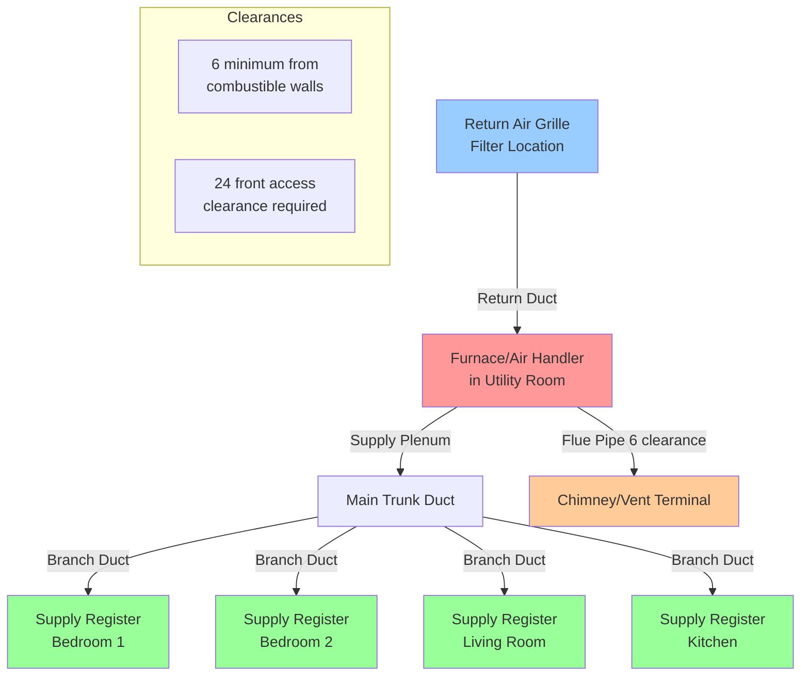

NFPA 90B establishes installation standards for warm air heating and air conditioning systems serving residential and small commercial occupancies. This standard addresses one- and two-family dwellings, manufactured homes, recreational vehicles, and other low-rise residential buildings with individual heating and cooling systems.

## Scope and Application

NFPA 90B applies to warm air heating systems where the air circulation capacity does not exceed 2,000 cfm (cubic feet per minute) and the heat input does not exceed 400,000 BTU/hr for gas-fired appliances or 250,000 BTU/hr for oil-fired appliances. The standard coordinates closely with International Residential Code (IRC) Chapter 16 for duct systems and Chapter 24 for fuel gas installations.

The standard covers:
- Factory-built fireplaces and fireplace stoves
- Residential forced air furnaces (gas, oil, electric)
- Heat pumps and air conditioning systems
- Duct systems (supply, return, and exhaust)
- Air distribution components and accessories

## Duct Material Requirements

Duct materials must meet specific performance criteria for fire resistance, structural integrity, and air leakage prevention. The following table outlines approved materials and their applications:

| Material Type | Application | Max Temperature | Thickness Requirements |
|--------------|-------------|-----------------|------------------------|
| Galvanized steel | Supply/return ducts | 250°F continuous | 28 gauge min for ≤14" dia |
| Aluminum sheet | Supply/return ducts | 250°F continuous | 0.019" min for ≤14" dia |
| Stainless steel | High-temp applications | 1,000°F continuous | 28 gauge min |
| Fiberglass duct board | Low-velocity systems | 250°F continuous | Listed and labeled |
| Flexible duct (metalized) | Short runs, connections | 250°F intermittent | UL 181 listed |
| PVC/CPVC | Combustion air intake | Per listing | Listed for application |
| Concrete/masonry | Underground/embedded | Varies | Lined or coated |

All duct materials must bear appropriate listings from recognized testing laboratories (UL 181 for flexible ducts, UL 181A for rigid fiberglass, UL 181B for closure systems).

## Furnace and Equipment Clearances

Clearance requirements prevent fire hazards and ensure proper operation. These dimensions represent minimum distances from combustible materials unless equipment is specifically listed for reduced clearances:

| Equipment Type | Front | Sides | Rear | Top | Flue Pipe |
|---------------|-------|-------|------|-----|-----------|
| Gas furnace (standard) | 24" | 6" | 6" | 6" | 6" radial |
| Oil furnace (standard) | 24" | 12" | 12" | 18" | 18" radial |
| Electric furnace | 24" | 3" | 3" | 3" | N/A |
| Listed low-clearance | Per label | Per label | Per label | Per label | Per label |
| Heat pump (indoor) | 24" | 6" | 6" | 6" | N/A |

Equipment installed in alcoves or closets requires additional clearances to ensure adequate combustion air supply (for fuel-burning appliances) and service access. The front clearance must allow full access to the burner compartment and controls.

## Residential HVAC Installation Configuration

## Duct Installation Requirements

**Supply Duct Construction:** Supply ducts must maintain structural integrity under positive pressure (typically 0.5 to 2.0 inches w.c.) and resist air leakage. Joints and seams require mechanical fastening plus mastic sealant or pressure-sensitive tape meeting UL 181A-P (rigid) or UL 181B-FX (flexible) standards. Longitudinal seams must be on upper surfaces where accessible.

**Return Duct Construction:** Return air systems operate under negative pressure and require careful sealing to prevent infiltration of unconditioned air or contaminants. Building cavities (joist spaces, stud bays) are prohibited as return air plenums unless they are sealed and constructed of continuous combustible materials or lined with approved duct material.

**Support and Bracing:** Metal ducts require support at maximum 10-foot intervals using metal straps, hangers, or brackets. Flexible duct must be supported every 4 feet maximum and stretched to minimize pressure drop (sag not exceeding 1/2 inch per foot of length).

**Penetrations:** Where ducts pass through fire-rated assemblies (walls, floors, ceilings), fire dampers or other fire-stopping methods are required to maintain the assembly's fire rating. Combustible ducts must be replaced with metal for 18 inches on both sides of the penetration.

## Combustion Air and Ventilation

Fuel-burning appliances require adequate combustion air to ensure complete combustion and prevent spillage of combustion products. Two methods are recognized:

**Indoor Combustion Air:** Requires two permanent openings (one within 12 inches of ceiling, one within 12 inches of floor), each with minimum free area of 100 square inches per 1,000 BTU/hr input for confined spaces. Buildings with tight construction (infiltration-resistant) require dedicated outdoor air supply.

**Outdoor Combustion Air:** Direct connection to outdoors via two openings or single opening with motorized dampers. Minimum free area is 1 square inch per 4,000 BTU/hr input when both openings connect directly to outdoors.

## Special Installation Considerations

**Attic Installations:** Ducts in unconditioned attics require insulation meeting or exceeding R-8 thermal resistance to prevent condensation and heat loss. Support must account for additional weight of insulation. Access for service must be provided per IRC requirements (minimum 22 x 30 inch opening, unobstructed path).

**Crawlspace Installations:** Ducts in vented crawlspaces require insulation and vapor barrier protection. Support must prevent contact with ground. Flexible duct is permitted but must be installed on solid surfaces or suspended to prevent damage from foot traffic during service.

**Garage Installations:** Equipment and ductwork installed in garages must be protected from physical damage and installed with base elevation minimum 18 inches above floor for fuel-burning appliances (to prevent ignition of gasoline vapors, which are heavier than air).

**Manufactured Housing:** Additional requirements apply per HUD standards, including duct system tightness testing and specific support methods to prevent damage during transportation and setup.

## Inspection and Testing

Duct systems must be inspected for proper materials, support, and sealing before concealment. Visual inspection verifies clearances, proper slope for condensate drainage (if applicable), and absence of damage. Some jurisdictions require duct leakage testing, with maximum permitted leakage of 6 to 8 cfm per 100 square feet of conditioned floor area at 25 Pa test pressure.

The authority having jurisdiction may require demonstration of adequate combustion air supply, proper venting of combustion products, and verification that automatic safety controls function correctly before final approval.

## Coordination with Other Standards

NFPA 90B coordinates with multiple standards to provide comprehensive installation guidance:
- NFPA 54 (National Fuel Gas Code) for gas piping and appliance connections
- NFPA 31 for oil-burning equipment installation
- NFPA 211 for chimneys, fireplaces, vents, and solid fuel systems
- IRC Chapters 12-24 for residential mechanical systems
- ASHRAE 62.2 for residential ventilation requirements

Equipment manufacturers' installation instructions take precedence when they specify more restrictive requirements than NFPA 90B, as equipment listings are based on specific installation parameters verified through testing.
