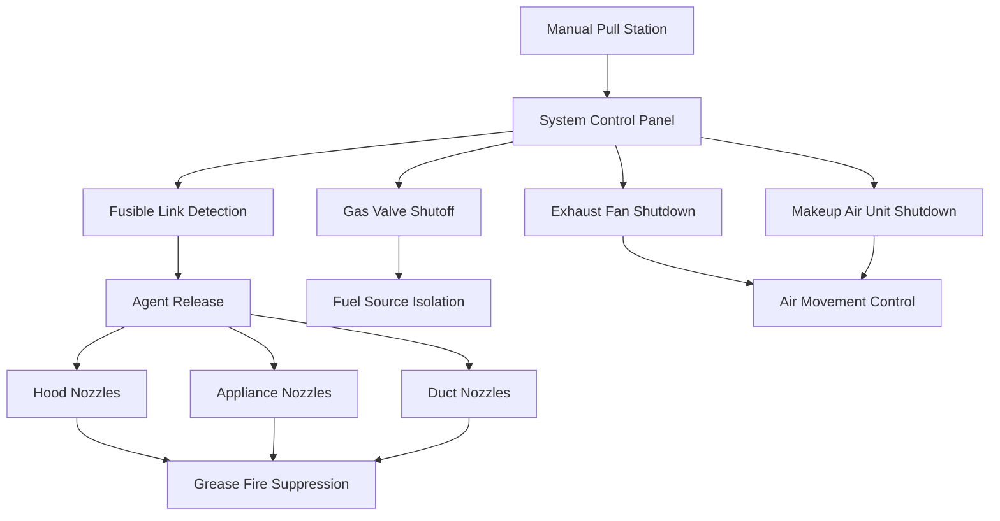
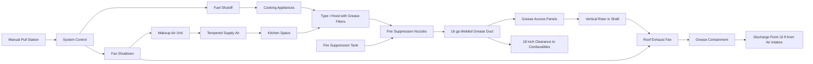

## Overview of NFPA 96

NFPA 96, Standard for Ventilation Control and Fire Protection of Commercial Cooking Operations, establishes comprehensive fire safety requirements for all commercial cooking equipment and associated ventilation systems. Published by the National Fire Protection Association and updated on a three-year cycle, this standard addresses one of the highest fire-risk areas in commercial buildings—the commercial kitchen.

Commercial cooking operations produce grease-laden vapors that, if not properly captured and exhausted, accumulate within ductwork and create severe fire hazards. NFPA 96 provides detailed requirements for hood design, exhaust ductwork construction, fire suppression systems, and maintenance procedures to minimize this risk. Both the International Mechanical Code (IMC) and Uniform Mechanical Code (UMC) reference NFPA 96 as the primary standard for commercial cooking exhaust systems.

## Scope and Application

### Covered Equipment and Operations

NFPA 96 applies to all commercial food service establishments including:

- Restaurants, cafeterias, and fast-food facilities
- Hotel and institutional kitchens
- Grocery store food preparation areas
- Hospital and nursing home kitchens
- School and university food service
- Concession stands and mobile food operations
- Industrial employee cafeterias

The standard covers both stationary and mobile cooking equipment that produces grease-laden vapors or smoke, including solid fuel (charcoal, wood) cooking appliances that require specialized controls.

### Excluded Applications

NFPA 96 does not apply to:

- Residential cooking in dwelling units
- Domestic-style ranges in break rooms (see NFPA 90A)
- Laboratory fume hoods handling cooking-related research
- Industrial food processing operations (continuous production lines)

## Exhaust Hood Classification and Design

### Type I Hoods (Grease Removal)

Type I hoods are required for all appliances that produce grease-laden vapors. These hoods incorporate listed grease filters or baffles and connect to dedicated grease exhaust ductwork.

**Type I hood subtypes:**

- **Wall-mounted canopy:** Most common, mounted against wall over cooking line
- **Single island canopy:** Suspended over island cooking equipment
- **Double island (back-to-back) canopy:** Covers two cooking lines
- **Eyebrow (proximity) hood:** Close-capture hood with reduced overhang
- **Pass-over hood:** Low-profile design allowing pass-through service
- **Backshelf hood:** Captures rising heat and grease at appliance backguard

**Hood airflow calculation for wall-mounted canopy:**

$$Q_{hood} = V_{face} \times A_{face} = V_{face} \times L_{hood} \times H_{opening}$$

Where:
- $Q_{hood}$ = Required exhaust airflow (cfm)
- $V_{face}$ = Face velocity at hood opening (fpm)
- $A_{face}$ = Hood face area (sq ft)
- $L_{hood}$ = Hood length (ft)
- $H_{opening}$ = Hood opening height from cooking surface to lower edge (ft)

**Minimum exhaust rates per IMC Table 507.2.2:**

| Appliance Duty | Hood Type | Exhaust Rate |
|---------------|-----------|--------------|
| Light duty | Wall canopy | 200 cfm per linear foot |
| Medium duty | Wall canopy | 300 cfm per linear foot |
| Heavy duty | Wall canopy | 400 cfm per linear foot |
| Extra-heavy duty | Wall canopy | 500 cfm per linear foot |
| Light duty | Island canopy | 300 cfm per linear foot |
| Medium duty | Island canopy | 400 cfm per linear foot |
| Heavy duty | Island canopy | 500 cfm per linear foot |
| Extra-heavy duty | Island canopy | 600 cfm per linear foot |

**Hood overhang requirements:**

$$O_{min} = 6 \text{ inches beyond appliance on all open sides}$$

For appliances generating heavy thermal plumes (charbroilers, overfired broilers), larger overhangs improve capture efficiency:

$$O_{recommended} = 12 \text{ inches beyond appliance edges}$$

### Type II Hoods (Heat and Steam Removal)

Type II hoods exhaust heat, moisture, and odors from appliances that do not produce grease. These hoods do not require grease filters and connect to non-grease ductwork.

**Type II hood applications:**

- Steam kettles and compartment steamers
- Pasta cookers and vegetable steamers
- Dishwashers (institutional)
- Ovens when no grease production occurs

**Type II hood exhaust rate:**

$$Q_{typeII} = 50 \text{ to } 150 \text{ cfm per sq ft of hood area}$$

Selection depends on heat release rate and moisture production. Dishwasher hoods typically require 75-100 cfm per linear foot to handle steam discharge.

## Grease Duct Construction and Installation

### Duct Material Requirements

NFPA 96 mandates specific materials for grease duct systems due to fire exposure risk:

**Approved materials:**
- **Steel:** Black or galvanized, minimum 16 gauge (0.0598")
- **Stainless steel:** Type 304 or 316, minimum 18 gauge (0.0478")

Ductwork must be continuously welded with liquid-tight joints. Mechanical fasteners, rivets, or screws are prohibited in grease duct systems.

**Material thickness requirements:**

| Duct Dimension (diameter or greatest dimension) | Carbon Steel Minimum | Stainless Steel Minimum |
|--------------------------------------------------|----------------------|-------------------------|
| Up to 30 inches | 16 gauge (0.0598") | 18 gauge (0.0478") |
| 31-75 inches | 14 gauge (0.0747") | 16 gauge (0.0598") |
| Over 75 inches | 12 gauge (0.1046") | 14 gauge (0.0747") |

### Duct Velocity and Sizing

Proper duct velocity prevents grease deposition while avoiding excessive noise:

$$V_{duct} = \frac{Q_{exhaust}}{A_{duct}} = \frac{4Q_{exhaust}}{\pi D^2}$$

Where:
- $V_{duct}$ = Duct velocity (fpm)
- $Q_{exhaust}$ = Exhaust airflow (cfm)
- $A_{duct}$ = Duct cross-sectional area (sq ft)
- $D$ = Duct diameter (ft)

**Required velocity range:**

$$500 \text{ fpm} \leq V_{duct} \leq 1,500 \text{ fpm}$$

Velocities below 500 fpm allow grease accumulation; velocities exceeding 1,500 fpm create noise and increase system resistance.

**Example calculation:**

For a hood exhausting 4,000 cfm through 20-inch diameter round duct:

$$V_{duct} = \frac{4 \times 4,000}{\pi \times (20/12)^2} = \frac{16,000}{8.73} = 1,833 \text{ fpm}$$

This exceeds the maximum. Increase duct to 24-inch diameter:

$$V_{duct} = \frac{4 \times 4,000}{\pi \times (24/12)^2} = \frac{16,000}{12.57} = 1,273 \text{ fpm} \checkmark$$

### Clearances to Combustible Materials

NFPA 96 specifies minimum clearances between grease ducts and combustible construction:

| Duct Configuration | Minimum Clearance |
|--------------------|-------------------|
| Unenclosed grease duct | 18 inches to combustibles |
| Grease duct with listed clearance system | Per listing (typically 6" or 9") |
| Grease duct in fire-rated enclosure | 0 inches (duct may contact enclosure) |

**Clearance reduction with protection:**

When 18-inch clearance is impractical, protection methods reduce required clearance:

- **Listed factory-built duct systems:** Follow manufacturer's clearance requirements (typically 6-9 inches)
- **Field-applied insulation:** Minimum 1-inch mineral wool rated 1,200°F minimum, reduces clearance to 9 inches
- **Fire-rated shaft enclosure:** 1-hour or 2-hour construction, permits zero clearance

### Duct Support and Access

**Support spacing:**

Grease ducts require substantial support to prevent sagging:

$$S_{support} \leq 10 \text{ feet for horizontal runs}$$

Support at each floor penetration and at changes of direction. Support systems must be steel and non-combustible.

**Access panel requirements:**

Install access panels per NFPA 96:

- At upper and lower ends of vertical risers
- Maximum 12 feet apart on horizontal sections
- At changes of direction exceeding 45 degrees
- Minimum 20 inches × 20 inches for ducts over 24 inches

## Fire Suppression Systems

### Automatic Fire Suppression Requirements

NFPA 96 requires automatic fire suppression systems protecting:

1. **Hood interior and filters:** Complete coverage of all areas where grease accumulates
2. **Cooking appliances:** Protection of all appliance surfaces within hood
3. **Grease duct:** Protection of duct interior (for systems with solid fuel)

**Common suppression system types:**

- **Wet chemical systems:** UL 300 listed, most common for modern cooking appliances
- **Water-based systems:** Pre-engineered water mist or deluge, gaining popularity
- **Dry chemical systems:** Legacy systems (no longer compliant for new installations)

**Wet chemical system design:**

$$N_{nozzles} = \frac{L_{hood}}{S_{nozzle}} + 1$$

Where:
- $N_{nozzles}$ = Number of hood nozzles required
- $L_{hood}$ = Hood length (ft)
- $S_{nozzle}$ = Nozzle spacing per manufacturer (typically 8-10 ft)

### Fire Suppression System Components

**Fusible link activation temperature:**

$$T_{link} = 350°F \text{ to } 500°F$$

Links melt at design temperature, releasing mechanical restraint that triggers agent discharge.

### Ancillary Equipment Controls

Fire suppression system activation must simultaneously:

- **Shut off fuel/power** to all cooking appliances protected (gas solenoid valves, electrical contactors)
- **Shut down exhaust fans** to prevent agent evacuation and fire draft
- **Shut down makeup air units** to eliminate oxygen supply
- **Activate building fire alarm** (where provided) via monitoring module

NFPA 96 prohibits time delays or override switches on these safety functions.

## Makeup Air Requirements

### Makeup Air Volume Calculation

Exhaust air removal creates negative building pressure requiring makeup air replacement:

$$Q_{makeup} \geq 0.80 \times Q_{exhaust}$$

At minimum, provide makeup air equal to 80% of exhaust. Many jurisdictions require 100% makeup air to prevent building pressurization issues.

**Energy considerations:**

Conditioned makeup air maintains kitchen comfort:

$$Q_{cooling} = 1.08 \times Q_{makeup} \times \Delta T$$

Where:
- $Q_{cooling}$ = Cooling load from makeup air (Btu/hr)
- $Q_{makeup}$ = Makeup air volume (cfm)
- $\Delta T$ = Temperature difference (°F) between outdoor and desired kitchen temperature

### Makeup Air Distribution

**Distribution methods:**

1. **Direct hood supply:** Low-velocity air supplied directly to hood face, reducing exhaust requirements by 10-20%
2. **Perimeter supply:** Diffusers at kitchen perimeter, directing air toward hoods
3. **Back-of-house distribution:** General ventilation with strategic diffuser placement
4. **Front-of-house dining area:** Pressurization air flows toward kitchen from dining areas

**Velocity considerations:**

Makeup air must not disrupt hood capture:

$$V_{makeup} \leq 75 \text{ fpm at hood face periphery}$$

High-velocity makeup air jets impinging on hood face create turbulence that defeats capture efficiency.

## Kitchen Exhaust System Schematic

## Inspection, Testing, and Maintenance

### Cleaning Frequency Requirements

NFPA 96 mandates inspection and cleaning frequencies based on operation volume:

| Usage Level | Inspection/Cleaning Frequency |
|-------------|------------------------------|
| Systems serving solid fuel cooking | Monthly |
| High-volume operations (24-hour, charbroiling) | Quarterly |
| Moderate-volume operations | Semi-annually |
| Low-volume operations (churches, senior centers) | Annually |

**Cleaning requirements:**

- Remove all grease accumulation from hood interior, filters, ductwork, and fan
- Acceptable residue: Maximum 3 mm (1/8 inch) wet grease film
- Access entire duct system through installed access panels
- Use qualified hood cleaning contractors per IKECA or Cikca standards

### Fire Suppression System Testing

**Semi-annual inspection verifies:**

- Fusible links properly installed and undamaged
- Nozzles clear of obstructions and properly oriented
- Agent cylinder(s) properly charged (weigh or use pressure gauge)
- Manual pull stations accessible and identified
- Appliance fuel shutoff valves function properly
- Gas piping free of leaks

**Annual testing includes:**

- Trip system using manual pull station (do not discharge agent)
- Verify all interlocks function (fan shutdown, fuel cutoff, alarm notification)
- Inspect mechanical and electrical components
- Check agent tank weight/pressure against specification

### Documentation and Records

Maintain permanent records including:

- Hood cleaning service dates and company names
- Inspection reports from fire suppression contractor
- Photos documenting pre-cleaning grease accumulation
- Repairs, alterations, or component replacements
- Certification of technicians performing work

Authority Having Jurisdiction (AHJ) may request these records during inspections.

## Code Compliance and Enforcement

### IMC References to NFPA 96

International Mechanical Code Section 507 extensively references NFPA 96:

- **IMC 507.2.1:** Commercial kitchen exhaust equipment must comply with NFPA 96
- **IMC 507.13:** Duct systems comply with NFPA 96 for grease duct construction
- **IMC 507.2.5:** Fire suppression systems comply with NFPA 96 and International Fire Code

### Common Code Violations

**Frequent deficiencies found during inspections:**

1. **Insufficient duct clearances:** Grease ducts too close to combustible joists or framing
2. **Missing access panels:** Inadequate access for cleaning entire duct length
3. **Improper duct materials:** Use of spiral lockseam or riveted duct instead of welded
4. **Uncovered appliances:** Cooking equipment outside hood capture area
5. **Inadequate makeup air:** Excessive negative pressure in kitchen
6. **Non-compliant fire suppression:** Outdated dry chemical systems or missing duct protection
7. **Deferred cleaning:** Excessive grease accumulation exceeding 1/8-inch thickness

## Conclusion

NFPA 96 provides comprehensive requirements that protect commercial kitchens—one of the highest fire-risk areas in any building. Proper hood design ensures effective grease vapor capture, while grease duct construction with adequate clearances prevents fire spread. Automatic fire suppression systems provide critical protection when fires occur, and regular cleaning removes accumulated fuel sources. Engineers must carefully integrate Type I and II hoods, properly size exhaust and makeup air systems, and coordinate fire suppression with all ancillary controls. Ongoing maintenance and documentation ensure continued compliance and occupant safety throughout the facility's operational life.
