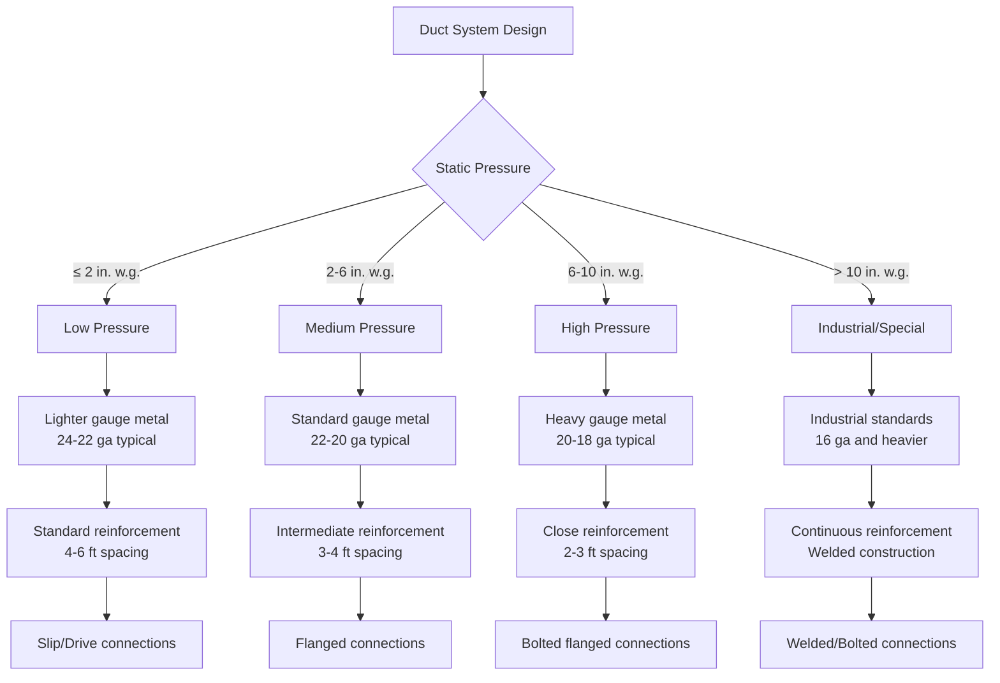

## Overview

The Sheet Metal and Air Conditioning Contractors' National Association (SMACNA) publishes industry-leading technical manuals that establish construction, installation, and testing standards for HVAC systems. These standards provide detailed specifications for duct fabrication, seismic bracing, indoor air quality management, and system commissioning procedures used throughout the mechanical contracting industry.

SMACNA standards serve as the authoritative reference for engineers, contractors, and code officials. While not legally binding codes, they are widely referenced in building codes, specifications, and contract documents. Compliance with SMACNA standards demonstrates adherence to industry best practices and ensures system performance, safety, and longevity.

## Key SMACNA Publications

### Duct Construction Standards

| Publication | Application | Key Features |
|-------------|-------------|--------------|
| HVAC Duct Construction Standards - Metal and Flexible | Commercial HVAC systems up to 10 in. w.g. | Pressure classifications, reinforcement schedules, seam/joint requirements |
| Rectangular Industrial Duct Construction | High-pressure industrial systems | Covers pressures from 10+ in. w.g. to 20 in. w.g., heavy-gauge construction |
| Round Industrial Duct Construction | High-velocity industrial exhaust | Spiral lockseam specifications, welded construction methods |
| Fibrous Glass Duct Construction Standards | Low-pressure distribution systems | Installation methods, joint sealing, acoustic properties |
| Thermoplastic Duct Construction | Corrosive fume exhaust systems | PVC, PP, PVDF material specifications and fabrication |

### Seismic and Structural Standards

| Publication | Application | Key Features |
|-------------|-------------|--------------|
| Seismic Restraint Manual | Equipment and ductwork in seismic zones | Design calculations, bracing details, cable/rod sizing |
| Architectural Sheet Metal Manual | Roof-mounted equipment curbs | Flashing details, weather protection, structural integration |

### System Performance Standards

| Publication | Application | Key Features |
|-------------|-------------|--------------|
| HVAC Systems Testing, Adjusting & Balancing | Commissioning of air and hydronic systems | TAB procedures, report forms, acceptance criteria |
| IAQ Guidelines for Occupied Buildings Under Construction | Construction phase air quality | Source control, filtration, isolation strategies |
| Duct System Leakage Test Manual | Verification of duct tightness | Test methodologies for Seal Classes A, B, C |

## Duct Construction Pressure Classifications

SMACNA defines duct construction requirements based on static pressure and velocity:

## Duct Seal Classifications

SMACNA establishes three leakage classifications based on maximum allowable leakage at test pressure:

| Seal Class | Max Leakage (CFM/100 sf @ 1 in. w.g.) | Typical Applications |
|------------|--------------------------------------|----------------------|
| Seal Class C | 24 CFM | Low-pressure return air, exhaust systems |
| Seal Class B | 12 CFM | Supply air systems, general applications |
| Seal Class A | 6 CFM | High-pressure systems, outside air, energy recovery |

Testing pressure varies by operating pressure: systems operating at 3+ in. w.g. test at 1.5× operating pressure, while lower pressure systems test at operating pressure plus 1 in. w.g.

## Seismic Restraint Requirements

SMACNA seismic standards provide comprehensive bracing specifications for ductwork, piping, and equipment in seismic design categories C through F:

**Ductwork Bracing Requirements:**

- Transverse bracing: maximum 40 ft spacing (30 ft for ducts over 28 in. wide)
- Longitudinal bracing: maximum 40 ft spacing, minimum two braces per duct run
- Four-way bracing required at direction changes, branch takeoffs, and equipment connections
- Brace angles: 30° to 60° from horizontal for optimal load transfer

**Attachment Details:**

- Structural attachments must resist calculated seismic forces in tension and compression
- Concrete and masonry anchors require ICC-ES approval for seismic applications
- Clearances required between ducts and structural members to prevent impact during seismic events
- Vibration isolation systems require seismic snubbers or restrained spring isolators

## Energy Systems Standards

SMACNA energy-focused publications address efficiency and sustainability:

- **HVAC Systems Commissioning Manual**: Systematic verification of equipment installation, control sequences, and performance testing
- **Energy Recovery Equipment Handbook**: Selection and installation of energy recovery ventilators, enthalpy wheels, and run-around loops
- **Duct System Optimization**: Right-sizing ductwork to reduce energy consumption while maintaining adequate airflow

## IAQ Guidelines During Construction

The SMACNA IAQ Guidelines establish protocols to prevent contamination of building systems during construction:

1. **Source Control**: Store porous materials in dry locations, protect from moisture infiltration
2. **Pathway Interruption**: Seal ductwork during construction, use temporary filtration
3. **HVAC Protection**: Delay installation or provide enhanced filtration during high-dust activities
4. **Moisture Management**: Control humidity levels, prevent standing water in duct systems
5. **Commissioning**: Verify cleanliness before occupancy, conduct duct inspection and cleaning if needed

## Testing and Balancing Procedures

SMACNA TAB procedures establish systematic methods for verifying HVAC system performance:

**Air Systems:**
- Traverse measurements in ductwork using pitot tube arrays
- Terminal device adjustment to design airflow within ±10%
- Static pressure verification at fan discharge and throughout distribution system
- Motor amperage and voltage readings to verify fan performance

**Hydronic Systems:**
- Flow measurement using calibrated balancing valves or ultrasonic meters
- Proportional balancing to achieve design flow rates within ±5%
- Pump performance curves verification
- Differential pressure readings across coils and control valves

## Application in Specifications

SMACNA standards integrate into project specifications through reference:

- **Section 23 31 00 - HVAC Ducts and Casings**: "Fabricate and install metal ductwork in accordance with SMACNA HVAC Duct Construction Standards, 3rd Edition, for the pressures and velocities indicated."
- **Section 23 05 93 - Testing, Adjusting, and Balancing**: "Perform TAB work in accordance with SMACNA HVAC Systems Testing, Adjusting & Balancing, 4th Edition."

Engineers specify seal class, pressure class, reinforcement class, and seismic design category to establish enforceable performance criteria based on SMACNA methodologies.

## Components

- Hvac Duct Construction Standards Metal Flexible
- Rectangular Industrial Duct Construction
- Round Industrial Duct Construction
- Fibrous Glass Duct Construction
- Duct Leakage Testing Smacna
- Hvac Systems Testing Adjusting Balancing
- Iaq Guidelines Occupied Buildings
- Architectural Sheet Metal Manual
