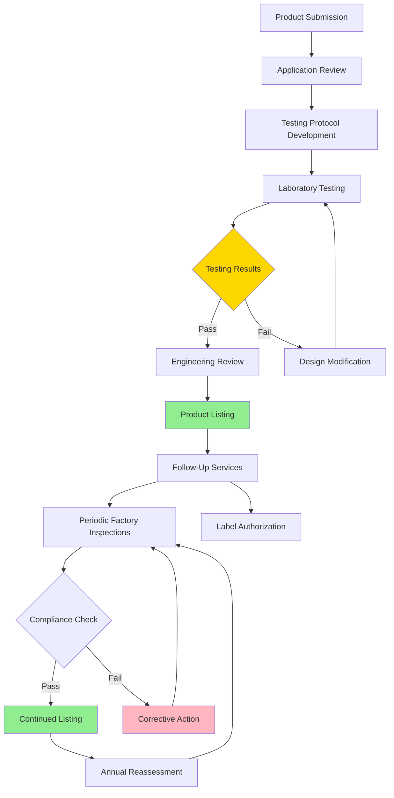

Underwriters Laboratories (UL) establishes critical safety standards for HVAC equipment through rigorous testing and certification protocols. UL certification provides third-party verification that products meet defined safety requirements, addressing fire hazards, electrical safety, and structural integrity. Equipment bearing the UL Listed mark has undergone comprehensive evaluation and continues to be monitored through periodic factory inspections.

## Primary UL Standards for HVAC Equipment

### Major Equipment Standards

| UL Standard | Title | Application |
|-------------|-------|-------------|
| **UL 1995** | Heating and Cooling Equipment | Furnaces, air conditioners, heat pumps, rooftop units |
| **UL 1812** | Ducted Heat Recovery Ventilators | HRVs, ERVs, energy recovery equipment |
| **UL 2021** | Fixed and Location-Dedicated Electric Room Heaters | Electric heating equipment, unit heaters |
| **UL 207** | Refrigerant-Containing Components and Accessories | Compressors, condensers, evaporators |
| **UL 1995A** | Heating and Cooling Equipment for Mobile Homes | Manufactured housing HVAC systems |

### Fire Safety and Materials Standards

| UL Standard | Title | Critical Parameters |
|-------------|-------|---------------------|
| **UL 555** | Fire Dampers | 1.5-hour and 3-hour fire ratings, airflow ratings |
| **UL 555S** | Smoke Dampers | Leakage classification, temperature ratings |
| **UL 2043** | Fire Test for Heat and Visible Smoke Release | Air-handling spaces, plenum-rated equipment |
| **UL 723** | Surface Burning Characteristics | Flame spread index ≤25, smoke developed ≤50 |
| **UL 181** | Factory-Made Air Ducts and Air Connectors | Class 0, Class 1 duct construction, closure systems |
| **UL 181A** | Closure Systems for Rigid Air Ducts | Tapes, mastics, mechanical fasteners |
| **UL 181B** | Closure Systems for Flexible Air Ducts | Flexible duct connectors, sealants |
| **UL 94** | Flammability of Plastic Materials | V-0, V-1, V-2 classifications for components |

### Component and Accessory Standards

| UL Standard | Title | Coverage |
|-------------|-------|----------|
| **UL 353** | Limit Controls | High-limit switches, operating controls |
| **UL 372** | Primary Safety Controls | Flame safeguard systems, gas valves |
| **UL 60730** | Automatic Electrical Controls | Electronic controls, programmable thermostats |
| **UL 508A** | Industrial Control Panels | Control cabinets, automation panels |

## UL Certification Process

## UL Listing Categories

**UL Listed**: Complete product has been tested to applicable safety standards. The entire unit meets all UL requirements and may bear the UL Listed mark. This represents the highest level of UL certification and is required by most building codes for major HVAC equipment.

**UL Recognized Component**: Individual component has been evaluated for use in complete products. Components such as motors, controls, or heat exchangers may be UL Recognized but must be incorporated into a UL Listed end product. The Recognized Component mark (UL in a backwards "R") appears only in industrial settings, not on consumer-facing products.

**UL Classified**: Product has been evaluated with respect to specific properties or performance characteristics. Classification addresses specific fire, casualty, or regulatory requirements rather than comprehensive safety evaluation. Examples include fire dampers classified for specific fire-resistance ratings.

## UL 1995 Requirements for Heating and Cooling Equipment

UL 1995 establishes comprehensive safety requirements for residential and commercial HVAC equipment. Key evaluation areas include:

**Electrical Safety**: Grounding continuity, overcurrent protection, insulation resistance, spacing requirements between live parts and accessible surfaces. All electrical components must withstand dielectric voltage testing at 1,000V plus twice the rated voltage for one minute without breakdown.

**Fire Hazards**: Ignition of external materials, internal component flammability, heat rise on adjacent combustibles. Surrounding combustible materials must not exceed temperature rise limits: 90°F on surfaces directly above equipment, 65°F on side and front surfaces.

**Mechanical Hazards**: Sharp edges, pinch points, fan blade exposure, panel security. Moving parts must be guarded to prevent contact during normal operation and routine maintenance.

**Refrigerant Circuit Integrity**: Pressure testing to 1.5 times working pressure, vibration endurance, tube joint strength. Pressure relief devices must operate correctly at 90% of burst pressure.

**Control System Performance**: Limit control response, flame safeguard operation, safety circuit integrity. High-limit controls must open circuits before hazardous temperatures develop.

## UL 2043 Plenum Rating

UL 2043 addresses fire performance of equipment and materials installed in air-handling spaces (plenums). Testing evaluates heat release and smoke generation when exposed to ignition sources representative of electrical malfunction.

**Test Procedure**: Sample is placed in a 8 ft × 12 ft × 18 in plenum chamber with controlled airflow. A 2,500W sand bath ignition source is applied for 20 minutes. Peak heat release rate must not exceed 100 kW, and average heat release over any 5-minute period must not exceed 25 kW. Smoke optical density must not exceed 0.5 per foot at any measurement point.

**Application**: Required for equipment installed above suspended ceilings used as return air plenums, including terminal units, fan-powered boxes, air handling units, and control panels. The 2043 rating is distinct from cable and wire plenum ratings (CMP), which follow different test protocols.

## UL 555 Fire Damper Requirements

UL 555 evaluates fire dampers for ability to maintain fire compartmentation integrity when installed in air distribution systems. Testing determines hourly fire ratings (1.5-hour or 3-hour) based on performance in standard fire tests.

**Static Fire Test**: Damper assembly is mounted in a furnace wall and exposed to time-temperature curve per ASTM E119. The damper must prevent flame passage and limit temperature rise on unexposed side to 250°F average or 325°F at any single point. Hose stream test follows at 75% of fire test duration.

**Dynamic Fire Test**: Damper operates under airflow conditions (2,000 fpm velocity) during exposure to verify proper closure under realistic conditions. Blades must fully close within rated closure time (typically 30 seconds) and maintain position throughout fire exposure.

**Temperature Ratings**: 165°F, 212°F, and 286°F fusible link ratings correspond to normal ambient conditions in the installation location. Higher rated links prevent nuisance closure in hot environments while still responding to fire conditions.

## UL 723 Flame Spread Classification

UL 723 (ASTM E84) measures surface burning characteristics of building materials through the Steiner Tunnel test. A 25-foot long specimen is exposed to controlled flame at one end for 10 minutes while mounted horizontally in a test tunnel.

**Flame Spread Index (FSI)**: Distance and rate of flame travel compared to reference materials (cement board = 0, red oak = 100). Class A materials have FSI ≤ 25, Class B from 26-75, Class C from 76-200.

**Smoke Developed Index (SDI)**: Optical density of smoke during test compared to same reference scale. Plenum-rated materials typically require SDI ≤ 50 regardless of FSI classification.

**HVAC Applications**: Duct insulation, flexible ductwork, fiberglass duct board, acoustic lining materials must meet Class A (FSI ≤ 25) for concealed spaces and most commercial applications. Mechanical codes reference UL 723 classifications extensively for material approval.

## UL 181 Duct Construction Standards

UL 181 addresses factory-made air ducts and connectors, establishing construction requirements and marking systems to identify proper applications.

**Class 0**: Nonmetallic ductwork without thermal insulation. Requires FSI ≤ 25, SDI ≤ 50. Used for return air and low-pressure supply applications where fire performance is critical.

**Class 1**: Flexible or rigid ductwork for air distribution systems. Most common classification for residential and commercial flexible duct. Must withstand 2.0 in w.g. positive and 2.0 in w.g. negative pressure without failure or excessive leakage.

**UL 181A**: Rigid duct closure systems including tapes with adhesive strength of 20 oz/in width minimum, mastics with bridging capability across 1/8-inch gaps, and mechanical fasteners with pull-out resistance.

**UL 181B**: Flexible duct closure systems optimized for longitudinal seams and end connections. Core requirements include minimum tensile strength of 90 lbf at 73°F and retention of 70% strength after heat aging at 200°F for 168 hours.

## Follow-Up Services Program

UL maintains ongoing surveillance of listed products through unannounced factory inspections, typically quarterly. Inspectors verify continued compliance with production samples tested against original specifications.

**Label Control**: Manufacturers must purchase authorized UL labels and maintain records of label application. Each label contains unique identification enabling traceability to specific production runs.

**Design Changes**: Any modification to listed products requires UL notification and evaluation. Changes affecting safety parameters necessitate retesting; minor changes may be approved through engineering review.

**Market Surveillance**: UL conducts field inspections of installed equipment to verify proper labeling and conformance with listed products. Non-conforming products trigger field investigation and potential delisting.

## Components

- Ul Listing Certification
- Ul 1995 Heating Cooling Equipment
- Ul 1812 Ducted Heat Recovery Ventilators
- Ul 723 Flame Spread Rating
- Ul 181 Duct Tape Closure Systems
- Ul 94 Flammability Plastics
- Ul 1995 Standard Requirements
- Ul Recognized Component
- Ul Classified Products
