## Overview of HVAC Safety Requirements

Health and safety in HVAC systems encompass a comprehensive framework of regulations, standards, and best practices designed to protect workers, building occupants, and the environment. The multifaceted nature of HVAC work involves exposure to electrical hazards, refrigerants, combustion products, confined spaces, and physical hazards that require rigorous safety protocols and continuous training.

The HVAC industry operates under overlapping jurisdictions of federal, state, and local safety authorities, with the Occupational Safety and Health Administration (OSHA) and Environmental Protection Agency (EPA) serving as primary regulatory bodies. Understanding and implementing these safety requirements is not merely regulatory compliance but fundamental to preventing injuries, fatalities, and environmental damage.

## OSHA Regulations for HVAC Work

OSHA establishes and enforces safety standards across all industries, with numerous regulations directly applicable to HVAC operations. The General Duty Clause (Section 5(a)(1)) requires employers to provide workplaces "free from recognized hazards that are causing or likely to cause death or serious physical harm."

**Key OSHA Standards for HVAC:**

- **29 CFR 1910.147** - Control of Hazardous Energy (Lockout/Tagout)
- **29 CFR 1910.146** - Permit-Required Confined Spaces
- **29 CFR 1910.132-138** - Personal Protective Equipment
- **29 CFR 1910.268** - Electrical Safety
- **29 CFR 1910.1200** - Hazard Communication Standard
- **29 CFR 1926.501** - Fall Protection (construction)

OSHA's enforcement includes routine inspections, complaint-driven investigations, and significant penalties for violations. Willful violations can result in penalties up to $156,259 per violation, while serious violations carry penalties up to $15,625 per violation. Repeat violations face enhanced penalties, making compliance both legally and financially imperative.

| OSHA Standard | Regulation | Primary Hazard Addressed | Key Requirements |
|---------------|------------|-------------------------|------------------|
| 29 CFR 1910.147 | Lockout/Tagout (LOTO) | Unexpected energization | Energy isolation procedures, locks, tags, training |
| 29 CFR 1910.146 | Confined Space Entry | Atmospheric hazards, entrapment | Permit system, atmospheric testing, rescue plan |
| 29 CFR 1910.134 | Respiratory Protection | Airborne contaminants | Medical evaluation, fit testing, program administration |
| 29 CFR 1910.269 | Electrical Safety-Related Work | Shock, arc flash, electrocution | Qualified person designation, PPE, safe work practices |
| 29 CFR 1926.501 | Fall Protection | Falls from elevation | Guardrails, safety nets, personal fall arrest systems |
| 29 CFR 1910.1200 | Hazard Communication | Chemical exposure | SDS, labeling, employee training |

### Employer Responsibilities Under OSHA

Employers must establish comprehensive safety programs that include:

1. **Written safety policies and procedures** specific to HVAC operations
2. **Regular employee training** on hazard recognition and mitigation
3. **Provision of appropriate PPE** at no cost to employees
4. **Maintenance of OSHA-required records** including injury logs (Form 300)
5. **Immediate reporting** of workplace fatalities and serious injuries
6. **Posting of OSHA notices** and employee rights information

The HVAC contractor must conduct job hazard analyses for routine and non-routine tasks, implementing engineering controls, administrative controls, and PPE in that hierarchical order of preference. Documentation of safety training, equipment inspections, and incident investigations forms the foundation of defensible safety programs.

## EPA Requirements and Environmental Safety

The EPA regulates environmental aspects of HVAC work, particularly concerning refrigerants, air quality, and hazardous materials. Section 608 of the Clean Air Act establishes comprehensive requirements for refrigerant handling, recovery, and disposal that directly impact HVAC technicians.

**EPA Section 608 Certification Requirements:**

- **Type I** - Small appliances containing less than 5 pounds of refrigerant
- **Type II** - High-pressure appliances (except small appliances and MVACs)
- **Type III** - Low-pressure appliances
- **Universal** - All types of equipment

Technicians must obtain appropriate EPA 608 certification by passing proctored examinations demonstrating knowledge of refrigerant properties, recovery techniques, safety procedures, and environmental regulations. Certification is mandatory for purchasing refrigerants and servicing equipment, with violations subject to EPA enforcement actions.

### Refrigerant Management Requirements

EPA regulations mandate specific practices for refrigerant handling:

**Recovery Requirements:**
- Equipment manufactured before November 15, 1993: 80-90% recovery
- Equipment manufactured after November 15, 1993: 90-95% recovery
- Recovery to atmospheric pressure or specific vacuum levels based on equipment type

**Recordkeeping:**
- Refrigerant purchase records
- Recovery and recycling logs
- Equipment service records
- Disposal certifications for recovered refrigerant

The EPA's Significant New Alternatives Policy (SNAP) program evaluates and regulates refrigerant alternatives to ozone-depleting substances, requiring contractors to stay current with acceptable substitutes and phase-out schedules. As of 2024, the AIM Act (American Innovation and Manufacturing) establishes production and consumption baselines for hydrofluorocarbons (HFCs), creating additional compliance requirements.

## Refrigerant Safety Hazards

Refrigerants present multiple safety concerns requiring specialized handling procedures and emergency response protocols. Understanding refrigerant properties and hazard characteristics is fundamental to worker protection.

### Refrigerant Hazard Classification

| Refrigerant | ASHRAE Safety Group | Toxicity | Flammability | Primary Hazards | Exposure Limit (ppm) |
|-------------|-------------------|----------|--------------|-----------------|---------------------|
| R-410A | A1 | Lower toxicity | No flame propagation | Asphyxiation, pressure | 1,000 (NIOSH) |
| R-134a | A1 | Lower toxicity | No flame propagation | Asphyxiation, cardiac sensitization | 1,000 (NIOSH) |
| R-32 | A2L | Lower toxicity | Lower flammability | Asphyxiation, mild flammability | 1,000 (proposed) |
| R-717 (Ammonia) | B2L | Higher toxicity | Lower flammability | Corrosive, toxic, flammable | 25 (OSHA PEL) |
| R-290 (Propane) | A3 | Lower toxicity | Higher flammability | Asphyxiation, explosion | 1,000 (NIOSH) |
| R-744 (CO₂) | A1 | Lower toxicity | Non-flammable | Asphyxiation, high pressure | 5,000 (OSHA PEL) |

**Critical Refrigerant Safety Measures:**

1. **Asphyxiation Prevention** - Refrigerants displace oxygen in confined spaces, creating immediate life-threatening conditions. Atmospheres below 19.5% oxygen require supplied-air respiratory protection.

2. **Cardiac Sensitization** - Halogenated refrigerants sensitize the myocardium to epinephrine, potentially causing fatal arrhythmias. Avoid strenuous activity during refrigerant exposure.

3. **Thermal Decomposition** - Refrigerants exposed to flames or hot surfaces (above 600°F) decompose into toxic compounds including hydrogen fluoride, hydrogen chloride, carbonyl fluoride, and phosgene. Never braze or weld refrigerant-containing systems without complete evacuation.

4. **Pressure Hazards** - Compressed refrigerants in cylinders and systems present burst hazards. Cylinders must never exceed 130°F or be subjected to mechanical damage.

5. **Frostbite and Cold Burns** - Rapid refrigerant expansion causes severe temperature drops. Liquid refrigerant contact causes instant frostbite requiring immediate medical attention.

## Safety Program Development

Effective HVAC safety programs integrate regulatory compliance with proactive hazard management. The hierarchy of controls provides the framework for addressing workplace hazards:

1. **Elimination** - Remove the hazard entirely
2. **Substitution** - Replace with less hazardous alternatives
3. **Engineering Controls** - Isolate people from hazards
4. **Administrative Controls** - Change work procedures
5. **PPE** - Protect the worker with equipment

### Essential Program Elements

**Hazard Assessment and Control:**
- Comprehensive job safety analyses for all routine tasks
- Pre-task planning for non-routine work
- Regular workplace inspections and audits
- Incident investigation and corrective action tracking

**Training Programs:**
- New hire orientation covering general safety requirements
- Task-specific training before assignment to hazardous work
- Annual refresher training and regulatory updates
- Competent person designation and training for specialized tasks

**Emergency Preparedness:**
- Emergency action plans with evacuation procedures
- First aid and emergency medical response
- Fire prevention and response protocols
- Communication systems for emergency notifications

**Health Monitoring:**
- Baseline and periodic medical examinations as required
- Exposure monitoring for hazardous substances
- Hearing conservation programs
- Respiratory protection programs when required

## Combustion Safety and Byproduct Hazards

Fossil-fuel-fired HVAC equipment generates combustion byproducts presenting acute and chronic health hazards. Incomplete combustion produces carbon monoxide, aldehydes, and particulate matter requiring continuous monitoring and ventilation system integrity.

### Combustion Byproduct Exposure Limits

| Contaminant | OSHA PEL | NIOSH REL | IDLH | Health Effects |
|-------------|----------|-----------|------|----------------|
| Carbon Monoxide (CO) | 50 ppm (8-hr TWA) | 35 ppm (8-hr TWA) | 1,200 ppm | Hypoxia, neurological damage, death |
| Nitrogen Dioxide (NO₂) | 5 ppm (ceiling) | 1 ppm (15-min STEL) | 20 ppm | Respiratory irritation, pulmonary edema |
| Sulfur Dioxide (SO₂) | 5 ppm (8-hr TWA) | 2 ppm (8-hr TWA) | 100 ppm | Respiratory irritation, bronchoconstriction |
| Formaldehyde (HCHO) | 0.75 ppm (8-hr TWA) | 0.016 ppm (ceiling) | 20 ppm | Carcinogen, respiratory sensitization |
| Particulate Matter (PM₂.₅) | 5 mg/m³ (respirable) | 5 mg/m³ (respirable) | N/A | Respiratory disease, cardiovascular effects |

**Combustion Safety Requirements:**

1. **Adequate Combustion Air** - Mechanical draft equipment requires 50 cubic feet per 1,000 BTU/hr input for combustion air plus dilution air per NFPA 54. Insufficient air causes incomplete combustion and CO generation.

2. **Venting System Integrity** - Flue gases must be completely isolated from occupied spaces. Annual inspection and cleaning of vent connectors, chimneys, and draft hoods prevents spillage and backdrafting.

3. **Carbon Monoxide Detection** - Install low-level CO detectors (25 ppm alarm threshold) in mechanical rooms and adjacent occupied spaces. UL 2034 residential detectors (70 ppm threshold) provide inadequate protection for commercial installations.

4. **Flame Safety Controls** - Flame safeguard systems must shut off fuel supply within 4 seconds of flame failure. Regular testing and calibration of flame sensors prevents unsafe operation.

## Indoor Air Quality Hazards

HVAC systems directly influence indoor air quality, with improperly maintained systems becoming contamination sources rather than IAQ solutions. Biological, chemical, and particulate contaminants distributed through ductwork create widespread occupant exposure.

### IAQ Contaminants and Sources

| Contaminant Category | Common Sources in HVAC | Health Effects | Control Measures |
|---------------------|----------------------|----------------|------------------|
| Biological (Bacteria, Fungi) | Standing water, wet coils, humidifiers | Legionnaires' disease, hypersensitivity pneumonitis, asthma | Drainage, UV-C, biocides, maintenance |
| Volatile Organic Compounds | Duct sealants, insulation, cleaning products | Headache, respiratory irritation, liver/kidney damage | Source control, filtration, ventilation |
| Particulate Matter | Outdoor air, construction, duct debris | Respiratory disease, allergic reactions | MERV 13+ filtration, duct cleaning |
| Radon | Soil gas intrusion, building depressurization | Lung cancer (second leading cause) | Positive building pressure, sealing |
| Asbestos Fibers | Deteriorated pipe/duct insulation | Asbestosis, mesothelioma, lung cancer | Containment, certified abatement |

**Critical IAQ Protection Measures:**

1. **Ventilation Rate Verification** - ASHRAE 62.1 mandates minimum outdoor air ventilation rates. Measure and document actual airflow rates annually using calibrated instruments.

2. **Moisture Control** - Maintain drain pans with P-traps, slope, and continuous drainage. Standing water becomes microbial reservoirs within 24-48 hours.

3. **Filtration System Maintenance** - Replace filters per manufacturer schedules before excessive pressure drop causes air bypass. MERV ratings must match system capacity.

4. **Ductwork Cleanliness** - NADCA ACR 2021 standards establish duct cleaning procedures for contaminated systems. Visual inspection through access ports identifies contamination.

## Common HVAC Hazards

HVAC work presents diverse hazards that require specialized knowledge and precautions:

**Physical Hazards:**
- Falls from elevations (rooftops, ladders, scaffolds)
- Struck-by hazards from equipment and materials
- Caught-in hazards from rotating equipment
- Lifting and material handling injuries

**Chemical Hazards:**
- Refrigerant exposure and asphyxiation
- Combustion products (CO, NOx, particulates)
- Cleaning chemicals and solvents
- Asbestos in older equipment and insulation

**Energy Hazards:**
- Electrical shock and arc flash
- High-pressure systems (pneumatic and hydraulic)
- Thermal burns from hot surfaces and steam
- Stored energy in springs, capacitors, and compressed gas

## Documentation and Compliance Verification

Maintaining comprehensive documentation demonstrates due diligence and regulatory compliance:

- Safety Data Sheets (SDS) for all chemicals used
- Equipment inspection and maintenance records
- Training records with dates, topics, and attendee signatures
- Incident reports and injury logs
- Permits for confined space entry, hot work, and other hazardous operations
- Calibration records for monitoring equipment

Regular internal audits verify program effectiveness and identify improvement opportunities. Third-party safety consultants can provide objective assessments and specialized expertise for complex compliance issues.

The investment in comprehensive safety programs yields measurable returns through reduced injuries, lower insurance costs, improved productivity, and enhanced reputation. Organizations with strong safety cultures experience fewer accidents, better employee retention, and competitive advantages in bidding and client relationships.

## HVAC Safety Considerations Framework

```mermaid
graph TD
    A[HVAC Safety Program] --> B[Regulatory Compliance]
    A --> C[Hazard Assessment]
    A --> D[Worker Protection]
    A --> E[Occupant Safety]

    B --> B1[OSHA Standards]
    B --> B2[EPA Regulations]
    B --> B3[State/Local Codes]
    B1 --> B1a[29 CFR 1910.147 LOTO]
    B1 --> B1b[29 CFR 1910.146 Confined Space]
    B1 --> B1c[29 CFR 1910.134 Respiratory]
    B2 --> B2a[Section 608 Refrigerants]
    B2 --> B2b[SNAP Program]
    B2 --> B2c[AIM Act HFC Phase-down]

    C --> C1[Physical Hazards]
    C --> C2[Chemical Hazards]
    C --> C3[Energy Hazards]
    C1 --> C1a[Falls from Height]
    C1 --> C1b[Struck-by Objects]
    C1 --> C1c[Confined Spaces]
    C2 --> C2a[Refrigerant Exposure]
    C2 --> C2b[Combustion Products]
    C2 --> C2c[Cleaning Chemicals]
    C3 --> C3a[Electrical Shock]
    C3 --> C3b[High Pressure Systems]
    C3 --> C3c[Thermal Burns]

    D --> D1[Training Programs]
    D --> D2[PPE Provision]
    D --> D3[Medical Monitoring]
    D1 --> D1a[New Hire Orientation]
    D1 --> D1b[Task-Specific Training]
    D1 --> D1c[Annual Refresher]
    D2 --> D2a[Respiratory Protection]
    D2 --> D2b[Fall Protection]
    D2 --> D2c[Electrical Safety PPE]
    D3 --> D3a[Baseline Examinations]
    D3 --> D3b[Exposure Monitoring]
    D3 --> D3c[Hearing Conservation]

    E --> E1[Indoor Air Quality]
    E --> E2[Combustion Safety]
    E --> E3[System Integrity]
    E1 --> E1a[Ventilation Adequacy]
    E1 --> E1b[Contaminant Control]
    E1 --> E1c[Filtration Maintenance]
    E2 --> E2a[CO Detection]
    E2 --> E2b[Combustion Air Supply]
    E2 --> E2c[Venting System Integrity]
    E3 --> E3a[Refrigerant Leak Detection]
    E3 --> E3b[Pressure Vessel Inspection]
    E3 --> E3c[Emergency Shutdown Systems]

    style A fill:#2c5aa0,stroke:#1a3d6e,color:#fff
    style B fill:#4a90e2,stroke:#2c5aa0,color:#fff
    style C fill:#4a90e2,stroke:#2c5aa0,color:#fff
    style D fill:#4a90e2,stroke:#2c5aa0,color:#fff
    style E fill:#4a90e2,stroke:#2c5aa0,color:#fff
```

## NIOSH Recommendations and Guidelines

The National Institute for Occupational Safety and Health (NIOSH) provides research-based recommendations complementing OSHA's enforceable standards. NIOSH Recommended Exposure Limits (RELs) often establish more stringent criteria than OSHA Permissible Exposure Limits (PELs), reflecting current scientific understanding.

### Key NIOSH Guidelines for HVAC Work

| NIOSH Publication | Topic | Key Recommendations |
|-------------------|-------|---------------------|
| NIOSH 2010-117 | Preventing Deaths and Injuries of HVAC Workers | Lockout/tagout, fall protection, confined space procedures |
| NIOSH 2005-100 | Preventing Carbon Monoxide Poisoning | CO monitoring, combustion testing, ventilation verification |
| NIOSH 2013-153 | Preventing Occupational Respiratory Disease | Respiratory protection program elements, medical surveillance |
| NIOSH 2014-106 | Hierarchy of Controls | Engineering controls prioritization over PPE |
| NIOSH Pocket Guide | Chemical Safety Data | Exposure limits, health effects, protective measures |

NIOSH mortality surveillance data identifies electrocution, falls, and confined space incidents as leading causes of HVAC worker fatalities. Targeted interventions addressing these hazards produce measurable safety improvements.

## Industry Best Practices

Leading HVAC contractors exceed minimum regulatory requirements by implementing best practices:

- Behavior-based safety programs that engage workers in hazard identification
- Near-miss reporting systems to identify and correct hazards before incidents occur
- Safety incentive programs that reward safe behaviors and injury-free performance
- Toolbox talks and daily safety briefings addressing specific job hazards
- Investment in modern equipment with enhanced safety features
- Participation in industry safety initiatives and information sharing

Professional organizations including ASHRAE, ACCA, and SMACNA provide safety resources, training materials, and forums for sharing lessons learned. Staying engaged with industry developments ensures access to emerging safety technologies and evolving best practices.
