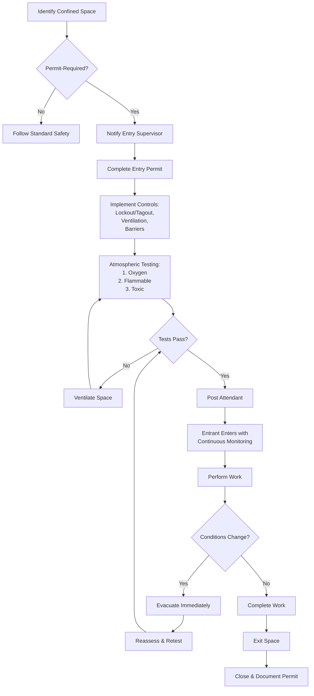

## Overview

Confined space entry represents one of the most hazardous activities HVAC technicians encounter. OSHA defines a confined space as an area large enough for bodily entry, has limited means of entry or exit, and is not designed for continuous occupancy. HVAC work frequently involves entering permit-required confined spaces including air handling plenums, chiller equipment rooms, large ductwork, underground vaults, cooling towers, tanks, and manholes.

OSHA 29 CFR 1910.146 establishes mandatory requirements for permit-required confined space entry. Violations result in serious injuries and fatalities annually, making strict adherence to these protocols essential for technician safety.

## Permit-Required Confined Space Criteria

A confined space becomes permit-required when it meets one or more of the following conditions:

| Hazard Category | Criteria | HVAC Examples |
|----------------|----------|---------------|
| **Atmospheric Hazards** | Oxygen < 19.5% or > 23.5% | Air handling plenums, sealed equipment rooms |
| **Flammable Atmosphere** | >10% Lower Explosive Limit (LEL) | Refrigerant leaks, natural gas areas |
| **Toxic Substances** | Exceeds Permissible Exposure Limit (PEL) | Refrigerant concentrations, CO₂ buildup |
| **Engulfment Hazards** | Material that can trap/asphyxiate | Condensate tanks, cooling tower basins |
| **Configuration Hazards** | Inwardly converging walls, sloped floors | Tapered ductwork, fan housings |
| **Other Serious Hazards** | Mechanical, electrical, temperature extremes | Rotating equipment, energized systems, steam lines |

## Atmospheric Testing Requirements

Atmospheric testing must occur before entry and continuously during occupation. Testing follows a specific sequence based on hazard severity:

**Testing Sequence:**

1. **Oxygen concentration** - Test first (acceptable range: 19.5% - 23.5%)
2. **Flammable gases and vapors** - Test second (must be <10% LEL)
3. **Toxic gases and vapors** - Test third (must be below PEL)

**Testing Protocol:**

| Parameter | Acceptable Range | Action if Outside Range |
|-----------|-----------------|------------------------|
| Oxygen (O₂) | 19.5% - 23.5% | Ventilate and retest; do not enter |
| Flammable gases (LEL) | <10% LEL | Ventilate, eliminate ignition sources, retest |
| Carbon monoxide (CO) | <35 ppm (8-hr TWA) | Ventilate until below PEL |
| Hydrogen sulfide (H₂S) | <10 ppm (ceiling) | Ventilate, use supplied air if entry required |
| Refrigerants (R-410A, R-134a) | <1000 ppm | Ventilate, repair leaks before entry |
| Carbon dioxide (CO₂) | <5000 ppm (8-hr TWA) | Ventilate, continuous monitoring required |

Testing equipment must be calibrated within the manufacturer's specifications and bump-tested before each use. Direct-reading instruments with audible alarms are required for continuous monitoring.

## Common HVAC Confined Spaces

**Air Handling Plenums:**
Supply and return air plenums present oxygen deficiency risks due to limited air exchange. Large commercial plenums beneath raised floors or above suspended ceilings require permit entry when access exceeds routine inspections. Hazards include oxygen displacement from refrigerant leaks, poor ventilation, and temperature extremes.

**Cooling Tower Basins and Sumps:**
These wet environments present drowning, engulfment, and slip hazards. Biological growth produces hydrogen sulfide gas. Water treatment chemicals create toxic atmospheres. Basin entry requires continuous atmospheric monitoring and fall protection when depth exceeds 4 feet.

**Underground Vaults and Manholes:**
Below-grade mechanical spaces accumulate heavier-than-air gases including refrigerants, natural gas, and sewer gases. Oxygen deficiency occurs from biological decomposition and displacement. Ventilation must continue throughout entry with continuous atmospheric monitoring.

**Large Ductwork and Fan Housings:**
Entry into ductwork for cleaning, repair, or modification requires permits when diameter exceeds 24 inches and length prevents easy egress. Lockout/tagout of fans and dampers is mandatory. Hazards include oxygen deficiency, dust accumulation, and configuration entrapment.

**Refrigerant Storage Tanks and Vessels:**
Tanks previously containing refrigerants must be purged, tested, and ventilated. Even "empty" vessels retain residual refrigerant that vaporizes, displacing oxygen. Hot work (welding, cutting) requires additional permits and gas-free certification.

## Entry Permit System

The entry permit serves as the central control document. Required elements include:

- Space identification and location
- Purpose of entry and work to be performed
- Date and authorized duration
- Authorized entrants, attendants, and entry supervisors
- Atmospheric test results (initial and periodic)
- Hazards identified and controls implemented
- Communication procedures and equipment
- Rescue and emergency services available
- Equipment required (ventilation, testing, PPE, rescue)
- Special requirements (hot work permits, lockout/tagout)
- Signature of entry supervisor authorizing entry

Permits remain valid only for the specified work period. Conditions change requires permit cancellation and reassessment.

## Entry Procedures

## Attendant Requirements

At least one attendant must remain outside the confined space throughout entry operations. The attendant may not perform other duties that interfere with monitoring responsibilities.

**Attendant Duties:**
- Maintain continuous communication with entrants
- Monitor atmospheric conditions and alarms
- Track authorized entrants (who enters, who exits)
- Order evacuation when hazards develop
- Summon rescue services when needed
- Prevent unauthorized entry
- Maintain entry permit accuracy

Attendants may not enter the space for rescue purposes unless properly trained and equipped as rescue personnel.

## Ventilation and Atmospheric Control

Forced-air ventilation is the primary control for atmospheric hazards. Mechanical ventilation must:

- Provide adequate air exchange (minimum 6 air changes per hour)
- Continue during entire entry period
- Use explosion-proof equipment in flammable atmospheres
- Supply breathing-quality air (Grade D minimum)
- Create airflow patterns that sweep contaminants away from entrants

Ventilation alone does not eliminate the need for atmospheric testing. Continuous monitoring remains mandatory even with active ventilation systems.

**Ventilation Configuration:**
Place supply duct at one end and exhaust at the opposite end to create through-ventilation. Position supply to push fresh air past the entrant toward the exhaust point. For vertical entries (manholes), supply air at the top and exhaust from the bottom when removing heavier-than-air contaminants; reverse for lighter-than-air gases.

## Rescue Procedures

Non-entry rescue is the preferred method. Retrieval systems consisting of full-body harnesses and mechanical retrieval devices (tripods, winches) allow external personnel to extract entrants without entering the space.

Entry rescue requires:
- Rescue team trained specifically for confined space rescue
- Rescue personnel equipped with supplied-air respirators
- Backup rescue personnel standing by
- Practice rescues conducted annually minimum
- Coordination with local emergency services

HVAC contractors must either maintain trained rescue teams or arrange services with local fire departments or private rescue companies. Response time cannot exceed 5 minutes from emergency notification.

## Communication Systems

Continuous communication between entrants and attendants is mandatory. Acceptable methods include:

- Voice communication (direct line-of-sight)
- Two-way radios (intrinsically safe in flammable atmospheres)
- Signal lines (tugs on rope)
- Electronic monitoring devices with alarms

Communication methods must function reliably in the specific confined space environment. Radio interference from equipment and structures may require alternative systems.

## Training Requirements

Personnel involved in permit-required confined space entry must receive comprehensive training:

**Entrants:** Recognize hazards, use PPE and testing equipment, communicate with attendants, understand alarm responses, emergency evacuation procedures

**Attendants:** Recognize hazardous conditions, maintain accurate entry counts, understand rescue procedures, operate communication equipment, summon emergency services

**Entry Supervisors:** Evaluate spaces, authorize entries, verify permit accuracy, cancel permits, understand testing requirements, oversee compliance

Training occurs before initial assignment, when duties change, when hazards change, and whenever knowledge deficiencies appear. Annual refresher training is recommended as best practice.

## Components

- Permit Required Confined Spaces
- Atmospheric Testing Confined Space
- Oxygen Concentration Monitoring
- Flammable Gas Monitoring
- Toxic Gas Monitoring
- Ventilation Confined Space
- Entry Permit System
- Attendant Requirements
- Rescue Procedures Confined Space
- Communication Systems Confined Space
