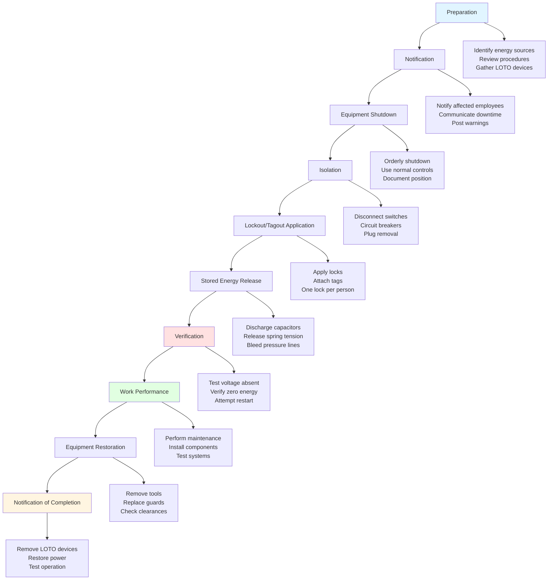

Electrical hazards represent one of the most serious risks facing HVAC technicians. From residential 120V circuits to commercial three-phase systems exceeding 480V, HVAC work routinely involves exposure to energized equipment. Understanding voltage classifications, implementing proper lockout/tagout procedures, and utilizing appropriate personal protective equipment are critical for preventing electrocution, arc flash injuries, and electrical burns.

## Regulatory Framework

OSHA 1910 Subpart S establishes the legal requirements for electrical safety in the workplace. These regulations mandate specific work practices, training requirements, and protective measures based on voltage levels and exposure conditions. NFPA 70E, Standard for Electrical Safety in the Workplace, provides the technical foundation for complying with OSHA requirements and has become the industry standard for electrical safety programs.

Key OSHA 1910 Subpart S requirements include:
- 1910.147: Control of hazardous energy (lockout/tagout)
- 1910.333: Selection and use of work practices
- 1910.335: Use of protective equipment
- 1910.331: Training requirements for qualified and unqualified persons

## Voltage Classifications

Understanding voltage classifications is fundamental to assessing electrical hazards and selecting appropriate safety measures.

| Voltage Class | Voltage Range | Common HVAC Applications |
|--------------|---------------|--------------------------|
| Extra-Low Voltage | ≤50V AC | Control circuits, thermostats, sensors |
| Low Voltage | 51-1000V AC | Residential/commercial equipment, motors |
| Medium Voltage | 1001-35,000V AC | Large chillers, central plant equipment |
| High Voltage | >35,000V AC | Utility connections, campus distribution |

The majority of HVAC work involves low voltage systems, but the potential for serious injury exists at all voltage levels above 50V AC or 60V DC.

## Approach Distances

NFPA 70E establishes approach boundaries that define safe working distances from exposed energized conductors. These boundaries determine required qualifications, protective equipment, and work procedures.

| Voltage Range | Limited Approach Boundary | Restricted Approach Boundary | Prohibited Approach |
|--------------|---------------------------|------------------------------|---------------------|
| 50-300V | 10 ft (3.0 m) | 3 ft 6 in (1.0 m) | Contact |
| 301-750V | 10 ft (3.0 m) | 3 ft 6 in (1.0 m) | 1 in (25 mm) |
| 751-15,000V | 10 ft (3.0 m) | 5 ft (1.5 m) | 7 in (178 mm) |
| 15,001-36,000V | 10 ft (3.0 m) | 6 ft (1.8 m) | 1 ft 1 in (330 mm) |

**Limited Approach Boundary**: Distance at which unqualified persons must not cross without supervision.

**Restricted Approach Boundary**: Distance requiring qualified person status, documented risk assessment, and appropriate PPE.

**Prohibited Approach**: Distance requiring specialized training equivalent to qualified electrical workers on energized systems.

## Lockout/Tagout Procedures

Lockout/tagout (LOTO) is the single most effective method for preventing electrical injuries during HVAC maintenance and repair. OSHA 1910.147 requires written energy control procedures for equipment servicing.

### Critical LOTO Requirements

**Individual Protection**: Each technician must apply their own personal lock. Group lockout procedures require lockboxes when multiple workers service the same equipment.

**Verification**: After lockout application, voltage testing must confirm de-energized conditions using properly rated test instruments. The "test-test-test" method verifies meter function before and after testing.

**Try-to-Start**: Attempting to operate equipment after lockout confirms effective isolation and prevents assumptions about circuit status.

## Qualified Person Requirements

NFPA 70E defines a qualified person as one who has demonstrated skills and knowledge related to the construction and operation of electrical equipment and has received safety training to identify and avoid electrical hazards. For HVAC technicians working on electrical components, this requires:

- Understanding of electrical theory and safety principles
- Familiarity with equipment construction and operation
- Ability to identify voltage levels and energy sources
- Knowledge of proper PPE selection and use
- Training in emergency response and rescue procedures
- Documented verification of qualifications

Qualification is voltage-level and task-specific. A technician qualified to work on 480V motor circuits may not be qualified for medium voltage switchgear.

## Arc Flash Hazards

Arc flash represents an extreme electrical hazard unique to energized work. When electrical current travels through air between conductors or to ground, temperatures can exceed 35,000°F (19,400°C), generating intense heat, pressure waves, and molten metal projectiles.

### Arc Flash Boundary

The arc flash boundary is the distance at which incident energy equals 1.2 cal/cm² (the threshold for second-degree burns on bare skin). Within this boundary, arc-rated PPE is mandatory for energized work.

| System Voltage | Typical Arc Flash Boundary | Available Fault Current |
|----------------|---------------------------|------------------------|
| 208V | 1-4 ft (0.3-1.2 m) | 10,000-25,000A |
| 480V | 4-10 ft (1.2-3.0 m) | 25,000-50,000A |
| 4160V | 10-40 ft (3.0-12.0 m) | 50,000A+ |

Incident energy calculations require electrical system analysis accounting for voltage, fault current, protective device clearing time, and working distance. Arc flash labels on equipment provide calculated hazard levels and required PPE.

## Personal Protective Equipment

PPE selection for electrical work depends on voltage level, incident energy exposure, and task requirements.

### Arc-Rated PPE Categories

| PPE Category | Incident Energy | Required PPE |
|-------------|----------------|--------------|
| 0 | <2 cal/cm² | Untreated natural fiber clothing, safety glasses |
| 1 | 4 cal/cm² | AR shirt and pants or coverall, face shield, safety glasses |
| 2 | 8 cal/cm² | AR shirt and pants, AR flash suit hood, face shield, safety glasses |
| 3 | 25 cal/cm² | AR flash suit jacket and pants, AR flash suit hood, face shield, safety glasses |
| 4 | 40 cal/cm² | AR flash suit jacket and pants, AR flash suit hood, face shield, safety glasses |

Voltage-rated gloves provide insulation from shock hazards and must be tested every six months. Leather protectors worn over rubber gloves prevent mechanical damage and improve durability.

## Safe Work Practices

Beyond specific procedures and equipment, electrical safety relies on disciplined work practices:

**De-energize First**: Energized work is justified only when de-energizing creates greater hazards or is infeasible. Equipment design and maintenance planning should minimize energized exposure.

**Test Before Touch**: Always verify de-energized conditions with properly rated voltage testers before contacting conductors or components.

**One Hand Rule**: When testing or working near exposed circuits, keep one hand in pocket or behind back to prevent current pathways across the heart.

**Insulated Tools**: Use tools with insulated handles rated for system voltage when work near energized parts cannot be avoided.

**Maintain Clearances**: Respect approach boundaries and maintain required working space around electrical equipment per NEC Article 110.26.

## Emergency Response

Despite preventive measures, electrical accidents require immediate response:

1. **Do not touch** the victim if still in contact with electrical source
2. **De-energize** the circuit if possible without delay
3. **Call emergency services** immediately
4. **Administer CPR** if trained and victim is not breathing
5. **Treat for shock** and burns while awaiting medical help

All workers in areas with electrical exposure should receive CPR and first aid training with emphasis on electrical injury response.

## Conclusion

Electrical safety in HVAC work demands comprehensive understanding of hazards, regulations, and protective measures. The hierarchy of controls prioritizes de-energization over energized work, engineering controls over PPE, and qualified personnel over untrained workers. By consistently applying lockout/tagout procedures, maintaining appropriate approach distances, and utilizing proper protective equipment, HVAC technicians can effectively manage electrical risks and prevent life-threatening injuries.

## Components

- Lockout Tagout Loto Procedures
- Electrical Arc Flash Hazards
- Personal Protective Equipment Electrical
- Arc Rated Clothing
- Voltage Testing Verification
- Ground Fault Circuit Interrupter Gfci
- Equipment Grounding
- Bonding Requirements
- Electrical Clearances
- Working Space Requirements
- Electrical Safety Training
